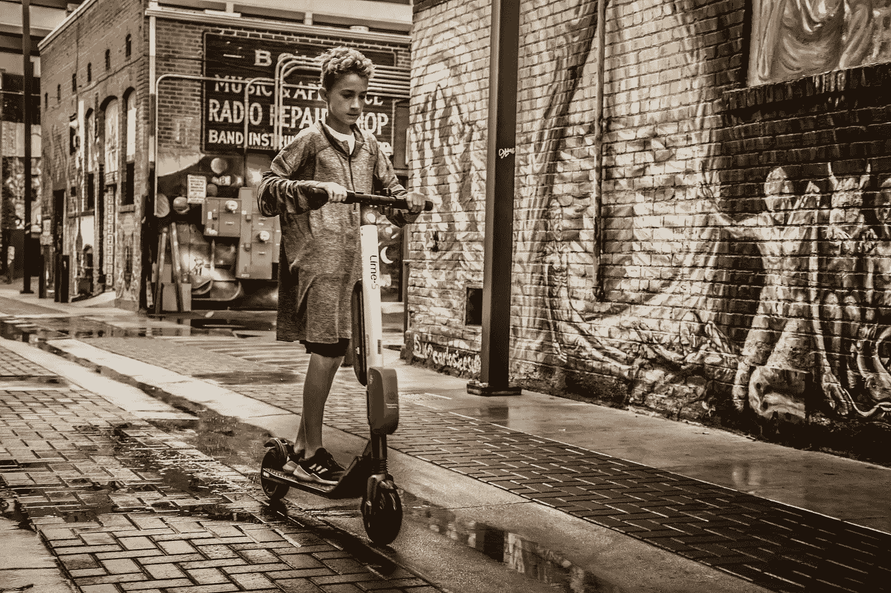
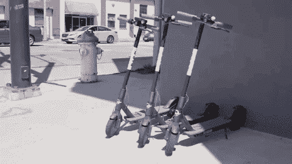
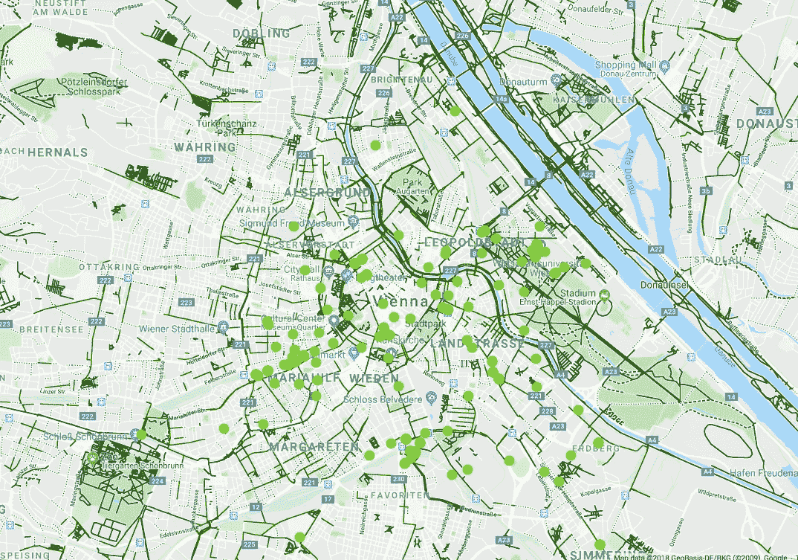
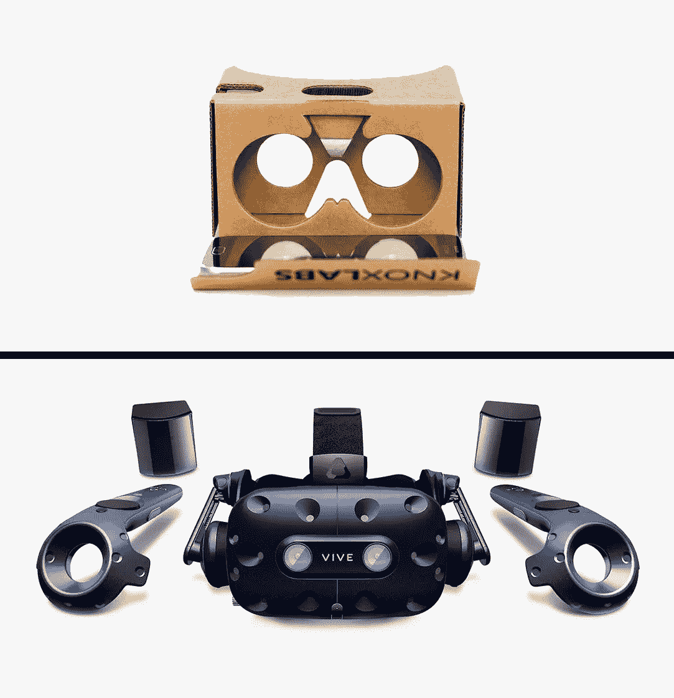
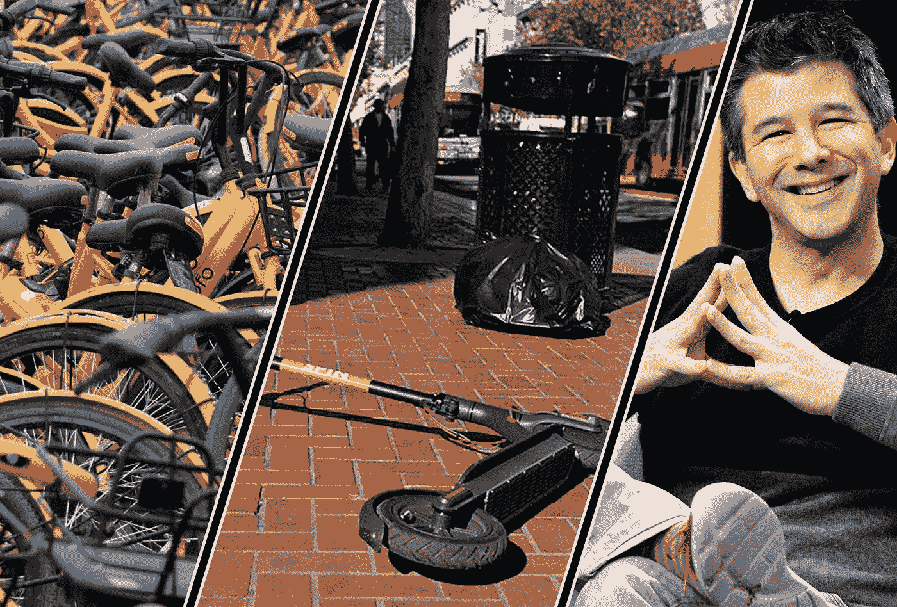
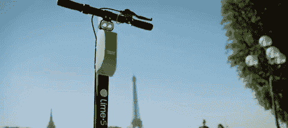

# 运营缺陷:电动滑板车飞速增长的成本

> 原文：<https://medium.com/swlh/operations-dis-excellence-the-cost-of-electric-scooter-breakneck-growth-b431b6dea5c6>

Photo by Brett Sayles

所以我刚从骑电动滑板车过来，在那里我的命运是撞上硬物，撞车。

幸运的是，这并没有发生，但故事是这样的:我开着华沙一家绿色公司的电动滑板车走了五分钟，然后下了小山坡。当车速达到 28 公里/小时时，它完全熄火了。刹车油门停止工作，屏幕上什么也没有显示。我觉得速度在增加，很有可能会撞到树上，除非我记起后面有一个手动刹车。我停下来，停在合适的地方，然后离开。如果你不考虑大多数用户(包括我聪明的朋友)并不知道手动刹车，如果你不考虑这个故障同时发生在其他城市的人身上，这是一个绝对正常的故事。

# 每周推出 3 个城市

即使在秋季，摩托车共享公司也试图通过在新城市的扩张来推动增长。经理们正在设定增长的关键绩效指标，热情的员工提出了更高的目标，Ninebot 在中国的仓库里已经没有踏板车了，整个城市交通创新运动正以前所未有的速度发展。

“Scooters invade San Francisco” by Engadget

对于传统企业来说，出现在一个城市，然后在下个月出现在七个城市听起来像一个梦。因为传统企业知道，首先你必须分析市场，然后找到人，在该国开设办事处，推出服务并提供客户支持。所有这些都是为了给客户提供 100%的价值。然而，电动滑板车公司的情况并非总是如此，这里 30%的管理层来自优步以外，20%来自食品配送初创公司。

这些人中的一些人习惯于接近，当他们来到这个城市，向当地媒体发送新闻稿，放弃 200 辆车，忘记这项服务，直到它被官员禁止。它允许在更短的时间内启动更多的城市，但这是一个脆弱的操作系统，注定在长期内交付不足。

172 Lime scooters as green dots in Vienna. Source:Scootermap.com

我的意思是，看看维也纳(Lime 200 辆)、布鲁塞尔(Bird 100 辆)或者里斯本(Lime 300 辆)。他们是被遗忘的孩子吗？
对于实际上不在地图所示位置的车辆以及电池电量只有 10%、声称有 2/3 电量的车辆，不计入踏板车数量。你将会以只有一半的舰队可用而告终。

下一次，当你的一个朋友吹嘘他/她开展滑板车业务的城市数量时，问问这个人:这些是真正的业务吗？还是这是非榨汁机承包商充电的一个半滑板车？

# 注定要重复历史？

这些关于扩展的问题让我想起了 Google Cardboard 如何改变了社会对 VR 的看法。因为谷歌 Cardboard 便宜且容易获得，许多新来者都将它视为“革命性技术”的第一次接触，正如营销人员所说。很多时候，用户看的不是承诺的激动人心的体验，而是一些无聊的 360 视频。令人失望的表现让 Google Cardboard 成为了看门人，只让 VR 世界中的铁杆爱好者，并阻止数百万普通人尝试更好的选择。

Google Cardboard (top), HTC VIVE PRO (bottom)

同样的东西我在华沙也能看到:200 辆滑板车，以前在另一个欧洲城市用过，上面有个大字“1/1CHF 起步”。甚至还不到当地的价格，低了两倍。榨汁机被称为公司业务的核心，由于中央管理层的决定，榨汁机没有工作。滑板车没有得到适当的维护和重新平衡。数字扩展也经常失败:虽然波兰货币应该显示为波兰兹罗提，但实际上波兰值显示为符号“$”，没有任何转换。
留存率——代步车共享行业保守得最好的秘密越来越低。而造成这种情况的原因是一再辜负客户的期望。

由于糟糕的扩张实践，社会资本并不是唯一丢失的东西。媒体潜力也丧失了。通常情况下，至少有 10 家严肃的网点/门户网站会写关于向新城市扩展服务的文章。许多博主将分享这些信息，用户自制照片的浪潮将通过 FB 和 Instagram 传播……只是为了介绍 100 辆踏板车？当有真正的需要时，当车队扩大到 1000 辆时，只有 2 个利基博客会写它。因为当地行动的每一步都已经讨论过了。

# 更好的方法

技术专家和未来学家都预测，真正创造价值的创业时代将从明天开始。或者后天。或者以后。但是赞助他们努力的首席执行官和风投们，必须改变他们今天建立科技企业的方法。他们应该在 R&D 投资制造真正耐用的交通工具，而不是降低踏板车的成本来提高单位经济性。自行车共享模型的预期生命周期为 4 年。与你的两个月相比如何？

Image sources: Quartz, SF Weekly, Page Six

Ofo 的案例，旧金山滑板车的案例以及其他许多案例都证明，我们不是在 2014 年。快到 2019 年了，为了建立真正的价值，解决真正的问题，并持续赚取大量的现金，我们必须提高质量。

“我们刚刚在 City_Name 推出了电动滑板车共享服务”应该是指有数百辆滑板车、与城市管理部门建立了联系、使用本地语言的清晰用户界面、客户支持和所有必需的安全功能。同样的规则应该适用于 1 亿美元和 10 亿美元的公司。

在欧洲城市中，巴黎的运营提供了迄今为止最好的体验:来自两家公司的数千辆电动滑板车行驶在城市的街道上。车辆是新的，有客户支持和大量的免费头盔。这是我想与朋友分享的产品。这是另一个城市政府可能会考虑为自己的市民进口的产品。

我是正在进行的微移动革命的狂热支持者，我希望现有的公司取得成功——它们都有足够的增长空间。但是业务的扩展应该重新设计。我们正处于通往无缝城市交通的漫长道路的起点，这只是我们必须克服的众多挑战之一。

注:除了 LinkedIn 的简要分析，对优步和食品初创公司员工的估计没有任何数据支持。

## 这篇文章发表在 [The Startup](https://medium.com/swlh) 上，这是 Medium 最大的创业刊物，有+393，714 人关注。

## 订阅接收[我们的头条](http://growthsupply.com/the-startup-newsletter/)。

