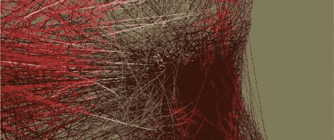

# 机会…一个确定的“东西”

> 原文：<https://medium.com/swlh/opportunity-a-sure-thing-a6640c1bfba7>

# 当然，“事情”

没有“确定的事情”这样的东西，那些不这样想的人很可能精神不稳定，他们或“事情”完全陶醉在他们的个人骄傲/自我或其他未命名的物质中。“确定的事情”是令人分心的美丽的彩虹和独角兽，结果是有毒的污染和患有狂犬病的恶魔马。避开或者至少保护你自己，你这个好奇的压力驱动机器人。

想象“确定”中所包含的带有嘲笑意味的自信自满，以及源自“事物”的可能性的一般模糊性。一想到这种混合物，我就感到困惑。

想象自己是如此自信地懒惰，以至于你说服自己，你刚刚描绘的海市蜃楼不仅是真实的，而且是具有不可预见的价值和如此丰富的东西，以至于其他人应该来凑热闹。在这个旅程中，时间不再存在，一路上的机会成本或后果，或者追求这样一个神奇、神秘的“东西”所花费的时间和精力，在等式中完全没有目的或价值。

这是英雄的旅程，没有旅程。没有坠入爱河的爱情故事。在很多方面，我们梦想的一切似乎都遥不可及。我们自己创造的幻觉。最佳娱乐。

如果说我们所做的事情，创造和变得没费些工夫..如果我们没有付出任何努力，没有赢得它，没有在创造的过程中牺牲或受苦，那么它可能就没有任何持久的重要性或意义。从各种意义上来说，它只是“东西”。没有什么真正有意义或持久的东西是在短时间内创造出来的

“艰难的选择，轻松的生活。容易的选择，艰难的生活。”

看到“十拿九稳”的事情，就跑。别浪费时间考虑。有更多的聪明人，更容易获得资源，他们有时间浪费在追求“确定的事情”上。

取而代之，成为某样东西又多了某一个。创造一些不仅仅是一些“东西”的东西，并且在这个过程中坚持不懈。这就是我们都想看到的持久的“事物”类型。

# 把手伸向边缘

我们需要抓住机会，不一定要抓住它，而是要抓住它；显示对两种能量存在的环境的意图和意识，那些是此时此地和那里以及可能的。

我们必须探索好奇心和想象力的极限，甚至让自己暴露于潜在的存在；未知的可能性。

正是在这些边缘，我们找到了最害怕和最勇敢的自己，我们最热情和情感的联系，我们是谁，我们会失去什么；如果我们变得超脱，如果我们偶尔让自己超脱和漂移，我们会是什么或谁。

我们应该在这些边缘徘徊。用它们做实验，用我们所知的符号来移动和塑造它们，在这个过程中，发现一些新的和令人惊奇的东西，或者一些怀旧的东西，它是自我保存和永恒的。

这是一个神奇的世界，我们是其中的一部分，想象所有我们尚未发现的可能性；它和我们自己。

# 本周的垃圾想法

我不知道该拿这些做什么，享受吧。

自然设计

历史的进化过滤器确保只有伟大的东西幸存下来，并因此被铭记；历史、自然选择和达尔文进化理论表明，它也忽略了不好或无聊的部分，因此怀旧。有点“目的偏见”或自然设计。“海洋塑造了船只的设计。不是设计师、思想家或工程师

先放大石头

生活充满了不可移动的大石块，以及我们可以随心所欲塑造的几乎无限多的细微决定。你不能移动所有的大石头，但你可以选择什么是大石头，关注什么，并围绕什么来构建你的生活。然后，让其余的东西进入裂缝，填满我们有限的生命时间，否则我们将永远没有空间来容纳或放置大件物品。

能量战胜激情

激情是一种谦虚的说法，我成功是靠运气、努力工作和学会享受过程中的狗屎。我们从未听说过所有充满激情的失败，所以我们浪漫化并幻想它对成功的不可估量的影响。我对此感到十分惊讶。

让幸运找到你

在你寻找的准确时间找到你正在寻找的东西，在你寻找的地方找到它，同时随时准备接受、拥抱和充分展示它存在的潜在协同作用，这是非常不可能的，也是幸运的。所以，更好的办法是创建一个让运气找到你的系统。“运气”就是懒。

真实性面具

真实性、脆弱性和表现形式的问题是，大多数人真的不想看到它，不是它的真实方面，不是它真正的样子。他们想要出版和润色的版本，有趣的版本，快乐的版本，看起来，听起来，感觉起来都像他们听过的电视节目，电影和故事，并享受他们的生活。他们想要舒适的，带有一点现实或新奇的东西。我们又能建议谁不这么做呢？

## 这个故事发表在 [The Startup](https://medium.com/swlh) 上，这是 Medium 最大的企业家出版物，拥有 282，454+人。

## 订阅接收[我们的头条新闻](http://growthsupply.com/the-startup-newsletter/)。

