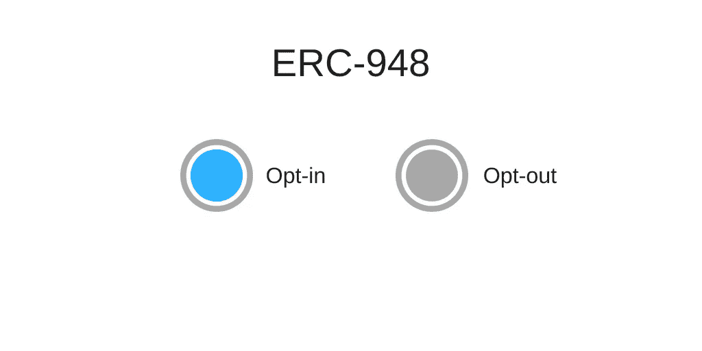
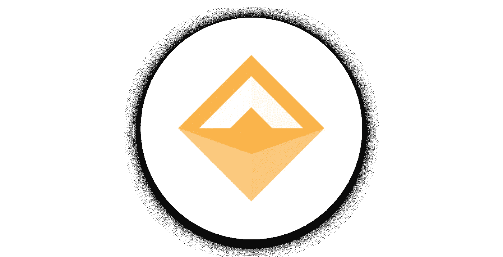

# 选择加入还是选择退出？

> 原文：<https://medium.com/swlh/opt-in-or-opt-out-7db2a247e72f>

## 周期性加密货币支付目前面临的问题和工作。

*订阅文章:*[产品所有权已过去](/8xprotocol/product-ownership-is-in-the-past-2c4dc5572f1f)

随着消费者偏好从产品所有权向可访问性的转变，以及更多企业选择进入区块链，毫无疑问，订阅行业和加密货币将会交织在一起。

这篇文章将涵盖当前的问题和工作，让订阅行业在区块链蓬勃发展。

## **本土以太坊限制。**

以太坊(加密货币)的固有形式并不适合支持区块链上的经常性支付。

以太坊的主要限制之一是它的波动性。进行以太网交易的用户和服务将暴露于其资金的波动性，这将给区块链的订阅经济带来重大问题。

使用以太坊的另一个障碍源于订阅模型的基本原则。选择订阅服务的消费者希望以尽可能少的资金方便地购买一致的产品/服务。

使用以太坊作为循环支付方式意味着用户/消费者需要每月用他们的私钥签署交易(推送基础)。这一行动本身就会对订阅业务的保留率产生不利影响，给他们的服务增加更多的难题。

仅仅这两点就促使以太坊社区寻找这个问题的进一步解决方案。

*现在，我们来谈谈如何使用 ERC20 令牌作为解决方案。*

“A white neon in the shape of the dollar sign at night” by [Jimi Filipovski](https://unsplash.com/@jimiburg?utm_source=medium&utm_medium=referral) on [Unsplash](https://unsplash.com?utm_source=medium&utm_medium=referral)

## ERC20 作为一种经常性支付方式。

[ERC20](https://www.investopedia.com/news/what-erc20-and-what-does-it-mean-ethereum/) 是以太坊区块链上的标准，用于实现令牌(Bancor、Qash 等令牌)的智能合约。它定义了用户之间如何处理令牌，以及如何访问数据。

为了解决波动性问题，用户和企业可以求助于使用符合 ERC20 标准的稳定硬币。在以太坊广泛使用的令牌标准 ERC20 中，存在用户可以向其他地址/用户发送令牌的功能。

整合稳定硬币(如 [MakerDAO](https://medium.com/u/743224aba00c?source=post_page-----7db2a247e72f--------------------------------) 的 Dai*)将解决波动性问题，但 ERC20 标准功能本身将要求消费者在每个结算周期签署交易以更新其服务。虽然这可以通过使用第三方托管来解决，即用户预付一笔费用(订阅的 X 个价格乘以 Y 个计费周期)，但用户将需要更多的资金，这将减少商品/服务的可获得性(订阅经济的一个重要部分)。

使用最基本的 ERC20 模型将提供负面的消费者体验，并为企业带来高流失率，因此不会成为 Web 3.0 订阅行业的最佳基础。

*基于将 ERC20 标准用于基本支付的概念，引入了 ERC948 讨论。*

Photo by [rawpixel](https://unsplash.com/@rawpixel?utm_source=medium&utm_medium=referral) on [Unsplash](https://unsplash.com?utm_source=medium&utm_medium=referral)

## **ERC948，关于经常性支付的讨论。**

由 Kevin Owocki 发起的 ERC948 EIP 是一项发布在 github 上的关于经常性支付标准的提案。

尽管 ERC948 协议仍未达成最终共识，但在标准讨论中提出的当前想法为解决区块链的经常性支付提供了可行的部分。

在 ERC 948(2018 年 6 月 7 日)的当前共识中，该标准旨在提出一种不可知的智能合约，用于允许应用程序理解循环支付合约的概念。这反过来将允许用户看到他们预订了服务。

在讨论中，我喜欢的一个选择是 ERC948 标准，它只控制订阅数据的查看/访问方式。使用最轻形式的 ERC948 将确保服务在修改订阅数据时需要撤销授权。比如定价。这个订阅标准将支持把用户放在第一位的基本价值。

这一观点伴随着更多关于标准功能类型的讨论，例如:存储的数据类型、订阅状态和用户订阅长度(对于忠诚度计划)。

所有这些都可以在 EIP 上找到。

我们不知道 ERC-948 标准的结果如何，但我们知道循环支付标准将成为 web 3.0 不可或缺的一部分。

 [## 循环订阅模式是一件好事，应该在以太坊上是可行的

### 我打开这个 ERC，作为讨论(a)优点和(b)创造一个标准方法的可行性的一种手段…

github.com](https://github.com/ethereum/EIPs/issues/948) 

我很想听听您对 ERC948 未来的看法，以及您是否认为会有替代 ERC948 标准的产品。

***特别提及去合著*** [***陆凯文***](https://medium.com/u/d81b0c185c2a?source=post_page-----7db2a247e72f--------------------------------) ***。***

## 8x 协议——区块链上的循环稳定支付

*作者是 8x 协议的团队成员，该协议有助于重复加密支付，而不会将消费者或企业暴露于加密货币的波动性。*

网站/白皮书:[https://8xprotocol.com/](https://8xprotocol.com/)推特:[https://twitter.com/8x_Protocol](https://twitter.com/8x_Protocol)电报社区:[https://t.me/eightexprotocol](https://t.me/eightexprotocol)

## *马克尔道

MakerDao 的 Dai 是一种抵押稳定硬币，该团队专注于解决区块链的波动性问题。

网站—[https://makerdao.com/](https://makerdao.com/)

## 这个故事发表在 [The Startup](https://medium.com/swlh) 上，这是 Medium 最大的企业家出版物，拥有 343，876+人。

## 在这里订阅接收[我们的头条新闻](http://growthsupply.com/the-startup-newsletter/)。

