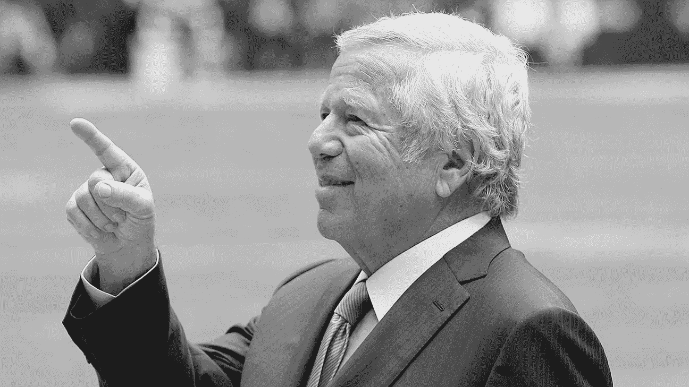
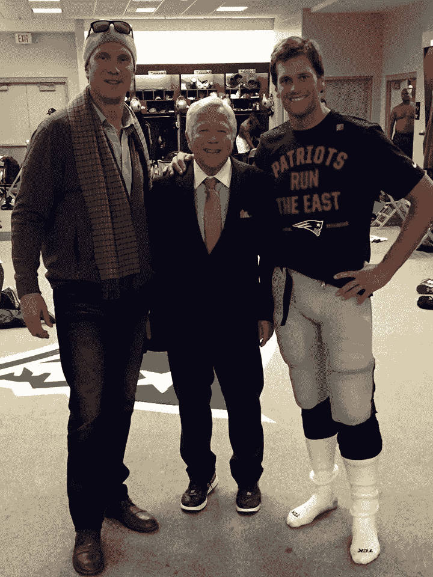

# 优化关系，而不是交易

> 原文：<https://medium.com/swlh/optimize-relationships-not-transactions-701b808991ea>

## 我从罗伯特.克拉夫特身上学到的。

奥贝特·克拉夫特是我个人崇拜的英雄之一。对于一个在长期可悲的新英格兰爱国者队的阴影下长大的罗德岛孩子来说，他是出现的救世主，打扫了房间，建立了一个世界级的组织，并提供了这项运动有史以来最伟大的特许权。凭借性格和信念，他和他的家人在面临日益萎缩的乡巴佬冷嘲热讽时坚持了下来，取得了任何自尊的马斯霍尔在 1988 年都无法想象的场内场外的胜利。他做这一切的方式和优雅，坚定的手和人情味；一个为我们所有人树立榜样的丈夫、父亲和公民。

2007 年，我有机会与罗伯特和乔纳森·克拉夫特在一家名为 Matchmine 的初创公司密切合作。这个项目命运多舛，其原因值得在另一篇博客上发表，但它给了我一个机会去了解这些人。这是我不能错过的。

## 好的生意是个人的。

在我们交往的早期，在罗伯特位于栗山的整洁雅致的家里，有一天晚上我们蹲在他的书房里互相了解。我们很快就跳过了客套话，聊起了生意和生活，只是几个曾经在常春藤联盟踢过球的足球迷，在现实世界中变得成熟后变得更加聪明和宽广。我们谈论家庭和信仰——对他来说唯一比足球更重要的东西——谈论意大利和犹太文化的共同点(他称我们为“地中海人”)，以及做父亲的要求和乐趣。这太棒了，过了一会儿我开始放松，他开始接受我进入部落。

“有件事我想问你，”我鼓起勇气说道。

“开枪，”他说。

“我有过一些成功，罗伯特，我认识许多成功的人。但我只认识几个像你一样成功的人。现在我们坐在这里，只是一对老巡逻兵，拍摄吉诺卡佩莱蒂的狗屎。很好，但我想我只是期望你会…与众不同。作为一个来自郊区的孩子，我一直想知道那些能在你这种水平上取得成功的人。”

“好吧。什么？”

“嗯……我们都来自重视人际关系的家庭和传统，很明显我们都从这个角度看待商业。我想当我们坐在这里时，我想知道的是这种哲学在你的水平上是否站得住脚？我的意思是……如果你想成为*的亿万富翁*，如果你真的想达到顶峰……你是否不得不接受有时需要成为——嗯——一个混蛋？”

他把目光移开了一会儿，思考着这个问题。“我希望不是，”他说，转身对我。

“人就是人，”他继续说道，“同样的动力在任何级别的企业中都发挥着作用。有时候很难，你必须做出艰难的选择来赢得胜利。但我觉得你没必要这么混蛋。人们做正确的事是一个好策略，因为从长远来看，好的生意是个人的。”

“但你有时不得不采取强硬手段，”我追问，“对吗？我知道你们发现自己处于个人忠诚与团队需要做的事情相冲突的情况。看看德鲁(布莱索)的情况。)裁掉他一定很难，尽管和汤姆(布雷迪)一起为后来的成功奠定了基础。”

Relationships last, among people who value them.

“这倒是真的，”他说，“但我不认为我是一个家伙。我觉得我欠德鲁一份人情，他是个好人，多年来一直是我们组织的形象代言人。当他该离开的时候，我们努力为他做正确的事。最后我们把他交易给了亚足联的一个大对手 T1，这显然不符合我们球队的利益。但我们知道这对德鲁来说是正确的，这就是我们促成这笔交易的原因。”

**“我猜有关系的人，也有交易的人，”**他说，更深入地挖掘自己的想法。“在商界，你需要同时应对这两种情况，但我一直试图成为一个注重人际关系的人。我不知道这是不是更好的方法。你有时会把东西留在桌子上。但到目前为止一切都很好，所以我会坚持下去。”

## 不是一家人。而是一个团队。

大约一年后，随着 2008 年信贷危机控制了经济，我们关闭了这项业务。尽管我们已经完成了一开始为自己设定的所有里程碑，但我们还是做到了，如果我说当时我没有感到不安，那是在撒谎。这是我不得不做的最困难的事情之一，但有罗伯特和乔纳森的个人支持对我很有帮助。

我们尽我们所能照顾人们，帮助[让他们在其他地方找到工作](https://miketrap.wordpress.com/2008/10/27/fin/)并继续前进。我为这个团队走到一起的方式感到自豪，事实上，在寻找新机会的过程中，他们相互联系，相互支持。我们在社交场合相遇，创建了一个分享谁在招聘的群组线索，并在每个人不可避免地成功抵达新的地方时保持联系。许多人后来在其他公司取得了巨大成功，直到今天他们还是朋友。

正如网飞不久前所说的那样，归根结底，企业不是一个家庭，而是一个团队。一个 *pro* 的团队，其实是一个即使比赛结束了也能互相照应的团队。

## 照顾好你的队友。

公司在我们的业务中来来去去，要领导一家公司，你需要做出艰难的选择，这些选择会影响你所关心的人的生活。然而，解决办法不是*不*去关心，而是要协调好对企业来说是必要的事情和对人们来说是正确的事情，并让自己平等地为这两者服务。

这就是职业选手的工作方式。根据有史以来最优秀的人之一所说，这就是到达顶峰所需要的。

**像这样？点击“❤︎”帮助传播信息，点击“关注”不要错过接下来的内容。**