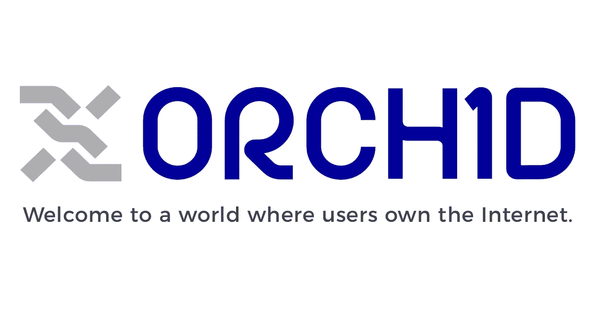

# 兰花实验室——结束互联网审查

> 原文：<https://medium.com/swlh/orchid-labs-ending-censorship-on-the-internet-3fde4fbe283>

# 行动纲要

兰花实验室公司是一个开源项目，致力于结束互联网上的监控和审查。兰花协议使用建立在现有互联网上的覆盖网络，该网络由对等令牌化带宽交换驱动，创建了更具包容性、更自由的互联网。兰花实验室的总部设在加利福尼亚州旧金山。

# 目标

兰花项目的目标是为全球有需要的人提供匿名的互联网接入。该团队认为，在压迫性国家，日益增长的监控和审查是互联网隐私的又一催化剂。此外，生活在政府过度监管其浏览和交易历史的国家的个人也会发现匿名技术的好处。同样，该技术也可以被机构用来在高度敏感的情况下匿名化其流量。

# 技术

Orchid 将试图通过提供网络出口节点可以使用的软件来隐藏流量。兰花协议可以被认为是现有基础设施之上的附加层，而不是分散互联网。它也不会强迫用户遵守严格的隐私协议，例如，他们仍然可以在浏览器上接受 cookies。

用户对 Orchard 技术的体验不会改变，但令牌允许浏览互联网的个人对提供互联网访问的人进行补偿。这将意味着他们将提供保护，从他们的 ISP。类似地，那些目前使用 VPN 的人也将从网络中受益，因为他们的浏览记录不会被记录。

令牌的经济性将是用户或者花费令牌从出口节点获得隐私，或者用户将运行出口节点来接收这些令牌。当用户决定运行一个节点时，他们会收到一个钱包应用程序，以便于接收令牌。

虽然您的 ISP 仍然可以看到通过这些节点的流量，但是该活动看起来就像正常的浏览流量。兰花实验室团队确信政府无法渗透他们的网络。最近，有人担心情报机构已经渗透到全球的一些 TOR 节点。然而，兰花团队认为，通过利用他们的技术，一个国家可以阻止系统的唯一方法是关闭互联网。

# 组

*   Stephen Bell:Bell 先生是 Trilogy VC China 的创始成员之一，他在那里花了 10 年时间支持中国种子阶段的初创公司。
*   **Brian j . Fox:**Fox 先生是一名企业家和开源倡导者，也是自由软件基金会的第一名员工。
*   **Jay Freeman:**Freeman 先生是一名软件工程师，是 Cydia 软件分发平台的开发者，该平台用于数百万台越狱的 iOS 设备。
*   **古斯塔夫·西蒙松:**西蒙松是一名工程师和开发者，他在 2015 年帮助推出了以太坊。
*   **Steven water house 博士**:water house 博士是一位经验丰富的投资者和企业家，他共同创立了 RPX 公司，并在太阳微系统公司领导蜂巢产品。

# 代币价值

兰花团队正在为该项目的 20%筹集 1.2 亿美元，该项目的估值为 6 亿美元。考虑到到到 2022 年，仅 VPN 一项就有望达到 1060 亿美元，该估值仅占 4 年后预期市场的 0.5%多一点。如果《兰花议定书》设法获得这个市场的一小部分，这一估价似乎是极其公平的。估价合理地反映了该项目的当前规模。

## 这篇文章发表在 [The Startup](https://medium.com/swlh) 上，这是 Medium 最大的创业刊物，有 312，043+人关注。

## 订阅接收[我们的头条新闻](http://growthsupply.com/the-startup-newsletter/)。

