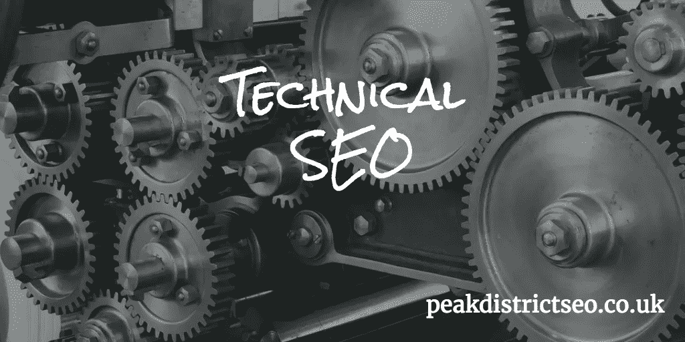
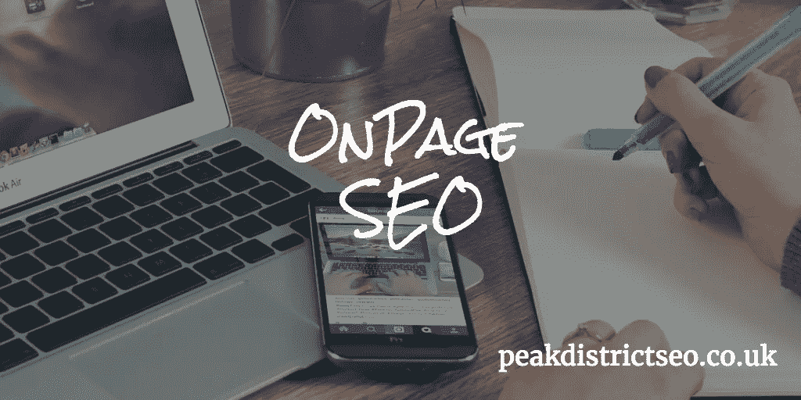
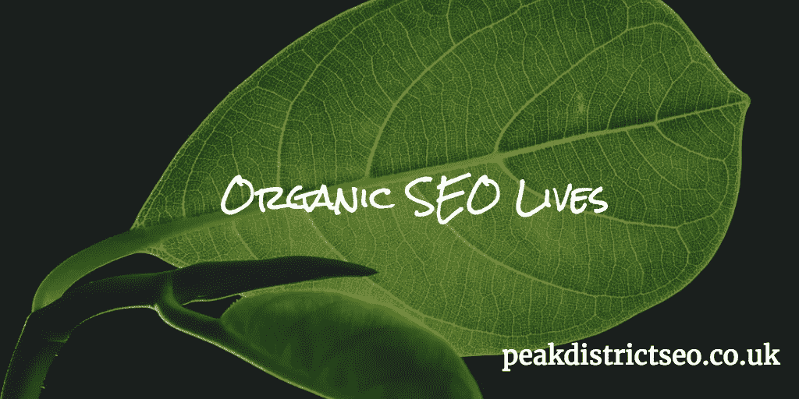

# 为什么你的企业需要有机搜索引擎优化

> 原文：<https://medium.com/swlh/organic-seo-search-engine-optimisation-is-the-use-of-methods-used-to-gain-a-high-placement-or-218aa28c863>

有机 SEO(搜索引擎优化)是指使用一些方法，在谷歌(Google)和必应(Bing)等搜索引擎产生的免费、算法驱动的搜索结果中，在搜索引擎结果页面上获得较高的排名。

有机搜索引擎优化帮助你加强网站上的页面和文章，使它们与用户搜索的内容更加相关。

2018 年，在线网站的数量比以往任何时候都多得多，随着越来越多的企业将营销工作转移到网上，这个数字可能会继续增长。

随后，我们采访了许多自 20 世纪 90 年代末就有网站的企业，他们抱怨说，随着新的参与者进入市场，他们在自己领域的影响力开始减弱。随着每个利基市场变得越来越拥挤，你必须采取措施让你的企业脱颖而出。

“有机 SEO”本质上由**技术 SEO** 、**页面 SEO** 和**页面外 SEO** 组成。这三个要素都有助于提高你的排名和网站的健康。

# 什么是技术型 SEO？

技术上的 SEO 问题被很多站长忽略了。他们不宣布自己，他们不明显，他们坐在后台悄悄地积累拖累你的网站。通过定期审核您的网站，我们可以在错误升级并成为主要问题之前发现它们。

# 一些技术性的搜索引擎优化错误可能会影响你的网站。

**抓取错误。**
当搜索引擎爬虫或机器人(bots)无法访问您的网站的一部分时，就会出现爬行错误，该部分链接来自搜索引擎结果页面(SERPs)中列出的另一个网站。丢失的页面可能已经从您的网站上删除，或者只是加载缓慢。

让你的页面被索引很重要，但是很多网站要么被搜索引擎索引的页面太少，要么被索引的页面太多。由于不同的原因，这两个问题都可能成为问题。

**爬虫预算**
管理你的爬虫预算对于大型网站来说是必不可少的，如果你的网站架构很差，那么网络爬虫可能会错过访问你网站的关键页面。如果它们没有被抓取，就不会被编入索引，这意味着用户没有机会在搜索引擎结果页面中选择你的列表。

**URL 重定向**
当我们在网站上有破碎的页面时，将进入网站的流量重定向到一个新的相关页面是有好处的，这可以防止潜在客户感到恼火，并保持页面排名，这是搜索引擎用来衡量网站相关性的一个指标。如果你不重定向损坏的页面或链接，你可以看到一个大的 404 错误提供给你的访问者。搜索引擎不介意一些，但不赞成大量的 404，因为这被视为一个网站维护不善的信号。

**你的首选域名**
拥有一个首选域名并向搜索引擎申报是关键。如果你的网站有多个版本可供搜索爬虫使用，他们如何知道优先选择哪一个？如果你使用一个分析包来跟踪你的网站，并且你的网站有多个版本，你看到的关于访问者和转化率的数据可能是完全不准确的。使用谷歌搜索控制台设置您的首选域名。

**页面速度**
页面速度是一个排名因素。这意味着如果你的页面加载缓慢，搜索引擎肯定会惩罚你。告诉你的开发者关于运行速度测试的问题，并确保网站尽可能快地加载。

你的网站必须在移动设备上看起来不错，否则你会失去金钱和客户。每年移动流量都在增长。2016 年，我们看到手机和平板电脑的综合浏览量首次超过了台式电脑的浏览量。随着手机屏幕越来越大，平板电脑越来越快，这种情况将继续改变。如果你的网站在这些屏幕上表现不佳，不适合屏幕，很难阅读或点击，你将会受到搜索引擎的惩罚。

**你的 Robots.txt 文件**
你的 Robots 文件告诉搜索引擎你的页面，你的站点地图在哪里，允许访问哪些页面。在这个文件上犯一个错误代价会很高。我们已经看到，由于 robots 文件中的错误，整个网站没有被编入搜索索引。

没有站点地图的站点只会让自己的日子不好过。确保你有一个用于爬虫的 XML 站点地图。你的站点地图应该会自动更新，确保它列在你的 robots 文件中。确保你让搜索引擎知道你的网站地图。您还可以为用户添加 HTML 站点地图。

# 什么是页面搜索引擎优化？

页面搜索引擎优化是有机搜索引擎优化的重要组成部分。页面搜索引擎优化就是改善你网站的内容，并使之相关。太多的网站充斥着大量的内容，一页又一页的简短内容，与用户实际搜索的内容毫无关联。

建立一个强大的网站架构
在你建立网站之前，先做好规划。确保每一页都是必要的，它链接到其他页面，并且很容易找到，不会重复。避免对子类别过于狂热。从长远来看，一个精心设计的网站会让你的有机 seo 工作变得更加容易。

**删除少量内容**
少量内容是指当一个页面上没有足够的内容时，它会被视为与搜索词相关。我们看到内容单薄的一个很好的例子是电子商务网站，他们出售相同产品的 20 个版本，每个版本都有微小的差异，通常网站管理员不会努力强调每个版本的差异和好处。只留下产品的简短描述。

另一个例子是非常短的博客帖子。简短的博客文章是浪费时间，写作是为了吸引和激发你的读者。

**删除重复内容**
重复内容对你的网站不利。你所有的内容应该尽可能的独特。尽量让你的页面关注一个独特的主题或想法，否则，如果你有几个页面都关注同一个主题，你的页面会在搜索结果中相互竞争。

你不应该需要从任何其他地方借用或剽窃内容，尽一切可能转述和引用，但不要使用其他人的整块内容。谷歌会知道的。

**减少孤儿页面**
孤儿页面是指那些位于你的网站上，并且没有链接到你网站上任何其他页面的页面。它们就像沙坑，会让用户和搜索引擎爬虫都感到困惑。

**建立相关性**
让你的页面与你的目标受众搜索的内容相关。要想获得高排名，你的网页必须是相关的。有机 seo 是关于自然的，所以想想你的观众用什么词和短语来找到你卖的产品和服务，确保你在你的页面上恰当地使用它们。

# 什么是离页 SEO？

离页搜索引擎优化不仅仅是在线工作，它是互联网相关行为和现实世界行为的结合。

**建立链接**
其他网站的链接有助于提高你的排名，但是只关注质量和相关的链接，其他的可能会比它们的价值更麻烦。每次你的网站得到另一个网站的链接，这被视为一种认可。但并非所有链接都是平等的，所以一个来自权威网站的链接比一个来自你姐妹 Twitter 个人资料的链接更有价值。不要试图为链接包付费，它们很少值这个钱。

社交媒体简介
确保你有所有相关的社交媒体简介。如果你只卖给 65 岁以上的人，建立 Snapchat 档案就没有意义了。试着和你的观众在一起。专注于你能管理的，不要因为发布太多个人资料而忽略了他们。

**客座博文**
在你擅长的领域，在别人的网站上写客座博文。获得这些机会并不总是容易的，但是如果你可以的话，它会提供权威的相关链接，搜索引擎会为此奖励你。

视频和播客现代的一代人，被称为 iGens，他们都是关于视频和播客的，他们不想坐着看文章，他们想看一个引人入胜的视频或在耳机上听有益的故事。你能从 youtube 和 iTunes 上找到指向你网站的多个链接吗？我们可以。

**信息图和图片搜索**
图片夺人眼球。因此，如果你有一组特定服务的照片，确保它们是有品牌的。如果你是巴克斯顿的扫烟囱工人。一定要把你的品牌和电话号码放在你的工作图片上。这样，如果人们搜索“巴克斯顿的清扫”并看到图片，你就让人们很容易联系到你。

**专业文章**
在 [Linkedin](https://www.linkedin.com/company-beta/18172763/admin/updates/) 上或为你当地的商会撰写文章，并将你的演讲上传到 [Slideshare](https://www.slideshare.net/PhilGregoryWork) 。专业文章是视频和播客的老派版本。非常适合那些想阅读的人。如果你不喜欢像这样写长篇文章，为什么不干脆把你的视频和播客做个副本呢？它们本身就是文章，是一个很好的辅助功能，只能增强你的网站和社交媒体的内容。

专业文章非常适合嵌入多个链接，指向你公司提供的所有优秀产品和服务。

品牌塑造
品牌塑造是一切，但要做对。把你的商标、网址、电子邮件和电话号码印在你的文件、汽车、电脑、电子邮件页脚和任何你能想到的地方，比如传单、名片和广告牌。

尝试赞助你所在城镇或村庄的草地边缘、学校戏剧或年度活动。当你这样做的时候，制作横幅并让别人看到，利用这个机会推销你的服务。

吸引网络影响者
通过你为人们做的事情让他们爱你。在线与他人交谈，倾听他们，同情他们，分享他们的内容，很快你就会有朋友，分享和链接你的内容，多年来，我们已经看到名人转发我们的推文并喜欢我们的帖子。

**客户服务**
良好的客户服务绝对至关重要，这是我们在英国非常不擅长的事情，但是如果你曾经去过美国，你会注意到那里的公司真的会做出额外的努力来确保你对他们的品牌有很好的体验。

如果你雇佣前台酒保、餐厅服务员、电话销售人员或送货司机，顾客总是对你的企业提供的服务水平有很多意见。

你能给自己的最好的广告就是像对待国王或女王一样对待每一位顾客，不管他们有多难相处或多烦人。一个差评可能会让你损失几百到几千英镑，所以一定要竭尽全力确保顾客满意。

# 将有机搜索引擎优化结合在一起

如果你的网站组织混乱，难以理解，你的用户会感到困惑和沮丧，搜索引擎也很难解释你的网站是关于什么的。这就是为什么清晰的销售和导航是至关重要的。

有机 SEO 的许多方面有助于加强网页，有助于在用户搜索产品和服务时使页面可见。有机搜索引擎优化的重点是改善网站每个页面的内容。通过改进您提供给客户的信息，您增加了他们继续浏览您的网站而不会立即离开的可能性。

网络企业面临的最大问题之一是不回头客的问题。许多访问者会来到你的网站，判断它不适合他们，因为它在搜索引擎中的标签很差。然后他们会离开，很有可能再也不会回来。

你可以通过为每一页创建清晰的标题来解决这个问题，并在你的网页上写好文章。添加一个好的元描述，可以帮助用户在从搜索引擎结果页面点击之前更好地理解你网站上的每个页面。

> 要做到这一点，你需要了解你的受众以及他们在寻找什么。
> 
> 你知道你的访问者在搜索你提供的商品和服务时会在谷歌或必应中输入什么样的搜索词吗？

> ***“听说有机 SEO 死了，是吗？”***

一句话，没有。

谷歌是目前最受欢迎的搜索引擎。有数以百计的其他搜索引擎试图复制和改进谷歌的做法。

虽然谷歌确实一直在加强搜索引擎利用付费广告植入创收的潜力，但我不认为它会很快放弃有机搜索结果，如果它放弃，它将失去所有的可信度。公众信任搜索引擎将他们的搜索查询与最相关和最有用的站点相匹配。出现在搜索排名中的站点，因为它们与用户搜索的内容相关。

> 另一方面，广告是由进入在线拍卖的付费关键词触发的。出价最高且广告最好的广告商将首先出现在匹配搜索中。这很好，但是并不是所有的网站都是高质量的或者真正相关的。
> 
> ***“任何傻瓜都可以向谷歌砸钱以获得点击量，但建立一个相关且信息丰富的网站，那就是另一回事了”。***

如果我们看到的只是付费广告，人们很快就会离开谷歌，找到一个新的搜索引擎，提供更好、更自然的结果。

> ***我没时间等有机 SEO，我现在就需要结果！***

时间是宝贵的，我们明白这一点，但偷工减料并不能拯救你的企业。[付费广告](http://www.peakdistrictseo.co.uk/ppc-pay-per-click/)很棒，但不是解决方案的全部。

你不会告诉建筑公司跳过你新家的混凝土地基，因为它们很贵，没人看得见。不，你会想要最好的地基，这样你的房子在 30 年、50 年或 100 年后仍然结构坚固。

SEO 也是一样。一个优化良好的网站将会持续不断地给你带来好的结果，周复一周，月复一月，年复一年。

我们和搜索公司谈过，他们报告说对有机搜索引擎优化的需求下降了。这部分是由于越来越多的人精通网络并愿意尝试自己的搜索引擎优化，以及提供“速赢”的广告服务的不懈推广。
“速赢”的问题在于，它们通常是一种短期策略，无法为小型企业提供 b 计划。小型企业需要尽快看到结果，但砸钱做广告并不能保证成功。

> ***“企业网站可持续发展的最佳策略是在中长期内建立客户信任”。***

任何商业网站增长的最大希望是在中长期内建立客户信任。

当访问者信任你的网站时，他们会停留更长时间，所以向访问者提供他们正在搜索的内容。他们可能会多次返回，并希望点击呼叫按钮，填写联系表格，或购买你正在销售的东西。如果你错过了我们之前关于建立网站信任的[文章，你可以在这里阅读](http://www.peakdistrictseo.co.uk/customer-trust-sales/)。

> ***我可以做我自己的 SEO，所以谢谢，但没有感谢！***

当然可以，SEO 本身并不特别难，但它是一门学科。有很多东西要学，你不可能一夜之间就精通。

我们都可以使用树篱修剪机，但我们不是树木外科医生。尽一切可能尝试基础的东西，但是引入更有经验的人来做专业的东西是很有意义的，否则你会冒对你的网站造成不必要的损害的风险

这就是为什么如果你真的想发展你的网上业务，雇佣一家本地 SEO 公司是你应该考虑的事情。

我们希望我们已经帮助你对什么是有机 SEO 有了更多的了解？

从长远来看，有机搜索引擎优化将为你的企业省钱。为什么？最终是因为你想让你网站的大部分流量找到你的网站，而不需要你为流量付费。

通过与 SEO 专业人士密切合作，你可以解决你的网站面临的许多问题，并享受网站目标访问者的大量增加。

# 为什么选择峰区 SEO 进行有机 SEO？

山顶区搜索引擎优化坚信有机搜索引擎优化运动是至关重要的，在帮助企业主加强其网站的基础。

当你选择峰区搜索引擎优化你会得到多年的经验和实际操作的专业知识。我们将扩大你的受众，增加你的销售线索和销售额。我们向您发送详细的月度报告，显示所取得的进展。

**第一步是注册免费的网站评论。我们会对您的网站进行健康检查，并告诉您需要做哪些工作才能使其正常运行。**

**所以不要耽误，今天就联系吧！**

【info@peakdistrictseo.co.uk】

# 如果你喜欢这篇文章，并且有一个网站，请考虑链接到原文。[https://peakdistrictseo.co.uk/organic-seo-saves-money/](https://peakdistrictseo.co.uk/organic-seo-saves-money/)

## 这个故事发表在 [The Startup](https://medium.com/swlh) 上，这是 Medium 最大的创业刊物，拥有 290，182+人关注。

## 在这里订阅接收[我们的头条新闻](http://growthsupply.com/the-startup-newsletter/)。

