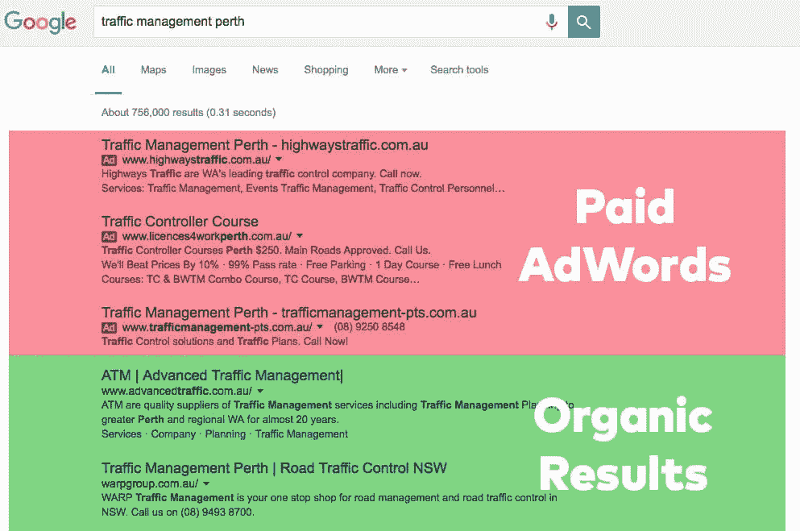

# 有机搜索引擎优化与谷歌广告词:哪一个适合你？

> 原文：<https://medium.com/swlh/organic-seo-vs-google-adwords-which-ones-right-for-you-cc407094fcdc>

任何网站的目标都应该是获取合格的潜在客户，而实现这一目标的最佳方式就是让你的潜在客户知道你的存在。让你的网站在谷歌上排名是所有企业在推广和营销服务时面临的众多挑战之一。你应该为广告付费，比如 Google AdWords，还是付出一些努力，与有机 SEO 进行长期博弈？

这是一个棘手的问题，需要在选择其中一条或两条道路之前仔细考虑。大多数企业不知道是采用有机的 [**SEO 策略**](https://startdigital.com.au/our-services/seo-perth/) 还是付费搜索策略，或者是否两者都用。

每个企业都是不同的，在一个独特的空间运作，所以没有正确或错误的答案，但是你的业务目标，预算和时间限制将在你采取的方向发挥重要作用。

根据经验，我们确实知道，如果你的营销策略错了，会耗费你大量的时间和金钱，最终弊大于利。

# 有机搜索引擎优化

拥有一个强大的有机 SEO 排名的最大优势是，有机排名往往比广告更可信。谷歌已经存在了足够长的时间，用户应该知道他们什么时候被广告了。而且大多数用户都知道，谷歌 AdWords 顶端的企业财大气粗。统计数据表明，一个高有机排名吸引了 50%以上的点击率比顶端的广告词清单。

考虑到这一点，企业认识到更高的有机排名意味着信任的增加，这反过来也意味着收入的增加，他们愿意花大价钱让自己的网站排名靠前。然而，这并不像“如果你建造了它，他们就会来”那么简单。事实上它要复杂得多。这就是 [**SEO 机构**](https://startdigital.com.au/) 发挥作用的地方。

在 Start Digital，我们确保我们的网站是谷歌友好的**，提高它们的性能和信任度，从而提高它们在搜索引擎眼中的重要性。我们确保您的文本是相关的，您的标题是适当的标签(H1 > H6)，您的网站图片是优化和标签，该网站是 [**移动友好**](https://startdigital.com.au/mobile-friendly-websites-perth/) **。通过使用 MaxCDN([**Content Delivery Network**](https://towardsdatascience.com/cnd-content-delivery-networks-b4e6998216cc))和 [**Cloudflare**](/@CloudflareBlog) 等服务，我们特别关注服务器性能、站点交付和稳定性，以进一步提升性能！我们已经为我们的每一个 SEO 客户看到了一些令人难以置信的结果，但它不是一门精确的科学，而是一个移动的目标。谷歌定期更新他们的搜索算法，这影响了他们对网站的排名。最近 [**Google 回溯了之前对站点元描述长度的扩展**](https://yoast.com/shorter-meta-descriptions/)**——又变短了。就像我们说的，这是个移动的目标。******

****有机搜索引擎优化需要努力、专注和大量的耐心，但是，一旦你的网站建立起来，它无疑会产生难以置信的长期结果，帮助企业基于价值和信任而不是口袋深度成长。****

# ****Google AdWords****

****付费在线广告有多种形式，但在本文中，我们将重点关注 Google AdWords。毕竟，他们是最大和最有名的球员。****

****AdWords 是将你的列表提升到顶端的好方法。然而，这是有代价的，如果管理不当，这种代价会很快掏空你的口袋。****

****Google AdWords 按点击付费(PPC)收费。也就是说，当有人点击你的广告时，你就要付费。流行的搜索词比那些不太流行的搜索词更贵。您的每次点击费用取决于您的市场和您的排名。支付 0.20 美元/点击的公司可能不会排名在支付 0.30 美元/点击的公司之上。是系统人，是系统。****

****开始付费营销活动时，了解客户在寻找你的服务时在寻找什么是很重要的。通常它不是流行的昂贵搜索词，而是长尾搜索词——它们便宜得多，竞争较少，是新查询的潜在金矿。我们建议你做这方面的研究，因为 longtail 也可以相当于一个月 10 次搜索，这是毫无意义的——至少在我们看来是这样。****

****PPC 的最大优势是你可以控制你的网站将被列入哪些条款。当您试图确定哪个关键词会产生最佳结果时，这尤其有用。使用谷歌的广告词管理工具，你可以很容易地看到哪些关键词正在转化为网站访问者。****

# ****结论****

****这里真的没有正确或错误的答案。这完全取决于你的业务、竞争和预算。对许多企业来说，有机的和有偿的结果相结合通常效果最好。有机排名给你的企业一些权威，信任和长期的结果，而付费广告提供了即时的高排名和增加的可见性。****

****无论你是要管理自己的数字营销还是聘请数字代理，我们都建议你做好调查。你的竞争对手在做什么？他们排名如何？他们是如何赢得工作的？他们用什么关键词？我们经常看到企业聘请数字代理，知道他们需要在网上营销自己，但没有完全理解这需要什么。澳大利亚的媒体和营销中心 [**Mumbrella**](https://mumbrella.com.au/) 注意到 [**“无知让广告欺诈盛行，因为客户不确定他们在支付什么。”**](https://mumbrella.com.au/fraud-might-be-as-much-your-fault-as-it-is-the-fraudsters-498163) 我们已经亲眼目睹了这种情况，为了应对这种情况，我们努力提供尽可能多的信息，并让我们的客户随时了解情况。对于我们的客户来说，大多数时候他们并不关心我们做了什么，他们只关心结果。作为一名企业主，我能理解这一点。****

****有关我们的 [**在线营销珀斯**](https://startdigital.com.au/our-services/online-marketing-perth/) 服务的更多信息，请浏览我们的 [**StartSEO**](https://startseo.com.au/) 网站。****

********

## ****这个故事发表在 [The Startup](https://medium.com/swlh) 上，这是 Medium 最大的创业刊物，拥有 331，853+人关注。****

## ****在这里订阅接收[我们的头条新闻](http://growthsupply.com/the-startup-newsletter/)。****

********