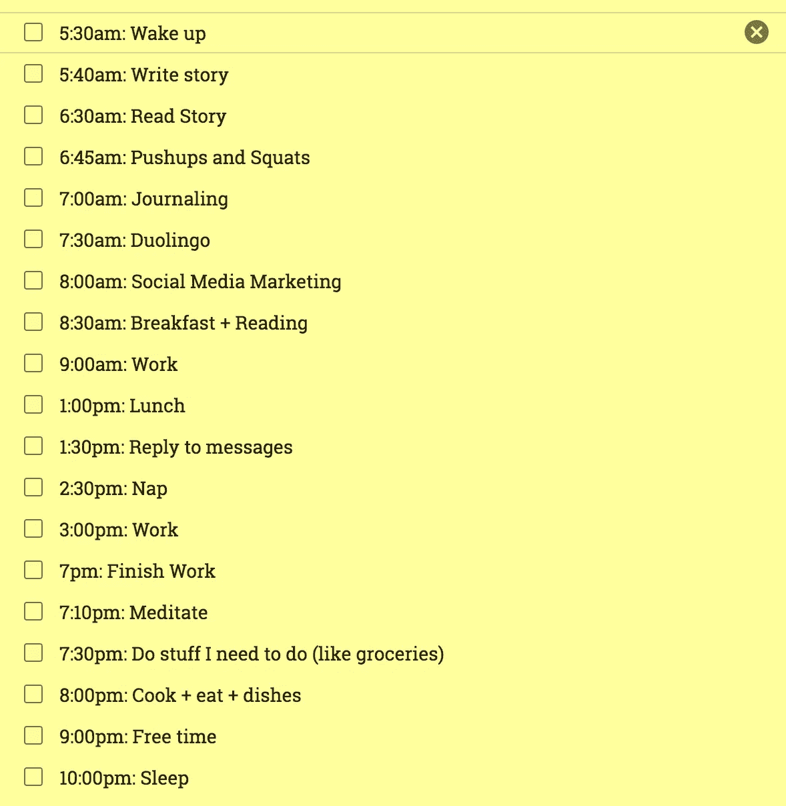

# 创意不存在，我们应该以此为目标

> 原文：<https://medium.com/swlh/originality-does-not-exist-we-should-aim-for-this-instead-e575228b78c0>

Photo by [@aleksdorohovich](https://unsplash.com/@aleksdorohovich): [https://unsplash.com/photos/nJdwUHmaY8A](https://unsplash.com/photos/nJdwUHmaY8A)

当我写这篇文章的时候，我已经有几天没有创作灵感了。我通常每天都写作，直到最近，这都很容易——比我想象的要容易得多。

我的日常生活被我回家探亲访友的事实完全打乱了。我从一个小组跳到另一个小组，几乎没有时间做我通常的二月例行工作。以下供参考:

My crazy daily schedule/routine

没有这个惯例完全摧毁了我的创造力。

我试图想出有趣和独特的话题，但什么都没有。

今天早上，我在 Medium 上读了一些故事，试图从中获得灵感，我意识到我们都在写同样的事情。包括我自己。

我是说，这很正常。当你把自己限制在学习、生产力、自我提升和生活课程的主题上时，没有一百万个主题可以写。

但是，我仍然觉得这是我目前阻止的原因之一。我写的没有一样是原创的。你读的没有一样是原创的。

我们从阅读中学到的东西都是一样的。

我本想认为我过去写的东西是原创的。

因为意识到这一点，我有点不想再写另一个故事了。

但是今天早上锻炼的时候，我意识到我错了。

# 原创来自真实

目前，我在 Medium 上的头条新闻是: [41 件你应该说“不”的事情，以成为你在生活和工作中想要成为的人](https://www.forestco.co/blog/41-things-you-should-say-no-to-to-become-the-person-you-want-to-be-in-life-and-business)。

人们当然会批评它缺乏原创性，因为毕竟大部分内容都是引用他人的话。

我自己也质疑过它的原创性。

事实上，我在 3 天前收到了关于这个故事的第一条很糟糕的评论:

> “你可能是一个不错的家伙，只是没有什么重要的想法，也没有掌握适当的语法和句子结构。”—马克·图尔克

他没有半错。我在 40-60 分钟内写完我的故事。在点击“发布”之前，我简单地重读了一遍。他们错误百出。幸好语法上有帮助，但是当我在 40 分钟内写 750 个单词时，我肯定会出错。

关于“没有重要的想法”，这又回到了我的问题上。我是原创吗？

我选择认为自己是“原创”。

以下是上面这篇文章“原创”的原因:

*   除了极少数例外，我对清单上的所有事情都说“不”；
*   我不会拒绝的事情，我正在努力；
*   每一个副标题都附有一个简短的简介，说明我个人是如何理解要拒绝的事情的；
*   我把所有的东西都分成我认为有意义的类别；
*   我选择了与要说不的事情相匹配的引语；
*   我选择了标题和图片；和
*   我写了引言和结论。

其他人会对同样的事情说“不”,但除此之外，这个故事很有创意。

我并不是因为有人写了一个不好的评论而为自己辩护。我自己也质疑过。

我分析了我写的其他一些故事，意识到我的原创性来自于我的真实性。

我在 Medium 上关注的其他伟人也是如此。

他们写同样的东西，但加入了他们的个人故事和弱点。这使得他们是真实的。

# 以真实性为目标

一篇改了字的复制粘贴文章很无聊。一篇有个人故事的文章让它变得有趣。

顶尖作家能走到今天这一步绝非偶然。我上面提到的那篇文章做得好，不是偶然的。它是原创的。它是真实的。

这适用于所有的创造性学科，可以说是任何东西。

我以制作电子游戏为生。我从所有伟大的游戏中窃取好的想法。《灵魂收割者》的所有好点子都是从其他做得好的游戏中借鉴来的。

> “好的艺术家临摹，伟大的艺术家偷窃。”——巴勃罗·毕加索

但我以一种前所未有的方式将一切结合起来。不同概念之间的“粘合剂”来自我自己的想法。整体而言，《灵魂收割者》是一款原创游戏。

我是一个长得像维京人的家伙，制作游戏和应用程序，在这里写作，拍照，在网上卖东西。

还有谁是那样的？

没有人。我喜欢这样。这让我的遭遇更有意义。这让我的故事更有趣。这让我的成功更大。

这让我变得真实。

# 结论

下次你或其他人质疑你的原创性时，想想你带来了什么不同。你的真实性可能会让你变得“原创”。

利用你的真实性。

向世界展示你是谁，它会回报你更深的关系和更多的成功和幸福。

你能做到的！

**感谢阅读和分享！:)**

**如果你喜欢这个故事，请随意**👏👏👏**几次(最多 50 次。说真的)。要获得自我提升的额外帮助和更多，请查看**[**dannyforest.com**](http://dannyforest.com/)**。**

## 这个故事发表在 [The Startup](https://medium.com/swlh) 上，这是 Medium 最大的企业家出版物，拥有 298，432+人。

## 在这里订阅接收[我们的头条新闻](http://growthsupply.com/the-startup-newsletter/)。

