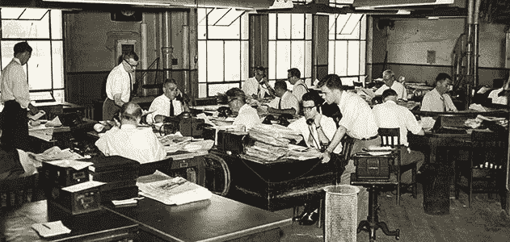
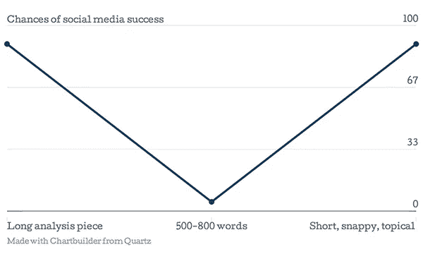

# 我们的八秒钟注意力跨度:新闻媒体的未来

> 原文：<https://medium.com/swlh/our-eight-second-attention-span-the-future-of-news-media-36bea72acba7>

smithsonianmag.com

在过去的十年里，我们一直在根据新闻媒体的变化调整我们的注意力范围。但是未来可能会相反——新闻媒体适应我们。这将如何影响新闻的未来？

最近[微软消费者研究](https://advertising.microsoft.com/en/WWDocs/User/display/cl/researchreport/31966/en/microsoft-attention-spans-research-report.pdf)声称人类的注意力持续时间从 2000 年的 12 秒下降到今天的 8 秒。金鱼的注意力持续时间是 9 秒。利用这项研究，你可以随心所欲，但我不认为这证明了 T4 对手机毁坏我们心智的哀叹。相反，在过去十年左右的时间里，随着社交媒体的出现，我们的思维似乎已经进化到适应新闻媒体和社交媒体协同作用产生的信息洪流。

在此期间，许多新闻媒体公司从印刷媒体转向网络媒体，同时保持其广告收入为主的商业模式。其中一些新闻媒体公司发现了社交媒体的一个改变游戏规则的公式——更多的分享转化为更多的广告展示/点击和更多的收入。随着社交媒体变得越来越主流(当你奶奶加入脸书，你妈妈上了 Snapchat)，新闻媒体公司变得越来越依赖它。然而，就在几年前，68%的记者表示，新闻业无法再与社交媒体合作。

2015 年，社交媒体比搜索引擎带来了更多的新闻网站推荐。今天，数字广告收入占《纽约时报》广告收入的 36%，占《福布斯》广告收入的 70%。社交媒体是车轮后面的踏板。此外，新的著名的非印刷新闻媒体公司诞生于这个社交媒体激增的时代，如《赫芬顿邮报》(2005 年)、BuzzFeed (2006 年，与 Twitter 相同)、Business Insider (2009 年)、Mic (2011 年)和 Quartz (2012 年)。

简而言之，随着新闻媒体越来越依赖社交媒体作为载体，随着社交媒体也越来越多地进入我们的生活，我们人类似乎已经适应了这种新的信息洪流。我们必须想出如何处理不断轰炸的信息，所以我们将注意力从 12 秒缩短到 8 秒，以帮助我们进行多任务处理，区分优先级，快速高效地消费。但是，在我们的注意力和新闻媒体之间的这种准进化关系中，接下来会发生什么呢？我们能很快达到 7、6 或 5 秒吗？我觉得这不太可能。相反，我认为我们正处于这种关系的*转折点——新闻媒体开始适应我们*。

新闻媒体开始感受到注意力经济学的影响，这种观点认为，丰富的信息造成注意力的稀缺，因此需要有效地分配注意力。虽然它适用于过去十年左右的社交媒体时代，但它几乎不是一个新概念。1969 年，诺贝尔奖获得者司马贺[写道](http://zeus.zeit.de/2007/39/simon.pdf):

> “……在一个信息丰富的世界里，信息的丰富意味着其他东西的匮乏:信息所消耗的任何东西的匮乏。信息消耗的东西相当明显:它消耗了接收者的注意力。因此，丰富的信息造成了注意力的匮乏，需要在可能消耗注意力的过多信息源中有效地分配注意力。”

在他的论文中，西蒙提到了来自过去时代的巨型计算机的大量信息，但尽管如此，他的理论也可以应用于最近来自社交媒体和新闻媒体的大量信息。现在，我们正在进入新闻媒体注意力稀缺的新时代，这对出版物和新闻业意味着什么？

1.更短、更具互动性的格式

我们较短的注意力持续时间并不是导致新闻文章字数变化的唯一因素。对于今天的绝大多数新闻公司来说，手机带来的流量超过了网络,这意味着优化手机屏幕应该是他们的首要任务。这两个因素都导致了新闻文章平均长度的减少。

例如，2014 年，世界上最大的独立新闻机构美联社呼吁其记者将文章控制在 300-500 字范围内。电子邮件，一个看似过时和不性感的概念，现在是时事通讯的载体，一种简短的，基于摘要的格式，几家[的主要新闻公司正在试验](http://www.niemanlab.org/2016/11/there-are-at-least-eight-promising-business-models-for-email-newsletters/)(想想[的 theSkimm](http://www.theskimm.com/) )。

除了平均字数的减少，我们还将看到新的互动形式(仍然是更少的单词)的投资和实验的增加，如谷歌 Cardboard 的[纽约时报虚拟现实应用](http://www.nytimes.com/marketing/nytvr/)，Quartz 聊天机器人应用， [CNN](http://cnnpressroom.blogs.cnn.com/2016/04/12/news-gets-personal-with-cnn-for-facebook-messenger/) / [华尔街日报](http://www.messengerchatbots.com/Reviews/wall-street-journal-chat-bot-walkthrough-review.aspx)/[BuzzFeed](https://www.buzzfeed.com/mathonan/meet-buzzbot?utm_term=.weA4v3Vx98#.wb98XyARrz)Facebook Messenger 内的聊天机器人， [Periscope 频道](https://www.periscope.tv/channel/news-us)， [Snapchat Discover](https://support.snapchat.com/en-US/a/discover-how-to)

2.高级长格式

考虑到前面的段落，这听起来很矛盾。但是即使我们的注意力持续时间较短，我们仍然阅读引人入胜的分析性长篇文章(1000 字或更多)。新闻快讯查看了 2013 年五大新闻出版物关于脸书的十大新闻，发现这些新闻要么极短(不到 300 字)，要么篇幅很长。《纽约时报》的十大新闻平均字数最高，超过 2000 字。

Quartz 的主编凯文·德莱尼似乎同意这一理论。2013 年，他解释说，石英要么发表 500 字以下的文章，要么发表 1200 字左右的文章，他说“[太多的报道是 700 字的文章，其他人都有](https://www.journalism.co.uk/news/-smartden-why-quartz-does-not-publish-500-to-800-word-articles/s2/a554444/)”这是一个形象化的例子:

因此，尽管我们的注意力持续时间越来越短，但我们似乎仍然对长篇小说情有独钟。我们愿意积极地维持我们的注意力持续时间，但前提是质量是真正有趣和吸引人的。我们更仔细地挑选值得花很多时间阅读的内容，这意味着新闻出版物应该开始投入更多资源来制作高质量的长篇文章。例如，《纽约时报》2013 年 11 月的[十大新闻之一是一篇关于澳大利亚移民的文章](https://www.newswhip.com/2013/12/article-length/)，超过 10000 字，长度类似于一篇文学短篇小说。

本质上，尽管给定新闻出版物中的大部分文章可能会变得很小(第一点)，但剩余的文章将会变得非常高质量，是长篇文章(第二点)。我们可能会开始看到中篇新闻文章消失。

3.哗众取宠

除了实际阅读文章，我们还花大量时间阅读标题。大约 60%的美国人承认只浏览过标题。这不应该令人惊讶，因为它符合主题:我们在每个标题上花几秒钟，然后继续前进，因为我们有大量的信息要消化。那么，如果一个记者想要真正的读者群，她该怎么做呢？创造吸引眼球的标题。

但是，伴随着吸引眼球的标题而来的自然是更加煽情的文字。如果一个记者在标题中暗示了一个有争议的观点，从逻辑上来说，作者更有可能在文章中包含这个观点。我并不是说著名的新闻来源将开始诉诸点击诱饵策略——不幸的是，我们都很熟悉这种策略。相反，我们可能会看到新闻业的中立性下降。Edelman 的一项研究表明，由于对社交媒体的依赖，75%的记者感到创建具有病毒式传播因素的内容的压力，而病毒式传播往往会带来耸人听闻的偏见。这是一个滑坡，我们不需要比 2016 年美国大选的[假新闻](http://venturebeat.com/2016/11/16/google-facebook-twitter-take-steps-to-reduce-hate-speech-and-fake-news-on-their-site/)看得更远来寻找其后果的可能性。

不管是好是坏，这是我们注意力持续时间缩短的三个影响，我认为我们将开始在新闻媒体上看到。风水轮流转，读者的力量似乎比以往任何时候都大。