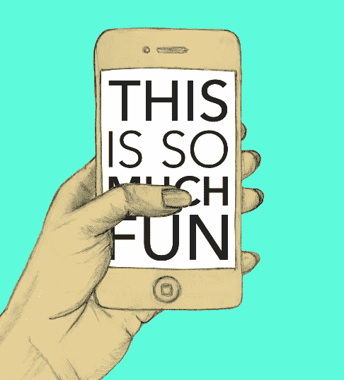

# 我们的扩展词汇:电话交谈，重温

> 原文：<https://medium.com/swlh/our-expanded-vocabulary-talking-on-the-phone-revisited-26ff9725ed50>

大卫·施瓦茨

技术改变了我们的交流方式。从皮影木偶到楔形文字簧片到活字印刷术，到今天:表情符号、gif、增强自拍视频。数字平台提供了比以往更多的表达方式。但是，在管理我们的内容时，计算机现在有能力直接从我们的嘴里说出话来。用拇指轻轻一划，英语的 26 个字符被看似无限的图像、动作和声音词汇所加粗、加粗、修饰。

通信的设计是当今产品的前沿。只看用 Alexa 或者 Bitmoji 贴纸的语音交互。argodesign 与领先的 GIF 键盘之一，一家名为 Tenor 的初创公司合作，[最终](https://qz.com/1239464/google-is-buying-tenor-to-make-it-easier-to-find-the-perfect-gif/)于 2018 年 3 月被谷歌收购。通过个性化的搜索和可定制的类别，[用户与一个独特的键盘互动，这符合他们明示和暗示的偏好。当 GIF 不够用时，用户可以通过手绘、添加贴纸、打字和在表情符号中嵌入 GIF 来创建和定制应用程序中的内容。](https://tenor.com/)

作为一个社交网络，Tenor 允许用户选择他们想看和交流的内容。这就形成了一个个人的应酬语清单，或者纯粹用于社交而不是交换信息的短语。

科技为我们选择发送的媒体提供了更多的选择，但同时也为我们发送的内容提供了更宽松的表达方式。[文学评论家和理论家诺斯罗普·弗莱](https://en.wikipedia.org/wiki/Northrop_Frye)将此描述为转喻的功能，在转喻中，词语被用作双方沟通的不完美桥梁。通过重新引入图像系统——数字象形文字——我们正在扩大我们的抽象能力，或者说我们基于个人观点联系思想的能力。通过这种方式，也许个人体验的表达对任何会使用设备的人来说都变得更加容易，而不仅仅是语言艺术家、艺术家和音乐家。

因此，我们的数字化语言趋同，因此手机聊天中的病毒模因很容易被引用。它可能帮助我们克服识字和语言的障碍；毕竟每个人都能看懂一张脸，一个表情符号。但数字语言也在迅速个性化:当记者发送水晶球表情符号“我哭了”和油炸 Squidward 时，他对某人的意思有自己独特的解释。然后，计算机为我们提供了更大范围的表达和理解，这可能会导致更大的同理心，一种即将到来的团结。也许他们为那些不太善于表达的人打开了一个更频繁的平台，让他们交流关于自己的事情。

但与愤怒的青少年写分手信不同，我们的手机上总是有第三方。这让人回想起充斥着“采购订单”的聊天室——但现在是营销人员，而不是家长。算法、表面推荐和交互设计师根据数据分析师预测的大众需求来组织内容类别。机器总是在倾听、帮助、暗示。这不容易说出来。这种口才带来了一种有趣的需求，那就是观察我们的嘴巴。

这样一来，机器就没有什么新的东西可说了，我们也没有责任去设计那些不能为我们提供所需控制的产品。虽然我们的媒体范围扩大了，但仅仅因为推荐或自动更正的内容而保持沉默是一种倒退。迷因可以是对时代精神的细微评论，但除非我们能找到符合我们独特交流方式的个性化评论，否则它们只是把话放进我们嘴里。

在一个不仅仅只有字母的数字世界里，计算机和人类开始一起说话。我们的对话总是通过我们的舌头，我们的语言，我们的行话。这只是下一步。书面语的把关者——字典——对于编纂新材料有着严格的规则，基于它被某个流行的意思引用了多久。像 Tenor 这样的平台可以提供一个更加平等的个人表达字典。但是，我们所能使用的词语——以及图片和表情符号——不能仅仅基于什么是流行的，什么是被利用的。这不会是吸毒，生病，或弗利克在所有。智能手机重新定义了我们沟通的方式和频率。但是它还没有帮助我们找到我们到底想说什么。

大卫·施瓦茨经营着 argodesign 的纽约工作室，专注于社会影响和东海岸的工作。他领导设计、研究和战略方面的创新项目。2015 年，他被列入《Fast Company》全球顶级设计师。他曾在 SXSW Eco、大会、奥斯汀中心 4 设计、德克萨斯人类学峰会、社区设计协会、奥斯汀设计之家、AIGA、社会公益峰会和 TEDx 演讲、主持研讨会并授课。他的作品或想法已经发表在纽约杂志，如何设计，临时杂志，影响设计中心，FastCo 设计，和麻省理工学院技术评论。此前，他在 IBM Design on Watson 工作，拥有设计专利和知识产权出版物。另一方面，大卫是一个狂热的旅行者和作家。

## 这篇文章发表在《创业公司》杂志上，这是 Medium 最大的创业刊物，有 340，876 人关注。

## 订阅接收[我们的头条](http://growthsupply.com/the-startup-newsletter/)。

