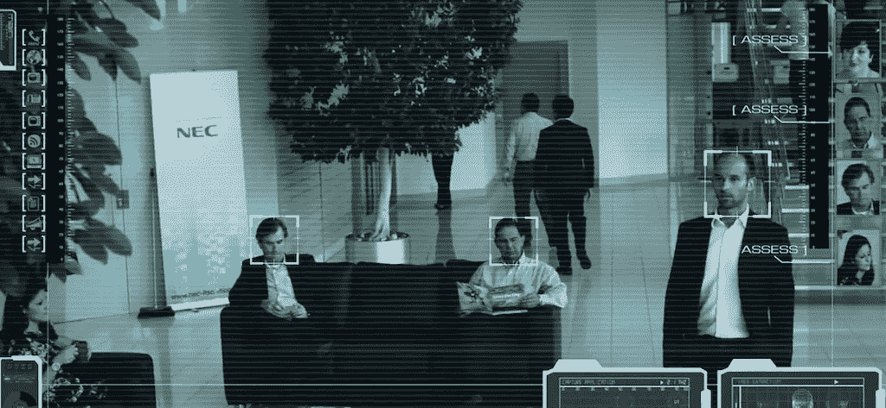
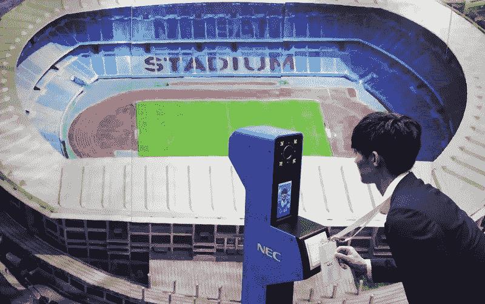
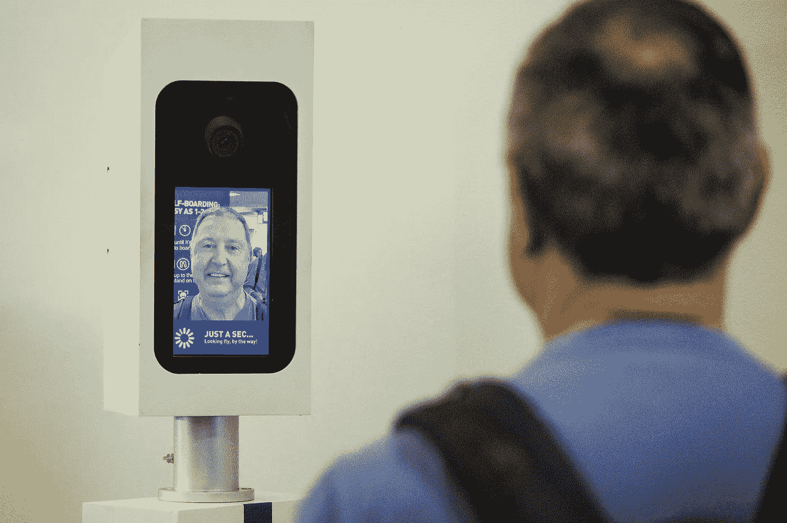
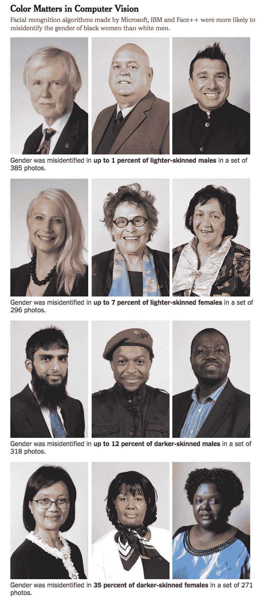

# 我们的脸正在取代字母数字密码。我们都应该担心。

> 原文：<https://medium.com/swlh/our-faces-are-replacing-alphanumeric-passwords-and-we-should-all-be-worried-433608d0ccc5>

## 这就好像面部识别将很快取代字母数字密码，我们都应该对此感到担忧。

Image from Revistaembarque.com

# 没有密码的人类

我不太喜欢密码。我总是忘记它们，一想到必须记住“秘密问题”的答案，我就感到痛苦，这个问题只有我一个人应该知道，但却不知道。或者，如果因为多次输入错误的密码而在有限的时间内从自己的帐户中注销，该怎么办？最糟糕的感觉，我承认。处于这种困境的不止我一个人。

但是，我们杰出的技术专家带来了解决我们困境的办法:用我们的脸作为密码。有了这样的进步，就不需要记住冗长的字母数字密码了。只需看一眼屏幕，瞧，你就可以访问你所有珍贵的个人事务。毫不奇怪，苹果和三星已经将面部识别作为其最新智能手机的主要功能。

因此，无论何时何地，我们关注面部识别软件的进步，以及它如何通过加强国家和地方安全以及减少排队等候来改善我们的生活，似乎都会成为头条新闻。

Face recognition system that will be used for the Tokyo 2020 Olympic and Paralympic Games. Image from AP News.

例如，让我们以东京 2020 年奥林匹克委员会为例。它最近宣布，它将使用面部识别来减少认证等候线的拥堵，从而使物流更容易，更安全，不用人工，总体而言，更易于管理。根据委员会的说法，使用这种方法来识别，最终将减少运动员在炎热天气下的焦虑感。

此外，在美国， [Mineta San Jose 机场](https://sanfrancisco.cbslocal.com/2018/08/06/mineta-san-jose-airport-to-implement-facial-recognition-security-system/?utm_source=newsletter&utm_medium=email&utm_campaign=newsletter_axiospm&stream=top-stories)几周前成为头条新闻，因为它是第一个使用面部识别技术来识别出入境旅客身份的机场，该技术通过将旅客的面部与护照上的面部进行比较，而护照上的面部已经存在数据库中。自实施上述技术以来，该机场将平均排队时间从 25 分钟减少到 21 分钟，整整 4 分钟。

A passenger scanning his face before boarding his flight. Image from the NPR.

此外，一种新实施的旅行验证服务正在美国机场遍地开花。它允许乘客在没有纸质机票或不使用航空公司应用程序的情况下登机。当他们走向登机口时，他们的脸就成了他们的登机牌，他们的脸会被一台复杂的生物扫描仪扫描。

Jd.com store in China. Image from Abacus News.

而在亚洲，一家中国在线零售商开设了一家高科技商店，类似于西雅图的亚马逊 Go 商店，顾客只需走进去，拿走他们想要的东西，然后不付钱就离开。面部识别和人工智能处理其余的结账过程。因此，减少了入店行窃，并再次有效地消除了结账队伍。

# 一个完美的世界…对吗？

至少可以说，所有这些听起来都很棒，无伤大雅。我们正在走向一个永远不用排队等候的世界。一个我们将没有卡的世界。我们永远不会用最复杂的规则组合来创建最荒谬的密码，也不会被最荒谬的密码所窒息，这些规则组合必须包括 8-12 个字符长，一个大写字母，一个数字，一个特殊字符，不能是常见的名称或实体，并且要求不断。

按照这种速度，我们甚至不需要驾驶执照或任何类型的身份证。

我们的脸将是我们生活的关键。它们将是我们银行账户的密码，是我们家和汽车的钥匙。我们的钥匙永远不会丢失，我们的车里再也不会有锁着的钥匙了。

# 但是…

如果我听起来有点偏执，甚至怀疑所有这些模糊，我道歉。我不禁要问，为了效率，我们愿意在多大程度上放弃我们的人性。

不要误会我的意思，面部识别有太多的好处，但我们是否故意邀请公司、政府机构和黑客进入我们的个人生活，而不退缩和质疑他们的动机，不管他们可能是多么卑微？让我们记住，在这样的世界里，我们的脸将是我们所珍惜的一切的万能钥匙。对我们面部生物特征的一次访问可能会为更普遍的身份盗窃过程打开大门。

虽然字母数字密码可以更改；我们的指纹和面部等生物特征不能。因此，奇怪的是，令人不安的是，我们总是被告知不要对所有需要密码的东西使用同一个密码，并定期更换密码，但我们却愿意让我们的脸成为我们财务状况的终极大门。

问题不在于技术本身，而在于当它们落入坏人之手时会发生什么？这些隐私信息会保留多久？谁能接触到它们？我们都同意不存在不可破解的工具。

# 为什么它很重要…

以免我们也忘记了面部识别目前受到偏见和不准确的阻碍。事实上，麻省理工学院的计算机科学家 Joy Buolamwini 的一项研究显示，面部识别算法在识别有色人种时更容易失败。如果你是一个白人，这个软件 99%的时候都是正确的。如果你碰巧是深色皮肤，出错率可能会上升到 35%。这相当令人担忧。

Images from Joy Buolamwini, M.I.T. Media Lab and the New York Times Magazine.

全国各地的执法部门现在正在使用人工智能面部识别软件，根据人们的身体特征跟踪他们，而不是监控他们的财产，如智能手机。虽然这降低了劳动力成本并提高了效率，但非法跟踪有色人种、移民和公民社会行为肯定会比以往更加反常。

让我们以[纽约警察局为例，它最近解决了一场诉讼](https://www.nytimes.com/2018/04/05/nyregion/last-suit-accusing-nypd-of-spying-on-muslims-is-settled.html)，因为它被发现通过窃听咖啡馆里的谈话、询问穆斯林对无人机袭击的看法、收集车牌和拍摄清真寺入口来跟踪穆斯林美国人，所有这些都需要大量的人力。有了面部识别系统，纽约警察局本可以以更容易控制的速度，更反常地追踪这些穆斯林美国人，也许就不会被抓到。

考虑到目前白宫正计划对穆斯林进行[长期监控](https://www.afsc.org/blogs/news-and-commentary/trump-wants-to-surveil-muslims)，并[增加了对 AI 进步的财政投入](https://www.whitehouse.gov/briefings-statements/artificial-intelligence-american-people/)，由于滥用和宪法危机的发生，诉讼开始滚动只是时间问题。

技术也在以法律允许的更快速度发展。没有搜查令我们不会被搜查。但基于当前法律系统的状态，面部识别允许这种搜索随后进行，没有任何衍生，因为没有法律和指导方针来防止面部数据的滥用。因此，虐待是必然会发生的。

我们对面部识别的技术狂态度令人钦佩，我们对科学知识达到新高度的勇气值得称赞。正是科学家的好奇心让这个世界变得比以往任何时候都更加安全、更加健康、更加紧密。

然而，我们是否仅仅因为能够发现一些好处而忽略了一些巨大的危险，就认为使用新技术是正当的呢？我们不应该就面部识别的合法性和安全性进行更有意义的讨论吗？或者，我只是一个技术恐惧者？让我知道你的想法。

## 这篇文章发表在《初创企业》杂志上，这是 Medium 最大的创业刊物，拥有 358，974 名读者。

## 订阅接收[我们的头条新闻](http://growthsupply.com/the-startup-newsletter/)。

