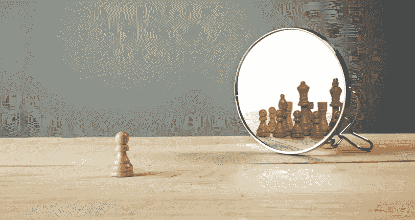

# 我们的历史，正在形成

> 原文：<https://medium.com/swlh/our-history-in-the-making-a4845386217c>

## 我们对主观经验中客观性的依赖

历史总是在创造，在每时每刻都在展现。随着时间的推移，我们似乎有一种与生俱来的迷恋/迷恋，在重要事件中认同我们自己、我们的身份。我们写自己，扮演一个知情的观察者，无辜的旁观者和“我在那里”的名人的角色。我们渴望成为重要的巅峰和低谷时刻的一部分。

这些精彩的经历只占我们生活的不到 1%,但是越有娱乐性，越有感情色彩，越有英雄气概或故事性，我们就越能感知并告诉自己和他人它们很重要。我们的参照系完全是主观的，然而我们重视并开始依赖此刻的客观性以及我们与它们的关系。

我们很难从自己身上分离出客观性，即对看似不相关的事件和目的的比较，也很难欣赏主观的自然，欣赏纯粹形式的快乐，这种快乐与每一个转瞬即逝的时刻都一样。

根据我们所知道的，以及我们是如何定义相对重要性或“价值”的，我们关注事情发生的时刻，进行理性的判断/评估，忽略生命中其他 99%的时间。我们似乎没有意识到每时每刻都在发生的事情，这是一个被严重低估的机会。

> “人们获得的专业知识和经验越多，他们看待世界的特定方式就越根深蒂固……随着我们获得关于某个领域的知识，我们就成了原型的囚犯。”—原件

我们的经验是我们的拐杖，当我们积累经验时，我们变得越来越天真地相信自己的直觉，并且更容易受到假阳性(创造者，自我验证的感知)和假阴性(不利风险，评估导向的感知)的影响。

因此，随着我们知识和专业技能的增长和发展，我们应该相信我们对他人的智慧和经验的无知。

个人不是一座孤岛。

# 有待思考的原始想法…

> “努力不做自己很累人。这就是为什么你会累，有压力，焦虑和没有安全感。做你自己，简单就好。”

**视力被低估**

我们低估了视力，却高估了自己的视觉能力。因为我们低估了我们的注意力和精力，高估了我们的自我意识和移情姿态。我们都想成为、希望并视自己为有伟大目标的伟大人物，但很少有人愿意接受自己的渺小，并投入终生的工作，尽可能地把自己发展成最好的样子；为自己，更重要的是，为他人。

**你属于这里**

有些人沉迷于物质、材料、时尚、屏幕、游戏、旅行、体验、调解、竞争、爱情、欲望、工作或许多许多其他选择，以逃避生活、障碍和提供给他们的机会。当你意识到你属于这里时，想去任何地方的愿望就会消失。否则做任何事情都是毫无意义的。唉，我们又开始了。

> “如果一个人跟不上他的同伴，也许是因为他听到了不同的鼓点。让他踏上他所听到的音乐的脚步，不管它有多远。”——亨利·大卫·梭罗

**杀死你最亲爱的人**

我们需要杀死我们的宠儿，将我们的原创想法交给观点各异的聪明人审查，这不仅是为了避免确认偏差和误报，也是为了鼓励目的、完善和只保留最适合的作品，无论它们在开始时看起来多么不理性、古怪和妄想。创造真正原创的作品是而且应该是一个痛苦的审查、迭代和核心能力的过程。

**品味被低估**

我们开发食物/营养之外的“口味”的耐心和坚持被严重低估了。我们渴望简单、舒适、自我验证的快速解决方案，通过我们在他人眼中的表现来强化我们的身份和我们告诉自己的故事。我们展示的东西。

**善良之盾**

当保护罩很低，自动化充其量是不稳定的时候，我们并不处于我们的社交最佳状态，我们出于自身利益而近乎纯粹地生存。“好”和“更好”需要精力和努力。维护我们已经默默同意遵守的社会和文化规范需要用心，这也是应该的。做一个“好”的人，做一个好人，意味着放弃我们的一些生存和利己的本能，屏蔽/保护自己和他人。

## 这篇文章发表在 [The Startup](https://medium.com/swlh) 上，这是 Medium 最大的创业刊物，有 308，471+人关注。

## 订阅接收[我们的头条新闻](http://growthsupply.com/the-startup-newsletter/)。

