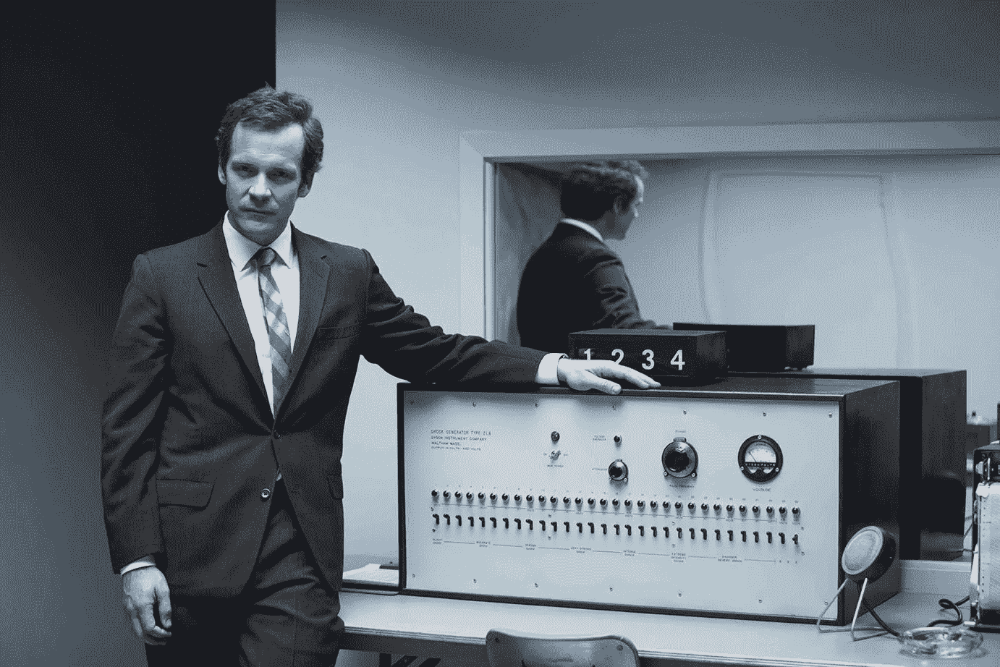
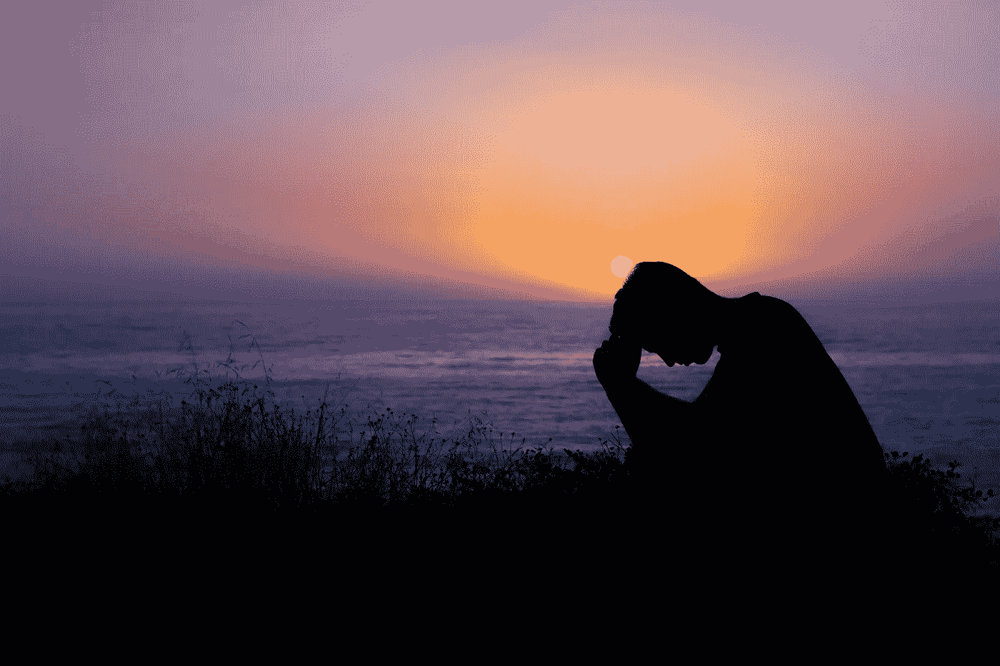

# 我们对智慧的服从

> 原文：<https://medium.com/swlh/our-obedience-to-intelligence-a3f845e01918>

## 智力的面具&相对论

我们如何定义智力和智力？我们对这样的定义有多少信任呢？什么是不可定义和不可测量的属性，并在我们对已知事物的顺从的僵化之外做出贡献呢…

我们对被感知、被认同和/或被归因于智力属性的执念又如何呢？似乎与慷慨、真诚、诚实、正直或同情相比，智力“更好”或具有某种相对价值本身就是一种高于他人的属性。在文化创造的基座上的智力，我们服从于它，以及其他可测量的，可观察的属性，这些属性也在某种程度上自我膨胀，被当作物质商品来炫耀或强化一种权利感。

相对于平庸的艺术标准，我们倾向于沉迷和过分强调我们自己、我们的生活以及我们定义(或感知)的好人的积极属性。

我们总是在比较，总是在竞争；一切都相对于那些职位相似、地位对我们亲切的人而言。当我们不确定自己是谁时，当我们对自己的位置和目标不确定时，这是我们证明自己是谁的方式。总是努力让自己足够，找到自己的价值，让自己“快乐”。

嗯，我们已经够朋友了。此外:

> 快乐是暂时的，完整是永久的。

一旦我们开始接受我们之所以是我们，是因为我们通过思想、决定和行动选择了我们，除非我们的潜力和满足感是过着我们注定要过的生活，这就是我们现在过的生活。这太不可思议了。不要更好，要优秀，要完整。

好人不需要智力、身体能力或属性、审美对称、健康、财富或其他。好人只是做好事；更多的时候，是为了服务他人或为更多的事情做出贡献；成为并代表更多的自我，成为并代表整体。

# 原始的想法

你可以做一点，也可以做很多。有所作为就好。

停滞的力量

阻力是让我们保持直立、停滞在一个地方的力量。它阻止我们前进，阻止我们前进。正是这种从后到前的推-拉将我们保持在适当的位置、时间和我们的想象力和局部最佳/潜力的范围内。如果我们要前进并实现一个新的最佳状态和/或扩展我们自己和我们的想象力，我们需要与我们对这些力量的精神接受作斗争。

你的解决方案是狗屎

首要目标不应该是解决问题，而是尝试可能有助于解决问题的方法。解决方案是一个方向，而不是一个目标。这是通过好奇和评估进行实验的行为，最终演变成一个全面或整体的解决方案。这是一个很难理解的概念，答案不应该是我们的目标，我们必须实际思考，创造实验，以各种方式反复分析和调整，以交换和连接点来构建解决方案。解决方案是从长期的行动和迭代中发展和构建的，而不是从受控的设计中发展和构建的。

可能=可能

如果有可能，就有可能。如果你能想到，这是可能的。它将在某个时候被创建。进化将预测相对不可预测的模式。它是我们想象之外的东西，我们不太了解或不能确定…直到有人想到它。

这里没了

不要浪费时间、精力，今天就达成一致。不如提前考虑一下。就好像你可以推断一个趋势，问在哪里/什么时候或者可预见的环境看起来会是什么样子，简单地为此而构建。有一个指导方向或焦点，你可以不时地检查，并不断地工作和进步。忘记结果，活在过程中。为明天做准备和计划，因为今天已经来了又走了。

## 这个故事发表在 [The Startup](https://medium.com/swlh) 上，这是 Medium 最大的创业刊物，有 295，232+人关注。

## 订阅接收[我们的头条](http://growthsupply.com/the-startup-newsletter/)。

