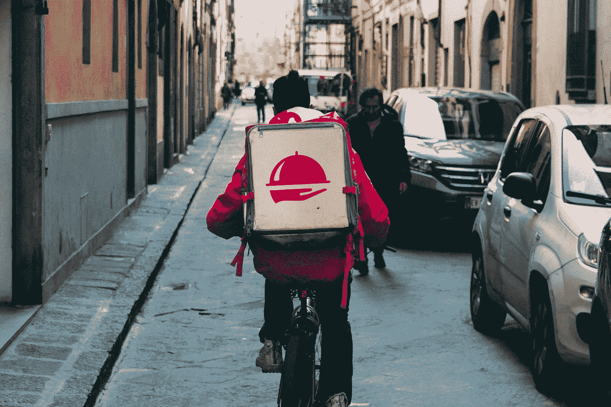
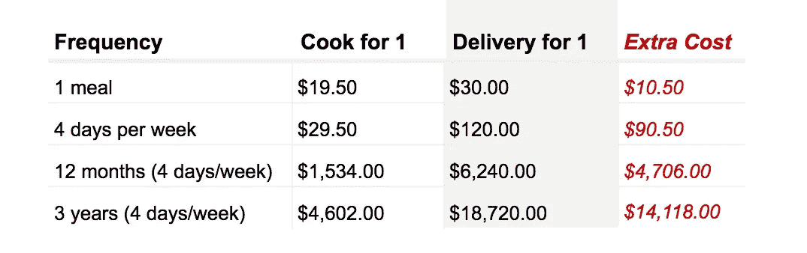
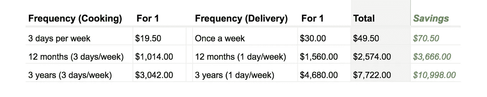
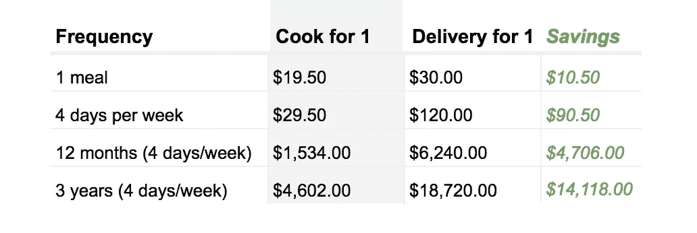
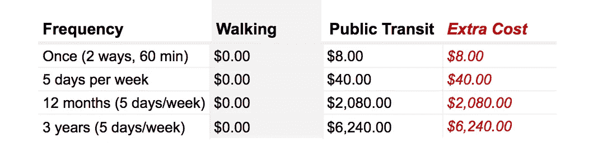
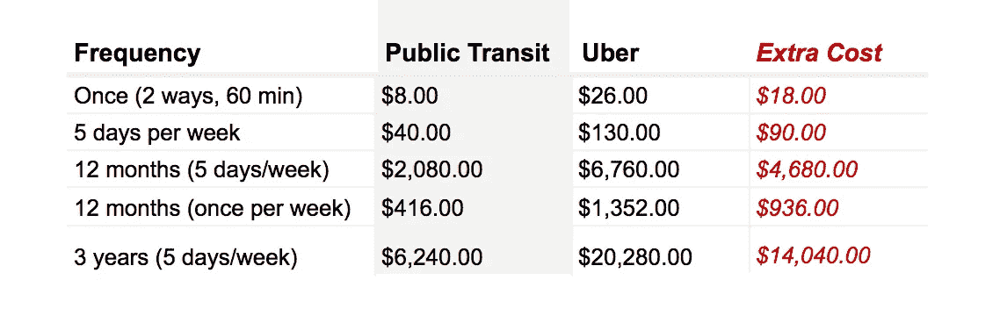
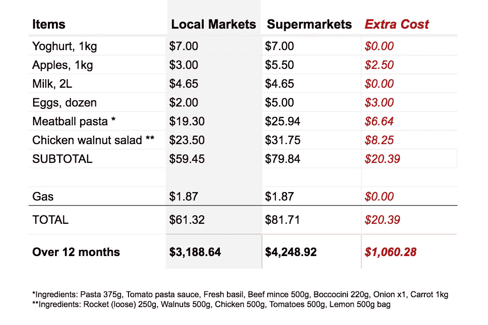
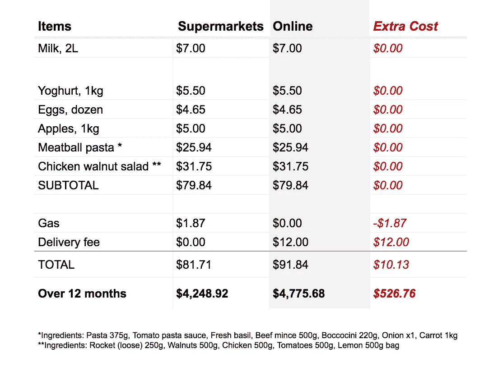
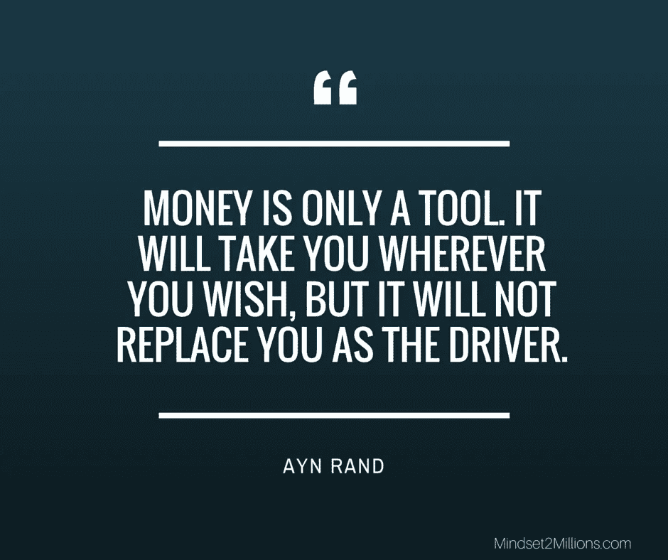

# 便利的真正成本

> 原文：<https://medium.com/swlh/our-obsession-with-convenience-is-deceiving-878c87fcb10a>

## 它掏空钱包的速度比你想象的要快

Photo by [Kristina Flour](https://unsplash.com/photos/BcjdbyKWquw?utm_source=unsplash&utm_medium=referral&utm_content=creditCopyText)

> 如果你事先知道在 Deliveroo 或 Uber 上订购晚餐每周一次，而不是每周四次，持续 12 个月，可以为你的海外假期或其他事情节省 3900 美元(基于每单 25 美元)，你会更在意你的外卖消费吗？

W **无论你是初创公司的创始人、企业主、学生，还是帮助另一家企业蓬勃发展的人才，我们都有不时在自己身上挥霍的罪过。*没事！但是当挥霍成为一种无意的习惯时，我们就有后悔的危险了。***

这一切都始于这里额外的 10%和那里的 20%。过一段时间，你开始更频繁地花掉额外的 20%。在你意识到这一点之前，它已经上升到了 20%的正常水平，而你平均放弃了 18%的额外收益，以换取当时感觉良好的便利。但是 5 年后，当你决定购买一个大的生活用品，比如一套房子或投资房产时，你意识到为了方便起见的**花费了你 5 年多的 32，500 美元**用于工作日送餐。*如果您事先知道这一成本，您还会选择送货便利吗？*

从商业角度来看， [**便利**是一个不断增长的行业，预计到 2022 年价值 471 亿美元](https://www.thegrocer.co.uk/reports/whitepapers/white-paper-understand-why-todays-consumers-demand-more-from-convenience/565548.article)，这真是太棒了。但是我们不应该忘记，一旦我们走出办公室，我们也是消费者。今天，我们在日常生活中忙得不可开交，以至于我们很容易被随处可见的额外收入对我们长期计划的影响所分心。以下是一些我们今天乐意支付的常见便利。

# 有外卖的时候为什么要做饭

How much more is delivery for dinner during the week costing you? | Photo by [Kai Pilger](https://unsplash.com/photos/tL92LY152Sk?utm_source=unsplash&utm_medium=referral&utm_content=creditCopyText)

寻找一个这样的食物可能是一个挑战，但这并不是不可能的，你可以控制你的饮食。另一方面，为 2 人或更多人做饭真的没有借口。然而，有了 [Deliveroo](https://deliveroo.com.au/) 、 [Uber Eats](https://www.ubereats.com/en-AU/stores/) 等服务，你可以更轻松、更方便地舒舒服服地坐在沙发上享用餐厅优质食品。除此之外，当我们下班回家时，我们通常想躺在沙发上“放松一下”，因为“这是艰难的一天”。然而，你真的在节省时间吗？虽然我们知道去杂货店和做饭需要时间，但这与订购食物和等待送货的时间相比又如何呢？我们不要忘记，送货并不完美，餐厅或送货员总是能把订单做对。有了外卖，我们可能不会总是选择“最健康”的选择，因为我们很容易吃我们此刻渴望的东西，而且更容易过量食用，因为我们通常不会或不容易烹饪的食物很容易获得。在一周中为晚餐送餐也可能会导致在私人教练身上花费数千美元，这是不必要的。在这一节中，我们将仔细看看送货比做饭更方便实际上要花费多少成本。

> 请注意，我选择以每周工作 4 天为基础进行计算和比较，因为我们有社交活动、聚会或“仅仅因为”想出去吃饭。请注意，成本比较是基于一个人的平均成本，只有晚餐。

## 场景 1.1:送货 4 天，不做饭

如果这是你，我想你的时间表是超级忙，你绝对讨厌做饭，或者你不知道如何做饭。幸运的是，你可以每周 4 天享受送货服务(比如优步吃饭)。我想你知道每次要花多少钱，但是超过 12 个月或 3 年呢？

Figure 1.1 Delivery 4 days a week

## 场景 1.2:烹饪 3 天+交付 1 天

如果这是你，我想你可能有也可能没有做饭的例行程序，但每周你都会用手机订购外卖，因为你没有食物了，或者懒得去商店，或者只是想“放松”。幸运的是，外卖比外出就餐便宜，所以钱包不会太紧，对吗？还是错了？

Figure 1.2 Cooking 3 days and 1 day of delivery each week

## 场景 1.3:烹饪 4 天，无配送

如果这是你，我想你有一个相当不错的日常购物和做饭的习惯。在某种程度上，我假设你已经对在家和外卖的食品杂货和晚餐做了一些粗略的计算。另外，这些食物通常更健康，因为你可以控制并知道你的食物中含有什么。

Figure 1.3 Cooking 4 days a week

## 观察

1.  连续 12 个月每周烹饪 4 天，你可以节省 4700 美元。这相当于在 3 年内节省了大约 14，000 美元。
2.  连续 12 个月每周 4 天送餐比同一时期每周 4 天做饭**贵 4 倍**——[《福布斯》发现送餐平均贵 5 倍](https://www.forbes.com/sites/priceonomics/2018/07/10/heres-how-much-money-do-you-save-by-cooking-at-home/#62b1211135e5) *。*
3.  连续 12 个月每周只送一次晚餐，相当于同一时期每周烹饪 4 天的成本——甚至这也让我感到惊讶。
4.  与外卖相比，你更有可能在自己做饭时吃得更健康，因为你知道你的食物中有什么。

> 如果你事先知道方便交货的相关成本，你会选择哪种情况？

总之，重要的是要意识到，与做饭相比，送餐的便利让我们付出了多少代价。我并不是说送货不好，但忽视让你感觉良好的便利所带来的成本是危险的，可能会导致后悔。此外，如果你像我一样关注食物成分的质量，你很可能在你的外卖餐中得不到这些。与烹饪相比，你愿意为送货方便付出多少代价？

## **烹饪技巧**

网上有很多快速健康的食谱。我在下面列出了一些，作为起步。对于那些不是创意厨师的人来说，只要从几顿饭开始就能掌握烹饪技巧，当你觉得舒服的时候慢慢加入新的食谱。你也可以在周日准备一周的饭菜，将每一餐分开打包，更方便在一周内“拿了就走”。

*   杰米的 30 分钟膳食
*   [一人工作日晚餐](https://www.self.com/gallery/weeknight-dinners-for-one)
*   [美食的 6 种成分或更少](https://www.goodfood.com.au/recipes/recipe-collections/10-easy-dinners-with-six-ingredients-or-less-20181120-h184ig)
*   [快速晚餐食谱](https://www.delish.com/cooking/menus/g1478/quick-dinner-ideas/)

# 有优步，为什么要步行或骑自行车

How much more is Uber costing you over the long term? | Photo by [Victor Xok](https://unsplash.com/photos/qd-zd2MoeE8?utm_source=unsplash&utm_medium=referral&utm_content=creditCopyText)

对于一些人来说，开车是日常通勤的唯一选择。但对许多其他人来说，我们可以选择步行、自行车、摩托车、优步/出租车或使用公共交通工具。我们经常理性地认为我们需要快速到达某个地方，很容易忘记“第二好”的选择(例如步行或骑自行车)带来的其他好处。

除了步行是免费的这一明显事实之外， [30 分钟的步行可以燃烧 90 到 200 卡路里的热量](https://www.livestrong.com/article/414178-how-many-calories-will-i-burn-walking-briskly-for-30-minutes-a-day-7-days-a-week/)，同时还有其他健康益处，比如改善精神健康。骑自行车也是免费的，除了自行车本身的一次性费用，对于普通人来说，骑自行车一小时可以燃烧 450 到 750 卡路里。虽然这些“第二好”的选择可能不理想或不可行，但它值得考虑对你健康的影响。

2018 年 1 月， [CBA 分享称，澳大利亚人平均每月在健康和健身活动上花费 7.12 亿美元](https://www.commbank.com.au/guidance/newsroom/new-year-fitness-spending-201801.html)。因此，事实上，对于那些每周乘坐优步上下班 3 次，其余时间乘坐公共交通工具的人来说，这里的便利成本更像是 12，100 美元，而不是仅优步和公共交通票价的 4，900 美元。很有可能你在健身房也更加努力，或者甚至支付了私人教练的额外费用 7200 美元，为期 6 个月，每周三次。如果你一直生活在快节奏的生活中，它在侵蚀你的健康，那么在你的决定中反复优先考虑方便，你真正获得了什么好处？让我们来看看一些数字。

**基于健身，第一位私人教练每 45 分钟收费 100 美元*

> 请注意，我选择计算和比较的基础是一个人每周工作 5 天，步行 30 分钟(例如，步行 30 分钟是 13 美元的优步之旅和 4 美元的公共交通单程票)。

## 场景 2.1:步行代替公共交通

一般来说，公共交通被认为是每日通勤时间和成本的良好平衡。然而，你知道每天 60 分钟的步行或骑自行车是你一天中必须做的运动吗？除了健身，还有其他几个健康好处，如[改善精神健康，降低压力水平，让你有时间为一天做好准备](https://letsreachsuccess.com/benefits-walking-to-work/)，这对你的工作效率有积极影响。它有时也更快，因为我们都知道交通会延长每天的通勤时间。在春季和夏季，步行和骑自行车都是摄入维生素 d 的好借口。所以，除了乘坐公共交通的便利性成本之外，乘坐公共交通而不考虑这些因素还有其他成本。

Figure 3.1 Walking vs taking public transit to/from work

在你的办公室不是步行距离的情况下，骑自行车是一个很好的选择，可以提供类似的健康益处和成本节约。唯一的成本是一次性购买自行车本身，大约 150 美元。

## 场景 2.2:公共交通代替优步/出租车

偶尔，不管什么原因，我们都会迟到，所以感谢优步和出租车。然而，迟到往往会成为一些人的习惯，尤其是如果距离不是很远，而对其他人来说，这是一个明确的决定。基本原理是这样的“优步单程只花我 10 到 15 美元，这比开车进城加停车还便宜”。因此，乘坐优步被认为并不比乘坐公共交通工具贵多少。但是，超过 12 个月或 3 年的时间呢？

Figure 2.2 Taking public transit vs Uber to/from work

但是乘坐优步真的像你想象的那样方便吗？除了通勤时间之外，你还花了多长时间等待优步？

## 观察

1.  每天步行上下班一年**为你节省 2080 美元到 6760 美元** ( *公交费用&优步*)
2.  骑自行车代替公共交通上下班一年**能为你节省 1930 美元**
3.  一辆优步上下班一年比公共交通贵 3 倍多，比步行贵 6760 美元
4.  一年中，每周乘坐一次优步上下班相当于大约 8 个月每周乘坐五次公共交通工具。

> 如果你事先知道不同交通方式的相关便利成本，你会选择哪种方案？

总之，与之前的送货和烹饪比较类似，当谈到便利时，你选择如何上下班也有相关的成本。区分实际花费的时间和到达某个地方的感觉是很重要的，因为通常更快的选择并不总是最快的，因为它取决于交通、天气和网络维护。您的健康是等式中的一个重要因素，也受到我们围绕便利性做出的决策的影响。从一个地方到另一个地方，为了方便，你愿意付出多少代价？

## **运动小贴士**

从长远来看，我们所做的小小改变和选择会产生比我们意识到的更大的影响。以下是一些开始的提示:

*   每天步行 30 分钟往返于工作地点、公共汽车站或火车站，因为这给了你每天所需的[最少运动量](https://www.more.com/lifestyle/exercise-health/walking-enough-workout)。此外，研究人员发现，那些每天步行的人患感冒的几率要低 25%。
*   如果你的通勤距离不是步行距离，那就提前一站下车，走完剩下的路到达你的目的地。
*   走楼梯，不要坐电梯。除了更可持续和有利于你的幸福，研究表明，那些走楼梯的人实际上节省时间。

# 为什么要去市场，那里有网上订购

How much more is buying groceries online cost you? | Photo by [Charles Deluvio 🇵🇭🇨🇦](https://unsplash.com/photos/vKEwDELlFbg?utm_source=unsplash&utm_medium=referral&utm_content=creditCopyText)

在[市场购物的概念已经存在了几千年，特别是从公元前 3000 年](https://en.wikipedia.org/wiki/Marketplace#History)开始，我们今天仍然这样做。我们购买食品杂货的习惯也在不断演变。今天，在网上订购食品变得越来越流行。虽然我个人不需要在网上订购食品，但我知道有些人觉得这是一个方便的选择。然而，我想知道那些在网上购买食品的人是否意识到这种便利会额外花费他们多少钱？成本本身不仅仅是杂货店收据底部的总数。还有许多隐性成本需要考虑，如产品质量和添加的防腐剂(如果有的话)。随着时间的推移，那些当时看似无关紧要的选择可能会影响你的长期健康，并产生意想不到的相关费用，无论是聘请私人教练、健身房会员等。在这一节中，我们将一窥网上订购食品杂货的便利实际上花费了人们多少钱。

> 请注意，我将 Woolworths 用于网上购物和超市，将维多利亚女王市场(在墨尔本)用作本地价格市场。价格是基于一个人的平均购物体验。

## 场景 3.1:在当地市场和/或超市购买食品杂货

通常，这是一个周六或周日的早上，你去当地市场购买一周的食品杂货。你可以从精选的农产品供应商那里挑选食物。假设市场离你的住处只有很短的步行距离，每个商店总共需要大约一个小时。大约两周或一个月，你会去超市买一些在市场上买不到的东西，比如卫生纸、肥皂等。这可能平均每周超过一个半小时。

另一方面，对于那些喜欢一站式商店的人来说，超市将拥有一切。从为你的膳食生产到基本的家庭用品，通常需要一个小时到一个半小时来获得你一周所需的东西。在这种情况下，你更有可能开车，因为你预计你会购买更多，因为超市会有你一周所需的一切。

Figure 3.1 Buying at the supermarket vs local markets

## 场景 3.2:在线购买杂货

在网上购买食品杂货时，有一个最低订购金额的要求，比如 50 美元。从心理学上来说，这隐含地设定了一个预期，当你购物时，你至少需要花那么多钱，这导致你比你实际可能花费的更多。此外，人们应该考虑在能够随时在线订购食品杂货和需要在家等待送货窗口或替代送货选项之间的权衡。另一方面，去超市或当地市场有固定的时间，这可能更容易安排计划，所以它是众所周知的。现在有许多超市营业到晚上 10 点和午夜，这为购物提供了灵活性。不管怎样，在网上购买食品并不能保证你不用走进超市。这是现实的自发需要一些随机的东西，意识到你忘记了一些东西或做一个交换，因为不正确的项目被交付。

你告诉自己在网上订购更方便吗？此外，网上订购是一次性的便利还是整体提升，让你有时间花相关费用做更多事情？当然，这不是一个普遍的规则，每个人的情况都不同，但我们应该彻底考虑所有的因素。

Figure 3.2 Buying groceries online vs supermarket

你认为网上购物每月能为你节省多少时间？你花了多少钱来节省时间？对你来说值得吗？

## 观察

1.  开车往返杂货店需要 1.87 美元的汽油费，而送货要 12 美元；一年下来，往返商店的运费比汽油多了**～**527 美元。
2.  比方说，你购买了[送货储蓄器](https://www.woolworths.com.au/shop/discover/shopping-online/delivery-saver)以获得一年 129 美元的固定送货费，但它要求最低订单为 100 美元。假设一个典型的单身人士在每家杂货店平均花费 75 美元，一年后，他们将**额外花费约 1429 美元(**(额外 25 美元*52 周加上 129 美元的费用)来满足“更便宜”送货的最低订单。**但这并不是真的便宜，因为一个人总共多花了约 805 美元**(送货节省 129 美元*加上满足最低订单要求的*额外支出 1300 美元*减去最低在线订单一年的*常规送货费 624 美元)。
3.  一个典型的单身人士在超级市场的杂货店比当地市场贵 36%—*只比较在两个地方都能买到的商品。一年下来，在超市购物要多花大约 1100 美元。*
4.  一个典型的单身杂货店**的网上价格比当地市场**高出约 56%——*仅比较在两个地方都能买到的商品。* 一年下来，**网上购物多花了约 1600 美元。**

> 如果你事先知道网上购物的相关成本，你会选择哪种情况？

总之，“你的健康是你最大的财富”。这值得用时间去交换吗？请注意，每个人的情况是不同的，但当我们基于便利性做出决定时，这些是需要考虑的重要因素。所以问问你自己:

> **某个决定或行为是否真正方便，或者只是为以后制造更多问题？**

## **健康生活小贴士**

“你吃什么就是什么”——这是真的！养成如何购买食品杂货以及从哪里购买的好习惯是健康生活的一部分，并且知道你将什么摄入体内。这里有一些方法可以让它变得更简单

*   带着购物清单去商店或网上订购，以避免购买“不必要的”食品
*   估计下一周你需要什么
*   试着在接下来的一周中使用剩余的食物

# 便利错觉

Why take stairs when there’s an escalator? | Photo by [Ivy Barn](https://unsplash.com/photos/u8hO6z05VH0?utm_source=unsplash&utm_medium=referral&utm_content=creditCopyText)

我们很容易被便利说服，因为作为人类，我们天生就懒惰。让我们暂时回到网上购物的例子。当你从周一到周四通过不去杂货店购物节省了 1 个小时，并额外节省了 5 个小时用于烹饪 4 顿晚餐时，你每周用这额外的 6 个小时能完成什么？做了吗:

*   让你赚更多的钱？
*   *让你开心？*
*   改善你的健康状况？
*   *给你时间拖延？*
*   给你时间去做其他更重要的事情？

如果是后者，那么你有没有利用另一项服务来尝试进一步让你的生活“更方便”？

**很关键的一点是，对方便的满足是没有止境的。**我们生活在一个快节奏、竞争激烈的世界。无论是赶着去参加下一个会议、社交活动还是其他活动，总会有一些我们想做得更快或节省时间的事情。因此，有必要时不时地花点时间**评估一下，从长远来看，你围绕便利做出的决定将如何影响你的钱包(和健康)**以及你愿意在考虑真实成本的情况下做出何种取舍。我们的决策质量受限于我们投资的时间以及我们对移动生活方式的展望。我们筋疲力尽，或者意识到我们对即时满足和短期思考的渴望比我们意识到或希望的要昂贵得多，这只是时间问题。

> 你生活中哪些方便的部分比你预想的要贵？它对你的健康有什么影响？

作为一个社会，我们要对我们日益增长的服务和产品需求和消费负责。作为个人，我们要对我们生活中渴望的长期便利相关的成本和后果负责。话虽如此，我认为我们中的一些人更喜欢每年额外的海外假期，如果这意味着我们每周 168 个小时中只投入 6 个小时来做更多的晚餐。**这还不到我们整个星期的 4%！**

## 学到了什么？拿着👏说“谢谢！”并帮助他人找到这篇文章。

你想要更多吗？ [*跟我来*](/@amandakwoo)

## 这篇文章发表在 [The Startup](https://medium.com/swlh) 上，这是 Medium 最大的创业刊物，拥有+395，714 名读者。

## 在此订阅接收[我们的头条新闻](http://growthsupply.com/the-startup-newsletter/)。

