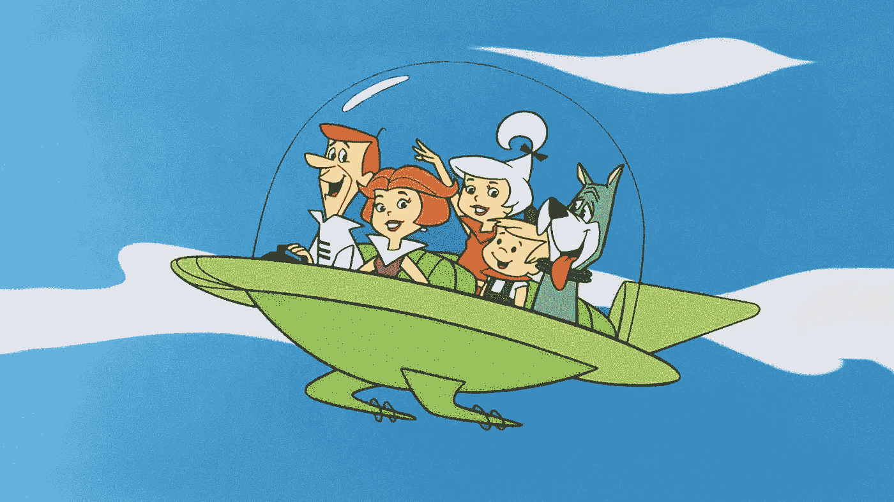
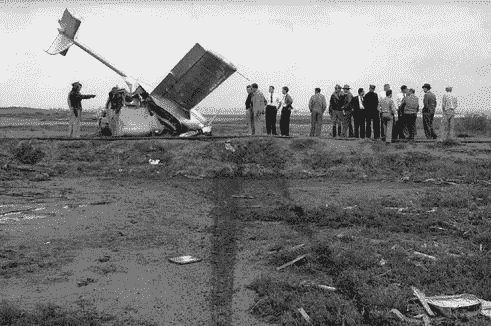
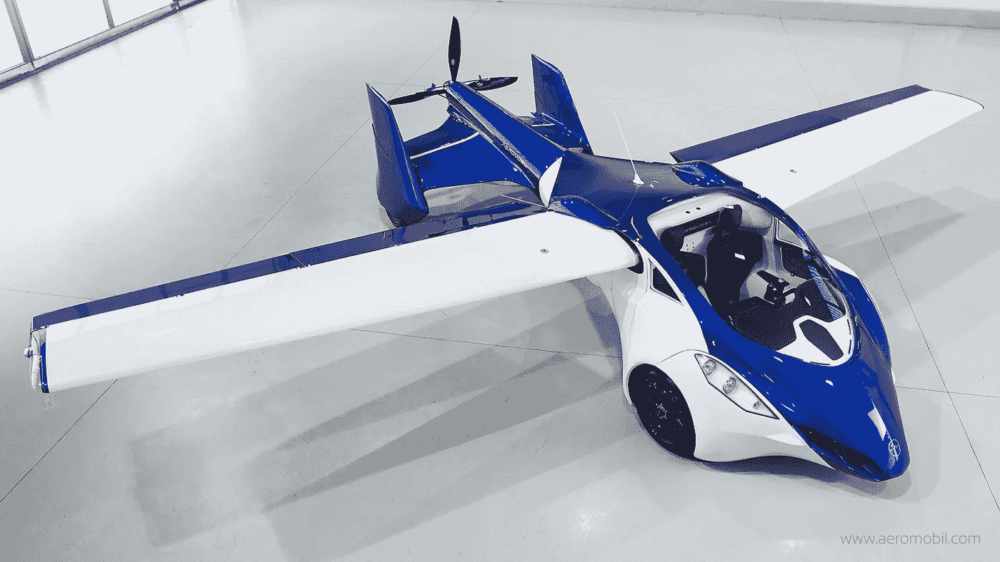
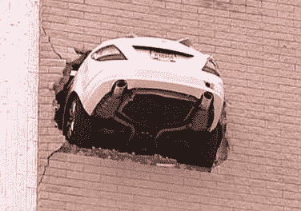
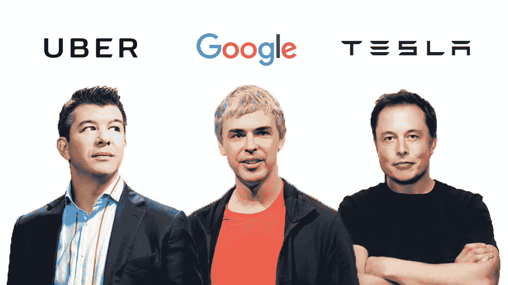
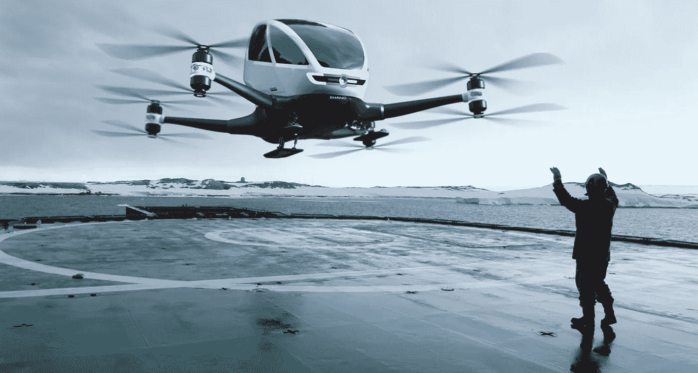
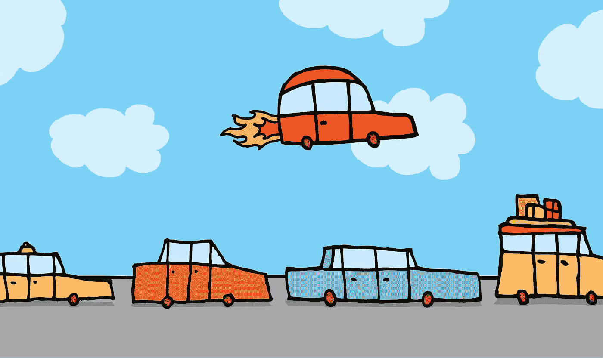
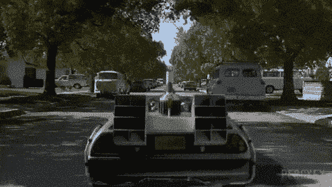

# 我们的自动飞行汽车的未来

> 原文：<https://medium.com/swlh/our-self-flying-car-future-21674e97b67d>

## 无人驾驶汽车可能会令人兴奋，但远不及随后发生的事情。

[*原载于 2016 年 12 月 23 日 TechCrunch 上的*](https://techcrunch.com/2016/12/23/our-self-flying-car-future/) *。*

当我年轻的时候，我记得和我哥哥一起收看周日早上的卡通节目。我们会看重播的杰特森一家开着他们的飞车到处跑。那是科幻小说的黄金时代。好莱坞充斥着像《银翼杀手》、《回到未来》、《星球大战》和《第五元素》这样的电影。这些电影向我们承诺了充满奇妙科技的未来世界。

今天，我们似乎已经在许多方面实现了未来。现在每个人的口袋里都有一个超级发射机，让他们可以与地球上的任何人即时通信。我们绘制了人类基因组图谱，让人类的大部分知识触手可及，更糟糕的是，我们甚至在计划殖民火星。但是尽管如此，还是缺少了一部分。仍然看不到会飞的汽车。它们不会很难做，对吧？

# 被遗忘的飞行汽车历史

Source: [Popular Mechanics](http://www.popularmechanics.com/flight/how-to/g1038/a-brief-history-of-the-flying-car/)

信不信由你，飞行汽车已经存在了 70 多年。

自从儒勒·凡尔纳在他 1904 年的*世界大师*小说中提出这个想法以来，一代又一代的工程师试图让飞行汽车成为现实。1940 年，亨利·福特预言飞机和汽车的结合即将到来。这个想法很有道理。当时，汽车和飞机都变得更便宜、更好，并被大量采用。这两者的结合被认为是不可避免的。事实证明福特是对的。就在他宣布的几年后，航空工程师泰德·霍尔推出了第一辆全功能飞行汽车。

你看到的是一个 70 年前的视频，一辆正在工作的飞行汽车。该飞行器是公路汽车和可连接机翼的组合。它得到了当时主要飞机制造商康维尔公司的支持，总共进行了 66 次成功的试飞。经过一些小的调整，它有望成为一个巨大的商业成功。但在 1947 年，一次试飞中的迫降导致康维尔退出。这个项目被认为太危险，和霍尔在每个车库里都有一辆会飞的汽车的梦想一起被关闭了。

[San Diego Air and Space Museum Archive](https://www.flickr.com/photos/sdasmarchives/7212151374/in/album-72157629762111670/)

从那以后，已经有无数次制造飞行汽车的尝试。他们中没有人能超越原型阶段。然而，飞行汽车的想法最引人注目的是它的持久性。尽管有失败和挫折的历史，每一代工程师都被这个想法迷住了，现在仍然如此。

今天，像 [Terrafugia](http://www.terrafugia.com/) 、 [AreoMobil](http://www.aeromobil.com/) 和 [Moller International](http://moller.com/) 这样的公司正在积极推进这个梦想。你可能从未听说过它们，但所有这些公司都有[实际](https://techcrunch.com/2009/03/18/flying-carrolling-plane-makes-debut-flight/)、[工作](http://www.bbc.com/news/technology-24635758)、[飞行汽车](http://www.huffingtonpost.com/billrobinson/techfuture-hold-on-paul-m_b_5092345.html)原型。

AeroMobil’s latest prototype, aptly named, the Aeromobile 3.0

# 伙计，我的飞车呢？

正如我们所见，飞行汽车技术已经存在了几十年。即使在今天，公司也在研究它们。那么，为什么仍然看不到飞行汽车呢？

一句话:**人类。**

正如我在之前报道的那样，人类是可怕的司机。在美国，汽车每年导致大约 30 000 人死亡，在这个过程中花费了 8710 亿美元(T21)。想想你认识的最糟糕的司机。想象一下那个人驾驶着两吨重的死亡机器。你会有什么感觉？

Hmmm…

公众采用飞行汽车将是对世界上每一栋建筑的死刑执行令。现代建筑的设计是为了承受正常的车祸(这种事经常发生)，而不是飞行中的车祸。在空中，仅仅是与另一辆车的碰撞就可能让两辆车都撞向地面。谁会愿意生活在一个飞来飞去的金属随时会砸到你头上的世界里呢？

最终，我们没有飞行汽车的原因不是技术或成本限制。**是因为大部分人类太不靠谱了，什么都飞不起来。**

# 进入无人驾驶技术

这就是有趣的地方:我们已经用自动驾驶汽车解决了人类不可靠的问题。

自动驾驶汽车[是真实的](https://www.youtube.com/watch?v=EYh0F_8ZdSU)。所有最大的科技公司都在研究它们。我们将在各处看到类似谷歌的汽车，这只是时间问题。虽然自动驾驶汽车很整洁，但它们远没有它们的潜在继任者**自动飞行汽车**那么迷人。

*“一台电脑怎么能聪明到驾驶一辆汽车呢？”你可能会问。*

事实证明。与普通汽车相比，为飞行汽车开发无人驾驶技术要容易得多。在空中，没有行人、坑洞、建筑工地或者任何其他[让电脑头疼的障碍物](http://gizmodo.com/6-simple-things-googles-self-driving-car-still-cant-han-1628040470)。这就是为什么无人驾驶技术最初是为飞机[开发的，并且已经在机票上使用了几十年。传感器、计算和人工智能的最新进展使得人类飞行员变得几乎没有必要。今天，飞行员平均每次飞行时间在 3.5 到 7 分钟之间。虽然飞行员的收入过去可以与律师和医生相比，但美国新飞行员的起薪可以低至每小时 10 美元。有很多关于自动化如何取代出租车和卡车司机工作的讨论。飞行员也不例外。](https://en.wikipedia.org/wiki/Gyroscopic_autopilot)

总而言之，安全是飞行汽车的主要问题，无人驾驶技术是解决这个问题的关键。那么，谁在研究这个呢？

# 通常的嫌疑人

如果不是硅谷突然对飞行汽车感兴趣，我不会写这些东西。在过去的几年里，硅谷的三个主要参与者对飞行器产生了浓厚的兴趣。他们都碰巧正在研究无人驾驶技术。哦，他们也有雄厚的财力，可以接触到世界上最好的工程师，并且有将看似不可能的想法变成现实的历史。他们是特拉维斯·卡兰尼克、拉里·佩奇和埃隆·马斯克。

上个月，优步发布了一份 98 页的白皮书，解释了他们对我们飞行汽车未来的愿景。这份名为[优步 Elevate](https://www.uber.com/elevate.pdf) 的文件描述了一个具体的计划，即在十年内将他们的业务扩展到全球共享的按需航空服务。简而言之:想象一下优步的应用程序，但它是针对无人驾驶的飞行器的。

除了优步，拉里·佩奇对飞行汽车也很感兴趣。在过去的几年里，[秘密投资了超过 1 亿澳元](http://www.businessinsider.com/google-cofounder-larry-page-funding-owns-flying-car-companies-zee-aero-kitty-hawk-2016-6)给两家飞行汽车初创公司 [Zee。Aero](http://www.zee.aero/) 和小鹰号。齐。Aero 正在霍利斯特市政机场测试其原型，人们报告说在那里看到了奇怪的车辆起飞和降落。Kitty Hawk 更神秘一些，但有趣的是，它是由谷歌自动驾驶汽车项目的前负责人巴斯蒂安·特龙运营的。

至于马斯克，嗯，他不太相信[一辆飞行汽车](http://www.businessinsider.com/elon-musk-on-flying-cars-on-startalk-2015-4)的想法。请注意，这并不是因为它们太难制造，而是因为他认为在城市之间旅行有更有效的方式，比如 Hyperloo p。然而，对于长途旅行，他认为电动飞机是一种不错的选择。在几次采访中，他提到他的下一个伟大想法是超音速电动喷气式飞机。事实上，他已经有了一个设计，如果没有其他人做，他可能会创办另一家公司来实现它。

这些硅谷的项目有意思的是，他们有一个共同点:他们的设计。事实上，优步、佩奇和马斯克的项目都是关于可以垂直起飞和降落的电动载人车辆。最后一部分很重要。

# 垂直起降，也就是人类的无人机

你可能会说，迄今为止展示的飞行汽车原型充其量只是一架飞机和一辆汽车的笨拙和过于昂贵的组合——最终的车辆比其零件的总和还要糟糕。这是因为飞机和汽车有着截然不同的用途，合并两者意味着做出可怕的妥协。最终，你最好分别购买一架飞机和一辆汽车。

要解决这个设计问题，我们首先需要放下飞行汽车应该看起来像飞机或汽车的想法。在之前，我已经[报道过我们如何倾向于将旧的解决方案应用于新技术，以及为什么突破性的产品通常需要新的设计方法。这正是我们用垂直起降得到的。](/swlh/no-ui-is-the-new-ui-ab3f7ecec6b3#.ku42agbba)

垂直起落飞机代表垂直起飞和着陆的交通工具。简而言之，使今天的[无人机革命](http://venturebeat.com/2015/08/29/the-drone-revolution-how-unmanned-aerial-vehicles-will-transform-the-economy/)成为可能的[相同技术](https://www.ted.com/talks/raffaello_d_andrea_the_astounding_athletic_power_of_quadcopters)将使我们未来的载人飞行汽车成为可能。忘记翅膀和轮子；我们说的是*杰特森式的飞行汽车*。图片 [DJI 的无人机](http://www.dji.com/products/drones)，但是对人来说。

The Ehang 184, [unveiled at CES2016](https://www.youtube.com/watch?v=wbeoTnuo2-U), is among the most exciting prototypes.

如果说无人驾驶技术是保证飞行汽车安全的关键，那么无人机技术则是让它们变得价格低廉并准备大规模生产的关键。

除了看起来很傻之外，将机翼绑在汽车上在很多方面都是一个有缺陷的想法。机翼意味着车辆必须水平起飞，这是危险的，笨重的，需要很大的空间。通过切换到垂直推进器，车辆可以更快地达到高海拔，这节省了大量能量。有了这样的设计，你就可以把车辆最危险的可移动部分剥离，比如机翼、尾部和升降舵。由此产生的设计更简单、更安全并且更容易大规模生产。

设计的另一个关键部分是电动机。除了对环境有益之外，电力是垂直起落飞机最合理的选择。因为不需要那么多运动部件，电动机比内燃机更容易生产。它们也更加节能，更容易维护，不太可能在飞行途中发生故障，在撞击的情况下也不会爆炸。电动机也有助于拥有多个异步推进器。如果一个推进器发生故障，其他推进器可以立即调整以进行补偿并安全着陆。最后，电有一个巨大的好处，那就是安静。这是垂直起降和直升机之间的一个重要区别。在他们的论文中，优步估计，在起飞期间，垂直起落飞机的噪音将与城市的背景噪音相当。在飞行过程中，它几乎听不见。

# 你的日常飞行通勤

谁曾梦想过，在堵车的时候，按下一个红色的大按钮，在空中翱翔，飞过所有其他的吸盘？消除交通是飞行汽车的梦想和承诺。

> 就像摩天大楼让城市更有效地利用有限的土地一样，城市航空运输将利用三维空域来缓解地面交通拥堵——杰夫·霍尔登，优步首席交通官

正如我在前面提到的，交通对我们的社会来说是一个巨大的负担。仅在美国，交通每年就浪费大约 1240 亿美元[。交通拥堵的最大原因之一是缺乏基础设施。我们的高速公路从未被设计成能承受今天的通勤量。有了垂直起降，这将不再是一个问题。他们的主流采用将大大减少对道路，铁路，桥梁和隧道的需求。除了对环境有好处之外，这还意味着潜在的基础设施节省数千亿美元。](http://www.newsweek.com/2014/10/31/cost-getting-stuck-traffic-278936.html)

再者，不绑定基础设施也意味着节省大量时间。火车、公共汽车和汽车只能以有限的、有时效率低下的方式从 A 地到达 B 地。道路经常会受到交通中断的影响，比如车祸或建筑工程。另一方面，飞行意味着能够直线旅行，这是你和目的地之间最短的距离。此外，能够垂直起飞和降落是目前飞机的一个巨大优势，因为你不再依赖机场和跑道。从家里起飞，直接降落在你的目的地。同样，所需的基础架构更少，节省的时间更多。

Source: Uber Elevate

在他们的论文中，优步估计长距离通勤是垂直起降的最佳初始用例。最终，随着大规模生产，他们相信垂直起落飞机会比拥有一辆汽车更便宜。例如，从旧金山到圣何塞的 2h12 车程最终可能是 15 分钟、20 美元的垂直起降。非常好。

# 前方的路

飞行汽车还有很长的路要走。在他们的白皮书中，优步强调了实现这些目标所需的主要挑战。首先，即使不需要任何飞行员，新的飞行器也需要符合联邦航空局的规定，这可能需要很长时间。此外，人们仍然担心成本、安全性，而且电池技术还不成熟。在他们的白皮书中，优步介绍了他们计划如何解决这些问题，并在 10 年内实现公众采用垂直起落飞机。

在《零比一》中，彼得·泰尔提出了一个有争议的观点，即我们不再生活在一个创新的世界里。他认为，虽然工业革命带来了大量的创新，如电力、家用电器、摩天大楼、汽车、飞机等，但今天的创新大多局限于信息技术和通信。正如泰尔所说，我们的智能手机分散了我们对这样一个事实的注意力，即自 20 世纪 50 年代以来，我们的生活方式一直保持着奇怪的变化。

我认为情况不再是这样了。至少在运输方面没有。最近的项目如自动驾驶汽车、Hyperloop 和[可重复使用火箭](https://en.wikipedia.org/wiki/Reusable_launch_system)证明了创新仍然存在。现在，按需共享飞行汽车有望让航空旅行民主化，就像汽车曾经让地面交通民主化一样。最终，这对所有人来说意味着更好、更快、更便宜、更安全和更环保的交通。

飞行汽车可能还有很长的路要走，但这没关系。因为马蒂，我们要去的地方不需要公路。

Booya!

💚**如果你喜欢或从这篇文章中学到了什么，请点击推荐。**

*巨大的感谢* [*鲍比·a·奥布*](https://medium.com/u/ce1efc09997?source=post_page-----21674e97b67d--------------------------------)*[*卡伦·奥戴尔*](https://medium.com/u/a5db36348af2?source=post_page-----21674e97b67d--------------------------------)*[*弗朗索瓦·兰希尔 n .*](https://medium.com/u/d6c1e76d5cac?source=post_page-----21674e97b67d--------------------------------)*[*扬苏·吉拉尔*](https://medium.com/u/c52e0e2d1426?source=post_page-----21674e97b67d--------------------------------) *为反馈。****