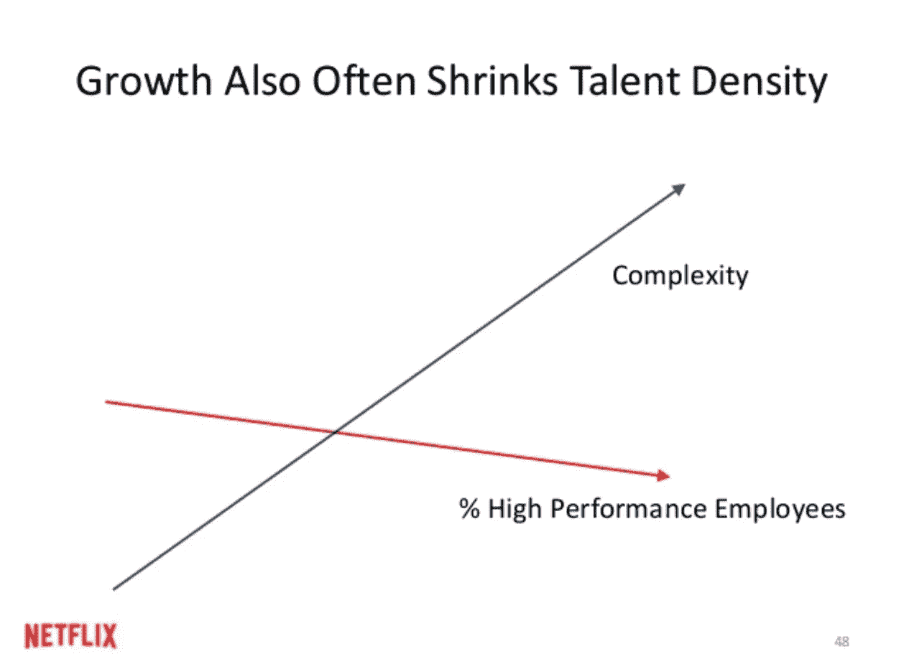
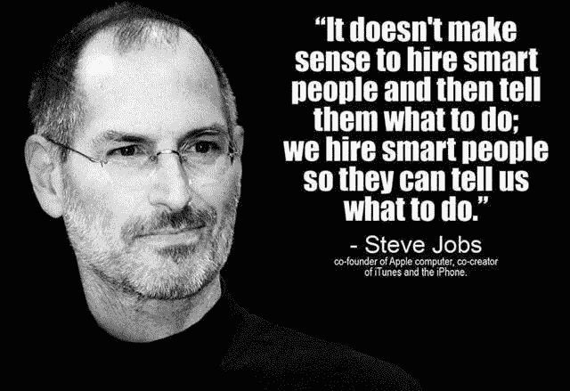
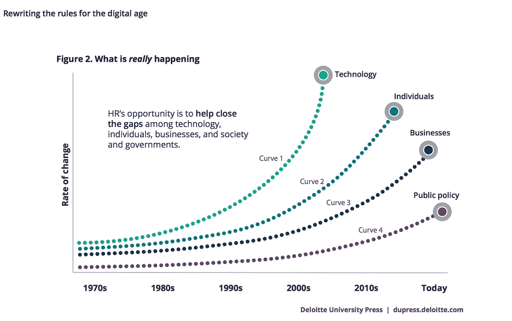
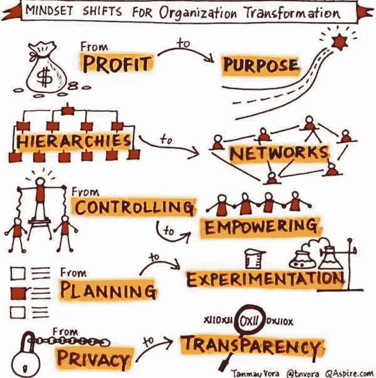

# 管理到底是为了什么？

> 原文：<https://medium.com/swlh/out-with-management-in-with-context-curation-38b860ee3042>

## 为什么层级组织不再适合现代经济的挑战。

有没有想过低成本喜剧《办公室空间》是如何赢得狂热追随者的？这部电影已经成为一代人的标志性电影，不是因为明星云集的演员阵容或精彩的笑话，而是因为它反映了当代社会，指出了我们长期以来一直怀疑的工作场所文化的一个问题。从工业时代继承下来的*管理*的理念已经过时了。

世界银行估计[全球劳动力](https://data.worldbank.org/indicator/SL.TLF.TOTL.IN)约为 35 亿，我绝不期望，更不提倡，那些今天被雇佣的人会在近期甚至中期内过渡到一个无管理的结构。目前，绝大多数涉及人类劳动的工作仍然最好在传统的组织结构中进行。

> 后管理时代才刚刚开始曙光。正是不断加速的技术进步摧毁了旧的范式。

在 VUCA 的世界(波动性、不确定性、复杂性和模糊性)，科技独角兽将成为后层级模式的早期采用者。事实上，有些人已经接受了它。

今天的竞争格局可以用一个词来定义:*颠覆*。增量式进展、持续改进和流程优化的想法不再管用了。这些做法是必要的，但还不够。如今，没有内部创业精神、定义类别的创新和不懈的业务转型，持久的成功是不可能的。

雄心勃勃的颠覆者所面临的组织困境在网飞的经历中得到了最好的体现。他们的人力资源专家帕蒂·麦考德发现了一个问题，这个问题现在回想起来很明显:随着业务的增长，复杂性也在增加。但这是以人才密度下降为代价的。

[How Netflix reinvented HR](https://hbr.org/2014/01/how-netflix-reinvented-hr)

她和网飞首席执行官雷德·哈斯汀斯一起开发的幻灯片在网上疯传，[雪莉·桑德伯格称之为可能是来自硅谷的最重要的文件。也就是说，帕蒂·麦考德并没有因为发现问题而赢得赞誉。吸引所有人想象力的是她提出的非正统解决方案:“*多年来，我们认识到，如果我们让人们依靠逻辑和常识，而不是正式的政策，大多数时候我们会得到更好的结果，而且成本更低。*](https://techcrunch.com/2013/01/31/read-what-facebooks-sandberg-calls-maybe-the-most-important-document-ever-to-come-out-of-the-valley/)

> 限制程序的专制，让高绩效员工参与进来，让他们在最大灵活性的环境中自我管理。

对网飞企业文化的评论往往集中在具体的人力资源政策上，如自行分配假期、无差旅费报告等。但是这些例子只是一个更大愿景的衍生物—高业务复杂性不需要用标准流程和不断增长的规则手册来管理。帕蒂·麦考德主张的恰恰相反:限制程序的专制，让高绩效员工参与进来，让他们在最大限度灵活的环境中自我管理。

*处理或控制事物或人的过程*是我们今天如何[定义管理](https://www.google.com/search?q=define+management)的。如果这还不算是一个首席执行官在经营一个小部件工厂以外的东西的危险信号，我不知道还有什么是。控制事物不再看似合理，控制人则完全适得其反。史蒂夫·乔布斯一针见血地说:“*雇佣聪明人然后告诉他们该做什么是没有意义的；我们雇佣聪明的人，这样他们就能告诉我们该做什么。*

苹果的联合创始人理所当然地被认为是我们这个时代最伟大的远见卓识者之一，但如果他出生在比如说 17 世纪，甚至比他早 50 年，并发表同样的声明，我怀疑这是否会引起他同时代人的共鸣。后管理时代才刚刚开始曙光。正是不断加速的技术进步摧毁了旧的范式。

Who is keeping up with the [pace of tech progress](https://www2.deloitte.com/content/dam/Deloitte/global/Documents/About-Deloitte/central-europe/ce-global-human-capital-trends.pdf)?

在前工业社会，让聪明人告诉土地所有者该做什么不会带来更好的经济结果。在最好的情况下，它会招致嘲笑。当时没有证据表明生产和人口增长是不一样的。

> 所有需要监督的工作都被外包给了机器人和算法。

虽然劳动分工是工业时代的标志，但如今以具体/精确任务的形式来解析和分配白领工作变得越来越困难。无论我们如何描述现在，无论是数字时代、第四次工业革命时代还是第二次机器时代，归根结底，所有需要监督的工作都被外包给了机器人和算法。另一方面，非标准的、创造性的、实验性的工作不适合管理。

我们目前看到的第二个根本性转变是，先*计划*，然后*执行*的策略不再可行。过去被称为得过且过的事情现在被称为采纳和适应快速变化的环境。正如我们所知，战略已经死亡。应对不确定性是头号挑战，正如老话所说，这也是头号机遇。如果你的公司不是颠覆者，这是一个清晰的信号，说明颠覆正在来临。

底线是过时的层级模式不再适合现代经济的挑战。传统组织的每一个支柱现在都在不断变化，正如 Tanmay Vora[精辟地概括的那样](https://twitter.com/tnvora)

现状往往被词汇保护:*董事直接*，*总裁主持*，*经理管理*。但所有这些活动的附加值都比过去低得多。他们在追求秩序的过程中限制创新，扼杀创造力。

> *语境策展人*是我想引入商业词典的术语。

语境意识、周边视觉、设计思维、多学科方法，这些都是现代办公室用语的趋势。理应如此。一个基于项目、没有头衔的组织——昨天的团队成员是今天的团队领导——可以提供企业渴望的灵活性和敏捷性。

*语境策展人*是我想引入商业词典的术语。领导一个项目不是分配任务和监控绩效，而是授权，定义更广泛的背景，并将一个团队的工作与业务的其余部分有机地联系起来。以网飞为榜样，努力提高人才密度只是成功的一半。管理高绩效员工的环境，而不是管理高绩效员工，是释放他们全部潜力的关键。

《办公室空间》符合好莱坞的剧本写作标准，讲述了一个伟大的爱情故事。主角彼得和他喜欢的女孩约翰娜(Johanna)， [*因为他们都讨厌愚蠢的管理，喜欢电视连续剧《功夫*](https://en.wikipedia.org/wiki/Office_Space) *》。*“世界末日般的滑稽结局，一名心怀不满的员工烧毁了办公楼，完美地隐喻了传统管理理念给现代科技企业带来的潜在风险。你不必看电影就能猜到是什么引起了不满。

意识到向新的组织结构过渡的不可避免性，我发现自己有点焦虑。在一个等级森严的世界里建立了职业生涯后，我努力想象加入一个完全扁平化的组织会是什么样子。但一个人的乱，是另一个人的创造过程。就像所有的惯例一样，很难放下，但是当它们消失时，人们会努力回忆起当初为什么要有它们。

**你读过吗？**

*   我们正在快速前进。但是没有人知道我们要去哪里
*   [应对失业未来的 5 种方法](/@ChakhoyanAndrew/5-ways-to-cope-with-the-workless-future-86f7816df8be)
*   如果每个人都休假会怎样？

*最初发表于* [*WEF*](https://www.weforum.org/agenda/authors/andrew-chakhoyan/)

## 这篇文章发表在 [The Startup](https://medium.com/swlh) 上，这是媒体最大的创业刊物，拥有 294，522+人关注。

## 在这里订阅接收[我们的头条新闻](http://growthsupply.com/the-startup-newsletter/)。

