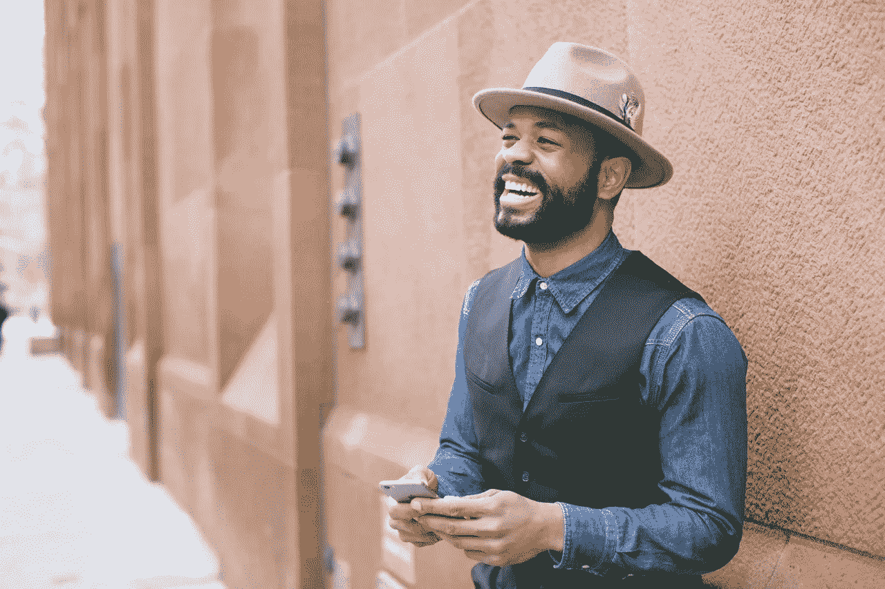

# 智取你对恐惧的原始反应

> 原文：<https://medium.com/swlh/outsmart-your-primitive-response-to-fear-bf25e4b9f7c5>

有些种类的鲨鱼必须不停地移动才能呼吸。这是唯一能给他们身体带来新鲜氧气的方法。如果他们停止移动，他们就会死去。

虽然我们可能不想承认，尤其是在看了一个小时的电影《大白鲨》之后，但我们确实有惊人的相似之处。

当我们因恐惧而感到瘫痪时，我们往往会停止运动，系统中的氧气量会减少，随着我们体验到的氧气量减少，我们的身体会承受更多压力，并增加我们的焦虑程度。

因为它造成了焦虑、恐慌、担心和困惑的积累，我们在这种精神状态下做出的决定是最没有效率和专注度的。

## 我们创造灾难性的假想场景。

我们的内心状态影响着我们做的每一件事，不管我们的生活在外表上是什么样子，因为旋风正在内部发生，当这种旋风下降时，就没有空间让清晰的见解或想法进来。

在这种状态下，没有清晰、感恩、洞见、喜悦或轻松会出现。

它造成焦虑、睡眠中断、缺乏理性和额外的需求。一旦你被它吸引，它不会歧视特定的种族或职业信仰，也不会在乎你是富有、贫穷、聪明还是成功；很难挣脱。

有些人可能会幻想，如果他们创造了一个财富、财产、成功、投资和安全幻觉的保护屏障，它会保护他们，他们会被关在里面，让恐惧的怪物远离。

并没有。

有了财富，围绕着财富创造了一个角色，这个角色必须得到滋养和维护；仅仅是失去他们所拥有的三分之一的风险就感觉是灾难性的。他们的角色、地位和自我意识在其中紧密交织。

这可能非常令人焦虑。

那些被赚钱驱使着让恐惧远离的人，用的是焦虑、压倒和压力的内在动机。也许再赚 50 万美元会让恐惧远离你；也许再多一点就可以了。我最近指导过一个客户，他实际上已经有了一个他在脑海中计算和编造的数字，这个数字一旦达到，就会让恐惧远离。

受此影响的不仅仅是富人。我们看到走在街上的普通人，经常记满了日程安排的日记和日历。害怕错过，害怕孤独，害怕被拒绝，往往只是其中的一部分原因。

**他们的忙碌达到了流行病的程度。**

上瘾通常始于试图躲避子弹，这是一种逃避的方式。像对待一个任性的孩子一样试图让头脑安静下来，正如任何人都知道的那样，当对待孩子时，你越是试图让他们安静下来，他们就变得越大声。

我们试图把它推倒；我们发现了这个叫做“控制”的伟大行动，它给了我们想象中的喘息机会，让我们美丽地抑制住了“恐惧”。所以我们控制和微观管理我们周围的一切，直到一个精确的细节。

大多数人想避开困难，但不是通过困难，他们想避免任何类型的不舒服的感觉状态，所以他们在困难和世界之间建立了无形的障碍。他们建造了一个堡垒，作为暂时消除恐惧的一种方式。

然而，我们还有另外一种方法来处理恐惧，不需要物质、药物或酒精。这不需要花一分钱，你也不需要住在某个特定的地方去适应它。

这是有爱的。

恐惧和爱不能存在于同一个空间。

当爱被引入时，恐惧消失在一股烟雾中，它畏缩在角落里。

当甲壳虫乐队演唱《你所需要的只是爱》这首歌时，他们唱得非常好。

当爱被引入时，有一种轻松，你的呼吸变得不同，这带来了与自我的联系，氧气在你和恐惧之间制造了一个障碍，带来了片刻的喘息，它允许你进入一个更平静的状态，带来了空间、和平和洞察力。

在印度，不需要冥想几个小时或进入一个静修所，你只需要变得更加意识到你的心态，这可能需要放慢速度，更多地呈现给你的内在动力。

我们一般都是朝着两个相反的方向走，不是爱就是恐惧。在你的个人或商业生活中做决定时，问问你自己；

**我的决定是出于爱还是恐惧？**

我不是鼓励你成为一个嬉皮士，梳着小辫，穿着宽松的粗棉布裤子，搭配凌乱的凉鞋。我只是邀请你更多地意识到你的能量在哪里，因为这很重要。

巨大地。

当这两种心态下降时，我们需要意识到它们。爱带来清晰，而恐惧遮蔽了我们的视野。

## 三原则运动的创始人悉尼·班克斯说:

> “如果人们学到的唯一一件事就是不要害怕他们的经历，那就足以改变世界。”

当我第一次开始公开演讲时，我被恐惧的想法吓呆了，这产生了一种不和谐的感觉，阻碍了我成为一名伟大的演讲者。

一旦我明白爱和恐惧不能共存，我就开始在演讲前花一些时间，尽可能多地与观众进行眼神交流，深呼吸，爱他们所有人。我不认识他们，这真的没关系，我只是爱他们。

一开始感觉有点不舒服，但是我做得越多，我注意到公众演讲的恐惧开始减少。我可能会事先感到焦虑，这是完全正常的，但我知道当我登上舞台与观众接触的那一刻，这种感觉就消失了。

我对影响观众的热爱比娱乐恐惧和聆听恐惧带来的对话更强烈。恐惧潜在地偷走了我的机会，我准备把它赶走。

反思自己的人生；

如果恐惧偷走了你的机会，你能面对它吗？

如果你知道它被伪装在一个虚构的故事中，这个故事可能在你早年被锁定，在你生命中的那个时候，它的目的是给你一种安全感的幻觉，你能面对它吗？

你可能生活在几十年前的恐惧故事中，但你没有更新数据库。当它们在你 7 岁时首次出现时，它们可能是完全合适的，它是为了保护你的安全，但当你试图在 37 岁时导航你的生活时，它不再为你服务。

事实上，它要么拖你的后腿，要么驱使你像瓷器店里的公牛一样行事。

花了多少精力以军事精度微观管理生活的每一个方面，所以恐惧永远不会进入其中。留在对你的成长如此有害的环境中，但任何事情都比面对(虚构的)怪物要好。

除非你被劫持了，被绑架了，或者将要面对一群狼，否则我们大多数的恐惧都是虚构的，都是通过思想产生的。它们不是凭空出现的。恐惧的想法会产生恐惧的感觉，这种感觉会影响我们当下的体验。

**但更重要的是，它会影响你未来的决策。**

我们每天的生活方式没有受到战争、劫持或绑架的威胁，但我们却生活在巨大的压力下。担忧是支撑商业、工作和个人生活中许多决定的潜在因素。所有的动力都来自于‘我需要，我必须，我必须，我应该……否则，”

它剥夺了我们在地球上首先要做的事情的乐趣。

**活着。**

是的，它可能被低估了，但生活如今已经成为一种商品。

当我最近给我的新书取名为《审视内心:停止寻求开始生活》时，许多不同成功水平的专业人士给我发来私信，告诉我书名已经打动了他们，因为这正是他们没有做的事情——生活。

他们正在拼命求生。最近几周，我们不得不忍受才华横溢、多产的社会成员自杀，这有什么奇怪的吗？

但是正如我之前所写的，恐惧是没有区别的。

我的客户最大的突破之一是，一旦他们从远离恐惧的全职工作中解脱出来，他们就会发现巨大的活力。他们的生活发生了不可估量的变化，他们有空间去创造他们想要的事业、生活、职业和关系，而不是被生活的微观管理所消耗。

恐惧永远不会消失，你越是与它接触，它就越是失去它的强度，就像你遇到一个烦人的邻居，他不停地敲你的门要多余的牛奶。你越明白恐惧不会伤害或摧毁你，它就越不会扼住你的喉咙。

不管你是邮递员、成功的企业家、经理还是千万富翁。我们都是由同样的纤维构成的，因此我们以同样的方式感到恐惧。不要抗拒，因为它会坚持；相反，要明白你在每一个时刻体现的心态，会对你所创造的一切产生巨大的影响。

## 如果这篇文章引起了你的共鸣，你可以在我的新书[中阅读更多类似的章节，这本书现在已经在亚马逊上出售。](https://www.amazon.co.uk/dp/1781332959/ref=cm_cr_ryp_prd_ttl_sol_0)

## 如果你想和我联系，分享这篇文章的见解，请发电子邮件给 micheleattiascoaching@gmail.com

 [## 首页|米歇尔·阿提亚斯生活蔻驰&演讲者

### 我的专业知识不仅通过资格认证、研讨会或聘请优秀的教练和导师而增长，它还增长了…

www.micheleattiascoaching.com](http://www.micheleattiascoaching.com/) 

## 这个故事发表在[的创业](https://medium.com/swlh)上，这是 Medium 最大的创业刊物，有 343，876+人关注。

## 订阅接收[我们的头条新闻](http://growthsupply.com/the-startup-newsletter/)。

