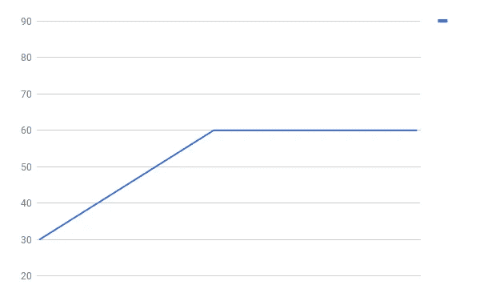

# 克服 OK 平台并达到精通

> 原文：<https://medium.com/swlh/overcoming-the-ok-plateau-and-achieving-mastery-68fef0dcf680>

## 如何停止仅仅是足够好？

我每天为了工作打字。我每天都写博客，最终我也为我的项目写了相当多的代码。有了这些“练习”，我每分钟打不到 100 多个字。事实上，我每分钟只有 70 左右，而且已经有 2 年了。我达到了一个点，我不再变得更好。

当我刚开始的时候，我真的很糟糕。我大概是每分钟 30 个单词，然后很快提高到每分钟 65-70 个单词，在这个速度上我已经停滞了一段时间。

每分钟 70 英里并不是某种物理障碍。如果我更好的话，我肯定能打得更快。事实上，世界纪录是每分钟 212 英里。

但是，我已经达到了某种平稳状态。尽管我的“练习”是一样的，但我的进步看起来是这样的。

Not a graphic designer, or statistician.

那么，我该如何度过这一关呢？怎样才能打出我想要的神奇的 100 WPM？

**答案:刻意练习**

因此，虽然我的工作可以被笼统地称为实践，但刻意的实践更系统、更专注。它的唯一目的是改善。

我可以使用在线 WPM 计算器，每天测量自己，用同样的工具反复测试，而不是像往常一样写文章。我会采取一种更专注的方法来解决困扰我的问题(在这种情况下，就是我放手的方式)，并努力改善它。

我的新图表会是这样的。

它不仅仅适用于打字——它几乎适用于所有东西。我可能每天都去晨跑，但是如果我不刻意尝试和提高，我就不会打破我的 5 公里记录。

那么，你可以通过有意识的专注来提高什么呢？你用什么达到了 OK 平台？请留言，我很乐意听到。

## 这篇文章发表在[《创业](https://medium.com/swlh)》上，这是 Medium 最大的创业刊物，有 292，582+人关注。

## 订阅接收[我们的头条新闻](http://growthsupply.com/the-startup-newsletter/)。

