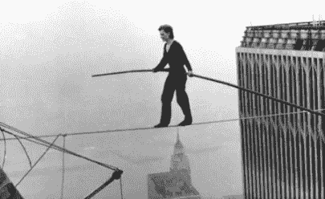
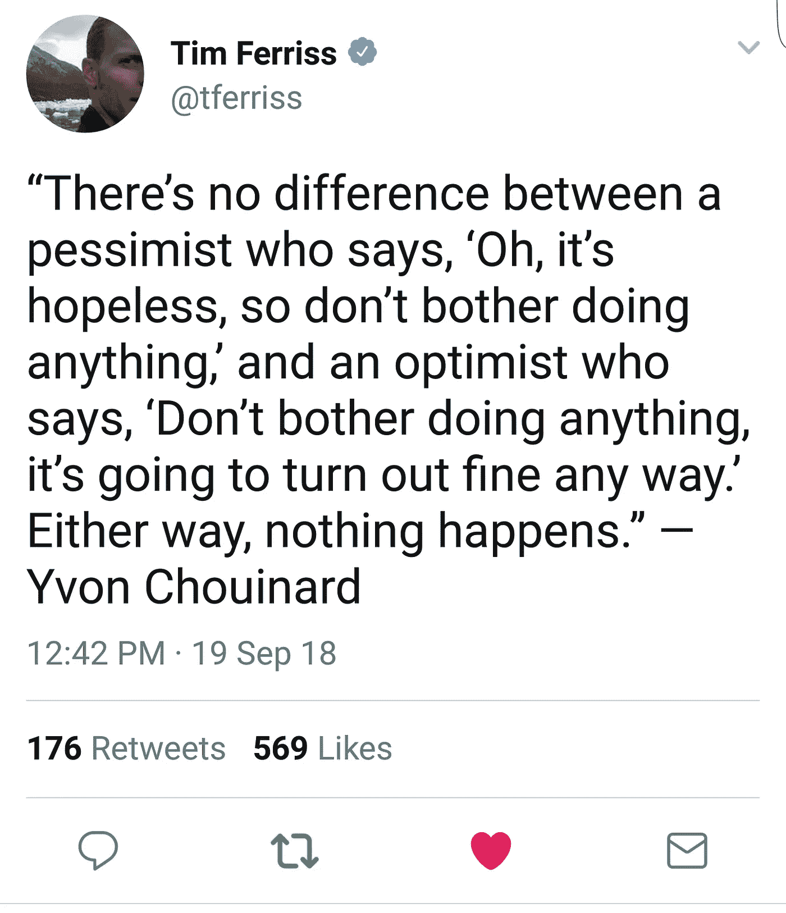

# 过度自信和自我怀疑都会毁掉你的事业和生活

> 原文：<https://medium.com/swlh/overconfidence-and-self-doubt-both-want-to-ruin-your-career-and-life-4406c40ae084>

Photo Credit: www.blog.learningbyshipping.com

我将以一个你不会在太多这样的文章中找到的免责声明开始——我不是首席执行官、企业主或任何方面的专家。

如果我要称自己为某方面的专家，那就是悲惨地失败并从中吸取教训。一错再错，好像这是我的工作。

奇怪的是，这让我有资格写这个。因为虽然专家和有影响力的人确信他们的道路会为你工作，但他们这么说很可能只是因为他们想要你的钱。所有的一切。

没有一条道路适合任何人。他们不了解你。他们不知道是什么样的环境让你走到了今天。许多人甚至不想帮助你。如果你认为我错了，给他们发邮件，向他们寻求免费的建议。

虽然我可能没有你正在寻找的成功城堡的钥匙，但我可以告诉你所有会阻止你找到它们的事情。

大多数人每天都在欺骗自己。虽然不是每个人都属于我将要提到的两类中的一类，但是大多数人都属于。

我在这个世界上基本上遇到过两种人。那些认为自己比实际做得好得多的人，以及那些不认为自己真正有价值的人。

坦率地说，我得出的结论是，过度自信的群体在短期内会更好。第二组全是以自己的方式进入的人。

像我这样充满无端自我怀疑的人。但问题是，我几乎可以肯定，从长远来看，我们会过得更好。

因为自我怀疑比自我和自以为是更容易被杀死。信心可以通过行动建立和找到。过度自信，虚假的自豪感和“假装直到你成功”——总是赶上第一组。他们最好的资产变成了他们最大的负债。他们无法接受建设性的批评，这简直超出了他们的自尊心所能承受的范围。

我发现，建立自信的最好方法是通过小步骤和持续的行动。就像老话说的，如果你不能跑，那就走，如果你不能走，那就爬。重要的是向前看。

然而，这两组人的共同点是，他们都在对自己撒谎。过于自信的人错误地相信，没有人比他们做得更好。不自信的自我怀疑者，已经说服自己他们不能做他们完全有能力做的事情。

我们可以从这两个群体中学习，以下是方法。老实说，我有点喜欢过于自信的态度。这是大多数情况下的最佳视角。如果你要去参加一个工作面试，告诉你自己你不可能得不到这份工作。从骨子里感受到。

然而，一旦你获得了这份工作——向不自信的人借点谦卑。承认你是新来的，对这个行业一无所知，但是你也完全有能力成为最好的员工。

过分自信的人需要学会谦逊。我现在警告你，如果你选择从不谦卑，生活会让你谦卑。

总有人在某件事上比我们做得更好。总会有更强壮、更英俊或更聪明的人。

为什么我觉得自己有资格写这个，是因为我曾经过于自信。我确信我是不可阻挡的，不会做错事。我总是赢。

然后，我失去了一切。我的事业，我爱的女人，我住的地方和赚的每一分钱。都是因为我的自我不允许我偶尔坐下来闭上嘴。我不愿意承认我并不总是对的，也不总是最清楚的。我的失宠让我痛不欲生，但幸运的是，我在堕落的过程中发现了谦逊。

当然，有时候我的大脑希望我关注过去的失败，而不是现在的机会。自我怀疑是一种幻觉。这不是真的。

过度自信和自我怀疑是一回事，因为它们都是基于虚假的借口。它们是从我们过去的经历中建立起来的。总能得到女孩的男人相信他会永远得到，而从来得不到女孩的男人相信他没有能力得到任何女孩。两个都不对。

这是今天让我在现实中保持中心的中间地带。我知道在任何时候，我都没有自己想象的那么伟大或者那么可怕。我知道我完全有能力做我想做的任何事情，如果我不小心，不能保持感激和谦卑，我也会失去我从中获得的一切。

## 这篇文章发表在 [The Startup](https://medium.com/swlh) 上，这是 Medium 最大的创业刊物，有+ 370，107 人关注。

## 订阅接收[我们的头条](http://growthsupply.com/the-startup-newsletter/)。

