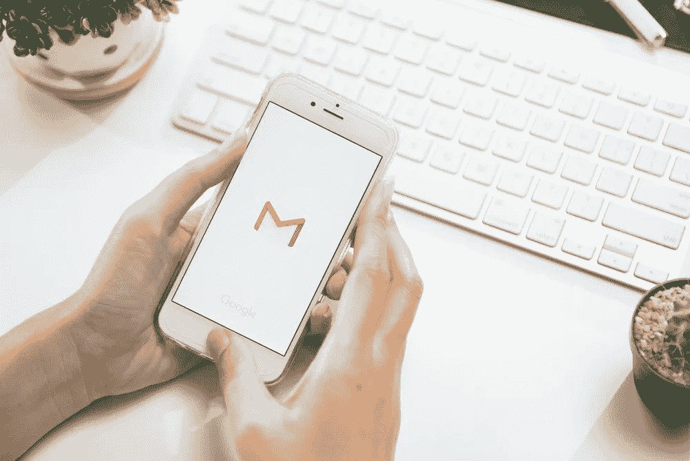

# 一封好邮件被忽视的秘密

> 原文：<https://medium.com/swlh/overlooked-secrets-of-a-great-email-18c06fc0989a>

电子邮件是工作场所最常用的沟通工具，但也是最容易被误解的。

作为一名在七个东南亚国家运营的吉隆坡创业公司的内容营销人员，我 90%的对外交流都使用电子邮件。写得不好，不清楚，误导或无效的电子邮件不仅会导致时间和生产力的损失，而且还会损害一个人的声誉，因为它会给收件人留下不好的印象。

我花了很多时间阅读关于电子邮件拓展的文章，并进行了 a/b 测试，以了解哪种类型的电子邮件对哪种收件人有效。我的结论是，在撰写和发送电子邮件时，你应该考虑遵循五条规则。

# 1.把它送给正确的人

在我的工作中，我与许多在东南亚媒体工作的作家、记者和编辑交流。

如果你想通过电子邮件与媒体人交谈，有两种选择:通过一般的编辑邮件或个人工作邮件。根据我的经验，后者要有效得多。当我通过个人邮件联系编辑和记者时，我得到了更高的回复率和更高的发表率。

获得个人联系可能很棘手。首先，四处打听。获得某人的联系方式最简单的方法是参考现有的关系，包括家人和朋友。

第二，利用社交媒体。几乎可以肯定，一个媒体人至少有一个社交媒体账号。

[例如，LinkedIn](https://www.linkedin.com/pulse/3-proven-strategies-using-linkedin-advance-your-career-prasatya) 是联系记者和编辑的最有效平台之一。从发表的文章中找到他们的名字，然后在 Linkedin 上查找。找到他们的 LinkedIn 个人资料后，向他们发送个性化的连接请求。让他们知道你有想分享的东西，并询问他们的电子邮件地址。

第三，阅读他们的社论版。一些媒体在编辑的页面上提供了编辑的电子邮件，通常可以在网站的顶部或底部找到。

无论你是销售人员、客户经理、内容营销人员、公关专员，还是任何使用电子邮件进行日常交流的职业，将电子邮件发送给正确的联系人都会增加成功率。

# 2.让主题行引人注目

每天，顶级媒体的编辑都会收到 25 到 50 封来自个人或品牌的电子邮件。由于时间有限，他们倾向于有选择地选择他们优先阅读的电子邮件。主题行决定了他们首先打开的电子邮件。

对于一个有效的主题，要简短。40%的电子邮件是在移动设备上第一次阅读的，所以要保持你的主题简洁明了。

第二，让人觉得特别。排他性的感觉是一种强大的力量。根据你想推广的内容，你可以用几个短语来表达:“你被邀请了”、“独家公告”、“特别内容……”等等。

第三，主题需要与内在相关。例如，如果你想推销一个故事，使用“媒体 a 的 iPhone 8 信息图表研究”。通过电子邮件介绍自己，考虑说:“嗨(个人姓名)！”

如果你做对了，你就会脱颖而出。

# 3.个性化您的电子邮件

三个月前，[我采访了来自印尼顶级媒体的 12 位编辑](https://iprice.co.id/trend/insights/11-tips-media-relations-untuk-startup-dari-media-media-top-indonesia/)，他们都认为个性化邮件比普通邮件更能吸引他们的注意力。根据采访，他们说只有少数初创公司发送了精心制作的个性化电子邮件，其中大多数都需要公关机构的帮助。

要个性化一封邮件，首先要提到他们的名字或媒体公司的名字。名字是一个人拥有的特别的东西。你可以在问候他们的时候在开头加上，在说谢谢的时候在结尾加上。例如，对于人的名字:“早上好安德鲁，”和“有一个伟大的一天安德鲁。”对于媒体的称呼:“我想把这个研究分享给媒体 a。”

第二，要有语境。为了让编辑讲好故事，[他们需要伟大的人物](https://blog.hubspot.com/agency/pitch-editors-email-templates)。他们需要有个性、有观点、有自己的精彩故事和视角的角色。你可以先简单解释一下你想分享的故事，以及这个故事为什么重要。

当你向大型媒体集团推销你的故事时，你是在与其他也想从他们那里获得报道的品牌竞争。所以确保你的邮件内容能引起他们的注意。

# 4.打造一个有结构的身体

就像在演讲中一样，电子邮件必须有趣，并讲述一个好故事。要做到这一点，请确保电子邮件易于理解。一封好的邮件应该由开头、主要信息和结尾组成。开头部分简单介绍了你是谁，你从哪里得到他们的联系方式，以及你为什么要发这封邮件。

主要信息包括你想提供的主要内容。它可以是要约或要求的细节，或者是你想要分享的数据，等等。

人们在关闭电子邮件时经常犯的一个错误是总结内容。一个清晰的行动号召是结束邮件的更合适的方式。如果你是销售人员，你可以要求一个时间打电话或见面。就我而言，我分享故事和信息，所以我提醒他们，欢迎他们有任何问题来找我。

# 5.在正确的时间发送

为了增加得到回复的机会，请在合适的时间发送电子邮件。

根据我对编辑的采访，一些人建议在早上(上午 8 点到 10 点)或晚上(下午 4 点到 6 点)发送故事。不同的编辑有不同的正确时间。

在寻找合适的时间时，确保内容对时间敏感，但给他们足够的时间回复。例如，如果是关于会议请求，提前 3 到 4 天发送电子邮件。

第二，当他们在办公室的时候给他们发邮件。工作很累，所以当你回家的时候，你想休息，不想看邮件。许多研究表明，发送电子邮件的最佳时间是早上 8 点到晚上 12 点。

一封好的邮件不仅对你的工作有好处，对个人品牌也有好处。当你持续发送好的邮件时，收件人会记住你，从而增加你邮件的成功率。

记者和编辑会收到很多不好的邮件。所以，从人群中脱颖而出，并在制作下一封电子邮件时投入额外的精力。

# 在你走之前！

*   我是吉隆坡的一名内容营销人员。如果有什么我能为你做的，请在我的 [LinkedIn](https://www.linkedin.com/in/andrewprasatya/) 里给我打电话
*   你可以在这里查看我和我的团队所做的一些工作→ [《福布斯》:在 8 个月内获得 200 多份免费的顶级新闻媒体出版物](https://www.forbes.com/sites/joeescobedo/2017/07/05/how-to-get-media-coverage-for-your-startup/#626dce284201)

# 你喜欢这篇文章吗？

请帮我把这个分享给你的同事:)

## 这篇文章发表在 [The Startup](https://medium.com/swlh) 上，这是 Medium 最大的创业刊物，拥有 276，798+人。

## 订阅接收[我们的头条新闻](http://growthsupply.com/the-startup-newsletter/)。

