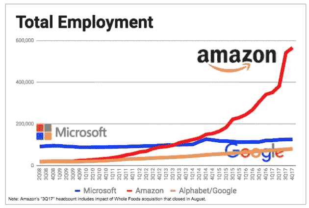
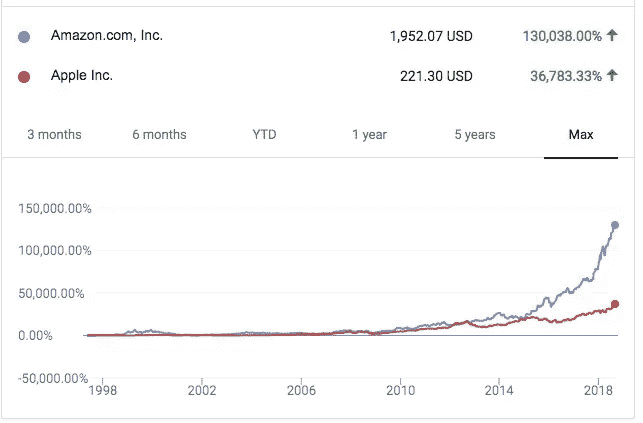
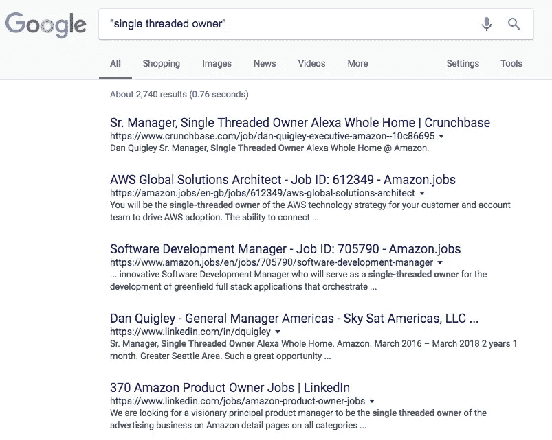

# 所有权关乎信任

> 原文：<https://medium.com/swlh/ownership-is-about-trust-7d56da89ed6d>

从创业的角度来看亚马逊领导原则的持续系列。 [*从这里开始看别人*](/@micah/want-to-start-a-company-work-at-a-big-one-first-2e04d30fc892) *。*

[亚马逊领导原则](https://www.amazon.jobs/en/principles)是推动亚马逊创新文化的 14 条陈述。每本书都关注这种文化的一个不同方面，每本书都为创业公司提供了有趣的经验，帮助他们跨越从创业到成功的旅程。

## 所有权

> 领导是主人。他们考虑长远，不会为了短期结果而牺牲长期价值。他们代表整个公司行事，而不仅仅是他们自己的团队。他们从来不说“那不是我的工作”。

在探索所有权如何在亚马逊工作之前，理解组织结构是很重要的。2018 年 2 月，亚马逊全球员工[56.6 万人](https://www.geekwire.com/2018/amazon-now-employs-566000-people-worldwide-66-percent-jump-year-ago/)。

Geekwire Image

它如何有效地管理比许多城市都大的员工队伍？当我在亚马逊工作时，人们会问如何最好地与组织合作，我第一次将亚马逊描述为一个拥有 1000 多家小型创业公司的投资组合的大型风投公司。亚马逊的每个团队都是独立运作的。每个小组都是独立的小组，可以自己做决定，通常依赖于其他小组。

这是如何工作的？有三个关键概念:领导者是所有者、单线程所有者和两个披萨团队。

## **作为所有者的领导**

当你阅读《领导原则》时，第一个概念是*领导就是所有者*。这在亚马逊有几种表现方式，从过度重视股权的薪酬到最重要的信任。

从本质上讲，亚马逊的设计宗旨是信任员工。如果有多个审批层，它就不能以现在的速度工作。每个人都必须有能力做出对个人有益的决定，但同时推动企业本身，进而推动股东价值。

Amazon vs Apple over the last 20 years

> *【领导者】考虑长远，不要为了短期的结果而牺牲长期的价值。他们代表整个公司行事，而不仅仅是他们自己的团队。*

每个人都可以影响亚马逊的发展和成功，这是亚马逊文化的关键支柱之一。

## 两个披萨团队

在 566，000 人的情况下，这将导致团队很快失去控制，如果他们过于垂直，就很难领导。解决办法？权力下放。是的，区块链不是第一个这样做的地方。

众所周知，贝佐斯说过“沟通很糟糕”，会导致创新和创造力减少，团队规模不应超过两个披萨(大约 8-10 人)。

为什么交流很可怕？人们相信，减少使用真实数据和后续对话会增加时间，并减少决策过程中的风险。

亚马逊真的有两个披萨团队吗？差不多吧。大多数单个团队(经理+团队成员)往往在十人左右，随着团队变大，会有内部重组。副总裁和董事将管理最多 10 名经理，增加额外的层级以保持团队相对较小。甚至贝索斯也只有十个人([S-Team](https://www.cnbc.com/2017/10/23/amazon-ceo-jeff-bezos-direct-reports.html))直接向他汇报。

## 单线程所有者

看看任何一个亚马逊的职位描述，你都会看到“单线程所有者”这个词。

Google Search

什么是单线程所有者？在亚马逊，信念是每个员工都是项目、程序、产品或服务的所有者/关键决策者。

有一个人全面负责让一个想法起步或继续现有产品的创新。

> 一旦一个提议被批准，一个“单线程领导”被分配给它，他可能是也可能不是带头提出这个想法的人之一。“我们赋予单线程领导者权力，”Dave Limp 说，“去创造伟大的东西。”很明显，这个术语(据我们所知，这个术语是由亚马逊创造并专门使用的)是对编程的认可，意味着领导者不应该一心多用。用威尔基的话来说，**这是“一觉醒来，只担心那件事的人。”**戴夫·林普坚持认为，这对“我们如何发明非常重要”，因为“发明失败的最好方式是让它成为某人的兼职工作。”然后，领导者可以雇佣一个团队，通常从一两个技术人员开始——只要有足够的能力就可以开始着手并开始构建东西。— [福布斯，“亚马逊如何保持第一天？”](https://www.forbes.com/sites/innovatorsdna/2017/08/08/how-does-amazon-stay-at-day-one/#5ff9d8fb7e4d)

作为一个单线程所有者，您的工作就是生活和呼吸那个产品。你可能没有发明它，但你被委托去创新它的未来。这是否意味着单线程所有者也要对失败负责？

是也不是。

在亚马逊，失败是意料之中的事。我学到的最好的一课是，没有学到东西的失败是一种损失。学点东西，就赢了。专注于胜利。

> 要发明，你需要实验。如果你事先知道它会起作用，那就不是实验。失败和创新是密不可分的双胞胎。你必须愿意失败。失败是令人尴尬的。如果我对你说，你有 10%的机会获得 100 倍的回报，你应该每次都打这个赌。但是十有八九你还是会错。你十有八九会感觉不好。—杰夫·贝索斯

# 初创企业的学习

*   相信你的员工会做出影响整个公司的决定；
*   给员工创造空间，不要让他们承担过多的管理责任；
*   将股权作为产生所有权的一种方式，而不是一种激励。

## 这篇文章发表在 [The Startup](https://medium.com/swlh) 上，这是 Medium 最大的创业刊物，拥有+367，690 名读者。

## 订阅接收[我们的头条](http://growthsupply.com/the-startup-newsletter/)。

