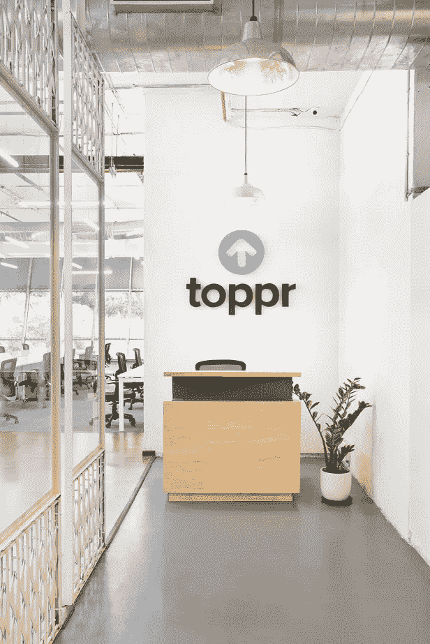

# 付费、拥有和获得的媒体

> 原文：<https://medium.com/swlh/paid-owned-earned-media-eae44c7275a1>

在 21 世纪的在线市场中，付费媒体、自有媒体和盈利媒体之间的界限变得模糊不清。这项研究将确定它们的相互依赖性。

在数字营销中， ***到达、*** 的浏览量和浏览量可以通过三个基本渠道高频加速:

## **1。付费媒体**

第一步是研究内容推动流量并最终推动商业的各种方式。建立认知和考虑的外部努力包括营销人员必须付费的数字媒体——或*付费*媒体。

> 在市场上建立品牌权威时，支持付费活动的大创意是最重要的。

与印刷和电视等传统媒体相结合，这种猖獗的数字广告的整个过程通常会推动销售线索的产生。

## 2.自有媒体

术语*拥有*意味着公司作为一个品牌在公共领域通过发起、指导和维持与客户互动的平台行使控制权。本质上是公司拥有的财产，如网站、应用程序、独家电子商务平台以及社交媒体账户。

随着疫情事件后消费者行为的显著变化，通过自有媒体保持统一的声音和形象非常重要。这是领先品牌投资全渠道客户体验的地方，建立了一个轻松、便利和可信的生态系统。

> 客户永远是产品的核心。

## 3.获得的媒体

现在，通过*付费*广告和*拥有的*财产获得的*媒体提高了公司在公众领域的声誉。它同样受到公司及其附属机构(如公关机构、联合品牌合作伙伴，当然还有有影响力的人或品牌倡导者)之间协作的影响。*

> 新闻稿是一个重要的组成部分。它们不仅验证了顾客对品牌的信任，还促进了对产品及其市场价值的更好回忆。

## 汇聚点

在社交媒体时代，可以肯定地说，如果将三者中的每一个都视为独立于其余两个的话，付费、拥有和赚取的框架就有些过时了。我们现在需要构想一个新的媒体框架，确定付费电视、FB 广告活动和通过自有渠道预热销售线索之间的交汇点。

> 付费促销的增加是有原因的。

例如，耐克的品牌战略展示了完全付费广告和利用有机影响力的促销广告之间的界限异常模糊。对于特定类型的以年轻人为中心的、[鼓舞人心的](https://www.youtube.com/watch?v=zv9daYDOCIY)内容，aligned 的理念是，通过分享/订阅按钮传播的视频可以在一夜之间达到预期的 15 倍。

在提升潜在客户影响力的同时，数字营销人员需要不断跟踪和衡量社交活动的成功。利用自有媒体进行竞赛在这方面非常有效。重点主要在于创造力和创新。

但是大多数公共领域的公司仅仅通过用户数量来寻求更高的可见性。他们可能忽略的是留住一个积极参与的用户。这取决于内容的深化，与产品创新的持续进步相一致。再多的钱和广告也买不到这个。

如前所述，媒体收入(公关、口碑)取决于付费和自有渠道的累积效应。然而，如果不稳定产品的参与度，它就无法站稳脚跟。

以网飞为例。该平台从一家本地邮购 DVD 租赁服务公司发展成为一家全球流媒体巨头，这既归功于用户体验，也归功于原创内容在境外的多元化。显然，[参与(阅读暴饮暴食)胜过一切。](https://blog.toppr.com/why-user-engagement-trumps-all-fb8efaf0785a)这应该是拥有大深度领域的初创公司的一项重要学习——瞄准大范围。

## TOPPR 的案例

到 2021 年，印度中小学在线学习市场的价值将达到 16 亿美元。电子学习应用程序 Toppr 成立于 2013 年，目前为超过 250 万名学生提供服务。已实践超 1.5 亿题，平台解疑超 100 万。

提供的产品如下:

> 学习:3000 多个小时的视频讲座，以及无限的练习题
> 
> 测试:全印度测试系列和以前的论文
> 
> 疑惑:24X7 全天候聊天专家协助

学生可以免费注册，并在试用期内无限制地使用所有模块。一旦过期，他们可以升级到他们选择的付费订阅。通常，订阅的最短持续时间持续到学年结束。

该公司的边际贡献是正的。他们预计，到 2021 年，低年级订阅量将增长 20 倍，高年级订阅量将增长 15 倍。在过去 12 个月中，同比增长一直是 5X，过去七个季度的季度环比收入增长率为 50%。

它的首席执行官是 IITian 人 Zishaan Hayath，他对一些初创公司进行了一系列天使投资，如 Ola Cabs、Orobind、Chaayos 和 T2 hola chef T3。在与 *Chaupati Bazaar* 的初步创业成功后，在电子商务领域，他知道在 4 亿学生的情况下，K-12 市场远未饱和。

Toppr co-founder, Zishaan Hayath.

仅在四年内，Toppr 就在人工智能应用方面取得了进展，成为教练课程最有前途的替代品，而教练课程在印度家庭支出中占了很大一部分。它的品牌故事值得深入研究。

> 在去年的 B 轮融资后，该公司正在积极地将其足迹扩展到 20 多个印度城市。

在触及 2M 用户大关的战略时刻，他们与著名广告公司 [Lowe Lintas](http://www.mullenlowelintas.in/our-partners/lowe-lintas/) 合作，发布了一部以印度日常阶级(房间)斗争为主题的 TVC。在三个不同的 1 分钟广告中，年轻的角色描述了扭曲的师生比例带来的限制，在获得技术援助之前，他们直接与父母联系。移动应用程序的功能就在最后，神秘地一瞥产品供应。它被 AdAge India 选为本周五大广告之一。

就销售线索分布而言， ***付费*** ATL 活动与以下因素相关:

> 1.ROI 的测量
> 2。报名人数
> 3。注册费用
> 4。为注册导致的流量增加提供基础设施支持

在 TVC 发布后，要测量注册人数的增长，100%的准确性是不可能的。然后，Toppr 的 ATL 团队决定根据最近发生的营销成本来衡量 CPL。他们想出了一个解决方案，即活动产生的每个新线索都有 20%的容差范围。相应地确定 ROI，其余参数由数据分析确定。

The ‘*classroom for one’* tagline extends the platform’s mission to personalise learning to a greater ‘*education for all’*.

脸书有超过 90 万用户，YouTube 有近 3 万用户，LinkedIn 和 Instagram 有 6 到 9 万用户——该平台的付费用户对其领先分布产生了重大影响。这是通过跟踪社交媒体像素的仪表盘来衡量的，同时还有其他 ***拥有的*** 频道，如 [Toppr Bytes](https://www.toppr.com/bytes/) 。

通过一个由内容作者和编辑组成的自由职业者社区，Bytes 是一个教育新闻门户网站，每天吸引成千上万的学生，并产生大量的注册用户。在这里，重要的是它通过文章中链接的关键词对 SEO(搜索引擎优化)的贡献。

> 付费谷歌广告与 Bytes 等自有资产的选择加入相结合，是两种媒体——付费和自有——如何相互融合的很好例子。

从 SEO 的角度来看，网站的营销页面同样重要。通过关键词搜索产生的流量对注册来说至关重要。最近，Toppr 增加了多个课程和考试页面，开放部分直接面向学生(用户)和家长(买家)。这些内含物对于更好的接合是必要的。

至于 ***赢得的*** 声誉，Toppr 通过其社交媒体竞赛和活动保持强大的社交信息。这往往足以通过口碑和公关产生积极影响的连锁反应。《印度时报》去年报道了著名的非政府组织*为印度而教*【TFI】发起的排灯节企业社会责任活动。该平台为孟买和浦那资源不足的学校提供了 300 个免费的“学习”模块(练习题和视频讲座)。这是一个罕见的挣得满足付费促销的案例。点击此处了解更多关于该协会的信息:[为印度而教计划推出在线学习。](https://blog.toppr.com/this-diwali-we-are-introducing-topprs-learn-module-in-teach-for-india-classrooms-for-free-88f6f6c4fb6a)

通过每日更新脸书(利用 YouTube、博客、字节和公关)、Instagram 故事和 8 篇每月博客文章，Toppr 保持其社交媒体受众的持续参与。此外，每周时事通讯通过发送精心策划的考试相关内容来支持这一点，包括与排名靠前的学生举行网络研讨会。这些与印度著名机构如印度理工学院的排名员的现场会议被称为 [*Toppr 讲座*](https://www.youtube.com/playlist?list=PLXyIamz14kHU-3vlfu3h6kZrp-LagBLYy) 。仅在 3 个月内，他们就将 Toppr 的 YouTube 频道的用户数量增加了 15 倍。

> 重点是为 TG 创造价值，TG 主要由准备学校、董事会和入学考试的学生组成。

只要注意到这一点，一个可靠的营销策略将包括:

> 1.直接影响销售线索生成的付费活动(电视广告和付费促销)
> 2。自有渠道参与(网站、社交媒体和博客)
> 3。赢得媒体(公关、口碑)

这三者共同为 Toppr 的业务增长做出了相当大的贡献。与之对应的是资金、内容扩展和产品创新等其他重要的增长决定因素。要了解更多关于 Toppr 的营销计划，请关注他们的[博客。](https://blog.toppr.com/)

**所有图片均为 Haygot 教育私人有限公司所有。*

## 这篇文章发表在[《创业](https://medium.com/swlh)》上，这是 Medium 最大的创业刊物，有 290，182+人关注。

## 在这里订阅接收[我们的头条新闻](http://growthsupply.com/the-startup-newsletter/)。

