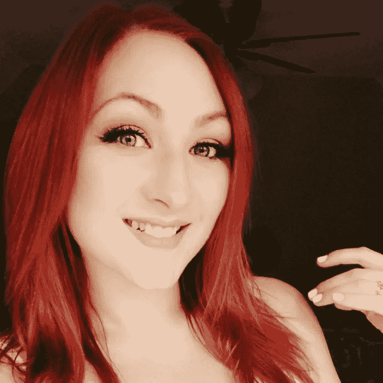

# “付费推广是兔子，有机推广是乌龟”VisualFizz 联合创始人玛丽莎·瑞安的 5 个创业战略

> 原文：<https://medium.com/swlh/paid-promotion-is-the-hare-organic-is-the-tortoise-5-startup-strategies-with-marissa-ryan-81848b1cd2d1>

> 我有幸采访了 Marissa Ryan，她是位于芝加哥的数字营销机构 VisualFizz 的联合创始人。玛丽莎的营销建议已经发表在《福布斯》、《苹果新闻》、《内置芝加哥》和《美国周刊》上。