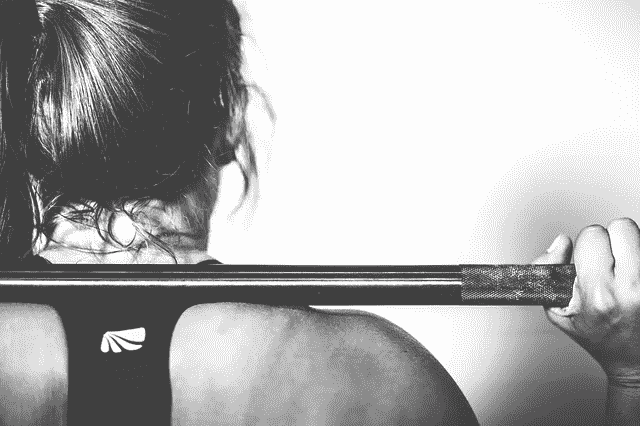

# 痛苦、快乐、满足、精神韧性、成功

> 原文：<https://medium.com/swlh/pain-pleasure-satisfaction-mental-toughness-success-b70e75d83228>

[AlexVan/pixabay](https://pixabay.com/en/crossfit-sports-fitness-training-534615/)

我们人类生来就注定要避免痛苦，寻求快乐。这个简单的原则在文明之前是一个明智的经验法则。我们的环境给我们带来了足够多的挑战。现在情况不再是这样了。

文明给我们带来了富足**，也消除了我们日常生活中的痛苦。表面上这是好消息，但也有不好的一面。我们不知道如何应对富足和缺乏痛苦。**

**如果我们跟随我们的本能，我们可以沉浸在快乐中，在短期内完全没有痛苦。从长远来看，这样的行为肯定会带来痛苦，要么是疾病的痛苦，要么是空虚的心理痛苦，或者两者兼而有之。**

# **快乐与满足**

**满足是一种不同于快乐的感觉。这需要我们的努力。这种努力可以是精神上的，情感上的，身体上的，或者两者的结合。当我们经过长时间的努力达到一个目标时，我们感受到的情绪不是快乐。是满足感。**

**快乐对成功来说是一种不好的启发。追求快乐很少导致成功。跟随满足感会。**

# **心理韧性的公式**

**成功需要努力。过了某个门槛，努力就觉得痛苦。如果我们使用我们的本能，我们将避免大量努力的痛苦。这意味着我们需要违背自己的本能来获得人生的成功。**

**换句话说，我们需要颠倒 [**痛苦、快乐的原则**](https://ideavisionaction.com/personal-development/the-principle-that-explains-all-human-behavior/) 。我们需要尽可能地避免快乐 [**和走向痛苦**](https://ideavisionaction.com/personal-development/love-the-pain/) 。这就是 [**精神韧性**](https://ideavisionaction.com/personal-development/your-definition-of-toughness-doesnt-serve-you/) 的公式，它带来了人生的成功和满足。**

# **刺激成长的痛苦**

**我在这里说的痛苦不是对你身体的伤害。这是做出必要的努力和面对恐惧的心理痛苦。换句话说，就是痛苦的 [**自律的**](https://ideavisionaction.com/personal-development/how-to-build-world-class-self-discipline-in-a-single-year/)[**勇气的**](https://ideavisionaction.com/personal-development/how-to-cultivate-world-class-courage-in-a-single-year/) 。**

**你不需要一夜之间成为最坚强的人。这是一个过程。你所要做的就是在正确的方向上迈出一步又一步。这就是[**1%改进**](https://ideavisionaction.com/personal-development/how-to-improve-your-life-38x-in-a-year/) 的原理。通过每天做 1%的改进，随着时间的推移，你的生活会有显著的改变。**

**当你 [**走向风暴眼**](https://ideavisionaction.com/personal-development/go-toward-the-eye-of-the-storm/) 时，你将不可避免地失败。那很好。每一次失败都是个人成长和进步的机会。美国亿万富翁投资者雷伊·达里奥在他的《原则》一书中将 [**进步**](https://ideavisionaction.com/personal-development/the-simple-formula-of-progress/) 定义为痛苦+反思。**

# **摘要**

**我们默认的行为是逃避痛苦，寻求快乐。这种本能在过去对我们的祖先起作用，因为他们的环境为他们提供了足够的挑战。现在我们很少这样了。**

**为了在生活中获得成功和满足，我们需要改变我们默认的本能。我们需要寻求痛苦，避免快乐。这种新的启发提高了我们的精神韧性，并带来成功和生活的满足感。**

*****如果这篇文章引起了你的共鸣，*** [***注册我的电子邮件简讯***](https://ideavisionaction.com/email-newsletter/) ***每周都会收到我关于个人发展和生活经验的最新文章的摘要。*****

****

## **这个故事发表在 [The Startup](https://medium.com/swlh) 上，这是 Medium 最大的企业家出版物，拥有 358，974+人。**

## **在这里订阅接收[我们的头条新闻](http://growthsupply.com/the-startup-newsletter/)。**

****