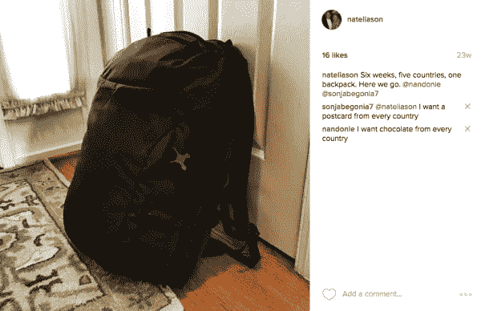

# 帕金森定律不仅仅是关于时间

> 原文：<https://medium.com/swlh/parkinson-s-law-isn-t-just-about-time-15a8c5fae8fd>

如果你不熟悉的话，[帕金森定律](https://en.wikipedia.org/wiki/Parkinsons_law)说:

***事情需要的时间取决于你分配给它多少时间*** *。*

所以如果你给自己一个短的截止日期，你会更有效率，工作得更快。相反，如果你给自己很多时间去做某事，你会花更长的时间去做，并且认为这是一个更大的任务。

这是生产力中最有用的概念之一，因为如果你明智地使用它，你可以限制你必须做事情的时间，并更快地完成它们。

但是这个定律还有一个更有用的概括:

***对一种资源的需求倾向于扩大以匹配该资源的供给*** *。*

遵守这个规律的不仅仅是时间，还有一切。任何时候你在使用一种资源，你所使用的数量会受到你可支配的数量的影响。

有些人花几个小时收拾行李去旅行。他们翻遍所有的衣服来挑选，找到合适的鞋子，然后装满一个大箱子。

我只是打包这个包:

这是一个 26L [的旅行包，是我在打算移居阿根廷时捡到的。](http://www.minaal.com/)

我带着那个包包在欧洲旅行了 8 周(当然还有里面的衣服)。现在，我唯一会用行李箱的时候是我真的需要一个装西装的箱子的时候(背包不太好，不会弄皱东西)。

以这种方式包装的其他好处:

*   你只能拿这么多，所以你必须从最基本的开始
*   你不用担心太多的服装，只要能搭配就行了
*   你可以每次都吃同样的东西来减少思考
*   你不随身携带不必要的东西
*   (最重要的)你不检查任何包

然而，包装只是一个例子。你可以用一般化的法则，用任何资源来影响你的思维。

## 个人理财

不要试图用剩余的钱来做预算或存钱，当你拿到钱的时候，立即存钱或投资，然后用剩余的钱。你会花掉你所拥有的，所以通过减少你所拥有的来确保你花得更少。

限制供给(实得工资)，你就限制了对它的需求(你花了多少钱)。

## 节食

你会把你的盘子装满，不是基于你有多饿，而是基于盘子有多大。盘子里的食物越多，你吃的就越多。盘子的大小和吃饭的速度是美国肥胖问题的两个最大的文化原因。

限制供应(盘子大小)，你就限制了对它的需求(拿起/吃掉的食物)。或者你可以试着五天不吃东西。

## 做什么/去哪里

当我和我的女朋友试图决定该做什么时，通常会发生这样的事情:

“你想做什么？”

“Idk，你想干什么？”

“这个呢？”

“嗯，也许吧，但也包括 XYZ…”

等了大概半个小时。

解决办法？首先，限制你必须做出决定的时间:“我们将在不到五分钟的时间内挑选一些东西。”然后，让一个人选择他们喜欢的两三个地方，让另一个人从中选择一个。这样你就可以绕过[的决定麻痹](http://www.nateliason.com/decision-fatigue/)。

## 空间

如果你有一个大公寓或房子，你会觉得更有义务去填满它。通过考虑压缩你拥有的空间，你可以确保你只买你真正需要和想要的东西，而不是因为你不想被空虚所困扰而去捡东西。

相反，如果你[努力缩小](http://blog.adilmajid.com/the-purge)，你觉得需要的空间也会减少。

## 喝酒

类似于节食，但如果你想减少你在酒吧等地方的饮酒量，就点小杯饮料。你会慢慢地啜饮它们，因为它看起来更少，并且不太可能在宿醉中醒来。

在你能接触到资源的任何领域，如果你给自己更多的资源，你会使用更多的资源。如果你想获得对任何事物(时间、空间、金钱等)的更多控制权。)你要做的就是减少你对它的供给。

知道这种思维方式适用的其他领域吗？请在回复中告诉我。

*原载于 2015 年 11 月 29 日*[*www.nateliason.com*](http://www.nateliason.com/parkinsons-law-isnt-just-about-time/)*。*