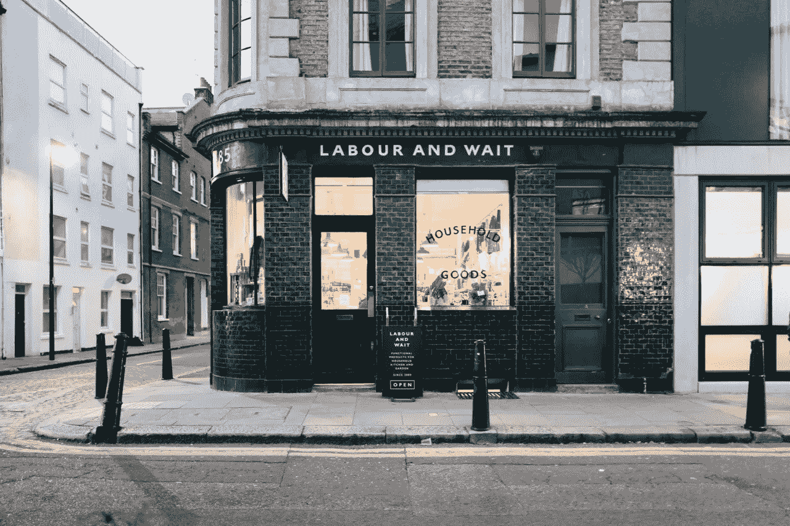

# 参与购买

> 原文：<https://medium.com/swlh/participating-in-the-purchase-984ee759c9f9>

## 创始人如何采取不同寻常的步骤让他们的销售过程出乎意料地棒

Photo by [Tomas Anton Escobar](https://unsplash.com/photos/y6rwKaurdkI?utm_source=unsplash&utm_medium=referral&utm_content=creditCopyText) on [Unsplash](https://unsplash.com/search/photos/shop?utm_source=unsplash&utm_medium=referral&utm_content=creditCopyText)

当谈到新用户和客户的获取或购买途径时，我经常听到创始人描述线性体验。

这有点像，'他们看到我们的 Instagram 广告，当他们到达我们的网站并点击试用按钮时，他们就会…'

像这样的陈述假设了很多关于移动一个人从不知道你的产品变成一个福音传播者。

实现这一目标的产品和营销步骤众所周知。提高知名度通常始于与朋友和家人的交流，一些广告和(希望)一个精心设计的推荐项目。它继续在社交媒体上重新定位潜在用户和客户。然后是重复发送电子邮件和提醒，希望注册的人会进入你的漏斗中的下一步。

这些策略是标准的，虽然它们在某种程度上有效，但并不显著。不管信息有多聪明，传递媒介有多创新，信息仍然是独白。不幸的是，尽管创始人的初衷是好的，但这些策略很容易被解读为讨厌和过头。

经常被忽略的微妙但重要的细微差别是*团队应该如何参与购买。换句话说，创始人和他们的团队如何采取不同寻常的(有时甚至是不可逾越的)步骤，让他们的销售过程从预期的到出乎意料的棒？*

# 小额购买

就在十多年前，我看了《意大利工作》的翻拍版。它被出色地再现，也是备受喜爱的迷你库柏的重新推出。当时我想买一辆新车。我还没有决定我想要什么，但是电影一结束，这种犹豫就消失了。

接下来的一周，身高 6 英尺 5 英寸的我对迷你库珀产生了确认偏见。我到处都能看到他们。没过多久，我在另一个城市拜访朋友时，在当地的迷你车库进行了询问。

虽然我不住在那个城市，但我经常去那里工作。我第一次去迷你车库时，年轻的销售经理和我谈到了选择和定价。他和我一样爱他们，他的热情很有感染力。在会议结束时，他告诉我，当我准备好购买时，请与我联系。

在另一个州购买的可能性不大，但两周后情况发生了变化。

当时，LinkedIn 与一款允许你记录商务旅行的应用程序有产品合作关系。提交详细信息后，应用程序会通知你的联系人和查看你 LinkedIn 个人资料的人你的旅行日期。它经常激发机会主义会议，我开始对它产生兴趣。

在回到我参观过迷你车库的城市之前，我记录了我的商务旅行，并没有把它放在心上。当我着陆时，我收到了 Mini 销售经理的短信，问我是否想在周末借一辆 Mini。我非常惊讶和高兴，故事以他得到我的生意而结束。

尽管作为一名相对年轻的销售经理，他的组织能力很强，但他还是参与了购买。他做了功课，创造了一个不可扩展的，从定义上来说，非凡的体验。

# 预购策略

你可能会认为像我的迷你体验这样的策略只适用于奢侈品，或者只适用于企业对企业(B2B)的关系管理。

他们不是。我认为参与购买可以(也应该)发生在所有的商业模式中。

我并不是说每位顾客在购买前都需要特别关注。那是不可能的。然而，这应该是企业获取客户计划的一部分。

# 传递相邻值

当我考虑加强关系时，我想到的第一件事就是想办法提高对方的地位。换句话说，我考虑他们的动机和激励，并试图找到帮助他们获得激励的方法。

实现这一目标的最佳方式是创造与你可能想卖给他们的东西相近的价值。

我为队友和学员以及潜在客户、合作伙伴和投资者这样做。

要明确的是，这不是拖延或把价值留在桌面上。这是一个长期的游戏。这也是有时暂停锁定短期销售的冲动，知道你获得的价值在未来会大得多。

您可以通过多种方式创造相邻价值，从而参与购买之旅:

1.  **提供访问** —这至少有两种方式。首先，首席执行官、联合创始人和高层领导可以打电话给客户，看看他们是否喜欢这款产品，以及如何改进。我总是惊讶于客户接到一个他们从未想过会花时间的人的电话是多么兴奋。第二，邀请客户参加像网络研讨会这样的活动，他们可以向您团队中的专家了解和询问您正在解决的问题。
2.  **发送产品**——意想不到地发送一件你可能喜欢并且可以尝试的产品，是让潜在客户停下来想想你为给他们惊喜所做的努力的最有效方式之一
3.  **提供服务** —基于服务的公司可以以礼券的形式提供一定时间的价值，例如公关机构可能会就危机管理问题提供 30 分钟的建议，可随时兑现
4.  **表达感谢**——打电话给潜在客户，感谢他们考虑你的公司(不是如果你能回答任何问题或试图再次向他们推销的话),这不仅会出乎意料，而且会表明公司感觉到他们伸出了援手
5.  **推荐内容** —如果你看到你认为对客户(或合作伙伴或投资者)有价值的内容，就发送出去。如果你听播客和雷德·霍夫曼的[音阶大师播客](https://mastersofscale.com/)，你会知道这是如何进行的；他建议开始听其他的播客
6.  **直接与更成熟的提供商合作** —这一点更有争议，但当一位业务开发人员出于长期合作关系的考虑，向我推荐更成熟的产品(而不是他们自己的产品)来满足我公司的需求时，我感到很惊讶

# 最后一件事…

当谈到交付相邻价值时，我通常会问自己三个问题。

*我/我们有可能获得长期价值吗？*

*这是不可扩展的吗？*

*我/我们有可能从潜在客户那里学到东西吗？*

如果每个问题的答案都是肯定的，那么结果通常是积极的。

这就是我参与购买的方式。你如何着手做这件事？

菲尔·海斯-圣克莱尔是一位连续创业者。他每周都在自己的博客上写关于创业公司成长的文章，并制作创始人对创始人播客。

## 这篇文章发表在 [The Startup](https://medium.com/swlh) 上，这是 Medium 最大的创业刊物，拥有+397，714 人关注。

## 在这里订阅接收[我们的头条新闻](http://growthsupply.com/the-startup-newsletter/)。

