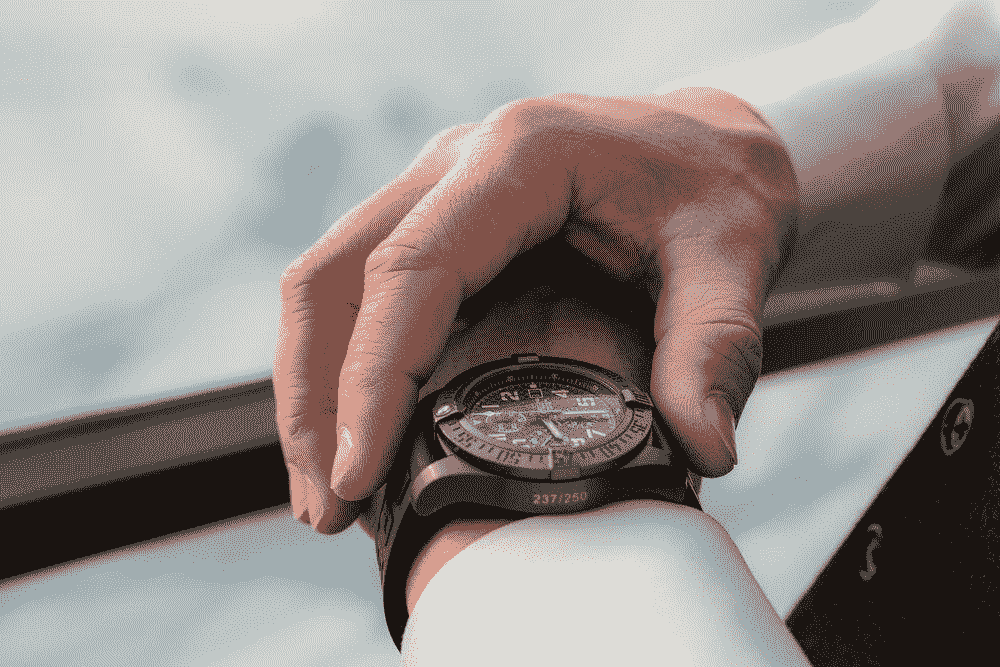
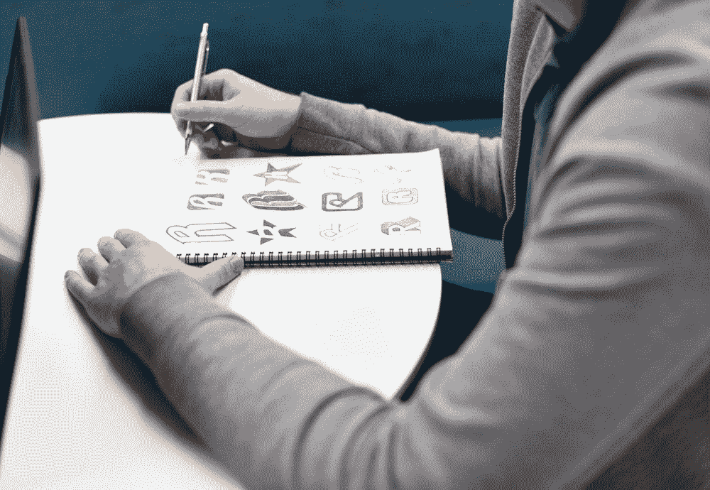

# 耐心对雄心勃勃的人来说至关重要

> 原文：<https://medium.com/swlh/patience-is-crucial-for-ambitious-people-a31e56328320>

[@cblack09](https://unsplash.com/@cblack09)

我认为自己是一个没有耐心的人。我想不断成长，直到我做的每一件事都获得成功。

在一个理想的世界里，人们不需要担心搞砸或错过机会，但生活并不是这样。我们有起有落。我不能指望每次都能做好报告，也不能指望每个人都认同我的设计，就像我的个人生活中，由于时机不好，一段浪漫的关系没有成功。我们做的每一个决定都需要时间来成长和学习，然后才能前进。

# 时机

[@tylerharris](https://unsplash.com/@tylerharris)

急躁不会让事情发生得更快。我们的目标越大，实现目标的时间就越长。

对于某些事情，你可以通过在“正确的”时间做事来获得最大的收益。这意味着根据数据将时间与你想要的预期结果保持一致。故意的。一个例子是在 LinkedIn 或脸书这样的平台上发布内容。我会在特定的日子或在被证明大多数人都在线的时候发布内容，以确保我获得最大的参与度。

当你与周围的一切保持一致时，事情就会发生，但你不能强迫它。一个例子是发表我的文章。我控制不了收视率低的那几周。有些文章我期望比其他人得到更多的关注，但有时时机不对，这种情况并没有发生。最后，这是可以的，因为让人们喜欢我的内容不是我的目标(也不应该是)，因为我最终写作是为了提高我的沟通技巧和帮助他人。这些技能需要时间来提高，这是一个持续的过程，在这个过程中，期待即时的满足(对任何事情)会导致失望。

> 做你喜欢的工作，充分利用你的时间。

尽管我上面提供的例子是一些我们如何看待好时机的例子，**从来没有真正的“好”时机**。最多是不可预测。你能做的最好的事情就是开始做你想做的事情，不要担心时间，而是尽你所能坚持不懈地努力实现你的目标。

# 在过程中要有耐心

[@rawpixel](https://unsplash.com/@rawpixel)

作为设计师，我们强调过程，因为它引导我们走向理想的结果。对于某些事情，我们不能操之过急。我们不能催促构思过程，不能催促用户测试，也不能总是催促和我们一起工作的人，因为这会影响他们的工作质量。事情需要很长时间是有原因的，我们能做的最好的事情就是适应、倾听和耐心。

耐心是我们努力工作和坚持不懈的成果得以发扬光大的原因。在前进之前，我们需要时间让我们的行动停下来并做出反应。尽管我在大学二年级的时候很想在谷歌工作，但我知道我还没有准备好拥有当时的经验水平。在前进之前，我必须在我的技能和我对如何处理不同设计问题的理解上有所增长。我失败了无数次面试来提高自己，并取得现在的成就。尽管我想尽我所能学习设计，但我不能一次处理所有的事情。如果我们这样做，我们就会错过主要的学习机会，无论是通过我们的奋斗还是失败，来达到我们想要的目标。

# 关注当下

[@iyolanda](https://unsplash.com/@iyolanda)

拥抱旅程，而不是结果。把你的失败视为学习的机会。通过改变你的心态，你会很快意识到你做事的方式和你达到目标的心态的重要性。在我大学三年级的时候，我不断得到在顶级公司面试的机会，但如果我没有通过面试，我对拒绝的反应让我意识到我是多么缺乏学习新事物的动力。我只关注结果，而不是我学到了什么。

> 机会来了又走。正是我们所学的帮助我们获得更多的机会，给我们带来竞争优势。

满足于你现在所拥有的，朝着你想去的地方努力。当你有其他事情要做的时候，不要试图去寻找，因为相信我，你永远不会满足。

# 结论

就像电子游戏一样，我们必须先升级，然后才能进入下一关。这意味着体验我们周围的一切，拥抱我们所拥有的一切。只有我们现在学到的东西才能推动我们走向未来。这意味着，当我们必须首先做好基础工作时，不要试图去做我们显然没有准备好的事情。

*查看我在* [*UX 研究*](http://skl.sh/2nal9ZT) *上的 Skillshare 课程，学习新知识！*

*为了帮助你开始拥有自己的设计生涯，这里有一些来自*[***Rookieup***](https://transactions.sendowl.com/stores/8000/107314)*的神奇工具，我曾经在这个网站上得到资深设计师的指导:*

*   [**在一位经验丰富的设计师的帮助下制作一个作品集**](https://transactions.sendowl.com/stores/8221/107314)
*   [**强化和建立你的作品集的必备工具**](https://transactions.sendowl.com/stores/8219/107314)
*   成为自由职业者 ，掌控你的时间和职业
*   [**获得惊人设计工作的小技巧**](https://transactions.sendowl.com/stores/8222/107314)

*链接到其他一些很酷的读物:*

*   我作为一名应届毕业生参加了脸书大学的面试。以下是我对设计 的了解
*   [**旅程映射是获得同理心的关键**](https://uxplanet.org/journey-mapping-is-key-to-gaining-empathy-1da5b54655e1)
*   [**UX 是接地气的理，不是设计**](https://uxplanet.org/ux-is-grounded-in-rationale-not-design-49e8f77b8f58)
*   [**什么时候设计变得这么容易了？**](https://medium.muz.li/when-did-ux-design-become-so-easy-bcc13fd8a4e2)

## 这个故事发表在 [The Startup](https://medium.com/swlh) 上，这是 Medium 最大的企业家出版物，拥有 312，596+人。

## 在这里订阅接收[我们的头条新闻](http://growthsupply.com/the-startup-newsletter/)。

