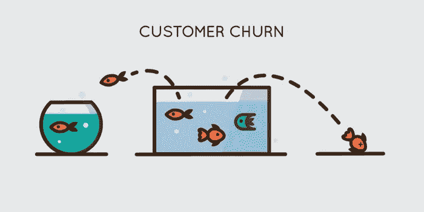

# 注意你的客户流失率——它可能太高了

> 原文：<https://medium.com/swlh/pay-attention-to-your-churn-chances-are-its-too-high-f734190a3491>

如果你的公司正在疯狂获取新客户，那么高流失率可能看起来没什么大不了的。但是如果你放任这个问题，它会对你的底线产生严重的后果。

T 你的流失率越高，你就必须获得越多的客户来发展。假设你年初有 100 个客户，但年流失率为 30%。这意味着，在接下来的一年里，你必须吸引 31 个客户，才能增加一个客户。这在获取新客户的时间和费用上都是非常低效的。

这个问题通常可以用一个简单的(虽然不直观)解决方案来解决:

停止关注让客户尽快转化，开始关注[在他们点击注册按钮之前教育他们](https://elearningindustry.com/getting-started-customer-product-training)。

# 客户为什么会流失？

不合格的客户可能会因为以下几个原因而流失:

*   你的产品没有他们真正需要的功能。
*   你的产品比他们想要的功能多得多。
*   你的产品不适合他们经营的业务类型。

这些事情中的任何一件都可能是真的——或者客户可能错误地认为它们是真的，因为他们没有时间通读您的产品文档。

无论是错误的客户注册你的产品，还是正确的客户因为错误地认为产品不适合他们而离开，流失都表明注册的客户不够合格。

看看您当前的客户获取量[漏斗](https://elearningindustry.com/engage-demand-gen-optimize-user-journey-full-funnel-customer-education)。你是否在每一步都教育你的潜在客户你的产品到底是做什么的，如何使用，为什么它会给他们的生活增加价值？

# 暂时不要让他们改变信仰

在某些客户转变之前，确保他们合格的一个可靠方法是让他们在客户获取漏斗中移动得更慢。

你的目标应该是一步一步地引导潜在客户从认知到选择加入。当潜在客户第一次意识到你的产品时，他们看到的第一个 CTA 不应该是注册免费试用，而应该是了解更多。

太多的公司使用免费试用作为一种方式来教育他们的客户他们的产品是做什么的，但这可能是令人难以置信的低效和混乱。不要只是让客户参与试用，并希望他们能够理解，而是在你给他们选择注册试用之前，给潜在客户提供他们充分利用试用所需的工具和知识。

看看人力资源管理软件公司 Workday 的主页。主 CTA 不是一个宣传免费试用的大横幅，而是一个橙色按钮，承诺告诉你为什么应该切换到 Workday。

点击橙色按钮，您将进入一系列教育页面:

1.  首先，您将看到一个页面，它提供了观看演示(如果您想要快速版)或向下滚动以查看功能和阅读深层内容的选项。这些内容被映射到软件潜在用户的职位，允许访问者自行选择他们的体验。在本页底部，还有另一个“了解更多”CTA。
2.  第二页充满了更深入的信息，包括案例研究，邀请您了解其他人是如何使用该产品的。还有另一个“了解更多”CTA。
3.  单击最后一个 CTA，您将被带到产品预览页面，在这里您可以填写表格来观看产品预览。

当您在这个表单中输入信息并观看产品预览视频时，您已经非常清楚 Workday 是否适合您的需求。

# 在您的产品试用中嵌入培训

据开发商招聘公司 Starfighter 的首席执行官帕特里克·麦肯齐(Patrick McKenzie)称，注册免费试用软件或 SaaS 应用程序的用户中，有 40 %- 60%的人会使用一次，就再也不会回来。

“许多公司生产的软件第一次运行的体验是一个意外，”他在内部通讯中为[写道。“这是软件。这里有一个用户。用户以不可预知的角度和不可预知的速度遇到软件。混乱随之而来。救护车来了。这是我们的错。我们不应该把用户扔进软件里，希望他们能理解，而是应该积极地打造他们的第一次体验。”](https://blog.intercom.io/designing-first-run-experiences-to-delight-users/)

演示阶段应该提供多种培训机会。这些可以是弹出式提示框、电子邮件培训系列或演示视频的形式。

您甚至可以考虑建立一个简短的演示项目，让用户在自己动手之前快速了解一下相关的知识。

# 无缝培训是关键

你可能会对自己说，“我们已经有足够的训练了！我们在 YouTube 上有常见问题解答、产品文档文件和数小时的网络研讨会！”

嗯，不管你有多少培训材料:如果它们没有[无缝嵌入](https://elearningindustry.com/using-embedded-training-onboard-users-contextual-learning)客户获取漏斗，大多数潜在客户不会去找它们。

对潜在客户来说，解释快速提示的 30 秒嵌入式视频比全面概述整个产品的 30 分钟视频更有帮助，特别是如果快速提示视频可以在用户最常用的产品中访问的话。

为您的客户提供他们需要的工具，帮助他们成功使用您的产品。你会看到更高质量的转化和更少的挫折——所有这些都会显著提高你的流失率。

如果你想深入了解在线培训项目，请查看[创建在线培训项目的初学者指南](https://www.schoolkeep.com/beginners-guide-to-online-training)。

[SchoolKeep](https://www.schoolkeep.com/) 是一款现代化、易于使用的软件，用于快速创建和提供品牌在线培训模块。

*原载于 2018 年 1 月 14 日***&*[*www.elearningindustry.com*](https://elearningindustry.com/churn-is-too-high-can-fix)*。**

**

## *这个故事发表在 [The Startup](https://medium.com/swlh) 上，这是 Medium 最大的企业家出版物，拥有 284，454+人。*

## *在这里订阅接收[我们的头条新闻](http://growthsupply.com/the-startup-newsletter/)。*

**