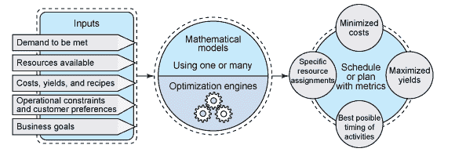
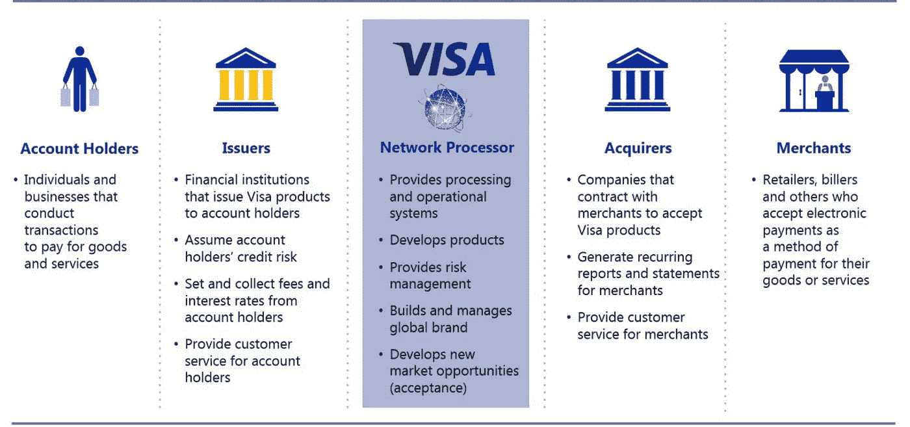

# 支付优化即服务

> 原文：<https://medium.com/swlh/payments-optimization-as-a-service-fd64906b9eb4>

支付服务提供商如何逆转支付的商品化？

Re-inventing the Payments Business Model

在过去的五年里，金融科技非常有趣，我认为是最有活力的行业。如果说有百年历史的金融机构在我们金融产品的每一个部分都有股份，从支票账户到信用卡到抵押贷款甚至保险，那么现在银行的非绑定化已经让我们在金融科技领域获得了不同类别的服务。

***放贷*** 造就了 [LendingClub](https://www.lendingclub.com/) 、 [Kabbage](https://www.kabbage.com/) 和[肯定](https://www.affirm.com/)、 ***散户投资*** 给了我们[罗宾汉](https://robinhood.com/)、[财富前线](https://www.wealthfront.com/)和 [Kapitall](https://www.kapitall.com/) 和 ***汇款*** 被[之类的转移方式改变了](https://transferwise.com/)

但是没有任何其他行业像支付行业一样见证了新公司的影响。有了像 [Stripe](https://stripe.com/) 、 [Adyen](https://www.adyen.com/) 、[Checkout.com](https://www.checkout.com/)、 [Square](https://squareup.com/) 、 [iZettle](https://www.izettle.com/) 、 [Venmo](https://venmo.com/) 、 [Dwolla](https://www.dwolla.com/) 这样的公司，改变着我们线上和线下的支付方式，以及向朋友和家人汇款。

## 商品化陷阱

然而，由于大多数支付公司都是建立在万事达卡、T2 卡、T4 卡和美国运通卡的基础上，行业专业人士知道，商品化陷阱就在眼前。

曾经被视为高价值解决方案的支付服务提供商现在正在变得商品化，因为 PayPal 和 Stripe 等公司已经将选择 PSP 的决策过程从商业决策转变为开发者决策。在过去，对需求的全面分析将与一个或多个提供者相匹配，而开发人员唯一的标准是将需求实现到应用程序中所必需的代码行。

随着 PSP 的功能变得几乎一样，决定归结为最低的公分母——价格。不再考虑其他财务计算，如投资回报、净利润影响、对关键指标的影响，PSP 开始相互竞争，为商家提供尽可能低的价格。

## 一场归零的竞赛？

随着 PSP 的商品化和公司在价格上的竞争，我们将看到更多的大型在位者，如 Ingenico，First Data 和 Vantiv，继续他们的收购狂潮(Bambora，CardConnect，WorldPay ),以确保规模经济带来实际利润。

但正如所有行业一样，我相信最大的机会仍在我们面前。我没有担心支付的商品化，而是把大部分时间花在思考、制定战略和规划支付行业的优化上。

## 最佳化

关于优化，我不是指从劳动力中榨出每一分钱的战略优化，而是指优化的数学视角。

在这种情况下，我会将 PSP 作为输入系统，将性能、价格和功能作为我希望最大化的输出。

Optimization Model

如果您熟悉支付行业，尤其是四方模式，您可能会意识到，一笔交易所经过的不同系统极其分散。交易中包括的系统范围从网关、两步验证、欺诈检测系统、卡处理器、卡方案交换系统、发行人处理系统到金融和欺诈系统的集成。

The Four Party Model

当 PSP 处理交易并分析单个和聚合交易的结果时，模式就会出现。这些类型的模式会导致系统的配置参数，这些参数会影响系统输出的结果。

## 支付优化即服务

像谷歌和亚马逊这样的公司已经学会了如何获取输入到他们个人系统的信息并优化输出，我相信如果他们想为未来创造一个可持续的商业模式，PSP 也需要做同样的事情。不依赖于处理事务的能力，而是依赖于它所能提供的增值服务。

我认为，支付行业的巨大机遇在于本地发行和收单实体所带来的低效率，以及创造新的支付方式或寻找数据驱动的解决方案来降低这些低效率。

目前，收单机构(商业银行)必须在国家/地区一级申请全球卡计划的会员资格，但必须接受世界各地发行的卡的交易。

像收单机构一样，发卡行申请国家/地区级别的会员资格，以便能够在国家级别发行卡。根据国家、信用卡处理的成熟度和消费者的消费习惯，每个发卡机构都必须建立系统来应对欺诈和拖欠信用卡持卡人的风险。

例如，美国市场是世界上最古老的卡发行和接受国家，这导致了信用卡的广泛接受，但同时发行人也处理全球最高水平的卡欺诈。

## PSP 的独特性

因此，随着时间的推移，每个 PSP 都开发了自己独特的数据集，这是因为它们处理的商家、它们运营的地区以及它们支持的功能。每个 PSP 都有能力使用数据科学开发自己独特的一套算法来优化他们的商户交易，并提供增值服务，如 ***人工智能欺诈检测*** 、 ***授权率优化*** 和 ***互换++优化*** 。

比如说； ***人工智能欺诈检测*** 系统可以使用众所周知的算法来检测欺诈，但通过依靠智能数据科学家来调整配置参数，每个 PSP 仍将能够为其个别商家优化欺诈。

***受声誉、数据质量或区域性影响的授权率*** ，可以使用数据挖掘技术来确定表现不佳的根本原因，并使用基于规则的逻辑来改进系统的下一次输入，以优化最终结果。

随着 ***Interchange++的*** 越来越受欢迎，尤其是在大型商户的影响下，财务影响可能会影响卡处理的总成本，许多人都想知道可以做些什么。地区性、速度和数据质量都是最终应用的交换和方案费用的组成部分。通过数据挖掘的结果，每笔交易的最佳路线可以导致定价的优化。

## 增值服务

优化以减少欺诈、提高授权率或降低定价只是优化即服务将如何改变支付行业与商户互动方式的几个例子。通过开发增值服务，并向商家展示这些服务如何影响他们的利润，PSP 将开始远离商品化，并能够真正将自己与其他 PSP 区分开来。

## 感谢阅读；)，如果你喜欢它，请点击下面的掌声按钮，这对我意义重大，也有助于其他人了解这个故事。通过在 [Twitter](https://twitter.com/dwaynegefferie) 或 [Linkedin](https://www.linkedin.com/in/dwaynegefferie/) 上联系让我知道你的想法。或者关注我，阅读我关于数据科学、支付和产品管理的每周帖子。

## 这篇文章发表在 [The Startup](https://medium.com/swlh) 上，这是 Medium 最大的创业刊物，拥有 306，072+读者。

## 在这里订阅接收[我们的头条新闻](http://growthsupply.com/the-startup-newsletter/)。

