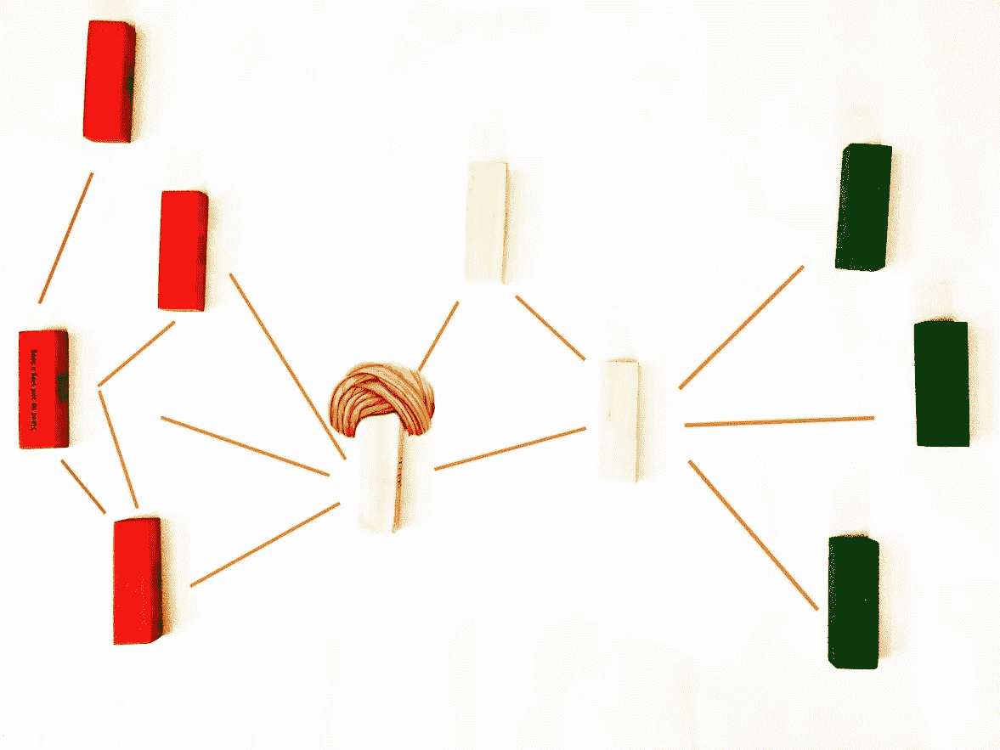
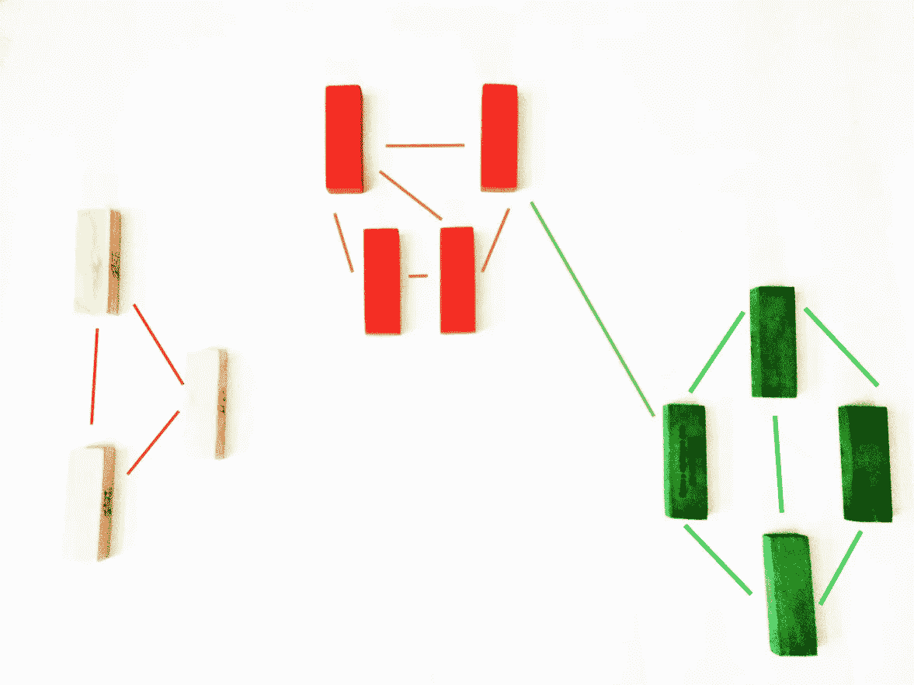
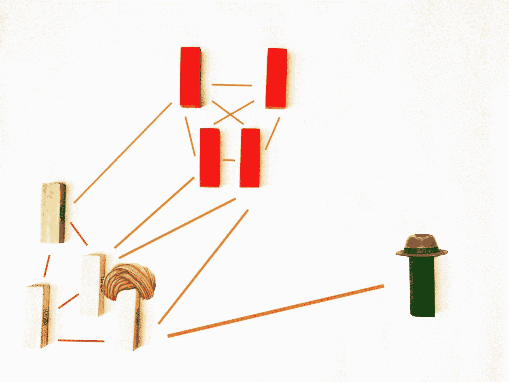

# 人物分析上升。

> 原文：<https://medium.com/swlh/people-analytics-rising-5f8579de8905>

## 工作场所的人际交流模式比我们想象的要多得多。

塔塔咨询服务公司(TCS)在最近的一项调查中发现，目前所有数据科学投资中只有 5%投向了人力资源。这一比例对于增强和维护公司最大的资源——人——来说微不足道。

《哈佛商业评论》最近发表的一项研究表明，70%的公司将人员分析作为重中之重，这与塔塔咨询服务公司的研究形成鲜明对比。线索可能在德勤的另一项研究中，该研究揭示，尽管对人员分析感兴趣，但只有 9%的公司对推动公司内部绩效的指标有任何线索。

从人物分析中受益最大的公司和那些苦苦挣扎的公司(包括绝大多数财富 500 强公司)之间的区别可能是人们很少听说的人物分析的分支，称为*关系分析*。

## 超越属性分析的人员分析

虽然大多数公司花时间试图找到单个员工的动机和指标，但在使用人员分析方面取得巨大成功的公司正忙于解决团队动态的难题——组织内关系的相互作用如何推动企业和员工的绩效和长期收益。

虽然属性(静态的(肤色、种族、性别)和动态的(教育、年龄、通勤时间、缺勤天数等)都很重要，但只有结合每个员工的关系方面，它才能揭示洞察力。

几十年的研究令人信服地表明，研究员工之间的关系——关系分析，结合种族、性别多样性和教育等属性，可以以有趣的准确性解释员工的表现。

关系分析的原材料来自电子邮件、工作聊天和其他人与人之间的在线交流。*一家公司的数字废气。*

被简单忽略的数据可以被挖掘为珍贵的宝石，揭示是什么让人们(以及团队和组织)工作！

根据保罗·莱昂纳迪和诺西承包商的一项研究，成功的关系分析的关键是找到“*结构签名*”:与不同水平的性能相关的数据模式。他们的研究进入了关系分析的第六阶段。

# 1.思维能力

这个签名预测谁更有可能想出好主意。

通过研究组织内部的沟通模式，你可以找出在核心团队之外沟通最多的员工。从统计数据来看，这些员工比那些只在核心团队内部交流的员工更有可能提出更好的想法。

The yellow turban clad member has a network that spans multiple teams.

那些拥有多种联系的人可以被称为“经纪人”，他们对公司有更广泛的了解，并且能够利用公司某个角落的发现来解决另一个角落面临的问题。这些人将两个或更多团队的好想法结合起来，创造出更好的想法。

社会学家开发了一种方法来衡量谁更有可能提出更好的想法，这种方法被称为*约束。*

约束条件反映了一个人在收集独特信息时受到的限制。对律师、软件工程师和金融分析师等不同领域的人进行的一项又一项研究表明，约束少的人，也就是说，在交流中不受紧密骑士网络束缚的人，更有可能提出对组织有价值的更好、更新颖的想法。

没有一个单一的属性比具有低*约束*的属性更接近预测思维能力的强相关性。

这项研究得到了许多组织的重视。事实上，开放式办公室背后的整个理念是促进不同部门员工之间的合作。谷歌已经开始从头开始设计他们的办公室，提供“随意碰撞”。

以下是谷歌土木工程师大卫·拉德克利夫和保罗·戈德伯格的对话片段:

> 于是，弯曲矩形的布局出现在公司坚持的平面图上，这将最大化拉德克利夫所说的“劳动力的偶然碰撞”根据拉德克利夫的说法，在这个 110 万平方英尺的建筑群中，没有一个员工与其他员工的步行距离会超过两分钟半。“你不能安排创新，”他说。“我们希望为人们创造机会，让他们有想法，并且能够对在场的其他人说，‘你觉得这个怎么样？’"

An office designed for ‘casual collision’ Image: smartfurniture.com

# 2.影响

影响力签名预测哪些员工在组织中处于更好的位置影响变革。

研究表明，影响力较高的人不是人脉最多的人，甚至不是公司的高层领导，而是人脉更广的人。研究表明，拥有更强(而不是更大)网络的人有助于传播想法(而不仅仅是最快)。据说这些人表现出更高的总体突出度。

The yellow turban clad team member has the strongest influence as his networks are more strongly interconnected than that of his peers.

总体声望较高的人拥有强大的联系，反过来，他们自己也有强大的联系。这就是谷歌搜索算法 PageRank 的工作原理。

加州大学技术管理教授保罗·莱昂纳迪在一家医疗设备公司进行的一项研究表明，能够促使员工更好地遵守新政策的人，不是被员工评为“*最具影响力”*的人，而是那些被关系分析确定为具有更高总体声望的人。

虽然“最具影响力”的人成功地影响了 15%的员工采用新政策，但那些被关系分析确定为具有高度影响力的人能够影响超过 75%的合规性。

# 3.效率

与之前的个人签名不同，效率签名是一个团队签名，它预测哪个团队最有可能高效地完成工作。研究表明，这不是关于识别具有相关技能和经验(优秀品质)的人。

当团队表现出两个个体特征时，效率签名就形成了:*内部密度—* 团队中个体成员的联系有多紧密，以及 2) *外部范围* —显示团队成员的外部联系有多广泛，使其能够获得更多的外部资源。

The team in yellow turban have high internal chemistry and great external networks. Making for a potentially high efficiency team.

简而言之，关系分析通过团队成员之间的化学反应及其利用外部资源和专业知识的能力来衡量效率。

内部密度对于快速建立信任、承担风险和在重要问题上达成共识至关重要。而外部范围，第二个社会变量使一个团队能够接触到一个庞大的专家网络和权力职位，这将提供非常需要的信息和资源，这将允许最后期限被击中。

# 4.创新ˌ革新

创新签名预测哪些团队更有可能提出有销路的创新。这是通过识别内部密度低但外部范围高的团队来预测的。

The folks in blue turban have low internal density but high external range. Potentially a prime innovative team.

低内部密度意味着更高的多样化想法和更富有成效的辩论的可能性。而广泛的外部范围意味着网络将帮助他们分配资源和购买他们的创新。

这里还需要注意的是，创新签名并不等同于构思签名，因为一个构思签名标识了个人，而不是创新签名中的团队。更重要的是，创造一个有想法的团队并不能创造一个创新的团队，事实上研究表明，当尝试时，绩效水平会下降。

# 5.筒仓

与之前讨论的个人和团队签名不同，这是一个组织签名。

一个孤立组织，有多个部门，外部范围很小。

Neither of the 3 teams in the given structural signature has good external range. While team white is completely excluded, team red and green are linked by single nodes.

较低的外部范围意味着工作和支出的冗余、员工士气较低以及创新率较低。这对组织非常不利，关系分析使公司能够识别公司内部的孤岛，以采取纠正措施。

我们可以通过测量一个组织的*模块性来评估它被污染的程度。*模块化简单来说就是内部内部密度与外部范围之比。研究人员认为 5:1 是有害的孤立组织的模块化。

模块化程度超过 5:1 的孤岛式组织甚至可以采取纠正措施，并通过纠正措施(如重新设计办公室、创建共享事件等)来改善协作和合作。

一个模块化比例为 13:1 的非营利组织能够通过任命每个部门的某些员工作为联络人，并每周召开一次主题会议，迫使即使是初级员工也参与到更广泛的组织中来，从而快速打破孤岛。

# 6.弱点

关系分析有助于在漏洞签名的帮助下识别组织的结构签名中的漏洞。

漏洞特征识别作为关键外部利益相关者的唯一联系人的个人。

The crucial supplier is connected by a single point of contact, the yellow turban clad.

这些员工中的任何一个都会耗费公司大量的时间。因此，识别签名并留住员工至关重要，直到公司能够实施继任计划，确保网络的*稳健性*。

如果即使随机删除某些节点，也能保持连接，那么网络就是健壮的。

这里的麻烦是，大多数情况下这些积分节点都是初级水平/一般员工。该公司不会知道是什么打击了他们，直到孤独节点辞职或休长假。这并不是说它们不是不可替代的，它们不仅仅是备份。

关系分析揭示了公司内部的漏洞，以保持健壮性并防止令人讨厌的意外。

# 挑战

一旦你确定了组织中的结构特征，你就可以采取行动了。正如我们所见，可采取的行动从来都不复杂，事实上，通常很简单——管理层面的决策，如召开跨部门会议、留住关键员工或将某项任务分配给某个团队。

那么，为什么大多数公司没有深入到关系分析中去进行绩效管理呢？其中一个问题是，网络分析目前没有描绘出预测性能的模式。

其次，组织没有适当的信息系统来捕获和识别关系数据中的结构特征。但是所有的公司都可以接触到他们的数字废气:电子邮件踪迹、空闲信息、trello 上的项目任务、微软团队上创建的团队，这些平台记录了互动。可以对这些数据进行分析，以挖掘出可以采取行动的结构特征。

另一个直接的挑战是隐私，这需要由人力资源部门小心处理，允许分析他们的数字试验，甚至需要获得交流内容(在极端情况下，将关系分析与机器学习配对)的同意书，以实现关系分析的无摩擦操作。

# 前进的道路

应对隐私问题的一个经过测试的有用策略是定期与员工分享收集的员工数据。这有助于建立信任和透明度——这是防范隐私问题的第一招。

还需要注意的是，研究表明，调查在挖掘结构特征方面效果不佳。人们并不真的知道，或者他们谎称他们应该与谁交流，而不是他们是真正与谁交流的 T2。

由于人类联系的动态性质，最好的方法是定期观察数字轨迹，并将其与机器学习相结合——以便结合从多个来源收集的关系信息，并在个体属性数据的帮助下找出模式。

为了从组织中的人员分析中获得最佳结果，您需要超越属性分析，引入关系分析来找出组织中存在的结构特征。

*总之*，当你用关系数据增加决策过程来分配任务、预测组织实现目标的可能性和计划继任时，你将获得更满意、更健康和更有生产力的员工。

## 如果你喜欢阅读，请鼓掌，让其他人也能发现。👏👏👏

## 订阅获取 feed 上的最新帖子。🌏

## 这篇文章发表在 [The Startup](https://medium.com/swlh) 上，这是 Medium 最大的创业刊物，有+394，714 人关注。

## 订阅接收[我们的头条新闻](http://growthsupply.com/the-startup-newsletter/)。

