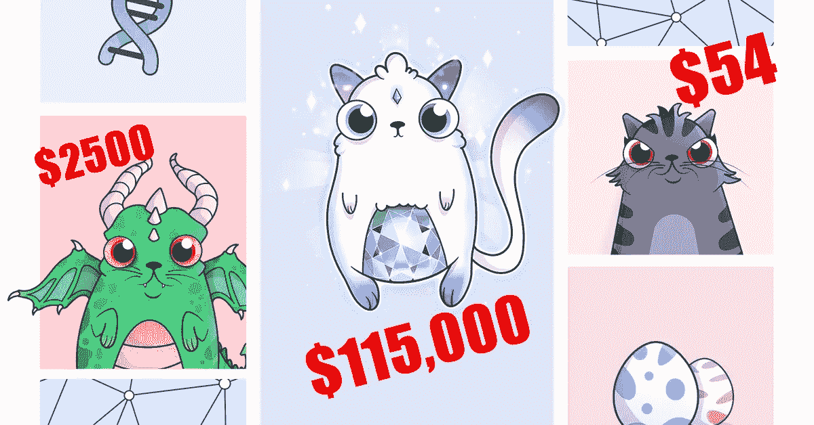
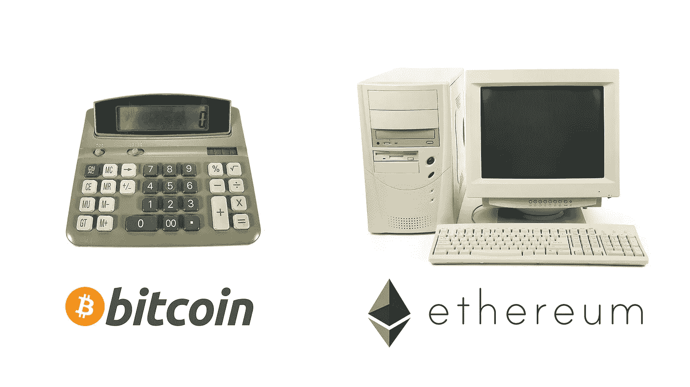

# 人们在数码猫上花费了数百万美元，这就是为什么它是有意义的

> 原文：<https://medium.com/swlh/people-are-spending-millions-on-digital-cats-and-heres-why-it-make-sense-aea431740bcf>

## 密码猫不仅仅是猫。

上周，AxiomZen 工作室推出了 [Crypto Kitties](https://www.cryptokitties.co) ，这是一款基于以太坊的游戏，在这里你可以购买和繁殖可爱的数字猫。

然后，就像互联网上的[每一件猫的事情](https://www.youtube.com/watch?v=zi8VTeDHjcM)一样，它迅速爆发了。到目前为止，人们在这些虚拟猫上花费了[超过 640 万美元。最贵的一只](https://kittysales.herokuapp.com/)[创世猫](https://www.cryptokitties.co/kitty/1)，几天前卖出了 11.5 万美元的天价[。](https://blocksyn.com/digital-cat-sold-for-115000/)

加密猫的流行在网上引起了很多愤怒和困惑。当然，乍一看，这看起来很傻。但是，信不信由你，Crypto Kitties 标志着一场大规模数字革命的开始。要理解为什么，我们首先需要了解区块链、比特币和以太坊。

# 复制粘贴问题

计算机最重要的特性之一是它们可以毫不费力地复制信息。

例如，如果我给你发了一封电子邮件，我的电脑上还有一份副本。与现实世界相比，如果我通过邮件给你寄一封信，那封信就不见了。我不再拥有它了。这封信在世界上只能有一个版本。

在大多数情况下，这种复制-粘贴特性非常好。但在某些情况下，这很糟糕。金钱就是一个很好的例子。

假设我创造了自己的数字货币——称之为*DCash*——并给我的朋友一些。然后，我的朋友复制了一百万次，现在，他想用它买你的车。你会同意以 100 万美元的价格把你的车卖给他吗？

**否**。你会说他的钱一文不值，因为他可以白手起家。

这就是数字资产的悖论，或者我称之为**复制粘贴问题:**要让东西有价值，它们必须稀缺。但是电脑，默认情况下，让每个人都可以使用任何东西。因此，从理论上讲，任何可以在电脑上复制的东西都不应该有任何价值。

这对于货币等数字资产来说是个大问题。到目前为止，我们通过强大的第三方支持美元来避免这个问题:政府、银行、贝宝等。今天，你的网上存款是有价值的，因为你相信你的银行不会偷偷复制你的钱(除了[他们会复制](http://positivemoney.org/how-money-works/how-banks-create-money/))。

那么，如果我们不需要使用第三方呢？

# 进入比特币和区块链

你可能听说过比特币。这种新的数字货币从 2017 年初的每枚 900 美元涨到了令人瞠目结舌的[今天的 14500 美元](https://coinmarketcap.com/currencies/bitcoin/#charts)。

比特币很特别，因为它没有任何银行、政府或公司的支持。那么，为什么比特币那么值钱呢？

答案是**区块链。**

区块链是最近的一项发明，由密码学的突破推动。我不会深究技术细节，但它的要点是:区块链是一种计算形式，你不能复制事物。

例如，如果我通过区块链给你发一封邮件，那封邮件就从我的电脑里消失了。我永远也拿不回来了(除非你把它寄回给我)。就像早先的真实世界的信一样，每个比特币都是完全唯一的。

在区块链的世界里，计算机[代码就是法律](https://harvardmagazine.com/2000/01/code-is-law-html)，比特币代码规定只能创造 2100 万个比特币。目前，地球上每 460 个人只有不到 1 个比特币可用，这还不包括已经永远丢失的比特币。比特币是独一无二且极其稀缺的，这也是它如此值钱的原因。

# 以太坊，区块链电脑

比特币是目前区块链最受欢迎的使用案例，但它远不是唯一的一个。第二个最受欢迎的，以太坊，在我看来更有趣。

你看，虽然比特币只能在其区块链上加减数值，但以太坊是[图灵完成](https://en.wikipedia.org/wiki/Turing_completeness) **，**也就是说它可以进行任何运算。

简而言之，比特币之于老式计算器，就像以太坊之于电脑一样。

I used photos of old devices because both of these projects are still in their very early days.

因为以太坊可以运行计算机代码，所以可以在其上构建应用程序。现在，Crypto Kitties 恰好是最流行的例子。

# 有形数字资产

正如我所说的，Crypto Kitties 是一款基于以太坊区块链的游戏。这就意味着，在游戏中，你买的每一只猫，或者繁育的每一只猫，都是独一无二的，只属于你一个人。

你可能会问，这和其他游戏有什么不同？

嗯，当你玩《魔兽世界》这样的传统游戏时，制作它的公司控制了一切。他们可以完全访问你的角色和物品。在任何时候，如果他们愿意，他们都可以复制、禁止甚至删除它们。在像 Crypto Kitties 这样的区块链游戏中，你拥有自己的资产。

起初这可能看起来没什么大不了的，但是人们关心这个。很多。

这是我的“彼得·泰尔”式的 [*非传统的真相*](http://www.businessinsider.com/peter-thiel-loves-this-interview-question-2014-11) :你拥有这只猫的事实就是感觉正确。这是一个很小的细微差别，但最终，它让世界变得不同。这就是现实世界资产的工作方式，**这也是数字资产的一贯工作方式。**

Above: overpriced scarce valuable assets

加密小猫被称为加密收藏品。它们是为收藏而设计的。从这个意义上说，11.5 万美元的 Genesis Ca t 与 320 万美元的 1909 年霍纳斯·瓦格纳棒球卡或 5200 万美元的 1962 年法拉利 250 GTO 没有什么不同。

我会花那么多钱买一只数码猫吗？不，但我也不会为了棒球卡。然而，归根结底，这些都是极其罕见的独特有形资产，因此对一些人来说极其宝贵。

# 超越密码收藏品

我承认，收集数码猫很傻，但这不是重点。让我们停下来想象一下，这个网站卖的不是猫，而是:

*   魔兽世界物品，
*   房屋，建筑，土地所有权，
*   苹果、亚马逊或脸书等公司股票。

你看到潜力了吗？让 Crypto Kitties 令人兴奋的不是猫本身，而是它展示的可能性。这是一个更大的概念验证。有了以太坊协议，我们现在可以在区块链上创建、标记和自由交易任何类型的资产。这与猫无关；这是关于这项革命性新技术的未来。

我会邀请你尝试一下。前往[www.cryptokitties.co、](http://www.cryptokitties.co,)下载[金属面膜](https://metamask.io/)、[购买一些 ETH](https://www.coinbase.com/join/52ee94d5adea9190a5000094) 并尝试他们的市场。然后，想象一个世界，每个数字和实物资产都像那些猫一样自由交易。

# 一些预测

很多人——包括我——认为区块链是自互联网以来最重要的发明。

区块链改变了我们对电脑的所有认知。通过删除计算机最大的功能之一——复制信息的能力——它为大量新的、真实世界的用例打开了计算之门，这在以前是不可能的。

诚然，饲养数码猫是愚蠢的，而且这很可能是一种暂时的时尚。然而，这标志着一场数字革命的开始。区块链以一种巨大的方式连接了数字世界和物理世界。现在，数字资产可以具有稀缺性等现实属性，而实物资产可以像发送电子邮件一样轻松地进行交易。这是两全其美。

鉴于 Crypto Kittie 的巨大成功，我预测我们将在 2018 年看到许多类似的项目问世，这将进一步推动这一想法。见鬼，我甚至可以用一个比特币打赌，我们会在未来 3 年内在区块链看到口袋妖怪。

想投资 crypto 但不知道从哪里开始？阅读我的购买比特币和其他加密货币的初学者指南。👇

 [## 如何购买比特币和其他加密货币

### 购买比特币、以太坊、莱特币和其他加密货币的完整指南。

medium.com](/@tonyaub/how-to-buy-bitcoin-and-other-cryptocurrencies-ac9e841c6405) 

本文[也发表在 2017 年 12 月 8 日的 TNW](https://thenextweb.com/syndication/2017/12/08/crypto-kitties-perfect-example-blockchain-matters/) 上

## 这篇文章发表在 [The Startup](https://medium.com/swlh) 上，这是 Medium 最大的创业刊物，拥有 271，813+读者。

## 在这里订阅接收[我们的头条新闻](http://growthsupply.com/the-startup-newsletter/)。

