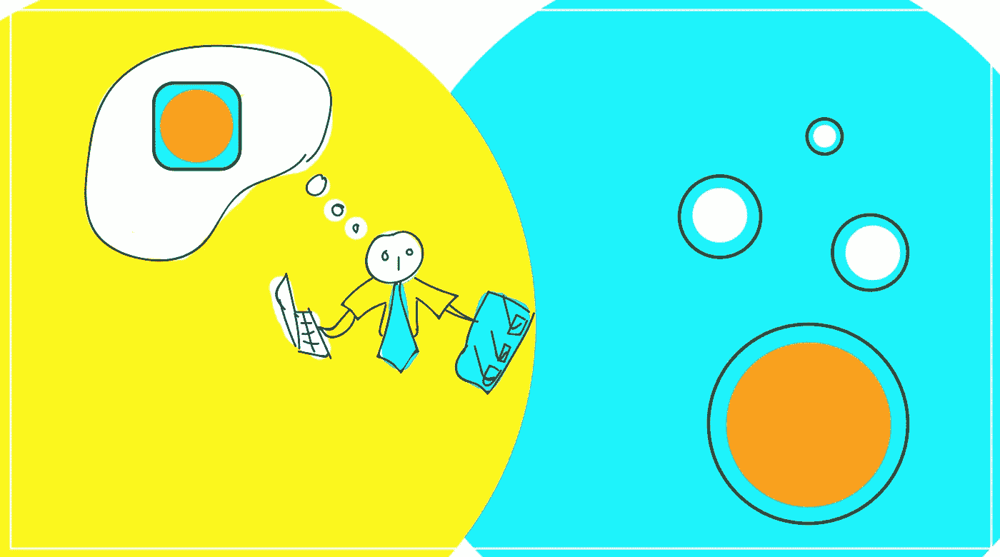
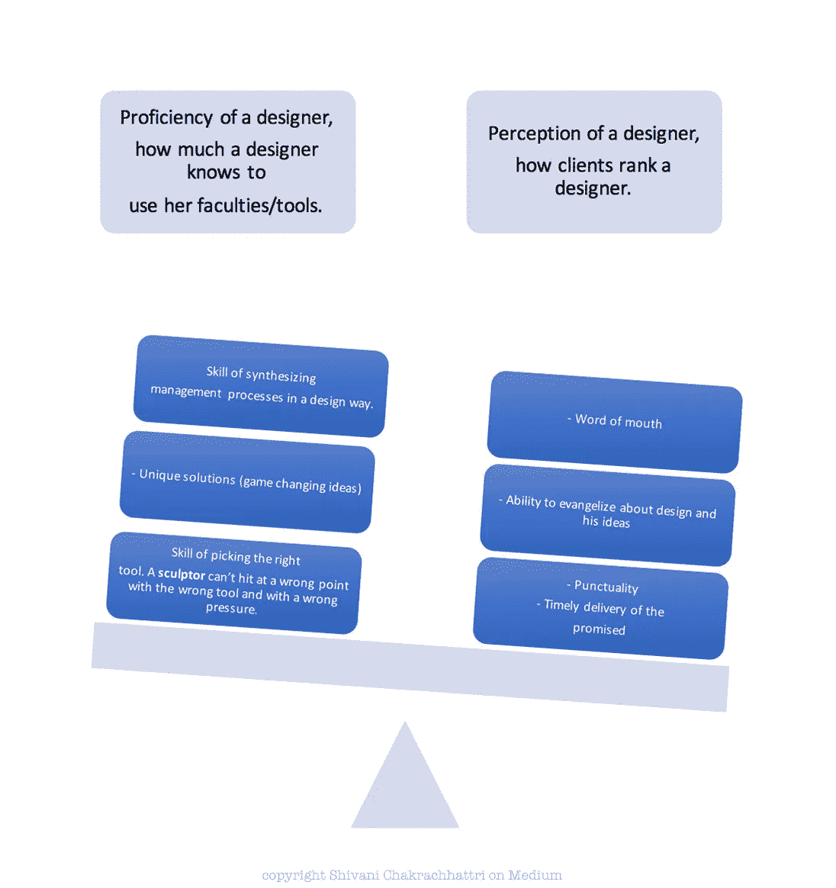
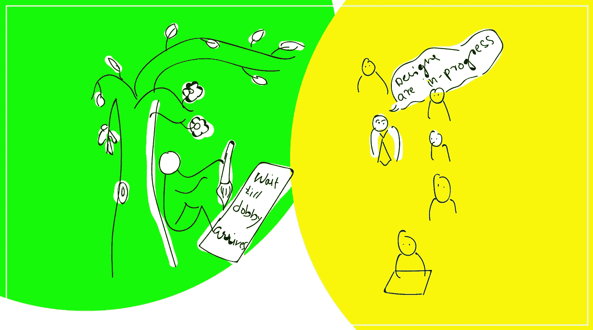
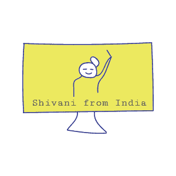

# 感知与熟练:雇佣设计师

> 原文：<https://medium.com/swlh/perception-vs-proficiency-hiring-designers-479c73a30c74>

创意人员接受神的口述。他们这么说。

非设计师会同意，他们在这个过程中大多看不到意义。他们怀着良好的意愿，宁愿选择确定性，而不是这个自称不确定的过程。

而在这两个空间之间就是本文要讲的内容。

对于这篇文章来说，这两个术语是什么意思？

**感知:** *对一个设计师的感知，客户如何给一个设计师排名。*

**熟练度:** *一个设计师的熟练度，一个设计师有多懂得运用自己的官能/工具。*

两者都很重要，但你不认为感知更重要吗？不仅仅是熟练程度就能解决问题？哦！走吧。

**几乎所有事情都是如此。我们不要争论这一点，人类是一种群居动物。**

时至今日，感知的建立可能只是表面上的，主要是因为定期消耗足够多的冗余数据。

最优秀的人才招聘人员仍在学习解码招聘设计师。

关于设计，我们还没有对相关技能形成定量的理解。

目前，就设计而言，人们是凭直觉选择的。
**比其他领域发生的事情更有预感**。

[设计思维](https://en.wikipedia.org/wiki/Design_thinking)是一种制造了如此多噪音的技能，以至于我害怕把它称为我的技能。事实上，我觉得这很有趣。我正在参加[印度制造，CNN IBN 少壮派媒体会议](https://www.youtube.com/watch?v=UzbrfKvMeHk)，主持人被介绍为设计思想家。每个人都声称有自己的“设计思维”过程。

设计作为一种技能，由于其自身的性质，一直是孤立的。

作为一个群体，我们正在进步，但我想可以肯定地说，双方的期望存在一定的不匹配。

— — — — — — — — — — — — — — — — — — — — — — — — — — — — — — —

为了理解一个设计师/艺术家的视角，让我们来听听伊丽莎白·吉尔伯特在她的 TED2009 演讲“你难以捉摸的创作天才”中是怎么说的

*06:10*

人们相信创造力是一种神圣的精神，出于遥远和不可知的原因，从遥远和不可知的源头来到人类身边。希腊人把这些伴随创造力的神圣精神称为“恶魔”众所周知，苏格拉底相信他有一个从远处向他传达智慧的精灵。

— — — — — — — — — — — — — — — — — — — — — — — — — — — — — — —

现在**让我们从首席/厨师的角度来理解这一点**，他必须——必须让管道中的东西运转起来，以提供足够的食物。

**厨师不会等着多比机发号施令。他必须提供更多的基本需求，宁愿放一个没有糖果的盘子。**

— — — — — — — — — — — — — — — — — — — — — — — — — — — — — — —

这种**预期的不匹配**是平均工作发生的主要原因。

对于这种期望不匹配，我没有答案，因为我发现它更像是 WIP，但我可以告诉你我是如何解决它的。根据我在一家创意数字咨询公司的工作经验，我尝试按部就班地工作。每一步都是一个完整的步骤，也就是说，每一步所做的工作都是完整的，为基本流程的运行做准备。

这有助于创造过程不妨碍更基本的过程。从而为多比赢得回答的时间。

我希望这有助于在你的**设计师和你的下一个雇员**的图表中标出分数。

期待您的反馈。

在 work.with.shiva@gmail.com 给我写信。

祝你有美好的一天。多田。

## 这篇文章发表在 [The Startup](https://medium.com/swlh) 上，这是 Medium 最大的创业刊物，有 320，131+人关注。

## 在此订阅接收[我们的头条新闻](http://growthsupply.com/the-startup-newsletter/)。

