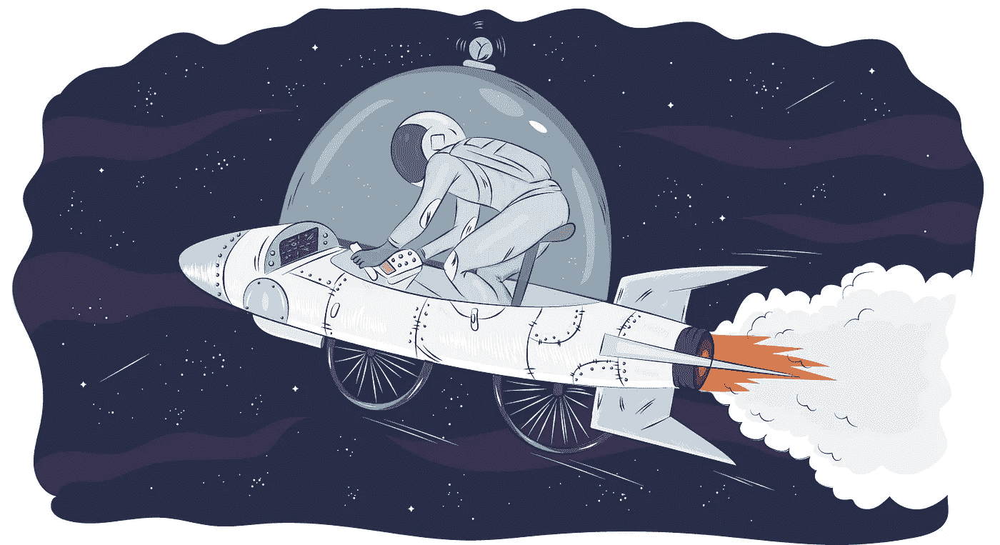

# 完美是无用的

> 原文：<https://medium.com/swlh/perfection-is-useless-345152b24f4a>

## 早期发货，后期改进是一个巨大的竞争优势，但我们的本能经常会妨碍这一点。

我们教给加入 [Semaphore](https://semaphoreci.com/) 团队的初级程序员的最重要的一件事就是小迭代中交付的思维模式。这是一个简单的概念，然而有一个不可避免的误解，源于“小”的主观想法。因此，在实践中，我们需要通过例子来说明我们所说的“小”到底是什么意思。

当你没有经验时，想要做并展示你最好的作品的欲望经常会导致完美主义。在编程中，完美主义往往表现为“我还没有提交我的拉取请求，因为我还没有完成所有的事情”。

完美主义与开发商业软件的目标不一致——给用户一些有用的东西，最好是早一点而不是晚一点。**完美主义者制造想象中的障碍，最终永远也不会建造出任何东西。**

最近，两个初级程序员正在为我们的营销团队构建一个新的报告屏幕。屏幕需要结合给定时间范围内的两个数据源，并呈现结果的分页视图。需要该报告的团队从未见过该屏幕提供的数据。如果报告的第一个版本不包括日期选择器和前 25 名之外的结果分页，会有什么影响吗？当然不是。所以，我们鼓励他们发布不带日期范围和页码的屏幕。最初的结果为改进提供了足够多的价值和想法。当开发人员继续完成剩余的任务时，营销团队可以处理一些数据。

问题的关键在于将一项任务分解成最小的有用部分。接下来，您估计每一个部分的复杂性，并与“涉众”(顾客、客户、产品经理或特性用户)交流期望。

假设一个设计师最近更新了几个影响四个不同屏幕的细节。将这些变更集成到四个独立的拉请求中，还是一个请求中，是最好的选择？这就是需要考虑复杂性的地方，即完成每一项任务所需的时间。如果他们每个人需要一天时间，四个独立的拉请求可能是最好的。如果所有这些加在一起不到一个小时就能完成，那就把它们合并成一个拉请求。三个任务真的很简单吗，但是第四个任务需要休息一天的设计师的额外投入，以及比所有其他任务加起来还要多的时间？最好用你能很快完成的事情取悦你的用户，然后分开做最后一件事。

提前发货往往会给你带来[惊人的反馈](https://semaphoreci.com/blog/2016/11/03/how-bdd-and-continuous-delivery-help-developers-maintain-flow.html)。也许最初的版本是如此之好，以至于没有人真正需要“丢失”的东西。或者，整个想法没有真正达到预期，需要重新考虑。目标是学习和帮助他人。继续前进。

这篇文章最初出现在[旗语博客](https://semaphoreci.com/blog/2017/05/04/perfection-is-useless.html)上。如果你喜欢，👏让我知道，并发表你的想法作为评论。谢谢！

## 这篇文章发表在《T4》杂志《创业》(The Startup)上，这是 Medium 最大的创业刊物，拥有 311，804+读者。

## 在这里订阅接收[我们的头条新闻](http://growthsupply.com/the-startup-newsletter/)。

