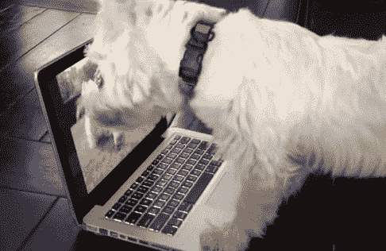

# 角色/用户，我们说的是谁？

> 原文：<https://medium.com/swlh/persona-user-whos-that-we-are-talking-about-6a4b778b2c97>

## 我对什么是“角色/用户”以及行业中使用的“角色/用户”的类型的理解。对此持保留态度，认真对待。

通常在 UX 项目中工作时，每个人都会抛出这样的语句:

"**我们需要创建一个角色/用户，让产品更加健康**(我们是按照角色/用户的要求让产品健康，还是让产品更好——*将这个主题留给另一篇文章*)"

"**这不是角色/用户所需要的**(当我们试图节省开发资源或电话沟通中断时)"

这样的例子不胜枚举…

# 什么是角色/用户？

在这篇文章的这个时候，我知道有 2 种类型被大多数人使用。

# **原型人物**

原型人物角色是使用项目涉众的直觉和对他们的产品如何改善他们的假想人物角色生活的理解而创建的人物角色。

原型人物角色和真实人物角色之间的主要区别(*细分人物角色*)是在考虑原型人物角色时缺乏背景研究。由于这些原型人物角色是在缺乏研究的情况下创建的，随着项目的进展，将会对用户有更多的了解(通过用户访谈、A & B 测试等)。在项目过程中，原型人物可以更新，以更准确地反映所学到的东西。

# 细分角色

细分人物角色是根据不同的需求和/或特征将不同的相似人群(客户或潜在客户)分组的实践。通常通过大规模研究开发，并使用人口统计信息(如年龄、种族或位置)或心理和行为信息(如兴趣、观点、价值观、生活方式、风险厌恶或人生阶段)进行定义。

细分并不提供对用户的洞察，而是提供对更大市场中的用户群的更多洞察。这些小组可以帮助利益相关者和产品所有者区分现有的不同类型的用户，以及这些用户组可能感兴趣的内容。

那么谁来决定角色/用户呢？

是付钱让我们把食物放在桌子上的人吗？

The all powerful stakeholder and product owners

使用产品的人？

The all powerful user that decides the fate of the product

对我来说，答案是两者都有，因为在大多数情况下，产品团队通常只提供一个原型人物角色，作为在很长一段时间内如何构建产品的开始构建基础，直到研究和测试可以在创建 MVP 的情况下进行。但是我们需要理解的是，我们只是在测试用户对产品使用的接受度，比较产品是否挑战了常规，是否与市场上的其他产品具有竞争力。

理想情况下，如果在可以帮助验证在创建原型人物角色期间所做的假设是否有效之后提供细分人物角色，可以使 it 更加健壮，从而减少在产品开发期间浪费的时间，与创建可能用户不再需要手动操作某个流程来运行的更改相比，该产品开发仅寻求增强用户的日常工作流，因为这与他们的新流程无关。

# 摘要

正如我的高级主管一直告诉我的那样，只有一个角色/用户，就像一枚硬币一样，只是取决于你在看硬币的哪一面，是正面还是反面。

## 这篇文章发表在 [The Startup](https://medium.com/swlh) 上，这是 Medium 最大的创业刊物，有 288，884+人关注。

## 订阅接收[我们的头条新闻](http://growthsupply.com/the-startup-newsletter/)。

