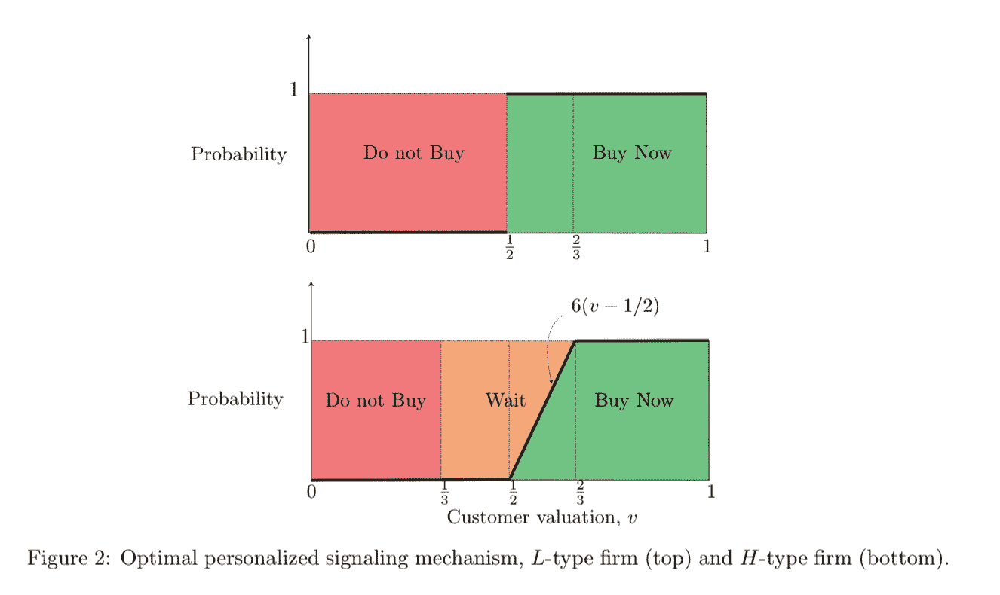

# 说服投资者早期投资你的初创企业:个性化信息的价值

> 原文：<https://medium.com/swlh/persuading-investors-to-invest-early-in-your-startup-the-value-of-personalized-information-e37a01847e4b>

我正在读我的朋友 [Kimon](https://www.linkedin.com/in/kimon-drakopoulos-a5663341/) 刚发表的一篇论文，这篇论文分析了你如何说服顾客以更高的价格更快地购买你的产品**而不是操纵价格**而是完全依靠信息共享。这个策略可以扩展到那些想要(或者不想？)来投资你的创业公司。整洁对吗？

让我(试着)解释一下这是如何工作的:

有三类人:一类是我称之为“注定失败”的人，他们永远不会投资(你知道，这些投资者只是在吊你的胃口)，第二类是等着别人先跳进去的人，第三类是现在就参与你这轮投资的人。

论文中的一个限制，也是你筹资的一个限制，是你不能在筹资期间改变价格(估值)，你需要另一个“技巧”来促使你的投资者更快承诺。

本文从数学上证明了最大化“等待”顾客的价格和最小化他们承诺的时间的最好方法是拒绝一部分顾客。等等，等等，我知道你在想什么。拒绝一些投资者会造成一种“排他性”的局面，迫使所有人快速行动。实际上更复杂。本文的亮点在于以下几个方面:

1.  你应该**永远不要**把你所有的投资者(客户)放在同一个邮件列表中，并尝试作为一个整体与他们交流
2.  不拒绝任何投资者(客户)实际上会使你的机会减少 8.3%

我们来做一个思维实验。

你正在为你的创业公司筹集新一轮 100 万美元，你有 100 名天使投资者，分为三组。最低限额是 10 万美元，因此你可以有最多 10 个投资者和最少 1 个投资者(即 100 万美元)。

A 组，是以前从未做过创业投资或者不太适合你创业的那一组。一开始我称这个团体为“失败的事业”，但现在我决定称他们为“失踪的人”。

C 组是一个非常合适的小组，了解你个人，以前投资过，可能是以前创业公司的投资者。这个群体随时会投资。

B 组，是会等到更多人参与或者等到更好的估值出现的那一组。这是我们需要优化的群体。

论文证明了最优策略是你需要和 B 组的每个人单独谈话并且**拒绝**其中的一些人。

> 第一个与直觉相反的发现是，你实际上需要拒绝一些投资者，才能让这轮交易进行得更快。

这是它的工作原理。

B 组知道一些投资者会被拒绝，因为投资者比空位多。别忘了，你有 100 个投资者，只有 10 个席位(最好的情况)。

这意味着他们需要快速行动。如果你决定不拒绝任何人，这意味着没有人拥有“特权”信息，所以他们没有动力继续下去。

淘汰一部分投资者，剩下的就要决定是否继续。根据他们所掌握的信息(他们被批准了)，他们要么拖延时间，错过机会，要么继续**利用他们所拥有的信息优势**。

这篇论文非常详细地探讨了个性化信息是如何造成一种不平衡的，你的读者必须利用这种不平衡来获得最好的结果。

带走:

当涉及到你的投资者时，使用个性化的信息，消除其中的一些。从统计学上来说，从长远来看，你会过得更好。

PS:本文指客户，非投资者。也许适用。也许不是？

PS2:这种假设是投资者试图最大化他们的回报，并利用尽可能好的信息获得最好的交易。我见过很多投资者，但这并不总是正确的:)

[**乔恩五世**](https://www.linkedin.com/in/johnvlachoyiannis/) **在 4300 年建造了第一个传送装置，并经常回到过去谈论将改变未来的事情。或者过去。在他的旅行中，他建立了** [**史诗般的公司**](http://agentrisk.com) **，投资** [**令人敬畏的公司**](http://tradingview.com) **和** [**创造了一台支付他账单的机器**](http://agentrisk.com) **。**

你可以在斯坦福大学、联合国、各种科技和创业活动以及他最喜欢的星球 KOI 7711 附近找到他的演讲。

## 如果你喜欢这个故事，请点击👏按钮并分享，帮助其他人找到它！欢迎在下方留言评论。

## 这篇文章发表在 [The Startup](https://medium.com/swlh) 上，这是 Medium 最大的创业刊物，拥有 335，210 多名读者。

## 在这里订阅接收[我们的头条新闻](http://growthsupply.com/the-startup-newsletter/)。

