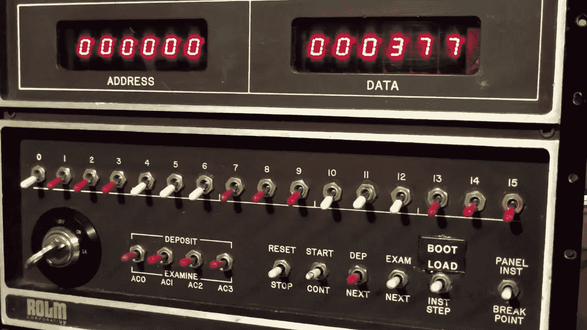
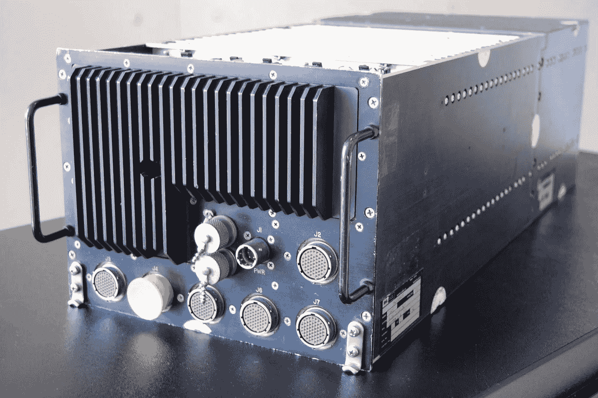

# 我在意见箱里放了一张纸条，它改变了我的生活

> 原文：<https://medium.com/swlh/peter-the-cable-guy-6578fa1ea91b>

## 从工厂生产线到工程师

[Unsplash](https://unsplash.com?utm_source=medium&utm_medium=referral)

80 年代初上大学时，有一年夏天我做了两份全职工作。第一次是在麦当劳，每小时 2.95 美元，就像我这个年龄的大多数孩子一样。但第二次是在雷神公司为 SLQ-32 舰载防御系统焊接计算机电缆——同样的系统在 1987 年美国军舰斯塔克号遇袭，37 名水兵丧生时莫名其妙地无法运行。那份甜蜜的工作每小时工资 4.30 美元。这几乎是我在快餐之外的第一份真正的工作。小时候，我花了很多时间制作无线电设备，现在终于有了回报。

> 小时候，我花了很多时间制作无线电设备，现在终于有了回报。

但是我不满足于制作电缆。在生产车间，我周围的人玩各种很酷的电子产品玩得更开心了。我非常想参与其中，但是我没有教育背景，甚至连面试的资格都没有。

每天当我上下班打卡的时候，我都会路过一个意见箱。我从来没有真正注意过它，直到有一次我碰巧停下来，看到一个标志，上面写着他们将把节省下来的 10%支付给任何提出削减生产线成本想法的人。很高兴知道。我会记住的。

我继续建造电缆。这有点无聊，但我很擅长。后来有一天，我去上班，突然发现很多房间里都堆满了准备运往生产线的空雷达罩——比我以前见过的多得多。但也有其他不同之处，它们都涂上了沙色迷彩，而不是通常的战舰灰。墨西哥湾发生了一些事情，该公司显然刚刚获得了一笔巨额合同。这意味着——更多的电缆。

## 通过检查

我们制造的一些电缆内部有多达 100 根单独的彩色电线；每个都需要焊接到连接器两端的正确端子上。因为即使特别小心也很容易出错，所以质量控制检查员使用了复杂的电缆测试设备来帮助验证所有细小的电线都连接到了正确的位置。每个测试者是 2500 美元。

更多电缆的合同意味着他们需要更多的人和更多的电缆测试人员，确切地说是 20 名新测试人员。这让我开始思考。我敢打赌，我可以用不到他们现在支付的一半的钱来做这些测试员，其中的 10%将通过建议计划为我带来 2500 美元的丰厚奖金。

Rolm Rugged Nova 1602, circa 1980

## 我可以建议吗

这很令人兴奋。我做了一些研究，花了整个周末起草了一个价格适中的电缆测试仪的蓝图，它具有我们需要的所有功能，没有我们不需要的功能。毕竟，现在我已经是制作电缆的专家了。我觉得自己就像空手道小子——上蜡，下蜡。

> 我所能做的就是等待，想知道他们多久检查一次箱子。

周一早上，在我上班之前，我紧张地把海报大小的蓝图折叠成尽可能小的尺寸，以便塞进意见箱的窄缝里。尽管如此，我还是在最后一推时撕开了这张精致的纸。然后我所能做的就是等待，想知道他们多久检查一次这个盒子，或者他们是否会费心去检查它。

大约两个星期过去了，一位我从未谋面的工程师来到我的工作站，说他被指派评估我的建议。嘣！他的名字叫吉姆，原来是他设计了我们正在建造的电缆——所以他是检验我的发明的最佳人选。

吉姆让我向他介绍设计和我的一些决定。他建议做一些小的改动，并告诉大老板们这个想法看起来很有前途，我们应该试一试。我已经在数我的奖金了。

来自电子实验室的一位名叫杰里的技术员被指派建造原型。我希望自己建造它，但杰里是这种事情的“他们的家伙”。杰里和我是在排队等候午餐车时偶然认识的，每天当工厂车间的休息蜂鸣器响起时，午餐车准时出现。我毫不怀疑他会做得很好。所以我把我的自我放在一边，继续制作电缆，因为我不耐烦地等待杰里把我的孩子带到生活中来。

没过多久，杰瑞就把我们叫到实验室，指示我们把每种电缆都从生产线上拿下来。当我第一次瞥见包装粗糙的原型时，我的心兴奋得怦怦直跳。我知道它会成功的，因为杰瑞把我们叫过去只是看着它失败是没有意义的。

## 测试，测试

杰里按下电源，盒子亮了起来，我们都敬畏地看着。开关和控制还没有贴标签，所以他给了我们一个快速的参观，因为他抓了一根随机电缆进行测试，并将两端插入嵌入式连接器。

现在，关键时刻到了。他按下测试按钮，绿灯亮了。嘣！一根好的电缆。让我们试试另一个，再一个。现在是一个坏的，看看它是否正确地识别了第一个错误的终端号码。

这是我的设计为了节省成本而故意走的捷径——它只能在预算三位数显示上显示一个错误。但是作为一个自封的电缆生产专家，我知道这就是我们所需要的。

显示器将通过编号的接线端子向上计数，如果发现错误就停止。如果测试持续到最后，电缆是好的。否则，电缆是坏的，并且显示器指示要记录在检查单上的坏线端子的编号。在这一点上，如果电缆有更多的问题也没关系——它们会在下一轮被发现。

> 请给我现金奖金。

它完美地工作了！笑容灿烂。请给我现金奖金。

工程师吉姆同意这是它所需要的一切。我飘飘然。我的生产线主管惊讶地发现，他生产线上的一个孩子竟然用不到 200 美元的零件组装了一台价值 2500 美元的机器。然后他们加上杰里的时间成本，再加上我从未听说过的所谓负担(一般管理费用)，总计 1500 美元——什么？也许杰瑞应该干得快一点。

最后，管理层认为节省 2 万美元不足以激励员工，于是这个项目和我的奖金一起被取消了。

## 随便挑个工作，真的

不管有没有奖金，我仍然是电缆生产线的英雄。就像《壮志凌云》中的汤姆·克鲁斯一样，我不得不选择我的下一个任务——修理微处理器板的计算机技术员。

没那么快。毕竟，我仍然只是一个有线电视的家伙。但在刚刚剥夺了我的奖金后，老板们怀疑地同意让我试试下周开始的夜班空缺。

这是我的工作:

一个 iPad 大小的印刷电路板被组装并焊接在生产线上。每个都有大约 75 到 100 个组件，包括一个 Zilog Z80 微处理器、RAM、ROM 和其他支持逻辑。新的电路板几乎从来没有工作过；总是有不完美和有缺陷的组件。我的工作是通过一系列测试来运行这些板，以确保它们工作正常，并在此过程中修复任何需要的东西。

这些板直接插入 Rolm 1602 坚固的 Nova 计算机(如图所示)；SQL-32 防御系统的大脑。它们充当核心计算机和我非常喜欢建造的电缆之间的数字接口，这些电缆依次连接到系统其余部分的各种传感器和控制器。

现在澄清一下——我一生中从未接触过任何这类东西，也没有任何使用惠普示波器或逻辑分析仪的经验。我永远也买不起那种昂贵的设备。

## 假装直到你成功

电视上有个广告完美地概括了我的情况。我不是真正的技术人员，但我昨晚住在快捷假日酒店；或者我在电视上演过，或者类似的。最重要的是，这完全是虚张声势，很有可能对我不利。但这是我的机会。

> 这完全是虚张声势，很有可能对我不利。

幸运的是，我有一些有利条件。首先，这些是 Z80 板。在过去的一年里，我在家里花了无数的时间来学习这种微处理器和传统上与它配套的大多数组件。就我而言，这是一个简单的[布瑞尔兔子](https://en.wikipedia.org/wiki/Br%27er_Rabbit)游戏，我已经准备好被扔进荆棘丛。

至于惠普的设备，我告诉我的新老板，我过去用过更老更便宜的型号(完全是谎言)，我只是需要把手册带回家过周末，仔细研究一下差异。

最后，他们没有其他人上夜班，他们对微处理器一无所知。我周围的其他人都对模拟和微波感兴趣，而我对此一无所知。当然，一开始我会有一点磕磕绊绊，但结果是，我和白班的那个人修理的电路板一样多，所以没有人知道我实际上是在学习。

我从来没有完全理解为什么我能从一开始就跟上白班的人。唯一合乎逻辑的解释是他在偷懒。

> 我多么想得到一个键盘啊！

没过多久，我就成为了修理电路板的专家，并开始编写自己的测试软件。那时我们没有软盘驱动器；他们对这个世界来说还是相当陌生的。相反，我们使用拨动开关和纸带阅读机来加载代码。我多么想得到一个键盘啊！

## 我的新道路

最终，我的人生道路完全改变了，因为我提出了一个在工厂生产线上节省几美元的建议。在那之前，尽管我对电子和微处理器非常着迷，但我从未想过要成为一名工程师。我想成为一名摄影师。

我把这次经历归功于我对计算机和编程的热爱。在大约六个月的时间里，我从一名电缆工变成了一名全面的技术人员——全靠自学。此后不久，我在一家名为 [ComDesign](http://www.peteravritch.com/portfolio/comdesigntc500) 的小型初创公司找到了一份工作，并在设计采用英特尔 8088 处理器的主板的工程团队中获得了一席之地；Z80 的继任者。

想想看，这个大学辍学生现在正在设计微处理器板，大约 18 个月后，我将去[创办我的第一家公司](/@peteravritch/going-toe-to-toe-with-steve-jobs-a5a2ed686ab5)。

## Rolm 1602 坚固的新星

只是为了好玩，当我整理这篇文章并回忆往事时，我决定看看是否能找到关于我的老朋友 Rolm 1602 Rugged Nova 的任何信息。令我惊讶的是，我在 YouTube 上发现了这个疯狂的[视频，它准确地展示了我的工作站是什么样子。](https://www.youtube.com/watch?v=H0n7YJDdKM8)

在 YouTube 上找到了这个:

## 感谢阅读。如果你喜欢这篇文章，请随意点击那个按钮👏帮助其他人找到它。

## 这篇文章发表在 [The Startup](https://medium.com/swlh) 上，这是 Medium 最大的创业刊物，拥有+383，380 名读者。

## 在这里订阅接收[我们的头条新闻](http://growthsupply.com/the-startup-newsletter/)。

