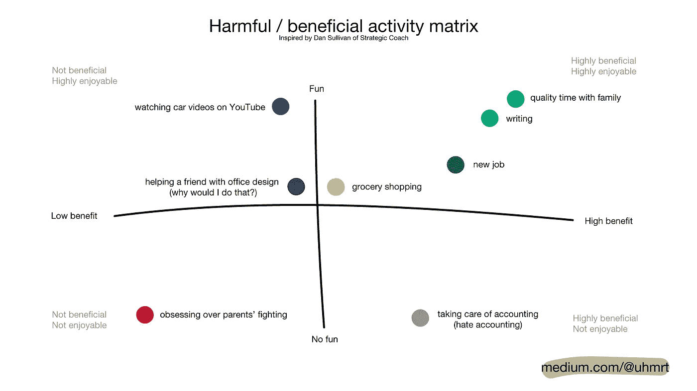

# 负责

> 原文：<https://medium.com/swlh/pick-your-responsibilities-1bf90de74c49>

## 为什么我会有压力？和上周有什么不同？怎么了?

Photo by [Louis Lo](https://unsplash.com/photos/sKRRxnmYisk?utm_source=unsplash&utm_medium=referral&utm_content=creditCopyText)

我最近感觉压力很大。通常，我不会意识到有什么不对劲。因为我一直试图变得更加清醒，所以我不再忽视这些感觉。

昨晚，我对女儿不耐烦了。她今天心情不好，事实证明，我也是。

我们一起度过了一个晚上，我累了一天，她会为每一件小事而激动。当她意识到自己的“哭的力量”时，她正在进入那个年龄是一回事。我知道她今天过得不好，所以保持了我的姿势。

“为什么我会有这种感觉？发生什么事了？”

我逃到另一个房间，放慢脚步，进行反思。我深吸一口气。

“我需要冷静下来。我的女儿是我的第一要务。我的责任是无论如何都要保持冷静。我的责任是向她表明，我们冷静理智地处理困难时刻。”

毕竟，从我的角度来看，这个时刻是艰难的。如果我表现出紧张，她不会理解的。我马上回到房间。

没有足够的时间反思。在她睡着之前保持冷静就足够了。我去我的日记分析和重组。

## 但说真的，到底发生了什么？

是什么导致了这种焦虑？上周我感觉很好，*有什么不同？*

战略蔻驰公司的创始人丹·苏利文介绍了影响我们实现目标的三类活动。

**第 1 类——令人沮丧且有害**

这些活动对我们内心的满足最有害。关心那些不在我们控制之下、没有价值也不令人愉快的事情。例如，如果我沉迷于爸爸妈妈吵架，这将使我沮丧和注意力不集中。它是不可控的，压抑的，有害的。

**第 2 类——消极和有益**

有时候我们不得不做一些只需要完成*的事情*。对我来说，会计、汽车维修、预约医生和其他差事都属于这一类。在某种程度上，它们是可控的——对某些人来说，我可以雇一个助手；对于其他人，我可以重新安排一个更轻松的时间。它们并不令人愉快，但无疑是有益的。

**第 3 类——享受和有益**

Benjamin P. Hardy 认为我们应该消除前两类活动，把注意力放在第三类上。这些是我们喜欢的活动；他们在智力上和动机上都很有启发性。

它们之间存在相关性。我们可以决定对上述所有事情负责。

如果我认为我的父母在他们的关系中有问题是我的问题，不可避免地，它会变得令人沮丧。我对此无能为力，尽管家庭对我来说很重要。我必须放手。

我可以找一份标准的工作，不用担心会计。我对这项任务负责，因为它符合我的财务稳定目标。

> 当你对别人说“是”的时候，确保你不是在对自己说“不”。
> 
> ―保罗·柯艾略

我已经习惯了用很多方式对朋友的求助说好。关于说“不”的艺术已经写了很多。我想继续提供帮助，成为一个好朋友，尽管我必须清楚自己想做什么和不想做什么。

否则会让*双方*都不高兴。我不会喜欢这份工作，也不会做好。*双输的局面变成了双输。*

在这种情况下，最初的想法是，我抑制自己的安慰是有益的。*这是错误的。如果我不喜欢做这件事，有人会做。他们会更有帮助。*

尽管我认为我以前的方法在某些关系中行得通，但它对第一类活动不起作用。爱的行为不可能来自痛苦的地方。

最后，我喜欢写作，我想提高，所以我需要每天写作。*无异常*。昨晚我没能发表，尽管我写了。我必须弥补。我对自己负责。

本·哈迪进一步指出，如果你努力辨别生活中的活动是有益的还是有害的，你就可以开始与你的目标联系起来，变得更加有效和满足。

## 分析

我不得不把它写在纸上。看看我和上周有什么不同，让我感到困扰。

本周，我从新工作中承担了一大堆责任。我喜欢这份工作，它在很多方面都是有益的——它属于第三类。然而，我有点累了，所以我需要在白天集中精力保持精力。我需要计划锻炼。**承担责任。**

我们结束了为期一周的旅行回来，我卷入了父母家的戏剧中。对每个人都不好，无法控制，无益——第一类。**放手。**

我计划了一堆约会，而且我的写作已经落后了。一个好朋友打电话说他需要帮助，我们有一段时间没见面了。第二天我们开了个会，我更加落后了。我本可以在下周计划的——第二类；这是令人愉快的，无益的，但可控的。吸取教训。**承担责任。**

从现在开始，我选择去担心对我有价值的活动。那些在我控制之下的、令人愉快的、与我的目标一致的事情。

我对我的家庭、我们的幸福和我的成就负责。我仍然想帮助我的朋友。它必须来自一个好地方。

## 其他所有东西都必须搬走。

*感谢阅读！*

*在接下来的一个月里，我挑战自己每个工作日发表一篇文章。我写的是我的挣扎，接受和在我的旅程中帮助我的工具。*

请稍候👏如果你对此感兴趣，点击关注。它会帮助我坚持下去。你真棒！

## 这篇文章发表在 [The Startup](https://medium.com/swlh) 上，这是 Medium 最大的创业刊物，拥有 283，454+读者。

## 在这里订阅接收[我们的头条新闻](http://growthsupply.com/the-startup-newsletter/)。

