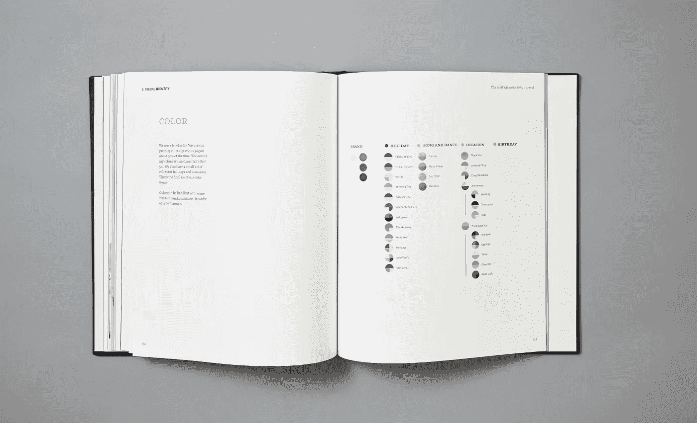

# 为你的品牌选择一种颜色

> 原文：<https://medium.com/swlh/picking-a-color-for-your-brand-7a589c40d950>

在 Focus Lab，我们每年都要处理各种品牌项目，在这些项目中，我们不断遇到这样一个问题…

> "那么什么颜色适合这个品牌呢？"

没有完美的答案，但我会尽我所能给你我对此的想法，并希望帮助你得出自己的结论。

# 在我们谈论颜色之前，我们先来谈谈颜色。单数。

每个品牌都努力捕捉一种独特的颜色来定义他们，作为他们自己的颜色，并立即被识别。

想想蒂芙尼。他们是我心目中最好的榜样。还有其他像可口可乐、约翰迪尔和 UPS。当我提到这些品牌时，你是否立即看到了浅蓝色、红色、绿色和棕色？这些品牌实现了一些人可能无法实现的目标。用色彩来设定大目标是很棒的，但实际上只有很小比例的品牌能达到这种认可度。这不仅仅是因为有很好的颜色选择，还因为品牌是随着时间的推移而建立起来的。开始时，重要的是选择一种颜色，这种颜色有三个作用:

1.  与你的目标受众产生共鸣
2.  捕捉你的品牌的情感和基调
3.  从竞争中脱颖而出

# 与你的观众产生共鸣

重要的是，你要让你的观众在你的品牌体验中感到舒适。例如，如果你的目标是老年人，那么 80 年代的霓虹灯可能不适合你。另一方面，当你瞄准年轻人群时，你的颜色选择会激增。还有一些公司几乎覆盖了所有人(脸书)，所以颜色的选择可以变得更加中性和安全。关键是你应该意识到这一点，并让它开始通知你的决定。也不要忘记文化差异。我们最近与一家总部设在东京的公司合作，并很快发现我们推销的颜色(大胆的粉红色)是色情的国家颜色。不太好。

Buuuuuut…

不要害怕大胆打破常规。改变是好的，你可能会惊讶于你的观众会接受什么。有安全的时候，也有勇敢的时候。你必须找到自己的舒适程度。在我们的项目中，我们在过程的开始大胆尝试。然后，在我们做出最终决定之前，我们会根据品牌的要求将其收回。

# 捕捉你的品牌的情感和基调

思考一种颜色意味着什么总是很重要的。它代表什么，与你的品牌有什么关系？它驱动什么情绪，为什么？色彩心理学这个话题非常有趣，而且最近被广泛讨论。

从潜意识和心理学的角度来看，知道你的颜色选择是否是一个很好的搭配是有帮助的。事情并不总是那么简单明了，但记住这一点很好。例如，某些颜色可能会因为其在自然界中的含义而避免出现在食品品牌中(即黑色=腐烂)。

这里也有扩展界限的空间，但同样，这一切都取决于你的舒适程度。我们相信，如果这个品牌对此无所畏惧的话，上面故事中的粉红色会起作用。客户没有那么自信。最后，我们加入了一些红色。这消除了他们感受到的负面属性，同时也保持了我们想要的效果。

# 从竞争中脱颖而出

这是最难的部分，但并不总是如此。

虽然想要感觉与你的竞争对手不同是有道理的，但颜色并不是他们与你唯一的互动。这可能是一个很大的问题，取决于你是谁，但这不是全部。如果你空间里所有的颜色都被占了，并不意味着你需要随便挑一个颜色。在选择与众不同之前，你仍然需要做对你的品牌、产品和受众最有利的事情。大型科技巨头就是很好的例子。

如你所见，你可以拥有与另一个品牌几乎相同的颜色，同时还能创造出你自己的形象。做对你的品牌最有利的事情，但不要让对竞争和与众不同的恐惧分散你的注意力。一开始这样想是可以的，但是要接受相似之处。

# 所以还有什么好考虑的…

# 我需要颜色吗？

有些品牌甚至不依赖颜色。我们最近为 [500px](http://focuslabllc.com/our-work/500px) 所做的工作就是一个很好的例子。品牌的力量体现在摄影中，因此颜色变得不那么重要。以至于从技术上来说，去掉它更好，特别是对于水印这样的应用，这是徽标的最大用途。

# 扩展后的调色板会是什么样子？

定义品牌中的主色调后，还有两个步骤。

> *“色彩和设计一样，需要层次。”*

首先:定义核心颜色。这有助于建立一个完成大部分工作的基础。这些位于层次结构的最高层。

第二:定义支持调色板。这些将是最广泛的实际颜色集(如果需要的话),并将用于二级 CTA、标注、图表等。并非每个品牌都需要扩展系统，但有些品牌依赖于它们。

A look at the 150+ page brandbook we built to conclude our branding work with the JibJab. They leverage a ton of colors within the brand system.

例如，JibJab 有一系列对他们的营销活动非常重要的重大节日和活动。所以我们围绕它建立了一个完整的系统。所有的颜色在相同的色调和色调内都是有凝聚力的。相比之下，Focus Lab 今天只有四种颜色。红色、灰色和白色。是的，白色对我们来说是一种颜色。

# 我将如何使用我的新调色板？

与选择一种颜色同样重要的是在你的品牌中使用它。设计团队的工作是详细定义在哪里、何时以及如何使用颜色。这有助于保持品牌的一致性和品牌感。不要因为“我们喜欢紫色，这是我们的品牌颜色”，就把所有东西都做成紫色。那不行。

# 最后

颜色是品牌标识的重要组成部分。你想要一种能与你的观众产生共鸣的颜色，抓住你的品牌的情感，让你从竞争中脱颖而出。无论如何这都不是一件容易的事。但是请记住，就像你的商标一样，颜色只是你品牌故事的一部分。它们用来和你的听众开始对话。这种对话将会持续多年。在那个时候，你的品牌颜色的认知度也会提高。

—

焦点实验室是一个战略创意工作室。阅读更多类似的文章，看看我们如何在[Focuslabllc.com](http://focuslabllc.com)一起做出伟大的事情

*最初发表于*[T5【focuslabllc.com】](http://focuslabllc.com/digest/picking-a-color-for-your-brand)*。*