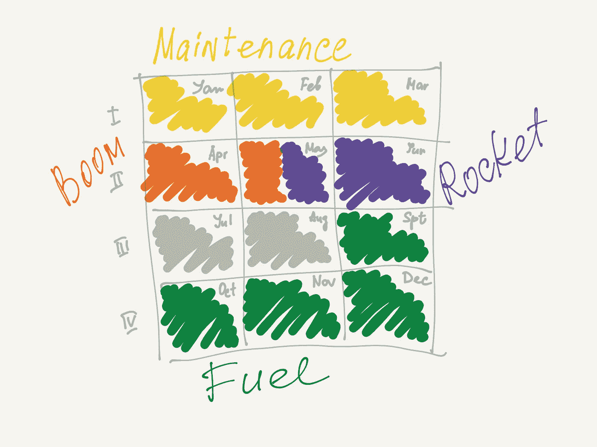
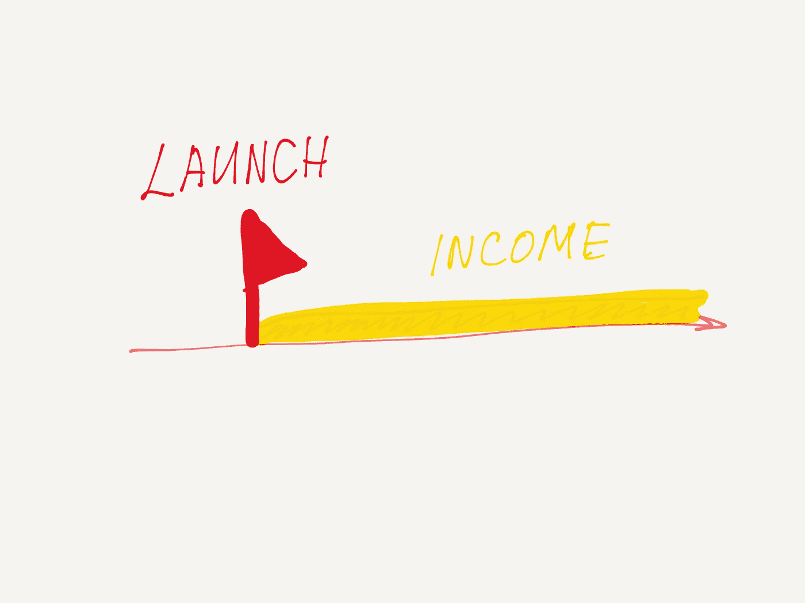
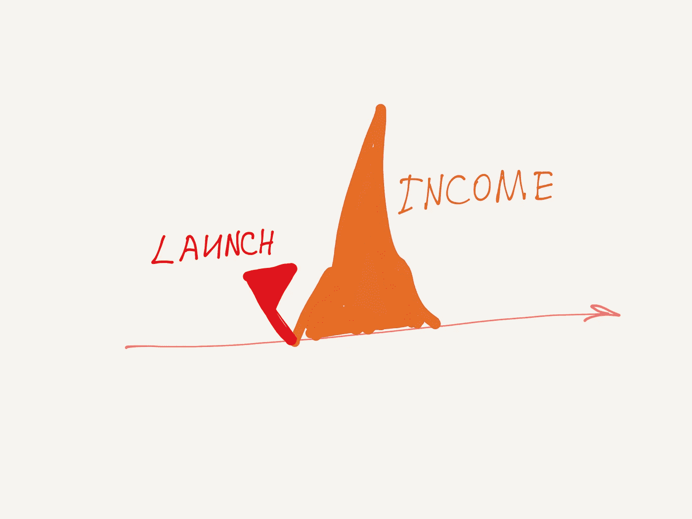
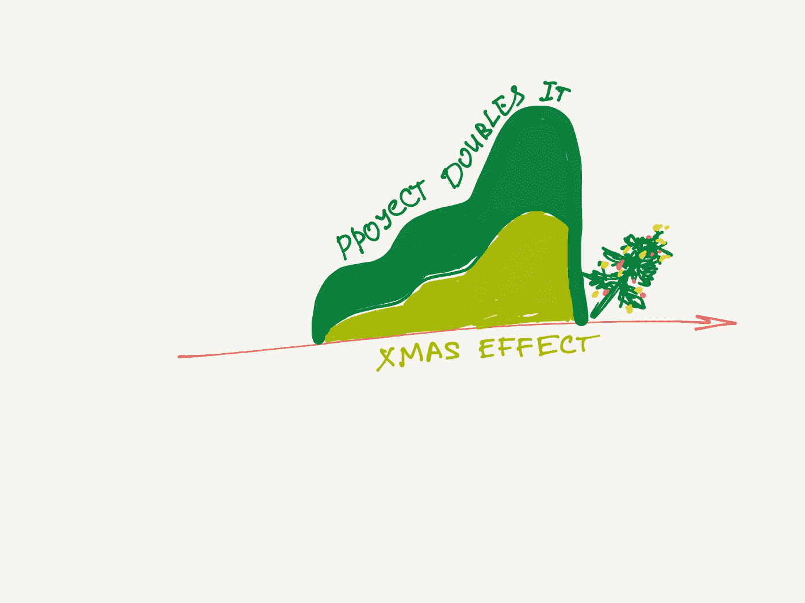

# 挑项目？—看看日历

> 原文：<https://medium.com/swlh/picking-a-project-look-at-the-calendar-dfdb4693b149>

## 如何制定全年的营销、产品和敏捷战略，以获得最佳结果。

在敏捷中有一种信念，那就是你可以在一年的时间里从你的积压工作中稳定地挑选出好的想法，并在你前进的过程中开始为它们工作。这就是你所需要的，伙计们，不需要计划。让任何年度策略都见鬼去吧。

我认为，一个人必须更聪明，提前为一整年做好计划。不一定要提前挑选你要做的项目。但是坐下来，决定全年每个项目必须满足的标准。先做什么，再做什么。这就是我要讲的。

# 第一季度——“维护”项目

第一季度肯定很无聊&全是钱。选择符合以下标准的任务:

—最低投资/最高回报。

—将立即开始创收。所以绝对都是为了钱。尽快谈钱的事。

—将在发布后的很长一段时间内带来收入，无需额外的努力。

例如，你摆脱了网站上的强制注册，从而提高了转化率。只涨了一点点，但是一劳永逸。

让那些任务平淡、原始、无聊。它可以是简单易懂的东西的缩放。没有一个你喜欢的实验。现在，忍耐一下，把那些宏大的项目想法保存到第二季度。

这里的秘密是，这些任务将在接下来的三个季度里一点一点地“喂养”你。如果你在第三季度执行它们，它们会给你带来三倍的收入。

# 第二季度—“繁荣”项目和“火箭”项目

第一季度的项目已经带来了一些收入。但这并不是很多，而且你们在整个第一季度都收到了付款——你们的支出不能等。你的预算不太乐观。

所以现在你必须迅速选择一个一次性的项目，这将给你带来一个单一的“繁荣”的收入。

一个非常酷的推广或类似的东西，这将有助于你获得新的受众。或者这可能是一个会给你带来大量新线索的大事件。你明白了。你的收入图表应该会达到一个巨大的峰值。

这个项目仍然不是你梦寐以求的，但你需要再等一会儿。这是针对突然现金缺口的预防措施(当你没有足够的资金支付员工工资时发生的不幸事件，即使企业整体经营良好)。这个项目的成果将让你通过创造一个财务安全垫来放松一下，同时你终于可以开始思考所有美好的事情了。

如果你一切顺利，在第二季度中期你将能够开始“火箭”项目。

这一部全是关于爱情的，有风险，有实验，有蝴蝶。一些你梦想了很久的东西，一些让你觉得有点像埃隆·马斯克的东西。

What else do you see?— My favourite [street art project](https://www.instagram.com/p/BXH38eLFVT2/?taken-by=zoomstreetart).

这是你的播种时间。你在这个季度种下的种子会成长为你业务的一个新的繁荣分支，并在几年后在数量上超过你目前的收入。但是现在你不知道它会在什么时候以什么方式发生，这没关系。

玩得开心点，但是记住，不会永远这样。一旦午夜钟声敲响…

# 第三季度—不确定性

你可以计划第一、第二和第四季度，但是，信不信由你——你无法计划第三季度。这完全取决于第一和第二季度的结果。如果他们成功了，你可以继续尝试。如果没有，那就做几个低预算的项目，尽可能多的攒钱。

# 第四季度—假期即将来临

惊喜惊喜！对于电子商务项目，第四季度开始于一个月前，即 9 月。是时候为即将到来的假期疯狂做准备了。

在营销旺季，有一条黄金法则:无论你踢什么，它都会飞起来。人们在黑色星期五和圣诞节前的整个 12 月都疯狂。你不能只是坐以待毙，你必须给火焰添加一些燃料。这就是你从九月到十二月要做的事情。

在那个季节，市场部没有假期——这是法律。咖啡、饼干、拥抱和来自经理的爱的光芒，这样压力就不会拆散团队。每个人都应该保持警惕。

第四季度不仅开始得更早，结束得也更早。到 12 月中旬，你已经做了你能做的一切。你可以数钱，布置办公室，为来年做打算。

# 概述

我建议如下:

—首先，你接受一份卑微而卑微的工作，这份工作会给你带来微薄但稳定的收入——**“维护”**项目；

—接下来你接下了一个**【boom】**项目，这个项目会给你带来短暂但显著的收入增长；

—然后你可以开始考虑长远，启动几个**“火箭”**项目；

—最后，为了不破坏旺季，当你的每一个行动都带来双倍的结果时，你要承担**“燃料”**项目。

通常事情都是反着做的:

**—年初**每个人都想有所改变，他们开始建造“火箭”。到第一季度末，他们只是在花钱，不能再这样下去了。所有的“火箭”都被无限期搁置。新的一年刚刚开始，但所有美好的时光都已经过去了。

**—在第二季度**他们开始感到饥饿，因此他们开始进行“维护”项目。它最多会在第三季度初启动。失去了在第二季度从 it 部门获得收入的机会。

**—在第三节**团队开始像疯了一样跑来跑去试图解决问题。只有“繁荣”项目才能进入计划委员会，这样他们才能尽快开始带来收入。在试图解决问题时，每个人都忘记了为旺季做准备。九月过去了。

**—在第四季度**每个人都试图赶上来，但是没有适当的准备，大量的机会就失去了。没有足够的“燃料”,赛季结束得不太好。每个人都工作到 12 月 25 日，但大部分都没用。他们像一群失败者一样庆祝新年。

在这两种情况下，团队都做得很好。但在第二种情况下，他们挣得更少，而且一路上压力更大。这就是我所说的糟糕的季度计划。

*免责声明:每个行业都有自己的季节。有些根本没有现金缺口，有些只是勉强维持，还没有能力发射任何“火箭”。可以理解。你应该制定出最适合你的季度计划版本。*

## 这篇文章发表在 [The Startup](https://medium.com/swlh) 上，这是 Medium 最大的创业刊物，有+ 371，336 人关注。

## 订阅接收[我们的头条新闻](http://growthsupply.com/the-startup-newsletter/)。

