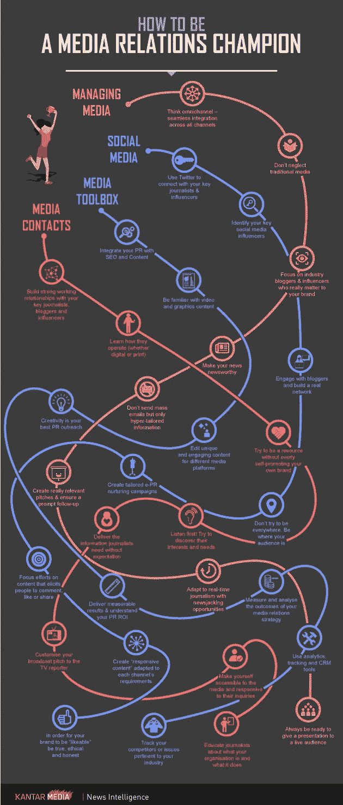
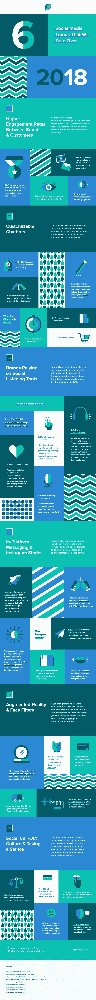
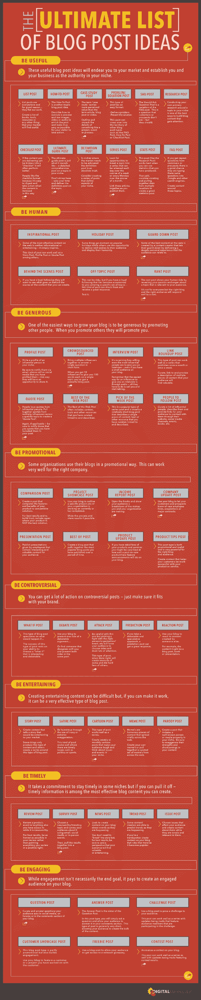
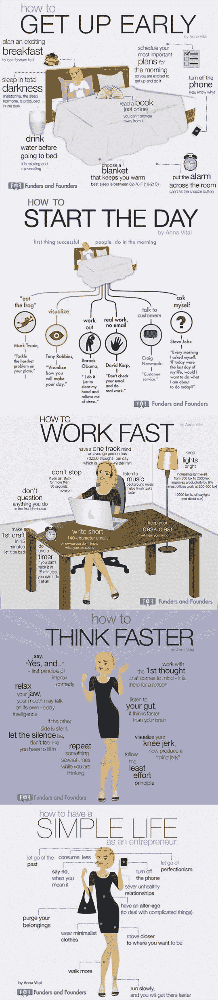

# 公关 Pinterest

> 原文：<https://medium.com/swlh/pinterest-for-pr-1ea0ecfb708a>

## 我不是面包师。我讨厌 DIY 项目。但我最近发现，Pinterest 对企业来说是一个多么神奇的资源。

在过去的几个月里，我一直在“钉”和归档一些主题的信息图，包括公共关系、博客、社交媒体、营销和生产力。以下是我最近最喜欢的四个，它们提供了以下建议:

# **媒体关系**

Source: Kantar Media

这张信息图创建于 2014 年，但信息仍然非常相关。媒体关系不仅仅是推销故事和建立关系——这张图片提醒我，拥有一个深思熟虑的战略和衡量你的成功是多么重要。

# 社会化媒体

Source: Sprout Social

2018 年已经过半，但在我们的业务中，重要的是尝试预测——或至少掌握——当前趋势。例如，这张信息图显示了由于 Instagram 故事的成功，Instagram 上的人气上升。他们指出，Instagram“还没有完成向平台添加功能”,他们是对的——6 月份推出的 [IGTV](https://instagram-press.com/blog/2018/06/20/welcome-to-igtv/) 为品牌提供了另一种试验和吸引粉丝的方式。

# 博客

Source: Digital Marketer

每个人都会时不时地遭遇写作瓶颈，尤其是如果这是一项你必须专业完成的活动。这张信息图提供了一些很好的想法来帮助激发你的创造力，让读者参与到你的帖子中来。如果你能说出我在这篇文章中融入了什么想法，我会加分。

# 生产力

Source: Funders and Founders

最后，我留给你一个生活帮。我经常参考这张信息图——它提供了如何让你的一天更有效率、生活更简单的建议。我尤其欣赏“如何开始一天”和“如何快速工作”的建议——因为工作时太容易分心[(松鼠！)](https://www.youtube.com/watch?v=xrAIGLkSMls)。

快乐钉钉！

你有没有发现对你的工作或个人生活有帮助的伟大“图钉”？如果是这样，请在评论中给我留言！

## 这篇文章发表在 [The Startup](https://medium.com/swlh) 上，这是 Medium 最大的创业刊物，有 344，974+人关注。

## 在这里订阅接收[我们的头条新闻](http://growthsupply.com/the-startup-newsletter/)。

