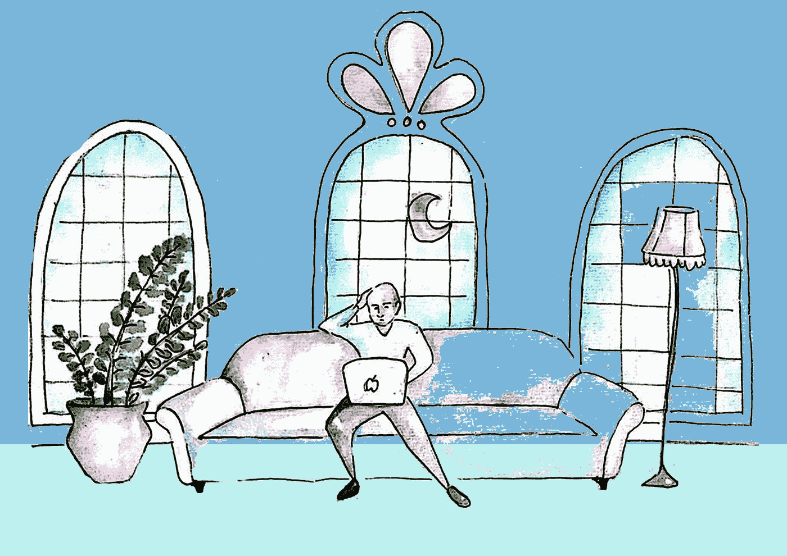
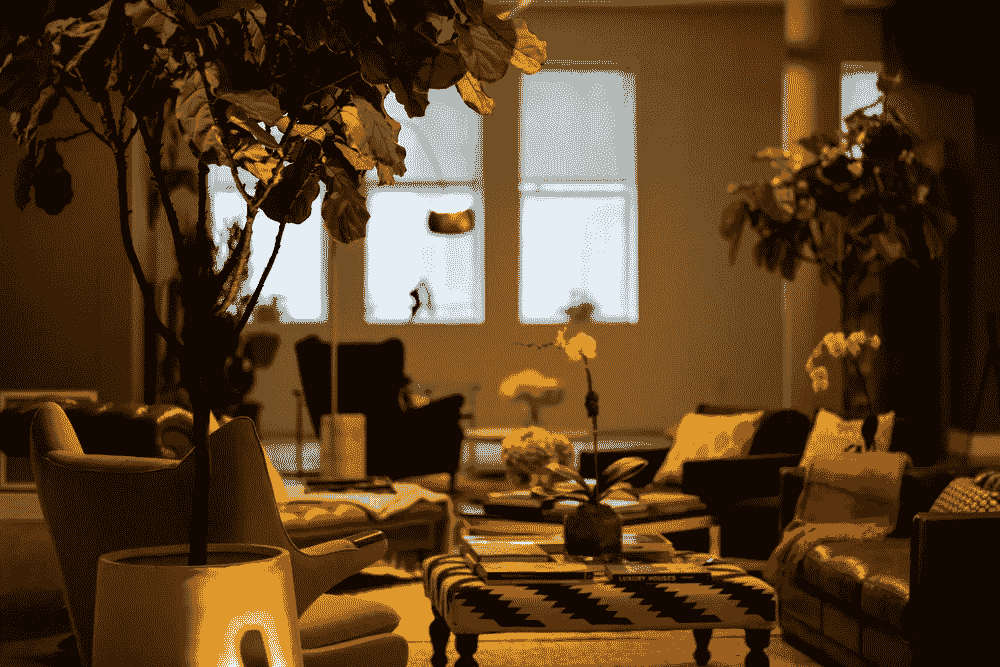
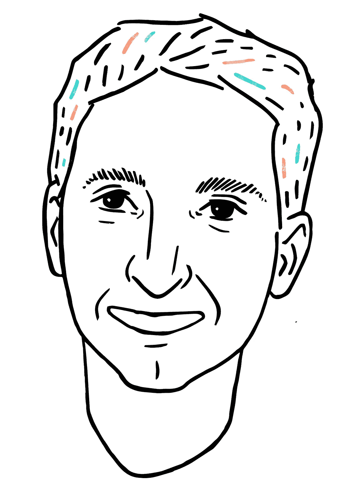
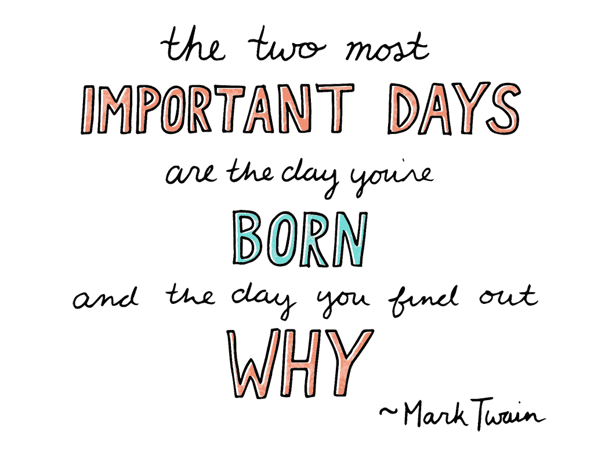
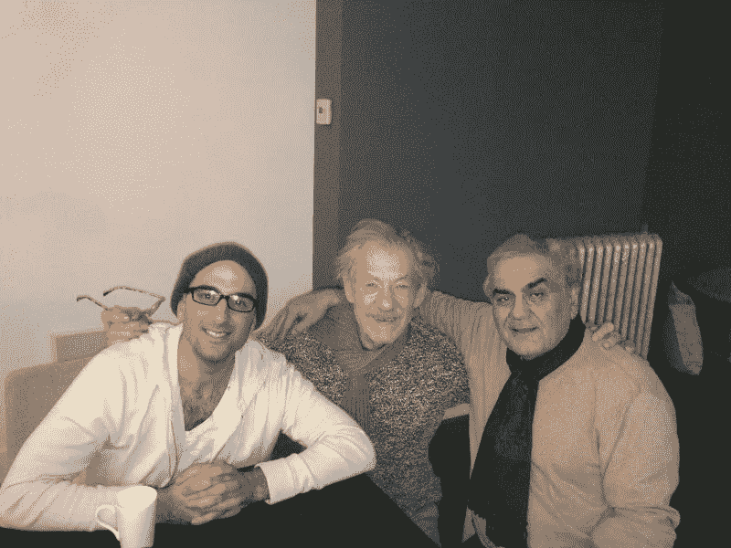
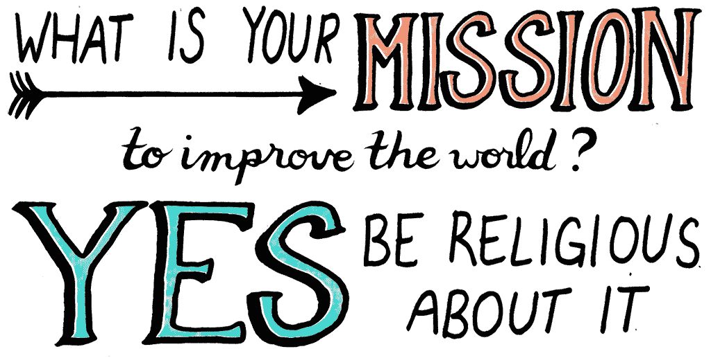
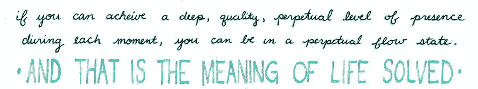
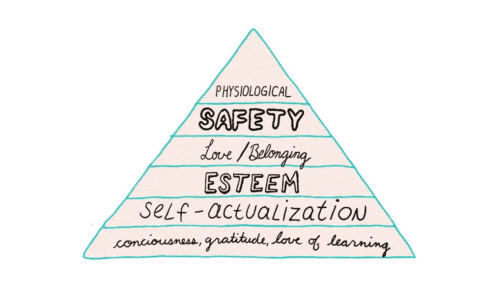

# 迈向有意义生活的支点:习惯和不确定性如何揭示我的企业家使命

> 原文：<https://medium.com/swlh/pivots-to-a-meaningful-life-how-habits-and-uncertainty-revealed-my-entrepreneurial-calling-44ccc74422ef>

Art for NuanceNow

多年来，我读到一些艺术家和企业家找到了他们的“使命”，但直到我自己有了一个使命，我才明白他们的愿景背后的力量。这终于在八个月前发生了，当时我正在探索我的第三个想法，希望从零开始创造一些新的东西。那时，我已经花光了投资者的一大笔钱，开始意识到自己不适合创业。在纽约独自工作了 15 个月后，我又回到了起点:面对我的同龄人、我的投资者和顾问，他们押注于我的成功，我拒绝让他们失望，还有我的父母，他们认为我放弃一家快速增长的初创公司的高薪工作，投资于如此高风险的东西是愚蠢的。在那个寒冷的 11 月的一天，当我受到召唤时，我害怕我会创造出新的东西，以我的名字命名并向全世界宣布，却只能看到它失败。一种浪费。

Illustrations by Emily May Rose

在意识到拥抱不确定性和培养对自己习惯的更深刻认识会让我走上正确的创业之路之前，我启动并转变了两个想法。我的创业需要的不仅仅是我做过的事情，而是我是谁，以及最终，在创建一个可持续发展的企业所需的时间里，我会成为谁。

这篇文章分享了在我作为一个新企业家的两个“支点”期间，我提出的问题和提供答案的哲学。如果你曾经质疑过你正在做的事情，发现自己在问你为什么做你正在做的事情，或者试图确定你的人生目标，我希望这篇文章能帮助你找到你自己的使命，就像它指引我的那样。

# 我的创业召唤始于这些问题:“我是谁？”以及“为什么？”

在 Bisnow Media，我是一名创始员工，公司的快速发展迫使我迅速成为一名领导者。我有优秀的同事，当我们从一年三次简讯和零次会议发展到 30 次简讯和 300 次会议时，我接触到了难以置信的创造力和创新。在我离开的时候，这个由 4 名员工在 DC 华盛顿州一个朋友家创办的平台已经发展成为北美最大的商业房地产新闻、活动和教育平台，拥有 70 名员工。

在筹集了第一轮种子资金后，我于 2013 年 7 月搬到纽约市，创办了 The House，这是一家思想领袖沙龙，在纽约市顶层公寓的“酷”环境中策划社交体验。召集有影响力的人讨论当天的重要问题是联系人们的一种方式，可能会对世界产生微小但重大的影响。

Photo of “The House” in New York City (Photograph by [Engin Beri](http://enginberi.com/2013/).), where I lived and worked. The couch on the right is where I spent most of my time with my laptop trying to get my startup off the ground.

然而，很快我就意识到我所做的并不适合我。我创办了这家公司，因为我认为一家事件驱动型公司*应该是我的下一步自然选择。但是，即使房子寻求推动讨论和变化，它也促进了奢侈的生活方式和财富。这些不足以让我每天坚持十年、二十年或三十年，而这正是创业所需的时间。*

这座房子的确是一种与他人联系的成功方式，但它不再是我想要的联系方式。最终，我和我的联合创始人决定(友好地)分手。我继续独立运营，但遗憾的是，我不得不解雇我的员工并重组。我以为生活方式、影响力和财富会让我充满激情。然而，我在曼哈顿一个 6000 平方英尺的顶层公寓里生活和工作，会见了纽约市(地球上最伟大的城市！)，但我仍然感到空虚。一个人住在那么大的地方，不得不独自管理所有的工作，这让我意识到，如果没有人分享，大空间会变得多么没有意义。作为一名企业家，我所做的不仅仅是我做过的事情，而是我是谁*。所以问题变成了:*

****我是谁？如果我不知道我是谁，我怎么知道呢？****

**

# *我拥抱不确定的生活*

*越来越深刻地意识到我的习惯，拥抱对我有利的不确定性，最终让我激发了自己的兴奋，而不是压力和焦虑。*

***不确定性=兴奋+成长***

*不确定性促使我变得有弹性和足智多谋。今天，我想象着未来，并且明白事情在不确定的时候实际上更令人兴奋，而不是当你稳定和安全的时候。拥抱不确定性是我认为马克·扎克伯格拒绝雅虎 10 亿美元收购要约的原因，也是 Snapchat 创始人埃文·斯皮格尔拒绝马克·扎克伯格 30 亿美元出售其应用的原因。指挥自己的船更令人兴奋，即使冒着几十亿美元的风险。*

**

*“One of the saddest things that happens with creativity … I think sometimes it isn’t expressed because of fear.Everyone is born very, very, very creative, but at some point it can be scary to try to do something new, that feels different.” *— Evan Spiegel, Founder of Snapchat**

# *利用我的“心流状态”*

*在过去的两年半时间里，从周日到周四，我都是晚上 8:30 睡觉，凌晨 4:30 醒来。为什么我要采用如此严格的睡眠养生法？因为它有助于促进我工作的极度流畅，这需要不受干扰的精神空间。对我来说，早上 5 点比早上 9 点更容易保持平静，因为这个国家的大部分时间都是早上 9 点。“心流状态”是我们“进入状态”时的感觉——这是一种最大的快乐状态，由大脑中多巴胺、去甲肾上腺素和其他神经递质等天然药物的释放引发。当我们全神贯注于某件事物时，就会发生这种情况。这就是为什么“饥饿的艺术家”愿意为了他们的工作而挨饿。我开始注意到我的“流动率”，即创造力的速度和想法出现的快慢，以及“流动分数”，我认为这是衡量你此刻经历的深度的一个指标。考虑这个问题:你在生理上和心理上每时每刻表现出多少？我早晨的心流状态和在逆境中度过一天的挑战激发了无畏的兴奋，而不是压力和焦虑。我背靠着墙，但我仍然能够日复一日地思考、创造和前进。这激励我尽最大努力。*

**观看心流顶级研究者之一的 TED 演讲了解更多细节**

# *我知道了习惯是如何起作用的*

*我研究了我对特定惯例的触发(暗示),并且明白我渴望奖励。我把习惯循环应用到我做的每一件事上，借助查尔斯·杜希格的书，《习惯的力量**，**增加了我的整体意识。下面是“习惯循环”:*

**

*当我观察我的习惯时，我注意到了我所做的事情的因果。例如，我认识到，当我“为了成功”而刮胡子和穿衣服时，我也保持了更好的姿势，吃得更少，总体上保持了更好的心情。这些成为影响我其他习惯的关键习惯。我现在用习惯循环来思考我做的每一件事，从检查脸书时意识到我的意图，到当我想喝咖啡时是否需要再来一杯。*

# *我意识到掌握“临在”对于工作和生活是多么重要*

*我过去重视金钱和关系，现在也同样重视当下。在场是我们凭直觉学习的方式，也是我们表现最好的方式。随着我在当下的能力提高，我学会了如何适应，更好地应对挫折，并利用我的注意力和焦点。举例来说，我知道，在我完全客观而非情绪化之前，不要做任何决定。这适用于每件事，从我的创业到每次打网球时站到底线发球。*

*乔希·怀茨金(Josh Waitzkin)是世界象棋和武术冠军，也是在竞争中保持存在感的伟大专家，他的人生故事帮助激发了电影《寻找鲍比·费舍尔》的灵感。他写道:*

**

# *对学习和出色表现的贪得无厌的热爱*

*虽然帮助他人的概念听起来很简单，但我相信它有一个强大的理由。意识到我想以某种方式帮助人们让我从价值的角度思考，而不是纯粹的财务指标。像甘地这样的强有力的领导人和像埃隆·马斯克这样的企业家过去和现在都不是被金钱所驱使，而是被改善地球和服务人类所驱使。他们的成功虽然不同，但却以巨大的方式帮助了人们:埃隆·马斯克通过 Paypal、特斯拉和 SpaceX 创造了数十亿美元的价值，甘地帮助印度获得了独立。*

*要成为一名强有力的领导者，你不需要成为亿万富翁科技创始人或主要的全球玩家。一个国家的首席会计师也在做着具有根本性影响的伟大工作。“你做什么人家不买；他们买你为什么这样做。你所做的只是证明你所相信的，”西蒙·西内克在他令人振奋的关于激励行动的[演讲](http://www.ted.com/talks/simon_sinek_how_great_leaders_inspire_action?language=en)中说。为什么你认为某个会计师是全国最好的？虽然会计师可能做类似的工作，但该领域的*领导人*知道*为什么。**

*所以我挑战你问自己: ***你为什么要做你现在做的事情？****

**

***那是我经历第一次支点的时候。***

*在更深的层面上思考我的召唤，帮助我认识到让我内心充满热情并给我最大满足感的是我在房子的三间备用卧室里招待行业朋友的那些夜晚。*

*我最喜欢的是和我的客人——企业家、记者和类似行业的创意人员——一起聊天和头脑风暴到深夜的那些夜晚。我帮助朋友、同事和朋友的朋友通过介绍和生意变得更加充实，因为这些介绍通常会带来长期的关系。*

**

*These two visitors to The House were special, as I had my dad visiting while legendary artist and activist, Sir Ian McKellen, stopped by to check out the space. Sir McKellen’s visit was one of those which helped inspire my next pivot.*

*我决定我的自然发展将是通过行业兴趣把主人和旅行者联系起来。我称之为 B2Bnb——就像 Airbnb 遇到 Linkedin 一样——并以新的热情投入到这个新想法中。*

*在四个月内，B2Bnb 的网站几乎准备好了，我开始匹配我的第一个测试主机和旅行者。这种潜力令人振奋。Airbnb 的估值非常高，其他几个网站的估值也接近 10 亿美元。我相信我自己的空间共享网站，增加了专业的网络元素，可以为一个大企业开拓一个独特的利基市场。空间共享公司筹集了大量资金，获得了巨额估值，这令人兴奋。但后来我问自己:我能在接下来的十年里这样做吗？罗伯特·格林在他的《掌握的圣经》中写道:“为了掌握一个领域，你必须热爱这个主题，并且感觉到与它有着深刻的联系。你的兴趣必须超越领域本身，超越宗教。”尽管 B2Bnb 有巨大的财务潜力，但我仍然觉得自己缺乏基本的使命感。所以我问自己:*

*我可以无止境地探索和钻研什么？当我的朋友和家人需要帮助或建议时，他们会找我做什么？*

**

*在过去的七年里，从冥想到电子邮件技巧，生产力和精神健康一直是我的朋友和家人向我寻求建议的话题。这些是我用来领导团队和指导员工的工具，我把它们视为天赋。我读了一百多本关于生产力、禁欲主义、正念和习惯的书，纯粹是为了学习的乐趣，而且经常迷失在创造力本身中，而不仅仅是为了赚钱。事实上，我致力于掌握临在，感觉有点像宗教。*

*我意识到我掌握自我内在存在的使命可以显化它自己来造福他人。我从未像那一刻那样对自己的职业和生活感到如此兴奋。有了这种奉献精神，我知道我可以帮助人们，让这个星球变得更美好。*

**

*Art by Emily May Rose*

*深深的好奇和寻求答案为我提供了做有意义的工作和过充实生活所需的动力和能量。这些技能来自深度在场、提升意识、感恩和掌握注意力。足够清醒的深度意识让我意识到习惯有多重要，学习本身让我成为一个充满激情和热情的人。*

**

***马斯洛的需求层次理论认为，在食物、水、安全和爱情之后，是尊重和最终的自我实现。为了那些努力发现自己天生适合做什么职业的人，我认为我们应该颠倒顺序，从意识、感恩和热爱学习开始。从对你有意义的事情开始，以及你想如何为人类或地球服务。***

*你是否如此热爱某件事，以至于可以忍受“饥饿”去做它？*

**

*我们大多数人从食物到安全再到爱情，如果我们幸运的话，我们有机会实现自我。我们工作五年、十年或二十年来满足前三四个需求，有时是一辈子。*

*我们中那些足够幸运，生理和安全需求得到满足的人可以颠倒马斯洛的顺序，从带着意识、感恩和对学习的热爱接近这个世界开始。如果你的最终目标是创业和经商，那就更是如此。*

*那是我经历第二次转变的时候。*

*我花了十年的努力才意识到头脑是多么有弹性。即使存在安全和生理上的威胁，大脑也能处理几乎所有的威胁。它化障碍为机遇的能力是相当强大的。在《T2》中，障碍在于道路，作者瑞安·哈乐迪指出传奇精神病学家维克多·弗兰克尔在大屠杀期间忍受了集中营的恐怖，并坚持认为有意义的生活来自选择:*

**

# *我的使命:用技术学习和教授存在的艺术*

*我的使命是用文字和技术来教导在场，让它像呼吸一样直观和自然，为尽可能多的人服务。在场让我们有基础来管理我们的注意力，从我们的经历中获得最大的收获，并且更好地管理经历，即使它们感觉“不好”今天，我对我的工作有如此多的兴奋和热情，以至于我被我管道中的想法淹没了。*

****“我们在实践中越是当下，我们在竞争中就越是当下，在会议室、在考试中、在手术台上、在大舞台上……当下，必须像呼吸一样。”—乔希·怀茨金****

#  *把工作当成热爱的劳动，不管成就如何*

*八个月前，我怀上了即将成为 NuanceNow.com 的孩子。我愉快地阅读、写作和研究了心理健康和“正念生产力”，让我的灵感自由流动。因此，我构思并创造了我的第一个产品，它基于我认为是有意义生活的基础的原则，帮助人们将存在的习惯融入他们的日常生活和日常事务中。*

*这种细微差别现在会“起作用”吗？我想是的。我开始相信宇宙是一个非常高效的地方，并且知道如果需要的话，我们所有人都会正确地“转向”下一步。*

**

**感谢阅读。这是我写的第一篇大约 300 字的文章，也是我四年来第一次重新发表。**

*这部电影一开始是 70 页的意识流，后来被压缩到 13 分钟，如果没有罗莎娜克·塔哈维、瑞安·哈乐黛、凯特·李和索菲·莫拉，这部电影就不会如此简洁。*

*[立即点击订阅 Nuance，还可以收到我的个人日常安排和我每天用来实现目标和生活愿景的愿景板。多年来我一直在改进它。它改变了我的生活，我希望它也能改变你的生活。](https://betreatedhowyouwanttobetreated.com/optin-main)*

**

## *这篇文章发表在[《创业](https://medium.com/swlh)》上，这是 Medium 最大的创业刊物，有+ 378，907 人关注。*

## *订阅接收[我们的头条新闻](http://growthsupply.com/the-startup-newsletter/)。*

**