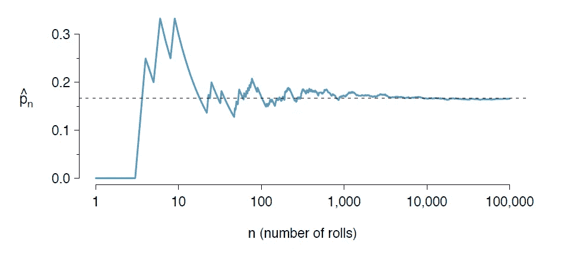

# 玩弄大数法则

> 原文：<https://medium.com/swlh/play-with-the-law-of-large-numbers-d61347acb5a6>

Photo by [Ricardo Gomez Angel](https://unsplash.com/photos/iC0MX40g480?utm_source=unsplash&utm_medium=referral&utm_content=creditCopyText) on [Unsplash](https://unsplash.com/search/photos/math?utm_source=unsplash&utm_medium=referral&utm_content=creditCopyText)

我目前在研究生课程中选了一门统计学课程，因为我们现在正在学习更多的基础知识，所以这很容易。我一直喜欢数学——但现在我发现自己更多地在写作和思考生活(不管是好是坏),我倾向于同时考虑这两个世界。

有什么比把我的想法传播到互联网上更好的方法来测试我的想法是否合法呢？

让我们开始吃吧。

## 一些简单的数学

对于那些讨厌四个字母单词 *math —* 的人，不要担心，我不会用来自遥远国度的奇怪的希腊字母或符号来烦你。

相反，我们将稍微涉及一个有趣的主题，叫做大数定律，并把它和生活联系起来。

这个听起来很酷的定律告诉我们，随着你感兴趣的实验数量的增加，实际结果将会向预期值或理论值靠拢。

本着教授概率的精神，我们将使用掷骰子的例子——似乎所有的数学家都这么做。让我们选择数字 6。滚动 a 6 的理论值是 1/6 或 16.66%，以小数形式显示在下图的 y 轴上。

如果我们第一次掷骰子，我们可能得到 4。如果我们再掷一次，可能会得到 3。如果我们多掷几次，我们可能会幸运地得到 6 分。出于某种原因，自然法则似乎不希望我们一开始就得 6 分。

所以我们转了几百次试试运气。

情况看起来有所好转——只是有些小问题。

让我们滚几万次。希望你有时间消磨。

最终，我们的进展看起来就像我们期望的那样。在下面的图表中，这是随着时间的推移我们的试验看起来的样子。

Taken from my [stats book](https://www.openintro.org/stat/textbook.php?stat_book=reset)

通过足够多的试验，我们的实际值将收敛到我们的预期值——在本例中为 16.66%。有点酷，是吧？

## 一些轻松的生活用品

好了，既然你是数学奇才，那我们就试着把这个原理应用到生活中吧。我能得出的一些结论是:

1.  在你成为明星之旅的开始，或者你新发现的激情，或者你的新爱好，你会有一些好运和霉运。这些的特点是大起大落。
2.  在经历了几百次成功和失败的反复之后，事情开始变得平稳，出现了几次更平稳的高潮和低谷。
3.  在你经历了成千上万次迭代之后，你就是一个经验丰富的兽医了，在你不久前还不熟悉的领域，生活似乎稳定了下来。

有趣的是，也是更实际的是，你的生活可能会受到许多不同的“实验”的影响，这些实验都同时体现了大数定律。这可能是一个很好的方式来反思你目前的状态和未来会是什么样子。

当思考你正在做的副业时，要知道成功和失败的感觉会一直伴随着你。坚持下去是其中的一部分。如果你坚持下去，有足够的时间和精力，你可能会到达你一直期望的地方。

我希望这个数学比喻对你们有意义，因为它们是今天统计课中出现的一些突发想法。它可能会在你新的努力中闪耀出一些观点——我们称之为可以使用一些观点。

感谢阅读。

## 这篇文章发表在《初创企业》杂志上，这是 Medium 最大的创业刊物，有 332，253 人关注。

## 订阅接收[我们的头条新闻](http://growthsupply.com/the-startup-newsletter/)。

