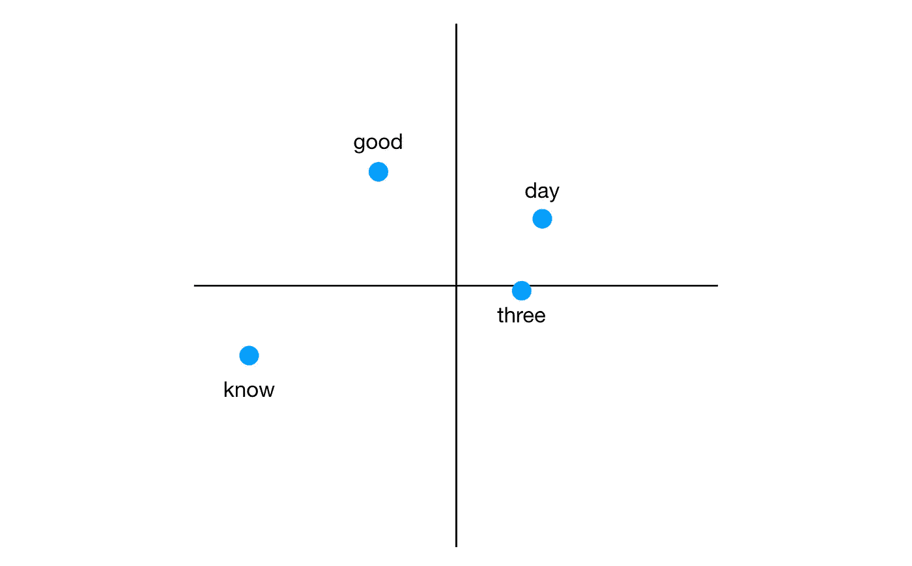
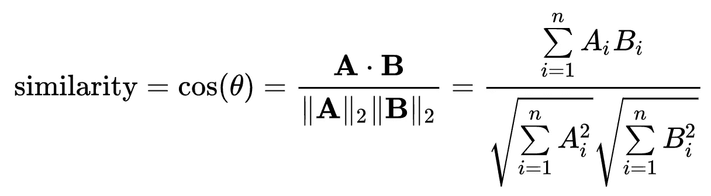
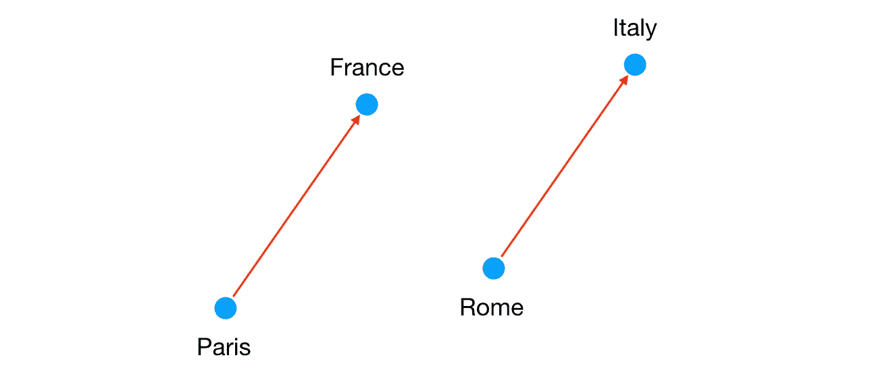

# 玩弄词向量

> 原文：<https://medium.com/swlh/playing-with-word-vectors-308ab2faa519>

在过去的几年中，人工智能领域发展如此之快，关于它的文章也如此之多，你可能已经听说了自然语言处理中一些令人印象深刻的结果。

例如，通过阅读维基百科，程序可以学习完成类比:`man is to king is like woman is to ___?` (queen)。

我写了一个简单的程序来亲眼看看。我很好奇: ***它能回答多难的问题？***

这篇博客是对这个话题的一个非常简单的介绍。我没有训练机器学习模型。相反，我下载了使用 [fastText](https://fasttext.cc/docs/en/english-vectors.html) 库创建的预训练英语单词向量。

## 先看数据

fastText 通过阅读维基百科学到了什么？让我们打开 2GB 文件看一看:

```
good -0.1242 -0.0674 -0.1430 -0.0005 -0.0345 ...
day 0.0320 0.0381 -0.0299 -0.0745 -0.0624 ...
three 0.0304 0.0070 -0.0708 0.0689 -0.0005 ...
know -0.0370 -0.0138 0.0392 -0.0395 -0.1591 ...
...
```

太好了，这种格式应该很容易使用。每行包含一个单词，在 300 维空间中表示为一个向量。如果这是在 2D，我们可以这样想象:



唯一不同的是每个字不是 2 个坐标，而是 300 个。

输入文件中的单词方便地按频率排序。对于我的实验来说，使用最常见的 100k 个英语单词就足够了，所以我将前 100k 行复制到一个单独的文件中。

## 使用 Python 3

为了让我的第一个项目简单，我决定使用没有额外依赖的普通 Python 3。我还使用了 [Mypy](http://mypy-lang.org/) ，一个 Python 的静态类型检查器。

首先，我们将定义一个类来表示每个单词:

接下来，让我们将数据载入内存:

```
words = load_words('data/words.vec')
```

我们已经将文件解析成了一个`List[Word]`。这部分很简单，所以我们将把细节留到文章的最后，直接进入有趣的部分。

## 余弦相似性

现在我们在内存中有了向量，我们可以回答关于它们的各种问题。我的第一个问题是:

> 向量空间中哪个词最接近给定的词？

我们如何计算两个单词向量 a，b 之间的距离？你可能会说“欧几里德距离”，但是 ***余弦相似度*** 更适合我们的用例。这个想法是矢量的绝对长度无关紧要，有趣的是两个矢量 之间的 ***角度。***

来自高中(或维基百科):



在 Python 中:

现在我们可以找到与给定向量相似的词:

我们只需要一些简单的实用函数来打印相关的单词:

是时候尝试一下了:

```
>>> print_related(words, 'spain')
britain, england, france, europe, germany, spanish, italy>>> print_related(words, 'called')
termed, dubbed, named, referred, nicknamed, titled, described>>> print_related(words, 'although')
though, however, but, whereas, while, since, Nevertheless>>> print_related(words, 'arms')
legs, arm, weapons, coat, coats, armaments, hands>>> print_related(words, 'roots')
root, origins, stems, beginnings, rooted, grass, traditions
```

相当令人印象深刻！看起来具有高余弦相似性的单词彼此相关，要么是句法上的(“根”，“有根的”)要么是语义上的(“根”和“草”，“胳膊”和“腿”)。

## 完成句子:巴黎对于法国就像罗马对于 ___

让我们试试更难的。给定两个像“巴黎”和“法国”这样有语义关系的词(巴黎是法国的首都)，还有第三个词“罗马”，我们能推断出“意大利”吗？

事实证明，我们可以简单地通过加减向量来做到这一点！这是因为这些单词的向量在空间中具有特定的关系:



It turns out the red vectors are very similar! We can imagine they represent the relationship “capital”.

令人惊讶的是:

```
vector(“France”) - vector("Paris") = answer_vector - vector("Rome")
```

因此:

```
vector(“France”) - vector("Paris") + vector("Rome") = answer_vector
```

我们将寻找接近`answer_vector`的单词。`answer_vector`不会与“意大利”完全匹配，但应该很接近。

让我们来实现它:

让我们问一些问题:

```
>>> print_analogy('Paris', 'France', 'Rome', words)
**Paris-France is like Rome-Italy**>>> print_analogy('man', 'king', 'woman', words)
**man-king is like woman-queen**>>> print_analogy('walk', 'walked' , 'go', words)
**walk-walked is like go-went**>>> print_analogy('quick', 'quickest' , 'far', words)
**quick-quickest is like far-furthest**
```

**成功了！**🎉通过阅读维基百科，fastText 了解了一些关于大写，性别，不规则动词和形容词(！)再来试几个:

```
English-Jaguar is like German-BMW      // Expensive cars
English-Vauxhall is like German-Opel   // Cheaper carsGerman-BMW is like American-Lexus      // Expensive cars
German-Opel is like American-Chrysler  // Cheaper cars
```

此外:

```
>>> print_analogy('dog', 'mammal', 'eagle', words)
dog-mammal is like eagle-bird
```

**这种模式并不总是正确的**

你将如何完成下列类比？
1。寿司饭就像披萨-_ _ _ _ _ _
2。寿司饭就像牛排-_ _ _ _ _ _
3。衬衫-衣服就像电话-_ _ _ _ _ _
4。衫衣如碗-_ _ _ _ _ _
5。读书就像电视-___

寿司是由米饭和其他配料做成的，比萨饼是由面团/意大利腊肠/奶酪等做成的。牛排是由肉制成的。衬衫是一种衣服，电话是一种电子产品，碗是一种盘子。我们看书，看电视。

让我们来看看答案:

```
sushi-rice is like pizza-wheat      // Makes sense
sushi-rice is like steak-chicken
shirt-clothing is like bowl-food
shirt-clothing is like phone-mobile
book-reading is like TV-television
```

另外:

```
>>> print_analogy('do', 'done' , 'go', words)
do-done is like go-undertaken
```

正如我们所看到的，fastText 并没有把每一个类比都做对。结果令人印象深刻，但当他们错了，他们似乎很遥远。

也许如果我们看看建议列表而不是第一条，会有一些更好的答案？

```
sushi-rice is like steak-
[chicken (0.58), **beef (**0.56), potatoes (0.56), corn (0.55)]book-reading is like TV-
[television (0.68), **watching** (0.64), listening (0.57), viewing (0.57)]shirt-clothing is like bowl-[food, cereal, rice, porridge]shirt-clothing is like phone-[mobile, cellular]
```

在两种情况下，第二个建议真的很好。然而，看起来“衬衫”和“服装”之间的关系仍然是一个谜。

## 结论

当我第一次在笔记本电脑上看到这些结果时，我完全惊呆了。这个程序由几行 Python 代码组成，让你觉得它很聪明，而且实际上*理解*你在问什么。

有一次我尝试了几个难题，我意识到这个程序可能会“犯很大的错误”，这是人类永远不会做到的。这可能会让你觉得这个模型并不聪明。

然而，请考虑这一点:向量是在英语文本上训练的，但与人不同的是，学习算法没有任何英语知识。*在一个* ***几个小时*** 的阅读维基百科中，它相当好地学会了英语语法，以及现实世界概念之间的许多语义关系。给定足够的文本，它可以对德语、泰语、中文或任何其他语言做同样的事情。

一个孩子需要多长时间才能发展出足够的逻辑思维，直到能够回答像这篇帖子中的问题？成人学外语怎么样？用两三种语言做这件事怎么样？人类需要几年时间，而 Word2vec 或 fastText 只需要几个小时。人们的学习方式与这些算法非常不同。人们可以从更少的数据中更好地学习概念，但这需要花费我们更长的时间。

这篇文章的所有代码都可以在 [GitHub](https://github.com/mkonicek/nlp) 上获得。你只需要 Python 3 和[预先训练好的向量](https://fasttext.cc/docs/en/english-vectors.html)来运行代码，自己寻找单词之间有趣的关系。

如果你喜欢这个，请在推特上关注我。

# 附录

我想让这篇文章尽可能简短，同时涵盖最重要的基础知识和有趣的结果。请继续阅读，了解更多详情。

## 一个小黑客

当我第一次实现该算法时，我得到了错误的结果，例如:

```
man-king is like woman-king
```

这是因为计算为`answer = vector(king)-vector(man)+vector(woman)`的答案向量非常接近单词“king”。换句话说，减去“男人”的向量并加上“女人”的向量对“国王”的原始向量没有什么影响，可能是因为那些“男人”和“女人”本身是相关的。

实际上，我得到的几乎所有答案都只是简单地重复了一个输入的单词。我添加了一个 hack 来跳过建议答案列表中的这些冗余单词，并开始获得如上所示的有趣答案。这种黑客行为在代码中被称为`is_redundant`。

更新:fastText 的作者托马斯·米科洛夫[在脸书](https://www.facebook.com/groups/1174547215919768/permalink/1846673885373761/)上回复说，我所做的实际上是一个众所周知的把戏，它是正确的。

## 载体是如何产生的？

我只写了几行代码就得到这些惊人的结果。这是因为所有的魔法都存在于向量中，这些向量是使用 fastText 从维基百科和其他来源的千兆字节的英语文本中训练出来的。还有其他类似于 fastText 的库，比如 Word2vec 和 GloVe。那些图书馆是如何运作的？对于另一个帖子来说，这是一个很大的[话题](https://arxiv.org/abs/1301.3781)，但是这个想法是，出现在相似上下文中的单词应该有相似的向量。例如，如果单词 pizza 经常出现在单词“ate”、“restaurant”和“Italian”附近，则 pizza 的向量将与这些单词的向量具有高余弦相似性。很少一起出现在文本中的单词将具有低余弦相似性，潜在地一直到-1。

## 历史

像 n-grams 和将单词表示为向量这样的想法存在了很长时间，但直到 2013 年[的 Word2vec 论文](https://arxiv.org/abs/1301.3781)和实现发表时，才显示出“以低得多的计算成本实现了准确性的大幅提高”。托马斯·米科洛夫同时致力于 Word2Vec 和 fastText。

我现在才知道这件事，但迟做总比不做好:)

## 为什么在 Python 中使用类型？

我同意 Michael Bolin 的观点，“在为一个大型软件项目选择语言时，静态类型是一个必不可少的特性”。类型帮助我使代码可读性更强，错误更少。即使对于这个小项目，在运行代码之前看到 Atom 中的错误也非常有帮助，节省了我很多时间。

最棒的是 Python 3 运行时接受类型注释。任何人都可以运行我的代码，无需任何额外的设置。在运行代码之前，不需要转换代码，例如在使用带有 JavaScript 的 Flow 时。

## 最佳化

代码根本没有优化，也没有做太多的错误处理。至少，我们可以将所有向量归一化，以使余弦相似度的计算更快(在我的 MacBook Pro 上，一次调用`sorted_by_similarity`来回答一个问题对于 100k 个单词需要大约 7s)。我们应该用 numpy。Python 进程使用了将近 1GB 的内存。我们可以使用现有的实现，它可以简单地加载文件并回答问题。所有这些都超出了本文的范围。我想看看我是否能从头开始写一些非常简单的代码来回答一些有趣的问题。

## 加载和清理数据

下面是`load_words`函数的作用:

`load_words_raw`简单地逐行读取文件，并将每行解析成一个`Word`。我们加载了 100k 个单词，每个单词有 300 个维度，Python 进程使用了近 1GB 的内存(！)—这很糟糕，但我们暂时还能忍受。

`remove_stop_words`丢弃以非字母数字字符开头或结尾的单词，如“inter-”、“thanks”和“- redrose64”。我们剩下 98，648 个单词。

`remove_duplicates`忽略标点符号，因此“U.K”、“U.K .”和“UK”是同一个单词，只存储一次。我们剩下 97190 个单词。还有一些重复的，比如“年”“年”。我们可以忽略大小写，但这样我们就会失去“us”和“US”(美国)之间的区别。


## 这篇文章发表在[《创业](https://medium.com/swlh)》上，这是 Medium 最大的创业刊物，有 289，682+人关注。

## 在这里订阅接收[我们的头条新闻](http://growthsupply.com/the-startup-newsletter/)。

