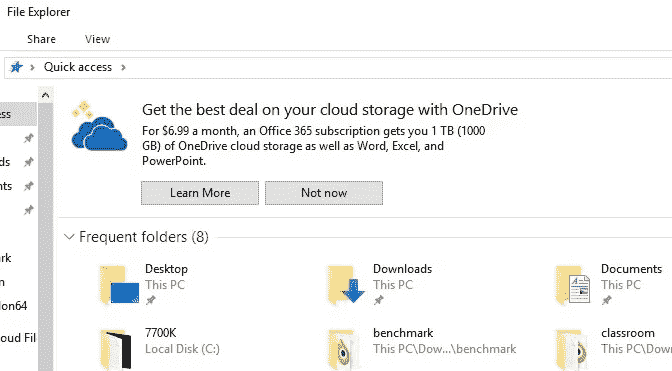

# 请不要这样做 Github

> 原文：<https://medium.com/swlh/please-dont-do-it-github-5890eb72d12c>

因此，微软一直在与 Github 就潜在的收购进行谈判。有几个原因说明这是一个糟糕的想法。Github 是一家非常可靠的 git 回购托管公司，但它的一些核心价值在这里岌岌可危，我不确定微软(或任何人)能够在没有严重影响的情况下收购 Github 这样的实体。

# 平台无关的集成

Github 有大量非常有用的集成，有助于让开发人员的生活变得更加轻松。像 appveyor，travis-ci，coverall，readthedocs，codacy 这样的工具真的很有用，最棒的是你可以在任何你喜欢的地方运行它们。微软如何提出商业案例来保持有助于竞争对手的平台无关集成？也许他们不会禁止，但他们可能会成为二等公民。

不相信我？微软对微软产品之外的任何人都不屑一顾的一些例子..

*   不得不使用[的天空](https://tel.red/linux.php)，因为 Linux 上没有用于商业的 Skype
*   [日出到展望](http://blog.sunrise.am/)
*   [完成展望](https://www.theverge.com/2015/1/29/7936081/microsoft-outlook-app-ios-android-features)

当然还有更多例子，但是有一天我需要登录一个微软账户来使用 Github，或者只能部署到 Azure 平台来构建工具，那将是我不再费心使用它的一天，这是我真正关心的问题。

# 与开源的联系

默认情况下，Github 回购是开放的，如果你想按月付费，它们可以变成私有的，这对于开源来说简直是惊人的，这也是 Github 成为大多数开源项目选择的平台的原因。还有一个很棒的问题跟踪器，维基，支持 markdown readmes 等等。我们都受益于这样一个伟大的开源项目设置。

过去几年，微软在开源领域做得很好，但任何人都可以看到这是最近的发展，纯粹是出于商业原因，以弥补 90 年代造成的损害。当微软参加 Linux 会议时，他们打扮成达斯·维德(Darth Vader)的样子，这是一个对抗开源反叛者的黑暗公司实体。现在他们正计划购买托管有史以来最大的开源代码库的实体？如果与开源的紧密联系消失了，酷的因素就会受到打击，Github 的社区也是如此。

# 冷静

微软不酷。上帝爱他们，他们在尽力，我一点也不讨厌微软。他们总是对开发商不屑一顾。我最近尝试了一下 VSCode，印象深刻。然而，你能想象 Windows 和微软服务到处都被 Github 钩住吗？通过(呃)Skype 与你的开源开发者合作，将你的 repo 自动部署到 Azure，或者将你的 Github 帐户绑定到你的 Linkedin 帐户，这样招聘人员可以找到更多证据，证明你非常适合那个 Java 角色，因为几十年前的大学 Java repo。如果有人认为这是疯狂的，我给你这个怪物。

最后，迁移到另一个 git 主机(咳咳 [gitlab](https://about.gitlab.com/) )可能会有点痛苦，但这真的没什么大不了的，主要是因为 git 太棒了。所以微软这次真的要小心行事了。我想象在 Github 同意这样的收购时，很多 Stallman 的军队会离开，事实上 Gnome 已经搬到 Gitlab，因为他们觉得这更符合他们[的精神](https://about.gitlab.com/2018/05/31/welcome-gnome-to-gitlab/)。你能想象许多开源项目在精神上与微软保持一致吗？开源作为一个运动自然会反抗集中式系统，微软如何能赢得开发者的心是一件很难看到的事情。

编辑:更新

所以有一个来自微软的[确认，](https://www.bloomberg.com/news/articles/2018-06-03/microsoft-is-said-to-have-agreed-to-acquire-coding-site-github)让我感到怀疑。最好的情况是微软尽可能轻描淡写。问题是，微软最近与 Github 的努力是否提供了足够的正能量来维持对 Github 的善意，或者 Gitlab 是否成为事实上的 FOSS git repo，老实说，事实上 git repo 托管公司的首选。

## 这篇文章发表在 [The Startup](https://medium.com/swlh) 上，这是 Medium 最大的创业刊物，有 331，853+人关注。

## 订阅接收[我们的头条新闻](http://growthsupply.com/the-startup-newsletter/)。

