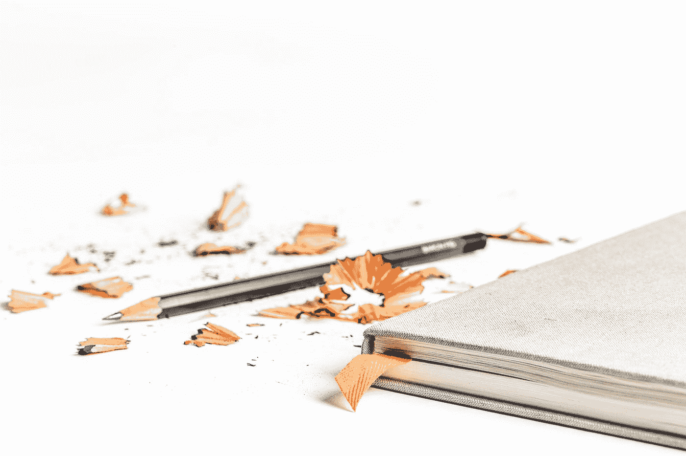

# 请让我帮助你永远不会再在工作或生活中感到没有效率

> 原文：<https://medium.com/swlh/please-let-me-help-you-never-feel-unproductive-at-work-or-in-life-again-435cb82016b7>

## 持续生产力之旅

Photo by [Pawel Janiak](https://unsplash.com/@pawelj?utm_source=medium&utm_medium=referral) on [Unsplash](https://unsplash.com?utm_source=medium&utm_medium=referral)

你有没有发现自己漫无目的地盯着看，脑子里什么想法也没有？

*你有没有想过，你在某一段时间内居然取得了* ***【负*** *的进步？*

你是否曾经说过，“为什么我做得不够多？”

好消息是，所有这些想法都是正常的！阿尔伯特·爱因斯坦、米歇尔·奥巴马和摇滚都表达了这些想法——而那个家伙似乎无处不在！

但是说真的，这里唯一发生的事情是生产力的低谷。有这些没关系，我们不可能每一秒都是精力充沛的兔子。

就在几天前，我看着我的待办事项日历，意识到我已经划掉了 15 项任务中的 1 项。这是在一天结束的时候！

我不会骗你说，有一个简单的方法可以克服生产力的低点，并实现始终一致的产量，这只是不人道的。但是，如果你遵循这三种方法，你会非常接近。

# 1.锻炼

哦，他要告诉我三件我已经知道并听过无数次的事情。锻炼、饮食和不断学习。

没有。

继续读，接下来的 2 个更有创意。这些都很重要，但是我想我可以给你提供更多的东西。

但是，我必须先介绍这个，因为它确实是最重要的。我不会拖拖拉拉地谈论锻炼的好处，因为有无数的研究人员、研究和其他人可以给你确凿的证据，但作为一名私人教练和测试者，我保证这一条是有效的。

锻炼让你活在当下，让你启动你的整个系统，并向你展示你可以实现不可能的壮举。

让锻炼成为你日常生活的一部分，或者用它来增加你的产出。

# 2.反思你做过的伟大的事情

*安抚人心。*

*感恩。*

*证明。*

你可以并且已经卓有成效。你已经并且能够成就伟大。

有时候你只是需要一点提醒。

将你最大的成就存档。论文、视频、项目、考试，不管是什么，只要是你真正擅长的。当你情绪低落的时候，看看这些。

向自己展示你有多了不起，你注定会有多了不起。

允许自己对自己印象深刻。你越相信、信任和建立对自己的信心，你就会变得更有效率、更有动力和更成功。

“A bare-chested muscular man pouring water into his mouth in a garage” by [henri meilhac](https://unsplash.com/@henrimeilhac?utm_source=medium&utm_medium=referral) on [Unsplash](https://unsplash.com?utm_source=medium&utm_medium=referral)

# 3.冲刺，休息，重复

在你的生活中，你有没有参加过一项运动，却没有休息一会儿？

如果是这样，那就是折磨！

如果没有，那么你就对休息对身体有多重要有了基本的了解。

但是，休息对大脑也很重要！

我们必须开始利用突发的智力能量，每次花 30 分钟专注于某项任务，然后花几分钟时间给自己一个“精神休息”

Thomas Oppong 写了这篇文章[https://medium . com/thrive-global/make-work-a-series-of-sprints-you-need-to-plug-out-per-90 minutes-8166977 b0b 73](/thrive-global/make-work-a-series-of-sprints-you-need-to-unplug-every-90-minutes-8166977b0b73)关于工作周期对减少生产力低谷有多重要，我完全同意。

我们不能一次几小时地专注于一个特定的任务，尤其不能一次几天！

Photo by [Tim Wright](https://unsplash.com/@timdwright?utm_source=medium&utm_medium=referral) on [Unsplash](https://unsplash.com?utm_source=medium&utm_medium=referral)

把你的生产力想象成一支铅笔:

你用一支漂亮、崭新、新鲜的铅笔开始新的一天。你用的铅笔越多，它就变得越小。

如果我们一整天都不削铅笔，那么我们会更快地到达底部，耗尽铅芯，被迫停下来，直到我们可以得到一个新的。

我们的生活和思想都是一样的。

生产力是一种可以提高、练习和掌握的技能。有意识地努力提高你的生产力水平，这样低落的时候就会少了！

# **想在任何情况下都感觉更舒服吗？**

成为“变得更舒适”社区的一员，通过加入这里的，这个社区推动你并向你证明我们都可以变得更舒适。

## 这篇文章发表在 [The Startup](https://medium.com/swlh) 上，这是 Medium 最大的创业刊物，有+ 373，685 人关注。

## 在这里订阅接收[我们的头条新闻](http://growthsupply.com/the-startup-newsletter/)。

