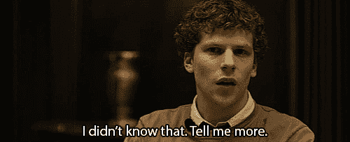
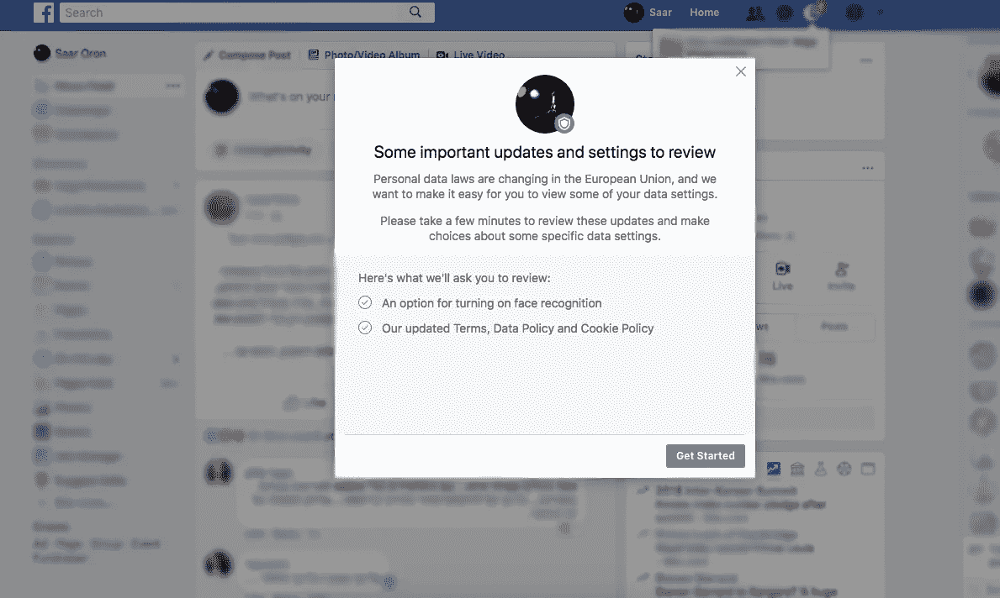
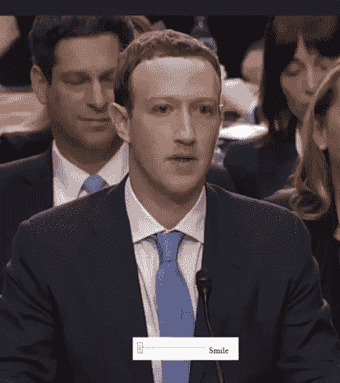

# 请派人来帮忙——我的身份被盗了！

> 原文：<https://medium.com/swlh/please-send-help-my-identity-was-stolen-cd065b7b5536>

## 你会为“脸书溢价”买单吗？

最近，当我进入脸书时，我收到了一个弹出通知。这是脸书新推出的人脸识别功能，我被要求选择加入。
虽然它的设计色彩鲜艳，吸引人，但**还是立刻引起了我的注意**。
我已经因为在网上分享我的数据而伤痕累累。

# 有人盗用了我的身份！

> "有三样东西藏不了多久:太阳、月亮和真理."~佛

我的 **身份不到一年前被盗**。我哪里知道？我收到一封来自我不是会员的银行的信，问我是否申请了他们的信用卡。他们让我联系他们。起初，我认为这封信是一个骗局，但我能够确认信中的电话号码实际上是他们的。

当我打电话给银行时，我面对冷酷的事实。
有人以我的名义申请了信用卡。银行没有透露他们如何认定不是我，但幸运的是，他们没有授权申请。有人建议我去拿我的信用报告，并检查是否有其他人以我的名义申请。
很显然，**又有一些信用卡申请使用了我的名字！不管是一个人、一个团体还是一个机器人——我不知道。但是写这封信的人有我的名字、出生日期和详细地址。**

那些日子令人害怕。幸运的是，所有的申请都没有通过，我的申请细节被转到了 [CIFAS](https://www.cifas.org.uk/) 。

有人是怎么知道我的详细资料的？这其实很容易，不是吗？我的名字，出生日期，可能还有我的地址，都在网上。事实上，我的名字和出生日期在脸书是公开的。我的地址呢？嗯，我不仅每次在网上买东西都要输入密码，而且我给很多人发了上百次短信。它一定藏在某个地方。无论是在脸书还是谷歌的服务器上，关键是它都可以被访问和滥用。

# 人脸识别是一项新功能吗？

据脸书称，这个新功能的目的是防止别人盗用你的身份，在脸书上使用你的照片。
听起来有道理。

> 我们的技术分析照片和视频中的像素，例如您的个人资料图片以及您被标记的照片和视频，以计算一个唯一的数字，我们称之为模板。我们将脸书上的其他照片和视频与此模板进行比较，如果发现匹配，我们会认出您。

但是很明显，这个功能在过去的 7 年里一直有效。
以前，脸书会建议给朋友的照片添加标签，而不是自己手动添加。
实际上，脸书多年来一直在分析和储存我们每个人的面部模板。而[脸书也因此被起诉](https://www.cnbc.com/2018/04/17/facebook-must-face-class-action-over-facial-recognition-us-judge.html)。这个所谓的“新功能”的唯一区别是，脸书现在可以识别你没有被标记的照片。

这似乎是一个防止他人身份被盗的好方法。但是脸书强迫用户选择加入的方式是完全不可接受的。

当我面对这个功能的弹出窗口时，我只有一个选项:“开始”。我刷新了页面，它消失了。我担心单击“开始”会不知何故地同意该功能的条款和条件。

在脸书的剑桥分析丑闻之后，我不能再信任它了。

# 使用脸书的成本

当我们使用脸书时，我们允许公司存储和查看我们所有的个人信息。那么，它真的是一个免费的平台吗？
脸书储存了我们所有的聊天记录、帖子、评论、群、事件、标签、照片和视频。它还保存了我们使用的应用程序、我们访问的个人资料、我们喜欢的页面、我们访问的网页以及我们在线购买或查看的商品的数据。
如果启用了定位服务，脸书还可以追踪我们去了哪里以及何时去了哪里。
总之，脸书对我们是谁、我们来自哪里、我们的年龄、我们的兴趣以及我们的种族、性别和国籍有着全面的了解。

这就是脸书赚钱的方式。利用我们的数据，他们销售我们认为感兴趣的广告。我们真的想让一家上市公司在其服务器上保存和储存我们所有的私人信息吗？我们乐意让脸书把我们的私人数据卖给第三方广告商吗？我们知道谁有权访问我们的数据吗？

我们不会为了一项“免费”服务而理性地放弃我们的个人数据。

# 那么还有什么选择呢？

我们可以使用其他社交网络——Twitter、Google Plus 和 Snapchat。
然而，所有这些公司都使用脸书使用的相同的“免费”平台模式。它们都存储着我们的个人数据。
**但是如果有其他选择呢？
无广告的“脸书高级”平台，加密数据完全归用户所有。你会付钱吗？在现实中，我们大多数人会说不。当我们有一个“免费”的选择时，我们几乎不可能付钱。我们永远不会为我们可以免费获得的应用程序付费，如果我们可以在 Spotify 上免费听这些歌曲，我们也永远不会购买 CD。但是“免费”脸书的价格实在是太贵了。**

事实是——我们不知道公司可以或不可以用我们的数据做什么。我们不知道谁有能力得到我们的数据。作为一个社会，我们需要开始前进。根据我们的数据来定义什么应该或不应该被接受，并使之成为一种规范。我们是否允许公司持有和出售我们的数据，以换取一个免费的平台？
我们对自己的位置和浏览历史被追踪感到满意吗？

> "做正确的事，时机总是正确的。"
> 
> ~小马丁·路德·金。

有两个重要的问题我们要问自己:
**这个有偿服务给我提供了什么价值？我为使用这项“免费”服务付出了什么代价？**

随着 GDPR 等新法规的出台，以及我们最近看到的在线数据泄露事件，我们正迈向互联网历史的新篇章。我们必须开始考虑替代方案，让我们在享受网络自由的同时保护自己的隐私。

> 如果你觉得那是你想做的，就一起鼓掌👏

# 感谢阅读！欢迎随时关注我:

 [## 萨尔·oron⁦⁦👈—中等

### 我是萨尔。大多对音乐和人充满热情。在寻求…

medium.com](/@saaroron) 

**更多帖子:**

 [## 你的职称是真实的你吗？

### 你是谁？你是做什么的？

medium.com](/swlh/is-your-job-title-who-you-really-are-1df20ef76006)  [## 草稿:‘免费’的正版价格是多少？萨尔·oron⁦⁦👈-中等

### “免费”实际上要花我们多少钱？我们生活在一个‘自由’的时代。我们被如此多的免费产品包围着…

medium.com](/@saaroron/draft-what-is-the-genuine-price-of-free-250ba824f65f) 

## 这个故事发表在 [The Startup](https://medium.com/swlh) 上，这是 Medium 最大的创业刊物，拥有 324，834+人关注。

## 在这里订阅接收[我们的头条新闻](http://growthsupply.com/the-startup-newsletter/)。

