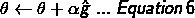
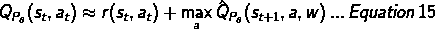
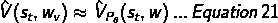
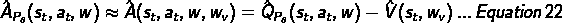

# 深度确定性政策梯度

> 原文：<https://medium.com/swlh/policy-gradients-1edbbbc8de6b>

Trained Agent Performance (animation by author)

# 介绍

本文概述了我在 Reacher 环境下对 Udacity 深度强化学习 Nanodegree 的第二个项目的实现。在这个项目中，目标是训练一个有两个关节的 acrobat 手臂，使它能够跟踪一个气球。随着气球的移动，两个关节被调整以跟踪气球。所以这是一个经典的机器人问题。但是对于这个项目，我们将改为使用无模型强化学习来学习最优策略。具体而言，使用的方法是深度确定性政策梯度法(DDPG)。

基于值的强化学习算法，如 DQN，已经在许多领域表现出良好的性能。然而，它们仍然限于离散动作空间环境和确定性策略(因为它们本质上基于确定性贪婪策略，因为它们仅选择均匀随机动作)。此外，使用基于价值的方法，我们首先计算每个状态的价值函数，并使用它来确定最佳策略。这是一种寻找最优策略的间接方法。

另一方面，使用基于策略的方法，我们直接找到产生最多回报的策略。策略梯度是一种更有效的基于策略的学习算法，其中我们直接计算预期回报相对于策略参数的梯度。除了直接之外，它还能很好地处理连续动作和随机策略。其他基于策略的方法包括随机优化方法，如随机打靶、交叉熵方法等。

在深入研究这个项目的实现之前，我在下面介绍了一些关于策略梯度方法的基础知识。特别是，本文将带领读者从强化学习(RL)的基本目标到一些高级策略梯度算法，如强化、行动者-批评家、优势行动者-批评家、确定性策略梯度和深度确定性策略梯度。为了彻底理解，假设读者精通概率统计、线性代数、向量微积分和基本强化学习术语。

# 强化算法

请注意，在以下分析中，为简单起见，贴现因子γ假定为 1。但是所有的分析都可以很容易地推广到γ不为 1 的情况。

所有强化学习(RL)的基本目标是最大化期望总效用 Uθ，其定义如下[1]:

做了一些数学计算后，可以看出 Uθ等于 Q(s₀,a₀).的期望值如果初始状态分布是均匀的，那么这意味着 RL 的目标是找到一个使所有可能状态的 q 值最大化的策略。

使用期望值的定义，上述等式 1a 可以重写为:

使用策略梯度法，我们可以通过首先计算 Uθ相对于θ的梯度来最大化 uθ，其(使用加强对数似然技巧[3])可以推导为:

提高预期总回报的一种方法是在当前θ中随机添加噪声，如果它导致更好的总回报，那么我们保留它，否则我们忽略它，并不断重复这一过程。这种方法叫做随机放炮法。同样还有其他更复杂的方法，如交叉熵方法。所有这些方法都属于随机优化算法的范畴。然而，尽管这些方法实现起来非常简单，但是它们效率不高，并且不能很好地适应高维空间。更有效的方法是使用随机梯度上升沿梯度方向改变θ，如下所示:

利用上述梯度的基本策略梯度算法被称为加强算法，其工作原理如下:

## 一种基本强化算法:

从随机向量θ开始，重复以下 3 个步骤，直到收敛:

1.使用策略 Pθ(at|st)收集 m 个轨迹{τ1，τ2，…，τm}，其中每个轨迹如上所定义。

2.使用这些轨迹计算梯度的蒙特卡罗估计值，如下所示:

请注意，上述估计器有效的原因是因为轨迹是通过遵循正在学习的策略生成的，即 Pθ(τ)，即它是一种基于策略的算法。另一种说法是，我们从概率分布 Pθ(τ)中对{τ1，τ2，…，τm}中的每个轨迹进行采样。

3.使用上述梯度估计器更新策略网络的权重/参数:

强化算法背后的直觉是，如果总回报是正的，那么在该轨迹中采取的所有行动都被强化，而如果总回报是负的，那么在该轨迹中采取的所有行动都被抑制。此外，为了提高计算效率，通常将 m 设置为 1。

虽然比随机优化方法更好，但加强算法也有一些缺点。梯度估计是相当嘈杂的，特别是对于 m=1 的情况，因为一个单一的轨迹可能不代表政策。
2。没有明确的学分分配。一个轨迹可能包含许多好的和坏的行为，这些行为是否得到强化，只取决于从初始状态开始所获得的总回报。
3。它对奖励的绝对值非常敏感。例如，给所有的奖励加上一个固定的常数可以极大地改变算法的行为。这样一个微不足道的转换应该不会对最优策略产生影响。

根据梯度的定义，∇θUθ指向 Uθ变化最大的方向。然而，从根本上讲，增强算法的上述缺点是由于∇θUθ(即ĝ)的蒙特卡罗估计量具有高方差的事实。如果我们能减少它的方差，那么我们对梯度(ĝ)的估计将更接近真实的梯度∇θUθ.

虽然梯度的蒙特卡罗估计(ĝ)是无偏的，但它表现出很高的方差。如下所述，有几种方法可以在不引入偏倚的情况下减少方差:1)使用因果关系，2)使用基线。

# 演员-评论家算法

减少差异的一个方法是利用因果关系:ĝ根据总报酬而不是未来的报酬来更新轨迹中的所有行动。也就是说，未来的行为影响过去的回报，这在我们的因果宇宙中是不可能的。因此，我们可以通过使用奖励来使梯度估计值更加真实，如下式所示。

请注意，使用奖励去代替总奖励仍然导致∇θUθ的无偏估计，因为因果关系是在等式 3 中使用 Pθ(τ)的期望中处理的。此外，这样做减少了差异，因为奖励去表达式有更少的条款(因此不确定性更低)比总奖励表达式。

需要注意的一点是，要获得的回报实际上是对(st，at)的 q 值的估计。这是因为 q 值定义如下:

因此，如果轨迹τ是从 Pθ(τ)采样的，那么 QPθ(st，at)的单样本蒙特卡罗估计就是:

如上所示，我们可以使用奖励 go 的 Q 值估计量，而不是像等式 7 那样使用奖励 go 的蒙特卡罗估计量。因此，等式 7 可以重写为:

如果 Qhat Pθ(st，at)使用神经网络(由 w 参数化)建模，则我们得到:

注意，因为状态-动作空间可以是非常高维的，所以它很快就遇到了贝尔曼的维数灾难；因此，在大多数具有复杂状态转换动态的实际情况下，Qhat Pθ(st，at)使用基于神经网络的函数逼近器来建模。

那么等式 10 可以重写为:

其中，Pθ(at | st)是由θ参数化的演员网络，而 Qhat Pθ(st，at)是由 w 参数化的评论家网络，这实质上就是所谓的演员-评论家算法。

对于任何被访问的状态-动作对(s，a ),行动者网络使用等式 6 来更新(利用来自等式 12 的ĝ),而批评者网络通常使用时间差学习来更新(由于其比蒙特卡罗学习更低的方差),使用以下更新等式:

由此更新权重向量 w 以减少损失 L(w ),损失 L(w)被定义为:

并且使用 Q-learning(以便批评家基于偏离策略的算法):

因此

凭借

这是演员-评论家算法的基础。虽然它有许多变体，但正如我们将在下面看到的，这是它的基本核心。

# 优势行动者-评论家算法

除了使用奖励去(由于因果关系)，另一种最小化ĝ方差的方法是减去不依赖于θ或行动 a 的基线 b——这个组合项被称为优势函数。可以从数学上证明，这样的变换不仅无偏，而且减少了方差。为什么它减少方差的直观解释是因为乘以∇θlog(Pθ(a|s 的项具有较小的量级，这实质上减少了整个表达式的方差。

基线 b 有多种选择，理论上也可以计算出 b 的最佳值。然而，为了简单和直观起见，通常使用的基线是所有动作的平均 q 值，即状态值。

然后，优势函数被写成如下:

使用该优势函数的基本思想是，q 值高于平均值(即状态值)的动作被加强，而其他动作被抑制。这比原始增强算法中使用的梯度方程更直观。所以从数学上来说，它会导致更低的方差，这一点也不奇怪。此外，现在梯度不再取决于奖励的绝对值。

上述等式的一个问题是，在实践中，很难计算上述期望——特别是对于连续动作或高维动作空间。因此，状态-值函数用单独的神经网络建模，该神经网络由 wᵥ参数化如下:

优势函数现在变为:

这个优势函数的问题是它需要两个独立的神经网络。通过一些巧妙的重新排序，我们可以使用单个神经网络重写优势函数。然而，为了做到这一点，让我们首先重新审视上述分析。基本上，我们想要的理想优势函数是:

如上面等式 8 中所定义的，状态-动作值可以根据状态-值函数进一步简化为:

上式中定义的 QPθ(st，at)的单样本蒙特卡罗估计值为:

因此，现在我们只需要使用由 wv 参数化的神经网络来表示状态值函数，如下所示:

因此现在可以使用用 wᵥ.参数化的单个神经网络来表示优势函数注意，对于上述优势函数等式，它实际上只是一步 TD 误差(即 TD(0)误差)。此外，也可以用 TD(λ)误差来表示。

优势演员评论家的梯度方程现在是:

这将是对预期梯度(等式 3)的更好的估计，即具有更低的方差，并且仍然是无偏的，即使 m=1。这样一来，算法的学习速度会快很多。

wv 更新如下:

由此使用一步 TD 学习(即 TD(0)):

使用来自等式 29 的梯度估计器、来自等式 30 的权重更新以及来自基本增强算法的剩余步骤，得到了所谓的优势因素-评价算法。

简要总结上述讨论，增强算法的主要缺点是梯度估计器基于初始状态-行动对的预期总回报的蒙特卡罗估计器，虽然偏差低，但方差高。通过使用因果关系并从蒙特卡罗估计中减去基线，我们可以减少方差。通过使用期望总报酬的 TD 估计量来代替蒙特卡罗估计量，方差被进一步减小。

# 确定性策略梯度(DPG)算法

对于连续环境中的随机策略，参与者输出高斯分布的均值和方差。并且从该高斯分布中采样动作。对于确定性动作，虽然这种方法仍然有效，因为网络将学习具有非常低的方差，但是它涉及复杂性和计算负担，这不必要地减慢了学习算法。为了解决这些缺点，对于确定性行动，我们可以使用所谓的确定性政策梯度。

在随机情况下，策略梯度算法在状态和动作空间上积分，而在确定性情况下，它仅在状态空间上积分。因此，计算确定性策略梯度可能需要更少的样本。但是，为了充分探索状态空间，基本思想是根据随机行为策略选择动作，并了解确定性目标策略(即，需要是偏离策略的算法)。

DPG 本质上是演员-评论家算法的确定性版本。对于基本的 DPG 算法，我们有两个神经网络，一个网络(由θ参数化)估计最佳目标策略，第二个网络(由 w 参数化)估计对应于目标策略的动作值函数。下面的等式对此进行了形式化。

如上所述，因为目标策略是确定性的，所以参与者可能不会很好地探索状态空间来找到最优策略。为了解决这个问题，我们使用一个不同于目标策略的行为策略(b(st))。它基本上是带有一些附加噪声的目标策略。为简单起见，我们将使用正态分布作为噪声源。但是请注意，这个术语就像一个超参数，在下面 Reacher 环境的实现中，使用了不同的噪声处理。

## 确定性策略梯度更新:

1.演员网络更新如下:

根据链式法则，它变成了:

2.评论家网络更新如下:

TD 误差由下式给出:

权重更新为:

重申一下，为了恰当地平衡勘探-开发权衡，虽然目标策略μ是确定性的，但行为策略是随机的。所以这是 DPG 算法的非政策版本。虽然随机策略外行动者-批评者算法通常对行动者和批评者都使用重要性采样，但是因为确定性策略梯度消除了对行动的期望，并且由于目标和行为策略在相同的环境中操作，所以它们的状态转换动态是相同的，所以不需要重要性采样比率。因此，我们可以避免在演员中使用重要性抽样，同样的道理，我们可以避免在评论家中使用重要性抽样[2]。对于那些想知道的人来说，类似的推理适用于为什么我们不在 Q-learning 中使用重要性抽样。

# 深度确定性策略梯度(DDPG)算法

DDPG 基本上是 DPG，在训练上有一些来自 DQN 的改变。

使用神经网络进行强化学习时的一个挑战是，大多数优化算法都假设样本独立且同分布。显然，这种假设不成立，因为样本是通过在一个环境中顺序探索而生成的。因为 DDPG 是一个非策略算法，我们可以像在 DQN 一样使用重放缓冲区(一个有限大小的缓存)来解决这个问题。在每个时间步，演员和评论家通过从缓冲器[2]中均匀地采样一个迷你批次来更新。

对于批评家来说，由于被更新的网络也用于计算目标，这可能导致像神经网络这样的高度非线性函数逼近器的训练不稳定性。解决这个问题的一个办法是使用一个单独的目标网络，就像 DQN [2]一样。给定使用评论家和演员网络确定的目标值，我们创建这两个网络的副本，并将它们的权重软更新到各自的学习网络。详情请参考我的 [Github](https://github.com/amitp-ai/Deep_Reinforcement_Learning/blob/master/P2_Continuous_Actions/Continuous_Control_UdacityWorkspace.ipynb) 代码。

# Reacher 环境的 DDPG 实现

现在已经看到了一些常用的策略梯度算法，我们现在可以开始我为 Udacity 的 Reacher 项目实现了。在这种环境下，双关节臂(acrobot)可以移动到目标位置(即气球所在的位置)。代理人的手在目标位置的每一步提供+0.1 的奖励。因此，代理的目标是在尽可能多的时间步长内保持其在目标位置的位置。随着气球的移动，两个关节被调整以跟踪气球。所以这是一个经典的机器人项目，使用无模型强化学习，代理将学习最优策略。具体而言，使用的方法是深度确定性政策梯度法(DDPG)。观察空间由 33 个变量组成，对应于手臂的位置、旋转、速度和角速度。每个动作都是一个有四个数字的向量，对应着适用于两个关节的扭矩。动作向量中的每个条目都是介于-1 和 1 之间的数字。

使用的 Reacher 环境包含 20 个相同的代理，每个代理都有自己的环境副本。为了被认为是解决了，代理必须得到+30 的平均分数(超过 100 个连续的情节，并且超过所有 20 个代理)。特别是，在每集之后，我们将每个代理人收到的奖励相加(不打折)，得到每个代理人的分数。这产生了 20 个(可能不同的)分数。然后我们取这 20 个分数的平均值。
得出每集的平均分(所有 20 个代理的平均分)。当这些平均分的平均值(超过 100 集)至少为+30 时，环境被视为已解决。

DDPG 算法使用 4 个独立的神经网络。一个学习政策，一个学习价值函数，一个学习目标价值函数，一个学习目标行动-价值函数网络中的目标行动。如前所述，我们使用单独的目标网络而不是本地网络，以防止当 TD 目标依赖于本地网络时学习中的任何不稳定性。目标网络中的权重更新得非常慢，比如在每个时间步长向本地网络更新 0.1%。缓慢地改变目标网络确实会降低学习速度，但它有助于学习算法的稳定性[2]。

为了加速学习过程，由于所有 20 个代理同时经历，输入数据流相当大。为了充分利用这一点，我在每次迭代中执行 4 次网络参数更新。不使用重要性抽样比率的原因是，参与者的目标策略是确定的，批评家的目标值也是确定的。此外，评论家网络的梯度修剪为 1。这样可以防止评论家网络变化太快。此外，我将目标网络初始化为与正在学习的网络具有相同的(随机)权重。此外，使用奥恩斯坦-乌伦贝克噪声过程代替正态分布来生成行为策略，以便更好地进行探索。所有这些因素加在一起，使得代理在 100 多集的时间里就达到了学习目标。详情请参考我的 [Github](https://github.com/amitp-ai/Deep_Reinforcement_Learning/blob/master/P2_Continuous_Actions/Continuous_Control_UdacityWorkspace.ipynb) 代码。

下面是所有 20 个代理的平均算法学习性能。

Training Profile (image by author)

就使用的超参数而言，演员和评论家网络的学习率都是 1e-4，没有使用正则化，因为网络相当小。我逐渐衰减探索概率以获得最优策略。奥恩斯坦-乌伦贝克噪声过程使用平均值 0 和西格玛值 0.2。actor 网络是使用三层神经网络(第一层 256 个神经元，第二层 128 个神经元，最后输出层 4 个神经元)构建的。critic 网络也是使用三层和与 actor 网络相似数量的神经元构建的，除了动作被连接到第一层的输出，并且最后一层具有单个输出神经元。为了更快地学习，elu 非线性被用于两个网络。

就进一步提高代理性能的方法而言，我的待办事项列表中有几件事情:1)使用优先化经验重放来训练代理，以及 2)使用最近的策略优化算法。

## 参考资料:

1:加州大学柏克莱分校 CS294 讲座(【http://rail.eecs.berkeley.edu/deeprlcourse/】T2)
2。https://arxiv.org/pdf/1509.02971.pdf 纸()
3。加固绝招:([https://dallascard.github.io/the-reinforce-trick.html](https://dallascard.github.io/the-reinforce-trick.html))