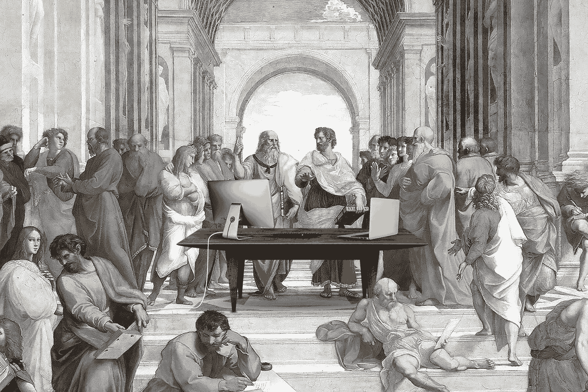
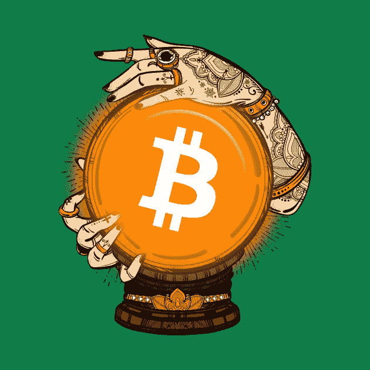

# 政治、宗教和加密货币——这三者有什么共同点

> 原文：<https://medium.com/swlh/politics-religion-and-cryptocurrencies-what-the-three-have-in-common-1be69016fbfa>

政治、宗教和加密货币有什么共同点？首先，不要在今年的感恩节餐桌上提出来。根据一些人的说法，美国正变得越来越分裂。唐纳德·特朗普(Donald Trump)和共和党不是爱就是恨，即便如此，也有人爱一个恨一个。或者，就在最近，在得克萨斯州发生了一起悲惨的枪击事件，一名[所谓的无神论者枪杀了一座基督教堂](https://www.nytimes.com/2017/11/06/us/devin-patrick-kelley-texas.html.)。那么加密货币是如何发挥作用的呢？在金融界，没有什么比加密货币更两极分化了。

美国的首席执行官们在比特币和区块链技术等加密货币上[意见不一。有些人喜欢它，比如维珍集团的创始人理查德·布兰森。其他人，如摩根大通首席执行官杰米·戴蒙，并不热衷于此。尽管如此，投资者继续涌入加密货币资产。](https://www.benzinga.com/analyst-ratings/analyst-color/17/10/10145571/a-guide-to-who-loves-and-hates-cryptocurrency)

Crypto boom?

**加密热潮**

事实上，对加密货币的需求有助于解释公开市场上难以置信的加密货币数量。根据 [CoinMarketCap](https://coinmarketcap.com/all/views/all/) 的数据，有超过 1300 种加密货币在流通，总市值超过 2450 亿美元。这个数字完全有可能更高，因为大约有 300 枚硬币有未知的市值。此外，新硬币一直在发行，所以数量将继续增长。

由于市场上交易的硬币数量巨大，创新的需求越来越大。像比特币和以太坊这样的一些硬币是彻头彻尾的加密货币——它们不依赖于解决特定问题的区块链平台。相反，其他的实际上是网络令牌，可以用来访问区块链平台上的某些功能。像这样的硬币有办法让自己在同行中脱颖而出。

The Crystal ball

## **加密水晶球？**

比特币和以太坊等加密货币将如何发展？正如世界上一些最著名的投资者所说，它们是一个等待破裂的巨大泡沫吗？当然，2017 年价格大幅上涨，但仅此并不意味着它们是一个毫无价值的陷阱，等待爆炸。如果加密货币像一些人预期的那样获得大规模接受和集成，那么加密资产的当前收益与未来价格升值相比将相形见绌。

假设投资者在 2017 年之前购买了硬币，即使出现大幅回调，加密货币仍然可以给投资者带来可观的资本收益。此外，加密货币的价值不仅仅与其价格相关。和区块链一样，加密货币也代表了推动它们的不可思议的技术。尽管有对比特币等特定货币的批评，但一些过去贬低比特币的人表示，他们是其底层技术的粉丝。

与任何投资工具一样，牛市和熊市都有可能发生。对于加密货币来说，这没有什么不同——无论是比特币和以太坊这样的流行硬币还是较新的硬币。然而，区块链技术是对进步力量的有力提醒，也是对永不安于现状的微妙挑战。这是感恩节餐桌上的一个话题。

## 这篇文章发表在[《创业](https://medium.com/swlh)》上，这是 Medium 最大的创业刊物，有 298，432+人关注。

## 订阅接收[我们的头条新闻](http://growthsupply.com/the-startup-newsletter/)。

