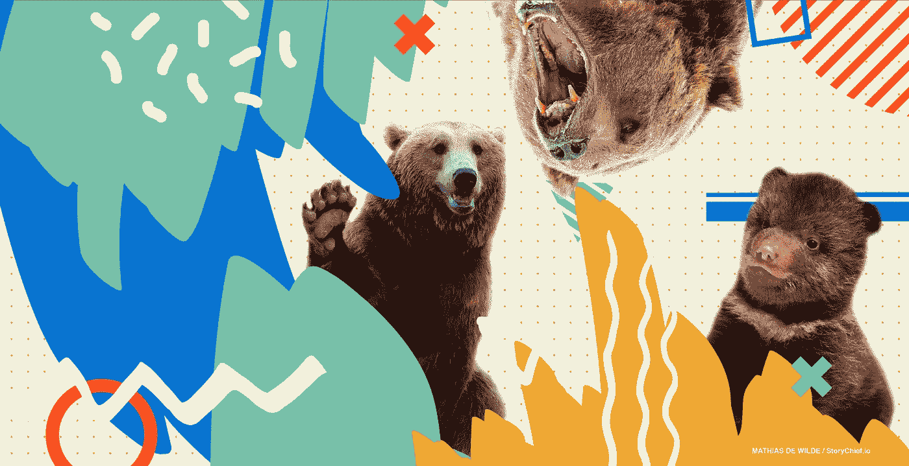

# 可怜的金发姑娘无法管理她的编辑团队

> 原文：<https://medium.com/swlh/poor-goldilocks-just-couldnt-manage-her-editorial-team-837197114dcd>

© Mathias De Wilde / Storychief.io

《金发姑娘和三只熊》的故事举世闻名，流传下来，被改写了无数次。自 1837 年首次正式出版以来，它还被翻译成许多种语言。简而言之，金发女孩已经出现了。她的故事有如此多的解释和版本，无论是在线的还是印刷的，她可怜的维基百科页面作者几乎跟不上。然而，对金发姑娘来说幸运的是，在她尽可能成为最好的自己的 181 年中，她在任何给定的故事中只遇到过三只熊和三个版本的任何事情。这在现实生活中什么时候发生过？这是执行主编的梦想——梦想编辑团队。

## **演员阵容，也就是我们的编辑团队**

为了这个故事的目的，我们将看到每个角色扮演双重角色。

金发女孩将成为执行主编，这使得她的母亲默认为主编。这使得三只熊成为了专职作家——熊爸爸、熊妈妈和熊宝宝——因为每个优秀的编辑团队都需要触及所有的人口统计数据。

为了尽职调查，让我们回顾一下这个屡试不爽的真实故事，好吗？

## 金发女孩作为**的主角和对手**

很久很久以前，金发姑娘被她的母亲送到了森林里，她的任务是在这片土地上寻找最有趣的故事。没有它就不能回家，金发姑娘又一次感受到了压力，就像在她之前那么多更优秀的执行编辑一样，她正处于职业倦怠的边缘。

就像任何一个体面的执行主编会做的那样，她的第一件事就是求助于她出色的作家团队。她立即动身去员工宿舍，但当她到达那里时，她发现没有人在家。正如老板们在他们的自然栖息地所做的那样，金发姑娘们还是侵入了他们的领地。

## 对于任何曾经在有公共厨房的办公室工作过的人来说…

金发姑娘漫步走进熊的家，从一个房间到另一个房间巡视，然后发现餐厅里放着三碗粥。她的肚子咕咕叫着，好像是在暗示什么，因为那天早上她没吃早餐。她毫不犹豫地抓起勺子，直接从熊爸爸的碗里舀了一大堆粥。天气滚烫，烫到了她的上颚，但这并没有阻止小金发姑娘，不。好吧，熊妈妈的粥结果是冰冷的，这是有道理的，因为众所周知，妈妈们很少能在粥里吃到热饭。但是熊宝宝的粥刚好合适，所以金发姑娘把它吃光了，一点也没剩。

肚子里装满了粥，金发姑娘决定在客厅里坐着休息，同时等待她的编辑团队回来——她的权利感只会因裙带关系的好处而放大。在客厅里，她发现了三把椅子:熊爸爸的椅子太大了，熊妈妈的椅子稍微小一点，但对金发姑娘小小的身躯来说还是太大了，熊宝宝的椅子刚刚好。她坐在熊宝宝的椅子上，让自己很舒服，但它不知何故在她的重量下碎成了碎片！

## 在熊和战争中，在床上，一切都是公平的

事实证明，整个经历对小金发姑娘来说是难以承受的。从她在森林里长途跋涉到吃别人的食物和弄坏椅子，这耗尽了她仅存的能量。所以她上楼去了卧室，决定打个盹。

自然，熊爸爸的床对她脆弱的骨头来说太硬了，熊妈妈的床又太软了，而——你猜对了——熊宝宝的床刚刚好。她的午睡变成了一场酣睡，她被一群充满敌意的熊吵醒了。说实话，金发姑娘的熊作家团队找工作已经有一段时间了，他们已经受够了恶劣的工作条件和管理层——也就是金发姑娘和她的母亲——的不公平待遇。在那个特殊的日子里，他们已经采访了不少儿童书籍内容工厂，他们的搜索已经成功结束。帕丁顿集团和贝伦斯坦熊队都向他们提供了工作。这些熊计划回家用他们藏起来的几碗粥和一些蜂蜜朗姆酒庆祝。值得庆幸的是，他们储藏的酒是安全的，但他们回来时家里一片狼藉。他们脸色铁青。

“有人吃了我们的粥，弄坏了我们的椅子，睡了我们的床。我们再也受不了了。吼！”

熊的动物本能压倒了任何残留的专业精神或外交手腕，因为它们第一次在金发姑娘露出了牙齿。像任何一个正派的总编辑一样，金发姑娘清楚地看到了不祥之兆，她从熊宝宝的床上跳了出来，径直跳出了窗外。在此过程中，她摔断了双腿，但却幸免于难，令她母亲高兴。

## 这个故事的寓意？

我们既不宽恕暴力，也不推动编辑团队政变，但我们确实相信在任何编辑团队的制衡中实现和谐是可能的。金发姑娘本不应该经历濒死体验来辨别是非。总有更好的办法。如果她和她的母亲能够更好地管理他们的内容团队，以更平衡的方式处理协作过程，也许所有的戏剧性事件都可以避免。

嘶！有传言说，三只熊的整个故事在 1837 年之前就存在了，比金发姑娘的存在还要早。因此，如果说[版本历史](https://storychief.io/version-history)教会了我们什么，那就是每个人都是可以牺牲和恢复的。金发姑娘和她的母亲最好记住这一点！

您是否希望优化编辑工作流程以实现更好的内容协作？[免费报名。](https://app.storychief.io/register)

## 这篇文章发表在《T4》杂志《创业》(The Startup)上，这是 Medium 最大的创业刊物，有 322，555+人关注。

## 在这里订阅接收[我们的头条新闻](http://growthsupply.com/the-startup-newsletter/)。

