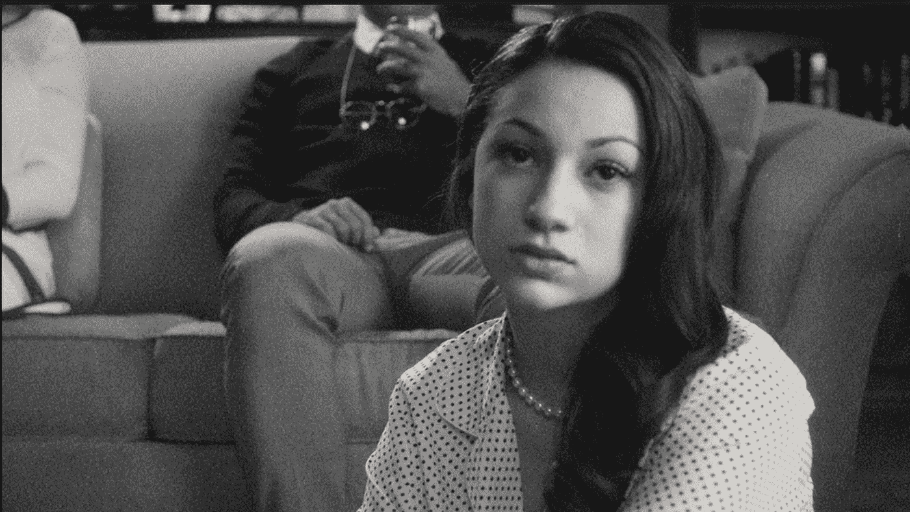

# 2018 年流行音乐——一年回顾

> 原文：<https://medium.com/swlh/popular-music-in-2018-year-in-review-9f17b01126d6>

## 流行音乐的六大趋势

Still of the video for “Gucci Flip Flops’ by Bhad Bhabie

流行音乐一直是我们时代的反映。随着我们结束纷乱的一年，我认为看看 2018 年的流行音乐会很有趣。我收集并分析了 2018 年所有的 Billboard 热门 100 首歌曲。一些大趋势非常突出。

# 1)嘻哈音乐统治了排行榜